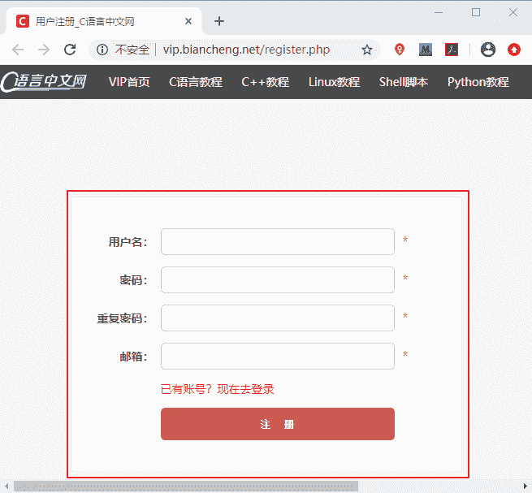
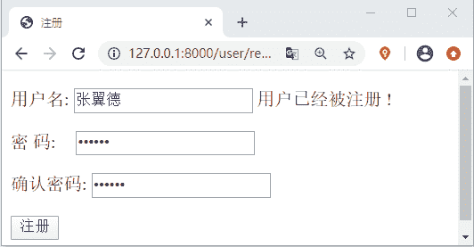

# Django HTML 表单实现用户注册

> 原文：[`c.biancheng.net/view/7830.html`](http://c.biancheng.net/view/7830.html)

在本节我们将进入逻辑性较强的代码环节，主要以实现项目中功能为主，并且会穿插介绍一些知识点，带领大家对之前讲过的知识进行重点复习，做到温故而知新。在以下几节中我们将重点介绍如何实现 Django 的注册登录这一基础功能，如果有小伙伴对 HTML Form 表单不熟悉的，建议马上进行复习，很简单的一看就会哦，下面就正式开始本节的内容。

## 1\. HTML 表单实现用户注册

在每一个 Web 应用网站都会提供用户的注册功能，这也是网站获取用户信息的一种方式，所以要理解此处的逻辑，大家几个网站平台的账号，不过在向注册的过程中，要站在一个程序员的角度，去思考问题，我相信你会有很大的发现与收获，如图所示是 C 语言中文网的注册界面。


图 1: C 语言中文网注册界面

#### 1) Django Form 表单的处理过程

Django 开发的是动态 Web 服务，而非单纯提供静态页面。动态服务的本质在于和用户进行互动，接收用户的输入，然后根据输入的不同，返回不同的内容给用户。在这个过程中返回数据是服务器后端完成的，而接收用户输入就需要靠 HTML 表单即 `<form>` 标签来完成。

Form 表单可以用来收集其内部标签中的用户输入，并将搜集到的用户输入以键值对的形式提交给 action 属性关联的 url，比如 <input> 的输入就是以 name 属性值为键，以 value 为值。然后通过 GET/POST 方法将数据发送到服务端进行处理。

#### 2) 模板层编写 HTML Form 表单

新建一个 app 应用使用`python manager.py startapp user` 在 templats\user 目录下新建 register.html 文件并在其中简单编写如下代码：

```

<!DOCTYPE html>
<html lang="en">
<head>
    <meta charset="UTF-8">
    <title>注册</title>
    <style>
        #reg .pwd p input{
           margin-left:14px
        }
    </style>
</head>
<body>
<div id="reg">
<form action="/user/reg/" method="post">
    
    <p>
        用户名: <input type="text" name="username" value="{{ username }}">
        <span>{{ username_error }}</span>
    </p>
    <div class="pwd">
        <p>
        密  码: <input type="password" name="password_1" value="{{ password_1 }}">
        <span> {{ password_1_error }} </span>
    </p>
    </div>
<div class="pd">
    <p>
         确认密码: <input type="password" name="password_2" value="{{ password_2 }}">
        <span> {{ password_2_error }} </span>
    </p>
</div>
    <p>
        <input type="submit" value="注册">
    </p>
</form>
</div>
```

#### 3) 视图层编写用户注册逻辑代码

在 user 应用的 views.py 编写用户注册的逻辑业务代码。如下所示：

```

from django.shortcuts import render
import hashlib
from django.http import HttpResponse
from user.models import User

def reg_view(request):
    #用户注册逻辑代码
    if request.method == 'GET':
        return render(request, 'user/register.html')
    elif request.method == 'POST':
        #处理提交数据
        username = request.POST.get('username')
        if not username:
            username_error = '请输入正确的用户名'
            return render(request, 'user/register.html', locals())
        password_1 = request.POST.get('password_1')
        #1 生成 hash 算法对象对密码进行加密
        m = hashlib.md5()
        #2 对待加密明文使用 update 方法！要求输入明文为字节串
        m.update(password_1.encode())
        #3 调用对象的 hexdigest[16 进制],通常存 16 进制
        password_m1 = m.hexdigest()
        print(password_m1)#加密后的密文会显示在终端上
        password_2 = request.POST.get('password_2')
        #对 password_2 执行 MD5 加密处理
        m = hashlib.md5()
        m.update(password_2.encode())
        password_m2 = m.hexdigest()
        print(password_m2)
        #可以设定密码格式，判断是都符合
        if not password_m1 or not password_m2:
            password_1_error = '请输入正确的密码'
            return render(request, 'user/register.html', locals())
         #判断两次密码输入是否一致
        if password_m1 != password_m2:
            password_2_error = '两次密码不一致'
            return render(request, 'user/register.html', locals())

        #查询用户名是否已注册过
        try:
            old_user = User.objects.get(username=username)
            #当前用户名已被注册
            username_error = '用户已经被注册 !'
            return render(request, 'user/register.html',locals())
        except Exception as e:
            # 若没查到的情况下进行报错，则证明当前用户名可用
            print('%s 是可用用户名--%s'%(username, e))
            try:
                user = User.objects.create(username=username, password=password_m1)
                #注册成功后
                html = '''
                注册成功 点击<a href='/index/'>进入首页</a>
                '''
                #存 session
                request.session['username'] = username
                return HttpResponse(html)
            #若创建不成功会抛出异常
            except Exception as e:
                # 还可能存在用户名被重复使用的情况
                print(e)
                username_error = '该用户名已经被占用 '
                return render(request, 'user/register.html', locals())
```

#### 4) 数据存储层编写 Model 模型类

在 user 应用的 user\models.py 中编写对应的模型类，如下所示，新建了三个字段：

```

from django.db import models
class User(models.Model):
    username=models.CharField(max_length=100,verbose_name='用户注册')
    password =models.CharField(max_length=100,verbose_name='用户密码')
    create_time=models.DateTimeField(auto_now_add=True)#第一次创建的时间
    def __str__(self):
        return '用户名：%s'%(self.username)
```

#### 5) 完成路由映射关系配置

最后就是需要完成路由关系的配置，首先建立分布式路由。首先在 BookStore\urls.py 中关联 user 应用的路由映射，然后在 user 应用中新建 urls.py 文件，并关联视图函数 reg_view。代码如下所示：

```

#BookStore\urls.py 代码
urlpatterns=[path('user/',include('user.urls'))]
#user\urls.py 代码
from django.urls import path
from user import views
urlpatterns=[
    path('reg/',views.reg_view)
]
```

#### 6) 用户注册效果展示

访问 127.0.0.1:8000\user\reg 进行用户的注册。我们分别注册了以下用户，访问 MySQL 数据库对注册用户数据记录进行查询，如下所示：

```

mysql> select * from user_user;
+----+----------+----------------------------------+----------------------------+
| id | username | password                         | create_time                |
+----+----------+----------------------------------+----------------------------+
|  1 | 冯增斌   | 123456                           | 2020-06-09 10:14:59.525601 |
|  2 | 关云长   | 123456                           | 2020-06-09 11:29:45.469154 |
|  3 | 张翼德   | e10adc3949ba59abbe56e057f20f883e | 2020-06-09 13:04:23.943287 |
|  4 | 黄汉升   | 25f9e794323b453885f5181f1b624d0b | 2020-06-09 13:05:33.282287 |
|  5 | 马孟起   | e10adc3949ba59abbe56e057f20f883e | 2020-06-09 13:06:16.395309 |
|  6 | 赵子龙   | 9fa5398e7aaf9e3a9cd3a1035998454d | 2020-06-09 13:06:56.038290 |
|  7 | 刘玄德   | e10adc3949ba59abbe56e057f20f883e | 2020-06-09 14:55:27.623265 |
|  8 | 诸葛亮   | e10adc3949ba59abbe56e057f20f883e | 2020-06-09 16:07:21.851377 |
+----+----------+----------------------------------+----------------------------+
8 rows in set (0.00 sec)
```

上述数据表中就是我们已经注册的用户，我们此时再将求中一个用户进行注册，就会得到如下的结果：


图 1: HTML 表单实现用户注册
 上述代码就完成了一个简单用户注册功能，在代码注释中包含了实现功能的逻辑思路，因为 Django 时后端框架，所以对于前端的界面，我们基本没有进行设计，只关注了后端的逻辑代码，后续会使用 Bootstrap 对界面进行一个简单的美化。下面我们对上述过程中的知识点以及注意事项进行总结归纳。

## 2\. 总结以及注意事项

#### 1) 注意事项

当你使用命令新建 user 应用后，各位小伙伴，你有没有对应用进行注册呢？如果没有注册，那么你会收到一大堆的报错信息，app 应用又是如何进行注册的呢，你还记得吗？首先找到配置文件 settings.py，然后在 INSTALL_APPS 列表中注册应用 user。还有当你在 user\models.py 中创建完成模型类数据表后，有没有记得要执行数据库的迁移命令呢？如果不执行你也会收到 n 多条的报错信息。以上这些小的细节，你注意到了吗？

#### 2) 总结归纳

本节使用 HTML Form 表单完成了我们第一个功能即用户的注册功能。我们从 Django MTV 设计模式的三个角度出发编写代码，从这个过程中，我相信大家对于 Django 的使用模式有了进一步的了解。而对于注册功能的逻辑分析，这个能力需要大家不断人提高，计算机技术与应用是一门思维严谨的学科，要求我们有缜密的思维逻辑，当然这个能力不是一蹴而就的，需要各位小伙伴，多写多分析多练习，比如分析其他网站的登录注册的逻辑，你会发现有很多思维都具有共性，所以我说注册登录是基础功能，但是它又不可或缺。

注册登录退出功能与实际的业务逻辑相比较还是比较简单的，大家通过简单功能的学习，要学会如何使用 Django 进行功能开发的基本模式，这是本节中最需要领悟的知识点，也是重中之重。再就是要善于利用异常处理机制，这是 Python 语言的一个特性，它会帮助我们在程序出错的时候进行分析处理，同时也避免大面积报错时找不到根源的问题。以上就是本节的相关总结，在下一节，我们将继续讲解如何实现用户的登录功能。