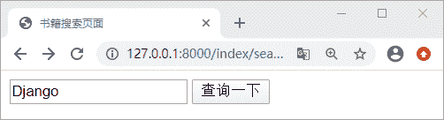
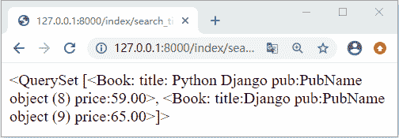
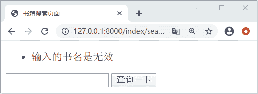

# Django HTML 表单实例应用

> 原文：[`c.biancheng.net/view/7895.html`](http://c.biancheng.net/view/7895.html)

在本节我们将实现一些小的功能需求，通过实现功能的过程对 HTML 表单的应用做进一步的讲解。前面我们已经使用表单实现了用户的注册登录以及退出功能，接下来要增加一个书籍搜索的功能，即输入书籍的 title 就可以得到想要查询的书籍信息。

## 1.HTML 表单完整应用

在页面中提交表单可以使用 GET 请求也可以使用 POST 请求，相应地，就可以通过 request.GET 或 request.POST 在视图中获取表单数据。GET 和 POST 这两种 HTTP 请求类型用于不同的目的，对于改变系统状态的请求，如给数据表中添加一条记录，应该使用 POST；而不改变系统状态的请求，如查询数据表的数据，应该使用 GET。大家应该对使用不同方式提交表单数据有深刻的认识。

#### 1) 编写模板层 HTML 页面

在 index\templates 中新建 search_title.html 文件，我们使用 GET 的方式进行查询。这时用户输入的查询 title 就会拼接在 url 中，它与 POST 最大的不同之处就在于，使用 POST 方式相对安全，对于一些私密信息比如说密码可以做到很好保护作用，还有就是 POST 将请求信息拼接在请求体中，和 GET 拼接在 url 中截然不同。所以对于这两种方法的选择，大家要根据具体的业务场景来进行选择。代码如下所示：

```

<!DOCTYPE html>
<html lang="en">
<head>
    <meta charset="UTF-8">
    <title>书籍搜索页面</title>
</head>
<body>
<form action="/index/search_title/" method="get">
    <input type="text" name="title">
    <input type="submit" value="search_title">
</form>
</body>
</html>
```

#### 2) 编写视图层逻辑代码

注意此时 action 关联的 url 是用来显示查询结果的页面，表单中完成 url 的跳转就是使用 action 属性完成的。所以可以而知，在 index\views.py 中需要编写两个视图函数，其中一个用来显示查询页面，而另外一个视图用来显示查询结果，代码分别如下所示：

```

#用来显示查询页面
def search_ttile_form(request):
    return render(request,'index/search_title.html')
#用来显示查询结果
def serch_title(request):
    #查询 title 忽略大小写,所得类型为 QuerySet
    title=Book.objects.filter(title__icontains=request.GET['title']) 
    return render(request,'index/book_list.html',locals())
```

#### 3) 配置 url 路由模式映射

接下来配置路由映射关系，在此之前我们简单的编写一个查询结果页面，在 index\templates 中新建 book_list.html 页面，并在其中增加模板语言变量 {{ title }}。然后如下如是配置路由关系：

```

from django.urls import path
from index import views
urlpatterns=[
path('search_title_form/',views.search_ttile_form),
path('search_title/',views.serch_title),
]
```

#### 4) 页面搜索效果展示

接下来，访问相应的 url 地址：127.0.0.1:8000\index\search_title_form\ 结果如下所示：


图 1：HTML 表单实际应用
 然后点击`查询一下`，会得到如下所示结果：


图 2：HTML 表单实际应用
 图 2 所示界面当然还可以进行优化，小伙伴们可以自己开动脑筋想一想，怎么才可以让图书的信息更加直观易读呢？利用前面讲过的知识，其实很容易实现，大家不妨自己动手实现一下。

#### 5) 表单验证逻辑

对于上述功能，还存在一些简单的问题，就是表单验证问题。在实际情况下用户可能没有输入查询关键词就单机搜索按钮，导致查询结果会出现错误。所以在处理表单验证的问题上，有下面两点需要使用：

*   表单页面没有错误提示，比如输入为空或者非法字符等；
*   视图函数缺少校验逻辑，对于用户的输入没有做校验，比如输入是否为空。数据格式是否正确，类型是否满足规定条件；

解决上述问题只需要修改模板和视图函数的处理逻辑即可。下面我们对上述代码进行一下修改，从而满足相应的验证逻辑。首先修改视图函数，代码如下所示：

```

#修改视图函数
def serch_title(request):
    if not request.GET.get('title',''):
        errors=['输入的书名是无效']
        #在这里使用列表的原因，是因为随着表单功能的修改可能需要传递多个字段，这时可能会有多个不同的错误信息需要展示。
        return render(request,'index/search_title.html',locals())
    title=Book.objects.filter(title__icontains=request.GET['title'])
    return render(request,'index/book_list.html',locals())
```

然后对模板 search_title.html 进行修改，如下所示：

```

<!--修改表单模板-->
<!DOCTYPE html>
<html lang="en">
<head>
    <meta charset="UTF-8">
    <title>书籍搜索页面</title>
</head>
<body>

<ul>
    
    <li>
        {{ error }}
    </li>
    

</ul>

<form action="/index/search_title/" method="get">
    <input type="text" name="title">
    <input type="submit" value="查询一下">
</form>
</body>
</html>
```

当我们再访问 127.0.0.1:8000\index\search_title_form\ 时 ，并且在搜索框输入空值点击查询一下，就会得到如下页面显示：


图 3：HTML 表单实际应用
 本节知识内容只是一个饭前的开胃小菜，在下一节《Django 项目实例详解(一)》中，将带领大家实现图书的管理逻辑即图书的增删改查，将学过的知识与实际的业务融汇结合，让我们再度领略使用 Django 做 Web 开发的乐趣。