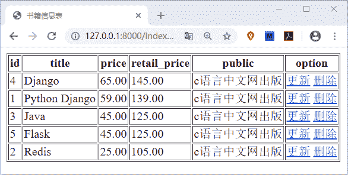
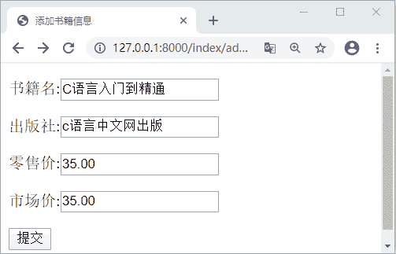
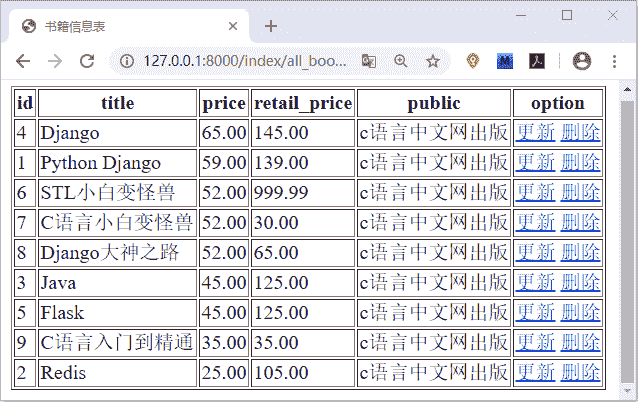

# Django 项目实例详解(一)

> 原文：[`c.biancheng.net/view/7903.html`](http://c.biancheng.net/view/7903.html)

在本节我们继续以项目实例的形式带领小伙伴们使 Django 进行相关的 Web 开发任务，在《Django HTML 表单实例应用》一节中，我们使用 HTML 表单完成了 书籍的查询功能。在本节我们将以完整的逻辑呈现图书的管理操作，本节的代码会较多，希望小伙伴们多加领悟，善于总结，并有所收获。下面我们正式开始本节的内容。

## 1\. 获取全量书籍信息

将书籍的信息以表格的信息呈现的前端页面，通过页面中的的增加、删除按钮对表中的每条数据进行操作。这是本节要实现的主体功能。我们首先将书籍的信息按照表格的形式展现出来。在 index\templates 中编写 book_table.html 页面，代码如下所示：

```

<html lang="en">
<head>
    <meta charset="UTF-8">
    <title>书籍信息表</title>
</head>
<body>
<table border="1">
    <tr>
        <th>id</th>
        <th>title</th>
        <th>price</th>
        <th> retail_price</th>
        <th>public</th>
        <th>option</th>
    </tr>
    
    <tr>
        <td>{{ book.id }}</td>
        <td>{{ book.title }}</td>
        <td>{{ book.price }}</td>
        <td>{{ book.retail_price }}</td>
        <td>{{ book.pub.pubname }}</td>
        <td>
            <a href="/index/update_book/{{ book.id }}">更新</a>
            <a href="/index/delete_book/{{ book.id }}">删除</a>
        </td>
    </tr>
     
    </table>
</body>
</html>
```

上述代码中我们我们构建了一个有关书籍信息表的表格，下面就需要在 index.views.py 文件中编写视图层代码逻辑了，代码如下所示：

```

"""
time: 22/6
item: Book CURD
"""
def book_table(request):
    try:
        all_book=Book.objects.all().order_by('-price')
        if not all_book:
            return HttpResponse('书籍信息表为空，请录入！')
    except Exception as e:
        print(e)
    return render(request, 'index/book_table.html', locals())
```

并配置路由映射关系，最后访问 http://127.0.0.1:8000/index/all_book/ 可得如下界面显示：


图 1：Django 实例书籍信息表

## 2\. 实现添加书籍信息

接下来实现书籍信息的添加功能，编写 add_book.html 页面，代码如下所示：

```

<!DOCTYPE html>
<html lang="en">
<head>
    <meta charset="UTF-8">
    <title>添加书籍信息</title>
</head>
<body>
<form action="/index/add_book/" method="post">

    <p>
       title : <input type="text" name="title">
    </p>
    <p>
       price : <input type="text" name="price">
    </p>
    <p>
        retail_price : <input type="text" name="retail_price">
    </p>
    <p>
        public : <input type="text" name="pub">
    </p>
    <p> 
    <!--按钮的值提交--> <input type="submit" value="提交"> 
    </p> 
</form> 
</body>
</html>

```

上述我们编写完成了添加书籍信息的页面，然后需要在视图层 index\views.py 中编写提交书籍信息的逻辑代码。如下所示：

```

def add_book(request):
    if request.method == 'GET':
        return render(request, 'index/add_book.html')
    elif request.method == 'POST':
        #添加书籍
        title = request.POST.get('title')
        if not title:
            return HttpResponse('请给出一个正确的 title')
        pub = request.POST.get('pub')
        price = float(request.POST.get('price','999.99'))
        if not price:
            return HttpResponse('请输入价格')
        try:
            retail_price = float(request.POST.get('retail_price'))
            if not retail_price:
                return HttpResponse('请输入市场价')
        except Exception as e:
            print(e)

        #判断 title 是不是已经存在了
        old_book = Book.objects.filter(title=title)
        if old_book:
            return HttpResponse('你输入的书籍系统已经存在 !')
        try:
            pub1=PubName.objects.get(pubname=str(pub))
            Book.objects.create(title=title,price=price,retail_price=retail_price,pub=pub1)
        except Exception as e:
            print('Add ErrorReason is %s'%(e))
        return HttpResponseRedirect('/index/all_book')
    return HttpResponse('请使用正确 Http 请求方法 !')
```

最后将路由映射关系配置完成，通过上面的代码我们就完成书籍信息的添加的功能，访问 127.0.0.1/index/add_book,可得如下界面：


图 2：Django 实例图书添加功能  
输入完上述信息点击添加按钮，会自动跳转到图书浏览目录页面，如下所示：


图 3：Django 实例图书添加功能
 在本节中，我们实现了书籍的全量展示功能以及图书的添加功能。上述代码理解起来会比较的直观简单，但是实际编写起来，会有很多需要注意的细节，需要开发者做到思维缜密，当然这个能力并非一蹴而就，需要大家不断的练习与自我提升才可以。在下一节中，我们将继续讲解 Django 项目的实例应用，希望大家通过讲解能够熟练的使用 Django 并将其作为 Web 开发的工具。