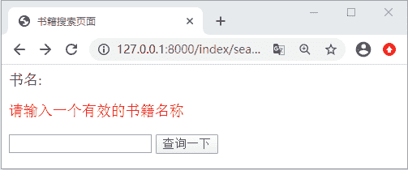
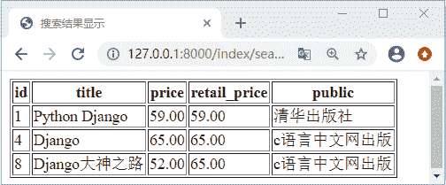

# Django Form 表单完整使用流程

> 原文：[`c.biancheng.net/view/7928.html`](http://c.biancheng.net/view/7928.html)

在《Django HTML 表单实例应用》一节，我们使用 HTML 表单的方式实现了书籍的搜索功能，那么通过本章节中对 Django Form 表单系统的讲解，我们可以尝试使用表单系统来实现这个功能了，在本节我们将汇总相关知识点，以此来讲解如何使用 Form 表单系统完成实际功能的开发。大家通过本节的学习可以查漏补缺。

## 1\. 表单系统重点知识回顾

表单系统的核心是 Form 对象，它将表单中的字段封装成了一系列的 Field 和验证规则，以此来自动生成 HTML 表达标签。本节中首先使用 Form 对象实现书籍的搜索功能，然后再详细讲解 Form 对象的构成。那么下面我们首先对前面学过的知识做一下简单的重点知识回顾。编写如下代码定义 Form 表单字段：

```

from django import forms
class TitleSearch(forms.Form):
    title=forms.CharField(label='书名',label_suffix='',error_messages={'required':'请输入正确的 title'})         
```

如上代码所示，Django 规定，所有的 Form 对象都必须继续自 django.forms.Form；我们定义了一个 title 属性，它是 forms.CharField 类型的，而该字段类型继承于基类 Field，每个 Field 字段类型都有个默认的属性 required=True 代表该字段是必填选项。那么 Form 对象有哪些特性呢？我们依次进行回顾。

#### 1) 实现对所有字段的验证

每一个 Form 对象实例都会有一个 is_valid() 方法，这个方法可以根据字段的定义验证实例对象是否符合字段的设定规则，如果所有字段都合法则返回 True，并且将数据储存到字典类型的 cleaned_data 属性中，所以由此看来，它们的调用是有先后顺序的，即必须使用 is_valid 方法验证通过，才可以把数据存储到 cleaned_data 属性中。下面我们举一个简单例子进行大概的说明，编写如下代码：

```

class TestForm(forms.Form):
    a = forms.CharField(required=False)#a 不是必填字段，可以不提供
    b=forms.CharField(max_length=20)#最大长度为 20
    c=forms.IntegerField(max_value=10,min_value=1)#最大值为 10 最小值 1
```

实例测试过程如下所示：

```

In [1]: from index.forms import TestForm
In [1]: from index.forms import TestForm
In [2]: pl=TestForm({"b":"django","c":4})
In [3]: pl.is_valid()
Out[3]: True
In [4]: pl=TestForm({"b":"django","c":11})
In [5]: pl.is_valid()
Out[5]: False
In [6]: pl=TestForm({"a":"python","c":11})
In [7]: pl.is_valid()
Out[7]: False
```

综上所述，可以看出 is_valid() 方法的验证作用，验证返回 True 的表单，证明数据验证结果为真，该表单可以使用。验证生效后的表单会有一个 cleaned_data 属性，表单对象就是通过这个属性对传递进来的数据做清理的，把值转换成合适的 Python 类型。对于返回 False 的实例，我们可以使用 errors 属性查看其错误信息。如下所示：

```

In [2]: pl=ExampleForm({"a":"python","c":11})
In [3]: pl.is_valid()
Out[3]: False
In [4]: pl.errors
Out[4]: {'b': ['这个字段是必填项。'], 'c': ['确保该值小于或等于 10。']}
```

errors 是 django.forms.utils.ErrorDict 类型的实例，它是 Python 字典的类型的子类，所以我们可以使用如下方式查看错误信息：

```

In [1]: pl["c"].errors
Out[1]: ['确保该值小于或等于 10。']
```

简单总结一下，通常在使用表单对象时，会传递参数初始化表单实例，调用其 is_valid 方法，如果为 True，则从 cleaned_data 属性中获取清理之后的字段值，否则，返回错误的信息提示，另外主要注意 cleaned_data 和 is_valid 的执行顺序，即验证不成功的话，就不会存在 cleaned_data 属性。

#### 2) 根据字段定义生成 HTML

表单系统另外一个强大的功能就是可以根据定义的字段自动生成 HTML，这我们在《Django Form 表单 API 详解》也进行了相关的介绍，可以通过 print() 打印的方式进行输出，而且它的输出格式默认以 <table> 表格的形式，不过没有提供 <table> 的起始和结束标签，我们还可以使用 as_ul 和 as_p 的方式来改变其输出格式。不仅可以输入整个表单，而且还可以指定字段输出，如下所示：

```

In [12]: pl=ExampleForm({"b":"django","c":10})
In [13]: print(pl["b"])
<input type="text" name="b" value="django" maxlength="20" required id="id_b">
```

由于表单实例可以直接返回 HTML 表单元素，所以，可以用它来替换模板文件中的字段定义，而且在没有正确填充表单时，它还可以返回错误信息的提示。

## 2\. 使用 Form 对象定义表单

通过上面的知识总结各位对于表单系统的重点方法以及使用流程更加熟悉了。下面我们就开始使用表单系统重新实现书籍的搜索功能。在视图层定义如下代码：

```

#index\views.py
from index.forms import TitleSearch #引入 forms.py 中定义的 TitleSearch 类
def search_ttile_form(request):
    return render(request,'index/search_title.html',context={'form':TitleSearch()})#实例化表单对象
def search_title(request):
    form=TitleSearch(request.GET)
    if form.is_valid():#第一步验证成功
        books=Book.objects.filter(title__icontains=form.cleaned_data["title"])#调用 cleaned_data 属性获取清理后的数据
        if not books:
            return HttpResponseRedirect("/index/book_not_list")
        return render(request,'index/book_list.html',locals()) 查看返回结果
    else:
        # 将带有错误信息的表单实例作为上下文传递到需要渲染的模板中
        return render(request,'index/search_title.html',{'form':form})

```

修改 search_title.html 页面代码，如下所示：

```

<!--修改表单模板-->
<!DOCTYPE html>
<html lang="en">
<head>
    <meta charset="UTF-8">
    <title>书籍搜索页面</title>
</head>
<body>
<form action="/index/search_title/" method="get">
    {{ form }}
    <input type="submit" value="查询一下">
</form>
</body>
</html>
```

然后将 book_list.html 更改为如下代码：

```

<!DOCTYPE html>
<html lang="en">
<head>
    <meta charset="UTF-8">
    <title>搜索结果显示</title>
</head>
<body>
<table border="1">
    <tr>
        <th>id</th>
        <th>title</th>
        <th>price</th>
        <th> retail_price</th>
        <th>public</th>
    </tr>
    
    <tr>
        <td>{{ book.id }}</td>
        <td>{{ book.title }}</td>
        <td>{{ book.price }}</td>
        <td>{{ book.retail_price }}</td>
        <!--外键关联字段取值-->
        <td>{{ book.pub.pubname}}</td>
    </tr>
     
    </table>
</body>
</html>
```

最后新建 book_not_list.html 页面编写如下代码：

```

<!DOCTYPE html>
<html lang="en">
<head>
    <meta charset="UTF-8">
    <title>书籍搜索页面</title>
</head>
<body>
<h2>对不起，没找到您需要的书籍</h2>
</body>
</html>

```

并简单编写 book_not_list 视图函数，最后配置相应的路由映射关系，如下所示：

```

#index\views.py
def book_not_list(request):
    return render(request,"index/book_not_list.html")
#index\urls.py
urlpatterns=[path('book_not_list/',views.book_not_list)]
```

至于其他路由映射关系无需改变，然后访问 127.0.0.1/index/search_title/，进行书籍 title 的搜索即可，可得如下页面：


图 1：Django 表单书籍搜索功能界面输入 Django 会得到如下所示的输出：


图 2：Django 表单书籍搜索功能
 在 search_title 中，首先将 requerst.GET 传递给 TitleSearch 对象的实例函数用来初始化表单实例，之后调用实例方法 is_valid 判断当前表单是否可用。当书名搜索框没有输入任何内容的时候，点击查询一下按钮，表单对象 Form 会给出默认的错误提示。综上所述就是 Form 表单的基本通用流程。希望大家可以认真理解、灵活运用 Django 的表单系统，从而实现自己业务功能。