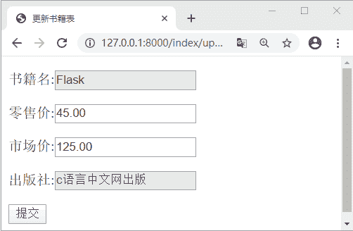
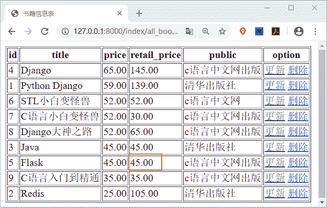
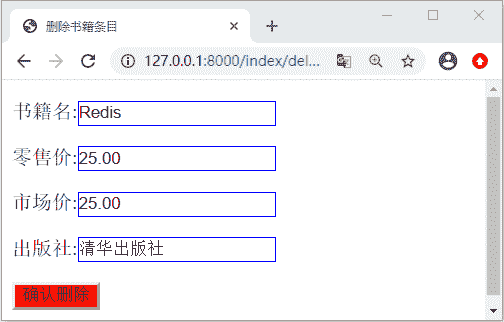
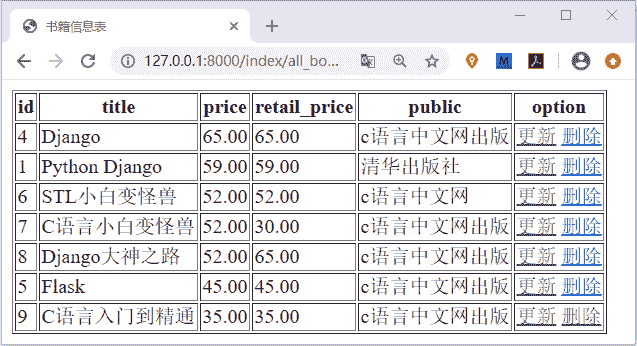

# Django 项目实例详解(二)

> 原文：[`c.biancheng.net/view/7950.html`](http://c.biancheng.net/view/7950.html)

本节我们将继续以《Django 项目实例详解(一)》为基础进行功能的拓展讲解，让他们充分的了解掌握 Django Web 开发的逻辑思路，本节代码依然较多，希望大家在学懂、看懂的基础上，要把这些代码亲自去敲一遍，以增强自己的“码感”！本节内容将完成其余两个功能，即图书信息的更新功能与图书条目的删除功能。

## 1\. 实现更新书籍信息

更改原有的书籍信息也是经常用到的功能，比如价格的调动等，那么下面就来实现这个功能，首先还是编写模板层页面，在 index\templates 中新建 update_book.html 页面，代码所下所示：

```

<!DOCTYPE html>
<html lang="en">
<head>
    <meta charset="UTF-8">
    <title>更新书籍表</title>
</head>
<body>
<form action="/bookstore/update_book/{{ book.id }}/" method="post">
    
<!--    css3 disabled 属性 不可选状态/禁用元素-->
    <p>
        书籍名:<input type="text"  value="{{ book.title }}" disabled="disabled">
    </p>

    <p>
        零售价:<input type="text" value="{{ book.price }}" name="price">
    </p>
    <p>
        市场价:<input type="text" name="retail_price" value="{{ book.retail_price }}">
    </p>
    <p>
        出版社:<input type="text" value="{{ book.pub.pubname }}" disabled="disabled">
    </p>
    <p>
       <input type="submit" value="提交">
    </p>
</form>
</body>
</html> 

```

上述完成了 update_book.html 页面的编写，我们使用了 CSS3 的 disabled 属性，将 title 和 public 置于不可选择的状态，只允许修改零售价与市场价。接下来我们在 index\views.py 中编写视图层代码：

```

def update_book(request,book_id):
    #用 book_id 给每个书籍加上标记
    #将其作为查找书籍的参数
    book_id = int(book_id)
    try:
        book = Book.objects.get(id=book_id)
    except Exception as e:
        return HttpResponse('--没有找到任何书籍---')
    if request.method=='GET':
        return render(request,'index/update_book.html',locals())
    elif request.method == 'POST':
        price = request.POST.get('price')
        retail_price=request.POST.get('retail_price')
        if not price or not retail_price:
            return HttpResponse('请输入更改后的零售价或市场价！')
        price=float(price)
        retail_price=float(retail_price)
        # 修改对象属性值
        book.price =price
        book.retail_price=retail_price
        # 存储更新后的状态
        book.save()
        #重定向至 127.0.0.1:8000/index/all_book/
        return HttpResponseRedirect('/index/all_book')
    return HttpResponse("书籍信息更新功能")
```

在上述代码中我们使用了动态 URL 的方式，book_id 作为动态参数起到了关联每个书籍条目的作用，每个书籍条目都具有唯一性的 id，这里选择它作为参数再合适不过了，最后我们要完成动态路由的配置，如下所示：

urlpatterns=[path('update_book/<int:book_id>',views.update_book)]

在浏览器地址栏输入 127.0.0.1:8000/index/update/5 直接可以进入，书籍价格的修改页面，如下所示：


图 1：Django 项目实例更新功能
然后修改市场价也为 45.00，并提交数据，url 会自动跳转至 127.0.0.1:800/index/all_book/ 页面，如下所示：


图 2：Django 项目实例更新功能
 如图 2 所示，可以看到价格已经发生了变化。那么如果直接点击 option 操作栏的更新按钮又会发生什么呢？结果可想而知，url 会自动跳转至书籍信息更改界面，之所以会这样请参见《Django 项目实例详解(一)》一节，因为 <a> 标签的 href 属性已将链接到书籍信息的修改页面，所以当你想更改某条书籍信息的时候，可以直接点击相应的更新按钮即可。

## 2\. 实现删除书籍条目信息

现在实现本项目实例的最后一个功能，即书籍条目的删除功能，通过上一节《Django 项目实例详解(一)》和本节共三个功能的讲解，我相信大家已经可以独立完成删除功能了，不过我们还是要给出代码，大家可以参照一下。首先还是在 index\templates 中新建 delete_book.html 页面，代码如下所示：

```

<!DOCTYPE html>
<html lang="en">
<head>
    <meta charset="UTF-8">
    <title>删除书籍条目</title>
    <style>
        input:not([type="submit"]){
       border:1px solid blue;
                             }
        input[type="submit"]{
        background:red;
        }

    </style>
</head>
<body>
<form action="" method="post">
    
    <p>
        书籍名:<input type="text"  value="{{ book.title }}" name="title">
    </p>

    <p>
        零售价:<input type="text" value="{{ book.price }}" name="price">
    </p>
    <p>
        市场价:<input type="text" name="retail_price" value="{{ book.retail_price }}">
    </p>
    <p>
        出版社:<input type="text" value="{{ book.pub.pubname }}" name="pub">
    </p>
    <p>
       <input type="submit" value="确认删除">
    </p>

</form>
</body>
</html>
```

编写完成后，在 index\views.py 中编写视图层逻辑代码，如下所示：

```

def delete_book(request,book_id):
    book_id=int(book_id)
    try:
        book=Book.objects.get(id=book_id)
    except Exception as e:
        print('get 查询出现了异常没找到数据',e)
        return HttpResponse('这里没有任何书籍可以被删除')

    if request.method=="GET":
        return render(request,'index/delete_book.html',locals())
    elif request.method=="POST":
        book.delete()
        return HttpResponseRedirect("/index/all_book")
    return HttpResponse("书籍条目信息删除功能")
```

并配置路由映射关系，如下所示：

urlpatterns=[path('delete_book/<int:book_id>',views.delete_book)]

访问 127.0.01:8000/index/all_book/ 可以直接点击 option 中对应书籍的删除功能，会得到如下页面：


图 3：Django 实例项目书籍删除
 点击确认删除，则 url 会重新定向到书籍展示页，大家会看到 Redis 书籍条目已经被删除了，如下所示：


图 4：Django 实例项目书籍删除
 至此我们完成了 Django 小型图书管理项目的所有逻辑代码，实现了图书的增删改查操作，我们主要运用了一些前面讲过的知识，比如 ORM 模块、QuerySet CURD 操作以及 Django 模板语言应用等，我们将这些知识点进行串联讲解，目的是为了让学习 Django 的小伙伴拥有一个使用 Django 做 Web 开发的基本概念，在这个过程中大家初次领悟了业务逻辑的概念，而这个能力需要我们自身不断的提高。我只能告诉你成功没有捷径，唯有努力拼搏的人才会站到成功的顶峰。