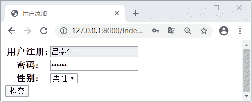

# Django Form 基于 Model 定义表单

> 原文：[`c.biancheng.net/view/7985.html`](http://c.biancheng.net/view/7985.html)

在本章中我们讲解最后一个知识点，即基于 Model 模型类定义数据表，这种业务场景也是我们在实际的开发工作中经常遇到的，比如我们要添加一本书籍，这个页面中的表单字段就需要与 Book 的 Model 定义相对应。利用 Form 对象并不难实现，只需要将 Model 中定义的字段对应成 Form 的对象中的表单字段就可以了，但是这时候也存在一个问题，就是如果这种需要对应的 Model 较多的时候，且 Model 中定义的字段也较多，那么重复实现这种表单的过程就会变成机械式的重复。

## 1\. 初识表单系统 ModelForm

Django 的表单系统充分考虑到这个问题，并给开发者提供了 ModelForm，使用它就可以实现基于 Model 的定义自动生成表单，这就大大简化了根据 Model 生成表单的过程，很好解决了我们遇到的问题，下面就让我们一起来看一下，它是如何实现这个过程的吧。

#### 1) 实现一个简单的 ModelForm

首先，我们来实现一个简单的 ModelForm 主要看它的使用方法以及在使用它的时候有哪些需要我们注意的事项。下面，编写如下代码：

```

class BookModelForm(forms.ModelForm):
    class Meta:
        model=Book
        labels={'price':'零售价格'}
        exclude=('retail_price')
```

ModelForm 需要使用 Meta 来设置必要的元数据信息，这样 Model 的元数据项不谋而合，我们在 Meta 中设置三个选项：model 指定了需要生成表单的模型对象；labels 为字典类型，用于定义表单字段的名称，当然这里大家需要注意一下，表单的名称首先默认使用 Model 字段设置的 verbose_name，但是若 Model 字段没有设置该字段选项，则就可以使用 lables 设置的字段名；exclude 标识不需要在表单中显示的字段，这和 Model 的 Meta 也一样。

ModelForm 的使用方法与 Form 类似，同样也可以使用 is_valid 方法来校验字段值的合法性和通过 cleaned_data 属性获取清理后的字段值，另外， ModelForm 也会校验模型字段中设置的限制条件，比如在 Model 模型的字段中添加了 unique 选项，那么 is_valid 则会查询数据库确认是否存在重复数据。

## 2\. 使用 ModeForm 定义表单

将表单应用到视图函数中才是有意义的，下面我们就实现用户添加的功能通过 ModelForm 来实现，首先在 index 目录下创建模板文件 useradd_model_form.html 文件，编写代码如下所示：

```

<!DOCTYPE html>
<html lang="en">
<head>
    <meta charset="UTF-8">
    <title>用户添加</title>
</head>
<body>
<form action="" method="post">
    
    <table>
        {{ form }}
    </table>
    <input type="submit" value="提交"> 
</form>
</body>
</html>
```

上面代码有两个需要注意的地方：由于指定了 POST 请求类型，需要 CSRF 保护机制，所以添加了  模板标签；action 没有设定 URL 的意思是将表单提交到与当前页面相同的 URL。接下来实现 UserModelForm 并在视图函数中应用它，代码如所示：

```

#forms.py 编写
class UserModelForm(forms.ModelForm):
    class Meta:
        model=UserInfo
        fields="__all__"
        widgets={'password':widgets.PasswordInput()}
#views.py 编写
def user_add_form(request):
    if request.method=="Post":
        user=UserModelForm(request.Post)
        if user.is_valid():
            user=UserInfo.objects.create(username=user.cleaned_data['username'],
                                         password=user.cleaned_data["password"],
                                         gender=user.cleaned_data['gender'])
            #user_add.html 只需要接收变量{{ user }}即可
            return render(request,'index/user_add.html',locals())
        else:
            return render(request,'index/useradd_model_form.html',context={'form':user})
    else:
        return render(request,'index/useradd_model_form.html',{'form':UserModelForm()})
#urls.py 编写
urlpatterns=[path('user_add_form/',views.user_add_form)]
```

最后访问 127.0.01:8000/index/user_add_form/ 可得如下页面：


图 1：Django ModelForm 定义表单
 视图函数 user_add_form 逻辑也不是很复杂，下面我们简单总结一下：首选如果是 POST 请求，且表单字段值合法，则创建 user 对象实例，然后是 POST 请求，但表单字段值不合法，则返回表单页面同时显示错误提示信息，最后若不是 POST 请求，显示表单页面。

通过上面的讲解，我们使用 ModelForm 定义了好一个基本的用户注册表单，并把它应用到了视图函数中，这也是通过它实现定义表单的基本流程。当然关于 ModelForm 还有一些基本知识没有介绍，比如说它的 Meta 选项，还有它的 save 方法，在一节《Django ModelForm 用法详解》我们会作出讲解。