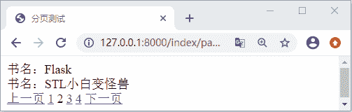

# Django 实现分页功能

> 原文：[`c.biancheng.net/view/8046.html`](http://c.biancheng.net/view/8046.html)

在本节中，我们将介绍 Django 为我们提供的高级模块，通过高级模块的学习，你会感受到 Django 的易用性如此之强，但是同时它又很复杂，所以在学习 Django 这样的重度框架的时候，我们一定要切记急躁，对于新的知识要敢于探索，除了要跟随着本教程的进度学习之外，大家也要拿出时间多阅读 Django 源码、官方文档，这样才能帮助自己尽快的提升。

本节要讲的分页功能大家一定不陌生，就像课本上的一篇篇课文一样，如果课文内容很多就会分成很多页，展示给读者。这和我们在开发阶段处理数据信息是一样的，因为大多数情况下，我们往往会面对很多的数据信息，为了让这些信息显示的更便于阅读以及减小数据的提取量从而减少服务器的压力等，我们就会采用分页的处理方法，Django 为开发者提供了内置的模块 Paginator 类。它的使用场景处处可见，比如某宝网购物时，显示下一页的商品，或者是用数字 1、2、3 等标注的页码，都属于分页的设计。

## 1\. 认识 Paginator 对象属性及方法

#### 1) Paginator 类构造函数参数

本节中我们先对 Paginator 类进行的介绍，最后通过项目的实例演示，加深大家对该模块的理解。Paginator 可以叫它为分页器，实际上它也是一个 Python 类，要使用它的时候我们可以用如下方式进行引入：

from django.core.paginator import Paginator

这个类被定义在 django.core.paginator 模块中，它的构造函数如下所示：

```

class Paginator:
    def __init__(self, object_list, per_page, orphans=0,
                 allow_empty_first_page=True)
```

其中每个参数的含义如下所示：

*   object_list， 对象列表即查询到的数据。
*   per_page， 每一页展示的内容，即每页的数据条数。
*   orphans=0， 为避免最后一页数据过少时设置，若最后一页的数据小于这个值，会合并到上一页，可省略。
*   allow_empty_first_page=True， 允许首页为空 ，默认为 True。

#### 2) Paginator 对象的属性

我们可以使用如下方法获取一个分页器对象：

```

paginator = Paginator(exam, 10)

```

它的属性如下所示：

```

In [1]: from django.core.paginator import Paginator
#待分页的数据
In [2]: objects=['a','b','c','d','e','f','g']
#获取分页器对象
In [3]: p = Paginator(objects, 2)
#需要分类数据的对象总数
In [4]: p.count
Out[4]: 7
#分页后的页面总数
In [5]: p.num_pages
Out[5]: 4
#每一页的数据个数
In [6]: p.per_page
Out[6]: 2
#分页后的页码范围从 1 开始，不包括 5,左闭右开
In [7]: p.page_range
Out[7]: range(1, 5)
```

#### 3) Paginator 对象的方法 page()

Paginator 分页器对象只有一个方法，也就是 page。它接受一个必填参数即页码号，返回一个当前页对象，若不提供将返回一个 TypeError 错误。

```

In [9]: p.page()
#不提供页码返回错误类型
TypeError                               
TypeError: page() missing 1 required positional argument: 'number'
#获取第 2 页的 page 对象
In [10]: pag2=p.page(2)
#返回当前页对象
In [11]: pag2
Out[11]: <Page 2 of 4>
#使用 list 进行实例化
In [12]: list(pag2)
Out[12]: ['c', 'd']
```

## 2\. Page 对象的常用方法以及属性

#### 1) Page 对象属性

在上面我们介绍了 Paginator 分页器对象的 page 方法，Page(）方法通过传递页码编号（从 1 开始）得到的相应页的页面对象，这个对象也有其相应的属性以及方法，下面就让我们一起来看一下：

```

#当前页上所有数据对象的列表
In [14]: pag2.object_list
Out[14]: ['c', 'd']
#当前页的序号，从 1 开始，第几页
In [15]: pag2.number
Out[15]: 2
#当前 page 对象相关的 Paginator 对象，可通它可调用原有的 Paginator 属性
In [16]: pag2.paginator
Out[16]: <django.core.paginator.Paginator at 0x63b2090>
```

#### 2) Page 对象方法

Page 对象的适应方法也非常的简单在这里就不进行实例讲解了，有兴趣的小伙伴可以自己试一试，如下所示：

*   len()：返回当前页面对象的个数。
*   has_next()：如果有下一页返回 True。
*   has_previous()：如果有上一页返回 True。
*   has_other_pages()：如果有上一页或下一页返回 True。
*   previous_page_number()：返回上一页的页码，如果上一页不存在，抛出 InvalidPage 异常。
*   next_page_number()：返回下一页的页码，如果下一页不存在，抛出 InvalidPage 异常。
*   start_index()：返回当前页相对于整个列表来说的起始的对象序号，从 1 开始，上例所示将返回 3。
*   end_index()：返回当前页相对于整个列表来说的结束的对象序号，从 1 开始，上例所示将返回 4。

注意：Page 对象是可迭代对象，可以用 for 语句来 访问当前页面中的每个对象

## 3\. Paginator 的异常处理模块

Paginator 的异常处理模块，有三类，分别如下所示：

*   InvalidPage：当向 page() 传入一个无效的页码时抛出。
*   PageNotAnInteger：当向 page() 传入一个不是整数的值时抛出。
*   EmptyPage：当向 page() 提供一个有效值，但是那个页面上没有任何对象时抛出，即当前页面数据为空。

我们可以使用如下方式引入，在代码中需要的时候主动的抛出异常：

from django.core.paginator import Paginator, PageNotAnInteger, EmptyPage,InvalidPage

## 4\. Paginator 实例项目应用

```

from django.shortcuts import render
 from index.models import Book
from django.core.paginator import Paginator#分页功能
#视图函数 index/views.py
def page_test(request):
    # 测试分页功能
    books=Book.objects.all()
    paginator = Paginator(books,2)
    num_p = request.GET.get('page',1)#以 page 为键得到默认的页面 1
    page=paginator.page(int(num_p))
    return render(request,'index/page_test.html',locals())
```

编写 page_test.html 页面，如下所示：

```

<html lang="en">
<head>
    <meta charset="UTF-8">
    <title>分页测试</title>
</head>
<body>

    <div>
        书名：{{ p.title }}
    </div>

<!--判断是否有上一页，然后拼接关于 page 的查询字符串-->

{# 得到上一页的页码编号 #}
  <a href="/index/page_test?page={{ page.previous_page_number }}">上一页</a>

上一页

{# 在页面范围内循环选择一个页面号码 #}

{# 如果页面编号等于当前页码序号 #}
     
        {{ p }}
    
         {# 否则跳转到页码相对应的页面 #}
        <a href="/index/page_test?page={{ p }}">{{ p }}</a>
    



  <a href="/index/page_test?page={{ page.next_page_number }}">下一页</a>

下一页

</body>
</html>

```

最后配置路由映射关系为 127.0.0.1:8000/index/page_test ,访问页面可得如下显示：


图 1：Django 分页功能的实现
 可以看出上面代码的实现主要逻辑编写在 HTML 页面中，利用 page 对象的属性判断是否存在上一页或者下一页，利用查询字符串 page 进行传参，从而实现了各个页面之间的跳转，所以从上述代码中，我们要理解 Paginator 对象以及 Page 对象的方法、属性，这样才可以把 Django 的分页功能运用自如。