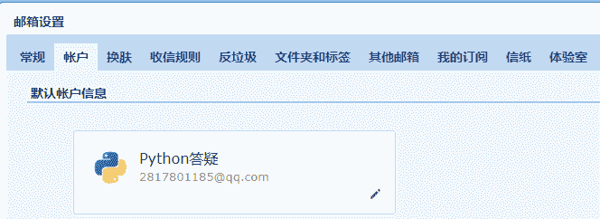
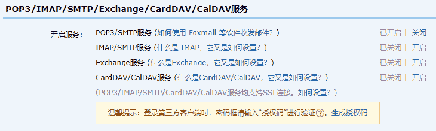
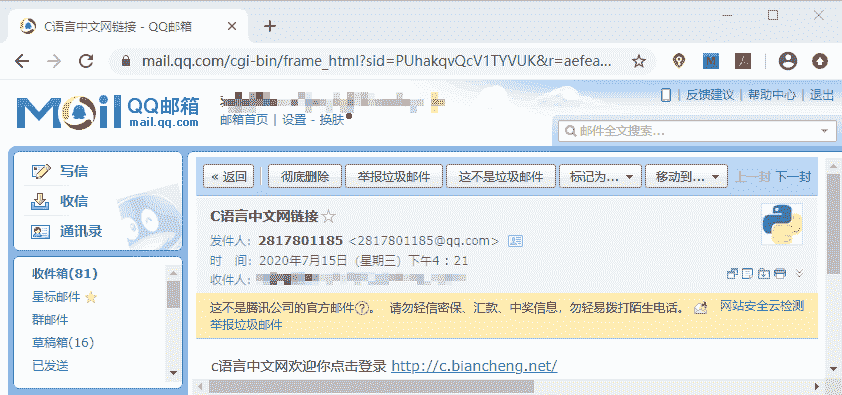

# Django 实现邮件的发送（含源码）

> 原文：[`c.biancheng.net/view/8047.html`](http://c.biancheng.net/view/8047.html)

本节讲解一个 Web 项目中，常用的一个工具，大家一定用到过，即实现邮件的发送。它的应用场景大家一定不会陌生，比如用户注册成功时，会给你的邮箱发送激活邮件，进行验证，然后点击跳转到登录页面；或者在找回密码的时候，需要使用邮箱进行验证，点击找回邮箱中的找回链接，才可以成功修改等等。可见实现邮件的发送是 Web 项目中必备的一个工具。你可以能会问不可以用短信吗？当然也可以，但是短信是收费的哦，有兴趣的可以自己研究一下，这里不再赘述！

## 1\. 邮件发送异步问题分析

本节我们只实现邮件发送就功能。若涉及在实际项目中的应用，就要考虑很多，比如发送邮件的时，等待时间太长，就会严重影响用户的体验，所以一般采用异步的方式发送邮件，所谓异步就是两个任务甚至多个任务同时进行，即在邮件发送的时不会影响到其他的操作，这就是异步，Django 需要使用额外的模块来实现它，即 Celery，它是一个简单、灵活且可靠的，处理大量消息的分布式系统。适用异步处理问题，比如发送邮件、文件上传，图像处理等等比较耗时的操作，我们可将其异步执行，这样用户不需要等待很久，提高用户体验。

注意：我们在这里提出 Cerely ，只是提供一种解决问题的思路，有兴趣可以自己研究。

## 2\. 实现 QQ 邮箱发送邮件

本节我们实现 QQ 邮箱发送电子邮件，因为 QQ 邮箱覆盖用户比较广泛，但是无论是什么邮箱 163 也好，还是 126 几乎实现方式是一样的。下面废话不多说，正式开始，学完本节，你就可以让你邮箱，通过代码的方式发邮件了。

Django 支持电子邮件发送，是因为它对邮件发送的 STM 协议进行了封装，大家接都触过网络协议，我们知道 SMTP 协议就是用来支持邮件发送接收的协议，所以要实现邮件的发送功能，还要如下引入：

from django.core import mail

通过以上方式，导入 Django 对 mail 的支持。然后调用 mail 的 send_mail 方法，该方法的定义如下所示：

```

def send_mail(subject, message, from_email, recipient_list,
              fail_silently=False, auth_user=None, auth_password=None,
              connection=None, html_message=None):
```

我们介绍主要参数的含义，如下：

*   subject：邮件主题；
*   message：邮件正文内容；
*   from_email：发送邮件者；
*   recipient_list：邮件接受者列表；
*   html_message：带有标签格式的 HTML 文本。

#### 1) 开启 QQ 邮箱 POP3/SMTP 服务

到这里大家需要跟着步骤来，首先你要登录你邮箱，通过 QQ 或者 邮箱都可以直接登录，然后在邮箱界面找到设置选项点击一下，会得到如下所示界面：


图 1：Django 实现邮件发送功能
 然后点击依次点击账户 ——>找到 POP3/IMAP/SMTP.....服务，然后点击该选项卡中的第一项，开启 POP3/SMTP 服务，如下所示：

图 2：Django 实现邮件发送功能

#### 2) 获取 POP3/SMTP 第三方授权码

开启时，它需要你使用当时绑定的手机号，发送一条短信进行验证，按照它的提示发送成功后，点击已发送，就会生成一个授权码显示在你的浏览器界面上。记得保存好你的授权码，你可以截屏或者拍照，这个授权码在后面还会用到，请务必妥善保管。

#### 3) 配置 Django 中的 settings.py 文件

当获得授权码后，我们就要在 Django 的 settings.py 中进行相应的配置，切记，你没有必要记下这些配置，它的写法是固定的，当你需要的时候直接 copy 即可，但是我们要明白这些配置项的意思，它们介绍如下所示：

```

# 固定写法设置 Email 引擎
EMAIL_BACKEND ='django.core.mail.backends.smtp.EmailBackend' 
EMAIL_HOST = 'smtp.qq.com' # 腾讯 QQ 邮箱 SMTP 服务器地址 
EMAIL_PORT = 25 # SMTP 服务的端口号 
EMAIL_HOST_USER = '2817801185@qq.com' #你的 qq 邮箱，邮件发送者的邮箱 
EMAIL_HOST_PASSWORD = 'None' #你申请的授权码（略） 
EMAIL_USE_TLS = False #与 SMTP 服务器通信时,是否启用安全模式
```

## 3\. 编写发送邮件视的图函数

最后一步就是要编写一个发送邮件的视图函数，它的格式几乎也是固定的，只需要更改相应的配置项即可，如下所示：

```

def send_email(request):
    subject = 'C 语言中文网链接'  # 主题
    from_email = settings.EMAIL_FROM  # 发件人，在 settings.py 中已经配置
    to_email = 'xxxxx@qq.com'  # 邮件接收者列表
    # 发送的消息
    message = 'c 语言中文网欢迎你点击登录 http://c.biancheng.net/'  # 发送普通的消息使用的时候 message
    # meg_html = '<a href="http://www.baidu.com">点击跳转</a>'  # 发送的是一个 html 消息 需要指定
    send_mail(subject, message, from_email, [to_email])
    return HttpResponse('OK,邮件已经发送成功!')
```

配置好 url 路径映射，并访问 127.0.0.1/index/send_email，就会得到显示邮件已经发送成功，查看我们的邮箱，可以看到发出的邮件。如下所示：


图 3：Django 实现邮件发送功能
值得大家注意的是，你可能会发现我们所发的邮件竟然出现在了垃圾箱中，这也不必诧异。这是由于腾讯对 QQ 邮箱安全性的考虑而造成的结果，一般在实际的业务中，我们若需要实现发送邮件的功能，都会选择免费的企业邮箱作为服务端邮件发送者，这样就避免了邮件出现在垃圾箱中，比如可以选择 163、126 邮箱，实现过程和 QQ 邮箱基本一样，这里就不赘述了。

我们还可以调用 mail 的 send_mass_mail 方法实现一次性发送多条消息，demo 如下：

```

from django.core.mail import send_mass_mail
message1 = ('Subject here', 'Here is the message', 'from@example.com', ['first@example.com', 'other@example.com'])
message2 = ('Another Subject', 'Here is another message', 'from@example.com', ['second@test.com'])
#接收元组作为参数
send_mass_mail((message1, message2), fail_silently=False) #fail_silentl 运行异常的时候是否报错，默认为 True 不报错
```

那么 send_mail 与 send_mass_mail 这两者的区别在哪里呢？send_mail 每次发邮件都会建立一个连接，发多封邮件时建立多个连接。而 send_mass_mail 是建立单个连接发送多封邮件，所以一次性发送多封邮件时 send_mass_mail 要优于 send_mail。

本节我们通过介绍了 Django 对邮件发送的支持，通过它的 django.core import mail 实现，大家一定自己亲自去试试，这样才能在实践中，不断提升自己的编码技巧。