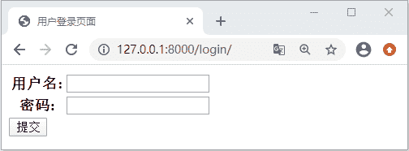

# Django Auth 应用定义登录视图的方式

> 原文：[`c.biancheng.net/view/8067.html`](http://c.biancheng.net/view/8067.html)

Auth 应用作为 Django 的内置用户认证系统，也实现了用户的注册、用户登录、密码修改、退出登录等功能。这些功能被统一的称为用户的身份验证功能，Django 对这些功能做了内置应用，我们可以通过调用相应的接口来实现相应的功能。为了方便的大家理解，下面我们通过用户登录视图，对本节的内容进行讲解。

## 1\. 使用 login API 定义登录视图

Auth 应用的登录、退出等功能定义在 django/contrib/auth__init__.py 文件中，部分源码如下所示：

```

def login(request, user, backend=None):
    session_auth_hash = ''
    if user is None:
        user = request.user
    if hasattr(user, 'get_session_auth_hash'):
        session_auth_hash = user.get_session_auth_hash()

    if SESSION_KEY in request.session:
        if _get_user_session_key(request) != user.pk or (
                session_auth_hash and
                not constant_time_compare(request.session.get(HASH_SESSION_KEY, ''), session_auth_hash)):
            request.session.flush()
    else:
        request.session.cycle_key()
                ......

```

从上述代码可以看出，该方法接受一个 HttpRequest 参数和一个 User 参数。如果使用 login 定义登录视图就会非常简单，它的应用代码如下所示：

```

from django.contrib.auth import login,authenticate
def login_views(request):
    username=request.POST("username")
    password=request.POST("password")
   #调用 authenticate 对 user 进行认证
    user=authenticate(username=username,password=password)
    if user:
        #调用 auth 的 login api
        login(request,user)
        pass
    else:
        pass
```

是不是极大的简化了登录视图的定义过程呢？因为 Auth login  这个 API 帮我们已经帮组我们完成基本的登录逻辑，我们只需要获取到用户输入的数据，对这些数据进行校验即可。

总结来看，主要分为两个步骤：根据用户传递的凭证，即用户名和密码，然后使用 authenticate 方法对获到的凭证进行校验，从而获得进过认证的 user；获取到用户对象后，使用 login 方法完成用户的登录，并可以跳转到自定义的首页，若没有获取到 user，则给出错误的提示！

## 2.  使用内置的用户登录视图

开发者可以使用 Django 的内置用户登录视图， 内置的用户登录是基于类实现视图（CBV 模式），定义在如下文件中：

django/contrib/auth/views.py

它的类名为 LoginView，定义如下所示：

```

class LoginView(SuccessURLAllowedHostsMixin, FormView):
    """
    Display the login form and handle the login action.
    """
    form_class = AuthenticationForm
    authentication_form = None
    redirect_field_name = REDIRECT_FIELD_NAME
    template_name = 'registration/login.html'
    redirect_authenticated_user = False
    extra_context = None
```

我们对其中涉及的变量做一些简单的介绍：

*   form_class：指定 LoginView 视图使用的数据表单，默认为 AuthenticateForm。
*   redirect_field_name：登录后重定向 URL 的参数名称，默认为 next。
*   template_name：指定视图使用模板名称。
*   redirect_authenticated_user：默认为 False，如果为 True，则成功登录后的用户会跳转到其他页面。

需要注意，如果在用户成功登录时没有提供 next 参数，则 Django 会自动跳转到 settings.LOGIN_REDIRECT_URL 设置的页面，默认为 /accounts/profile/。通常，需要修改这个变量的定义，例如，在 BookStore 项目的 settings.py 文件中定义:

LOGIN_REDIRECT_URL="/index/update_book/

这里我们还需要使用 CBV 类视图的方式，定义 URL 模式，如下所示：

path('login/',LoginView.as_view(template_name="index/login.html"))

然后我们在 inedx/templates/index 中创建 login.html 代码如下所示：

```

<!DOCTYPE html>
<html lang="en">
<head>
    <meta charset="UTF-8">
    <title>用户登录页面</title>
</head>
<body>
<form action="" method="post">
    <table>
        {{ form }}
    </table>
<!--    防止 CSRF 攻击-->
    
<input type="submit" value="提交">
</form>
</body>
</html>

```

最后我们就可以在浏览器地址栏进行访问了，输入 127.0.0.1:8000/login/ 会得到如下返回：


图 1：Django 内置用户登录界面
 我们完成上述的内置登录视图，在这个过程中，我们主要做了两个操作：首先是定义 login.html 模板，然后就是配置类视图的映射关系。使用 Django 内置的身份验证视图是非常简单的，除了 LoginView，认证系统还提供了注销登录的视图 LogoutView 以及 PasswordChangeView（修改密码）等。它们的使用方法类似，我们就不再赘述！