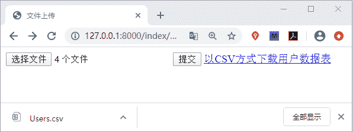

# Django 文件上传与 CSV 文件下载

> 原文：[`c.biancheng.net/view/8120.html`](http://c.biancheng.net/view/8120.html)

本节我们讲解 Django 中如何实现文件的上传与下载功能，这种使用场景也非常的常见，要解锁这个技能，首先大家有必要回顾一下 HTTP 媒体类型，这在前面的《Django 模板加载与响应》一节也进行讲解，在本节我们就来一起看看，如何实现这两个常用的功能呢！

## 1\. 实现文件的上传功能

要实现文件的上传功能，且需要使用 Form 表单的形式提交，Form 表单使用格式如下所示：

```

<form method="post" action="/index/upload" enctype="multipart/form-data">
     
     <input type="file" name="myfile">
     <input type="submit" value="提交文件">
</form>

```

#### 1)文件上传实现过程分析

通过上述代码可以看到 Form 表单提交文件的时候使用了文件上传的专用属性 `ectype="multipart-data"`,这是文件上传的固定编码格式，文件上传即表示向服务器提交资源，所以这里我们使用了 Post 方式进行提交。在 input 标签的 type 属性设置为了 file，这是提交文件的专用属性。再实现文件提交功能前，我们还需要在 settings.py 文件中进行配置，即设定文件的储存路径，如下所示：

MEDIA_ROOT = os.path.join(BASE_DIR,'static/files')

设置媒体文件路径，在 index/static 文件下创建 files 目录，我们上传文件将被显示在这个目录中。下面就一起实现一个提交文件的功能，代码如下所示：

```

#views.py 文件
def uplod(request):
    if request.method=='GET':
        return render(request,'index/upload.html')
    elif request.method=='POST':
        #使用 request.FILES['myfile']获得文件流对象 file
        file=request.FILES['myfile']
        #文件储存路径，应用 settings 中的配置，file.name 获取文件名
        filename=os.path.join(settings.MEDIA_ROOT,file.name)
         #写文件
        with open(filename,'wb') as f:
            #file.file 获取文件字节流数据  
            data = file.file.read()
            f.write(data)
            return HttpResponse('成功保存了 %s 文件'%(file.name))

```

然后新建 upload.html 文件并编写如下代码:

```

<!DOCTYPE html>
<html lang="en">
<head>
    <meta charset="UTF-8">
    <title>文件上传</title>
</head>
<body>
<form method="post" action="" enctype="multipart/form-data">

    <input type="file" name="myfile">
    <input type="submit" value="提交">
</form>
</body>
</html>
```

在 Form 表单中 enctype 有两个属性值，另外一个是默认即 application/x-www-form-urlencoded ，它是表单默认的提交数据的方式，而文件提交我们就需要使用 multipart/form-data。

#### 2) os.path.join()函数解析

它代表将文件路径进行拼接，并使用 / 连接，如下所示：

```

import os
Path1 = 'c'
Path2 = 'biancheng'
Path3 = 'yan'
Path4 = Path1 + Path2 + Path3
Path5 = os.path.join(Path1,Path2,Path3)
print ('Path10 = ',Path10)
print ('Path20 = ',Path20)
#输出结果
#Path4= cbianchengyan
#Path5 = c\biancheng\yan

```

最后我们配置路由映射关系，看一下实际的效果，访问 127.0.0.1:8000/index/upload，并选择一个文件进行上传，如下所示：


图 1：实现文件上传

#### 3) 实现多文件上传

如上所示是实现了单一的文件上传，如果想实现一次性选择多个文件，那么就需要使用如下格式：

<input type="file" name="myfiles" multiple="">

就可以实现多文件同时上传了。这里需要注意的是由于 request.FILES['myfile'] 只能够得到最后一个，所以我们要使用下面的方法：

```

files = request.FILES.getlist('myfiles')

```

然后通过循环获得 file 文件流对象，最后实现多文件上传，大家可以自己 to do 一下。

## 2\. 生成 CSV 文件并导出下载

CSV 文件又称为称为逗号分隔值文件，“CSV”并不是一种单一的、定义明确的格式（尽管 RFC 4180 有一个被通常使用的定义）。因此在实践中，术语“CSV”泛指具有以下特征的任何文件：

*   纯文本，使用某个字符集，比如 ASCII、Unicode、EBCDIC 或 GB2312；
*   由记录组成（典型的是每行一条记录）；
*   每条记录被分隔符分隔为字段（典型分隔符有逗号、分号或制表符；有时分隔符可以包括可选的空格）；
*   每条记录都有同样的字段序列。

它被用户、商业和科学广泛应用。最广泛的应用是在程序之间转移表格数据，例如，一个用户可能需要交换信息，从一个以私有格式存储数据的数据库程序，到一个数据格式完全不同的电子表格。大多数情况下，数据库程序支持导出数据为“CSV”文件，然后被导出的 CSV 文件可以被电子表格程序导入。这样就实现了在程序之间转移表格数据的操作。

那么在 Django 如何生成 CSV 文件并实现导出下载功能呢？Django 可直接在视图函数中生成 CSV 文件并响应给浏览器，Django 内置了 CSV 模块，我们可以直接调用它 。代码如下所示：

```

# 生成 csv 文本导出
def test_csv(request):
     #生成 csv 文本
     #生成 response 的 content-type 头
     res=HttpResponse(content_type='text/csv')
     #固定格式,添加 content-Disposition 头，设置以附件方式下载，并给文件添加默认文件名
     res['Content-Disposition']='attachment;filename="allUser.csv"'
     # 获取数据库中数据
     users=UserInfo.objects.all()
     # 生成 writer 的写对象
     writer=csv.writer(res)
     # 写 csv 表头，即想要展示字段名
     writer.writerow(['username','gender'])
     # 写具体数据
     for user in users:
        writer.writerow([user.username,user.gender])
     return res
```

响应对象 res 获得一个特殊的 MIME 媒体类型即 text/csv。这告诉浏览器该文档是 CSV 文件，而不是 HTML 文件；响应会获得一个额外的 Content-Disposition 标头，其中包含 CSV 文件的名称。它将被浏览器用于“另存为...”对话框；对于 CSV 文件中的每一行的写入，会调用 `writer.writerow` 给该方法传递一个可迭代对象，比如列表或元组。

注意：Content-Disposition 为属性名将它的值设置为 attachment， 这代表以附件方式进行下载。比如：Content-Disposition: attachment; filename=xxx.csv。

最后完成路由的配置，访问 127.0.0.0:8000/index/csv，就会自动生成 CSV 文件，将数据库中用户表数据导出，我们可以将这个链接它放入一个 <a> 标签中，这样就可以实现在我们想要的页面下载用户数据了。点击自动下载效果图如下所示：


图 2：实现以 CSV 格式下载数据库数据
本节我们完成了文件的上传与数据库数据的导出下载，希望各位小伙伴能够熟练运用本节的知识。