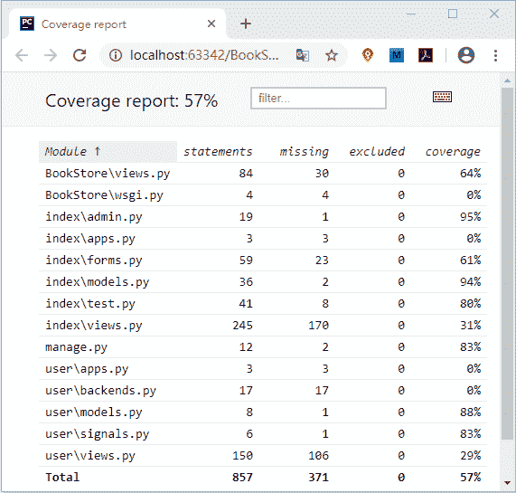

# 单元测试数据库配置及常用测试工具

> 原文：[`c.biancheng.net/view/8208.html`](http://c.biancheng.net/view/8208.html)

经过前面几节的讲解，相信大家对 Django 单元测试有了全面的了解。主要给大家介绍了三个方面的知识点，如何针对 Django 的不同模块执行测试用例，如何利用装饰器进行跳过测试和预期失败以及如何编写测试用例代码。

在整个单元测试过程中还有值得我们优化的环节，比如前面进行 ExampleTest 类测试时，我们发现 Django 会为单元测试创建新的数据库，但是你会发现这个过程很消耗时间，一个还好，如果很多个测试单元呢？再就是本节我们还会介绍一些单元测试中常用的工具方法，通过本节的学习你会对单元测试更加了解。

## 1\. Django 单元测试数据库配置

默认测试数据库的名称是将 settings.py 文件中  DATABASES 变量配置的 NAME 值的前面加上 test_。如下所示：

Creating test database for alias 'default' ('test_bookstoredb')...

上述创建方式使用了默认的文件系统，即以 MySQL 数据库的形式生成了相关的数据文件。Django 为了解决数据库创建与销毁耗时的问题，也为我们提供了解决方案。我们可以通过配置使用轻量级数据库 SQLite 来解决此问题，此时 Django 将会在内存（memory）中创建数据库。

#### 1) 为单元测试添加配置信息

我们在 settings_test.py 文件添加对 SQLite 数据库的配置信息，如下所示：

```

if 'test' in sys.argv:
    DATABASES['default'] = {'ENGINE': 'django.db.backends.sqlite3',}

```

然后我们可以使用如下命令执行测试用例：

python manage.py test -v 3 index.tests.ExampleTest

最后你会发现执行的速度比之前快很对，几乎不用等待。通过命令行界面可以看到，创建的默认数据数已经更改了方式，这个数据库在内存在完成了创建，如下所示：

```

C:\Users\Administrator\Book\BookStore>python manage.py test -v 3 index.tests.ExampleTest
Creating test database for alias 'default' ('file:memorydb_default?mode=memory&cache=shared')...#内存中生成临时文件
Operations to perform:
  Synchronize unmigrated apps: messages, staticfiles
```

由此可见适应 SQLite 时，同样也会在执行测试时候创建数据库，只不过这个创建与销毁的过程发生在内存中，要比使用默认的文件系统快的得多。

## 2\. Django 单元测试的常用工具

在《Django 项目编写单元测试用例》我们介绍了编写单元测试代码的流程方法，Django 中提供了不止一种的测试方法，我们也可以叫它们为测试工具，下面我们就给大家简单介绍一下常用的几种工具，分别是标记测试与内置断言方法。

#### 1) 标记测试

所谓标记测试就是仅执行测试方法的子集，这里需要用到一个装饰器即 django.test.tag 装饰器，它可以应用在测试方法或者测试类上。我们对这样测试方法进行简单演示，如下所示：

```

from index.models import Book, PubName
from django.test import TestCase, tag
class ExampleTest(TestCase):
    def setUp(self):
        self.pub1=PubName.objects.create(pubname="编程帮出版")
    @tag('tagone') #添加标记
    def test_model(self):
        book=Book.objects.create(title='Servlet',price='35.00', retail_price='35.00',pub=self.pub1)
        self.assertTrue(book is not None)
        self.assertNotEqual(Book.objects.count(),8)
        self.assertEqual(Book.objects.count(),1)
    @tag('tagsecond')#添加标记
    def test_view(self):
        book=Book.objects.create(title='Jsp',price='25.00', retail_price='25.00',pub=self.pub1)
        response=self.client.get('/index/update_book/%d/'% book.id)#视图访问获取 response
        response['X-Token']='C 语言中文网'
        self.assertEqual(response.status_code,200)
        self.assertEqual(response['X-Token'],'=?utf-8?b?Q+ivreiogOS4reaWh+e9kQ==?=','not sucessful')
    def tearDown(self):
        print('清理测试环境')
```

使用如下命令进行测试标记的执行：

python manage.py test --tag=tagone --tag=tagsecond index.tests.ExampleTest

上面是同时执行两个标记测试，也可以只选择一个执行，大家在书写命令的时候要注意格式。我们还可以使用如下参数来排除不想执行的测试方法：

--exclude-tag=tagsecond 

#### 2) Django 内置断言方法

在《Python unittest 模块实现单元测试》一节，我们介绍过使用断言的方法来进行测试，不过这是 unittest 框架提供的断言方法。Django 不仅继承了 unittest 框架的这些方法，还定义了一些内置的断言方法，下面我们常用的方法进行一下简单的总结：

```

class ExampleTest(TestCase)
    def test_assert1(self):
        """
        django 内置断言的方法测试
        """
        # 用来断言可执行对象的调用引发了异常，且在异常中发现了对应的信息
        with self.assertRaisesMessage(ValueError,'invalid literal for int()'):
            int('a')

    def test_assert2(self):
        #判断 HTML 是否相等基于 HTML 语义，常用来检验返回模板的视图
        self.assertHTMLEqual("<p>hello c.biancheng.net</p>"," <p>hello c.biancheng.net</p>")
        self.assertHTMLNotEqual("<p>hello c.biancheng.net</p>","<p>hello c.biancheng.net</p>")

    def test_assert3(self):
        #用来断言 JSON 字符串是否相等，校验 JsonResponse 视图返回对象
        self.assertJSONEqual('{"name":"John","age":15}','{"age":15,"name":"John"}')
        self.assertJSONNotEqual('{"a":1,"b":2}','{"a":2,"c":1}')

    def test_asseret4(self):
        #断言查询集合是否与给定的列表内容相等，给定列表也可包含多个元素
        book = Book.objects.create(title='Servlet', price='35.00', retail_price='35.00', pub=self.pub1)
        #repr(a)将对象 a 转换为字符串格式
        self.assertQuerysetEqual(Book.objects.all(),[repr(book)])
```

 除了上面介绍的内置断言方法外，Django 还提供了一些其他的方法，这里就不逐一介绍了，有兴趣的可见参考官方文档《[Django 单元测试工具](https://docs.djangoproject.com/zh-hans/2.2/topics/testing/tools/)》。

## 3\. coverage 统计测试代码覆盖率

测试代码覆盖率描述的是多少源代码经过了测试，它表达的是代码测试的程度。Python 的第三方库 coverage.py 可以用来统计测试代码的覆盖率，Django 可以轻松地与 coverage.py 实现配合。在使用 coverage 之前需要对它进行安装，使用 pip 包管理工具安装即可：

pip install coverage

安装完成后之后，需要在 manage.py 所在目录执行下面的命令：

coverage run --source='.' manage.py test

在 CMD 命令行工具中就可以看到测试输出了，然后再使用 coverage 工具的 coverage report --skip-covered 命令查看测试代码覆盖率，最后可以得到如下结果：

```

C:\Users\Administrator\Book\BookStore>coverage report --skip-covered
Name                 Stmts   Miss  Cover
----------------------------------------
BookStore\views.py      84     30    64%
BookStore\wsgi.py        4      4     0%
index\admin.py          19      1    95%
index\apps.py            3      3     0%
index\forms.py          59     23    61%
index\models.py         36      2    94%
index\test.py           41      8    80%
index\views.py         245    170    31%
manage.py               12      2    83%
user\apps.py             3      3     0%
user\backends.py        17     17     0%
user\models.py           8      1    88%
user\signals.py          6      1    83%
user\views.py          150    106    29%
----------------------------------------
TOTAL                  857    371    57%

30 files skipped due to complete coverage.
```

结果展示中的字段含义：

*   Stmts：代表语句总数；
*   Miss：代表未执行到的语句数；
*   Cover：代表测试代码覆盖率，计算公式 Cover=(Stmts-Miss)/Stmts。

我们还可以生成 HTML 版的测试报告，它更加直观，易于阅读，同时方便我们查找未被覆盖的代码，执行`coverage html`命令后，便可以在 manage.py 同级目录下生成一个名叫 htmlcov 的文件夹，使用浏览器打开其中的 index.html 文件，可以得到如下所示：

图 1：HTML 格式的测试代码覆盖率报告
 但是我们要正确的认识测试代码覆盖率这个概念，覆盖率高只是说明对当前项目的测试比较充分，它不能说明代码的质量高。 关于单元测试的章节到这里就讲解完毕了。单元测试在项目中扮演着重要的角色，在开发阶它可以帮助发现可能存在的问题、帮助重构，并且降低重构出错的风险。在项目后期，单元测试可以看作项目的一份说明文档，所以，理解并学会编写单元测试用例是十分有必要的。