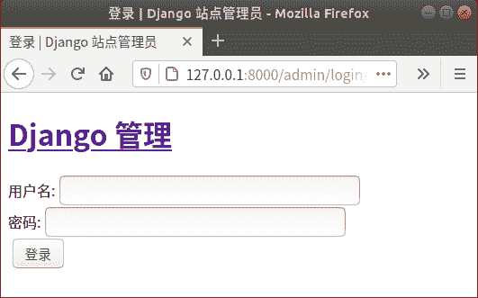

# Django 项目部署搭建 uWSGI 工作环境

> 原文：[`c.biancheng.net/view/8224.html`](http://c.biancheng.net/view/8224.html)

在本章节，将给大家讲解一下如何部署 Django 项目到生产环境的方。项目部署是指在软件开发完毕后，将开发机器上运行的开发版软件实际安装到服务器上进行长期运行，这是使用 Django 框架进行开发的的最后一个环节，也是非常要种的一部分。本章节会介绍到 Django 项目部署的基本流程、Python Web 中 WSGI 协议的理解，然后完成搭建 WSGI 生产环境以及 Nginx 反向代理服务器的配置工作。

## 1\. 什么是 WSGI 协议

在本教程开篇我们介绍过，Django 是 Python 语言编写的 Web 框架，而我们使用 Django 编写的项目称为 Web 应用，而一个 Web 项目的运行离不开 Web 服务器，所以就需要一种规范或者协议来定义 Web 应用如何与 Web 服务器之间实现交互以及请求的接受与响应的返回，这就引出了 WSGI 协议。所以，我们就能够了解到 WSGI 协议的主要工作职责是什么了。

#### 1) 从定义层面理解 WSGI 协议

WSGI（Web Server Gateway Interface）即 Web 服务器网关接口，它是属于一种规范协议，它定义了 Python Web 应用程序与 Web 服务器通信的接口。为了让大家更容易理解 WSGI 的作用，我们举一个通俗易懂的例子，比如，世界上有很多国家，各个国家之间货币都不通用，当你需要到韩国旅游的时候，就需要把我们的人民币按照国际汇率标椎兑换成韩元，这样我们才可以在韩国消费，而国际汇率标准就是一套完整的规范协议准则，也就相当于本节讲到的 WSGI 协议，需要各个国家遵守。

#### 2) Python Web 中 WSGI 协议

通过上面例子，再理解 WSGI 协议在 Python Web 中的作用就变的非常简单。Python 语言有各种各样的 Web 应用框架，如果在没有统一标准的情况下，可能需要针对每一个框架去实现各自的 Web 服务器。可想而知，如果这样的话，会给我开发者带来繁重的工作量。

WSGI 协议的出现恰恰解决了上述问题，它可以让 Web 服务器知道如何去调用 Python 应用程序；让 Python 应用程序知道客户端在请求什么，以及如何返回结果给 Web 服务器，WSGI 实现了 Web 服务器与应用程序之间的交互。

## 2\. Django 内置 WSGI 服务器

在 WSGI 协议中定义了两个角色：一个是 Web 服务器即 server，另一个是应用程序即 application，server 需要接受来自客户端的请求，然后根据协议定义调用应用程序（application），应用程序处理请求并返回结果给 server，最终响应给客户端。

Django 框架同时实现了 WSGI 的 server 和 application。其中内置的 WSGI 服务器是基于 Python 的内置模块 wsgiref 实现的，主要是添加了一些异常处理和错误记录，但是没有考虑到运行效率，故不适合在生产环境中使用，它主要被使用在开发和测试过程中。在这里进行一下简单的讲解，不作为本节的重点，在和 manage.py 同级目录下新建一个 python_webtest.py 文件，编写如下代码：

```

from wsgiref.simple_server import make_server
#定义服务器调用对象 application
def application(environ,start_response): 
    """
    :param environ:  #包含所有客户端的请求信息即上下文请求，application 从这个参数中获取客户端请求意图
    :param start_response: 一个可调用对象，用于发送 http 请求状态
    :return: [b'Hello World!\n'] #返回可迭代对象 且必须是字节流，Http 是面向字节流协议
     """
    status='200 OK'
    response_headers=[('Conteny-type','text/plain')] #响应头是一个列表
    start_response(status,response_headers) #返回给 server 之前调用 start_response
    return [b"Hello World!\n"]
#创建 WSGI 服务器，指定调用 application,这里的调用对象也可以是一个类或者实例
httpeserver=make_server('127.0.0.1',8000,application)
#处理请求后退出
httpeserver.handle_request()
```

然后在 CMD 命令行执行下面的  python python_webtest 命令，注意要在 python_webtest 对应的目录下，然后再使用 curl 命令发送请求进行测试，最终如下所示：

```

C:\Users\Administrator>curl -i 127.0.0.1:8000
HTTP/1.0 200 OK
Date: Thu, 30 Jul 2020 08:41:45 GMT
Server: WSGIServer/0.2 CPython/3.7.4
Conteny-type: text/plain
Content-Length: 13
Hello World!
```

## 3\. uWSGI 生产环境的搭建与配置

上面介绍了 Django 的内置 WSGI 服务器的实现，但是由于 Django 并不专注于实现服务器，所以内置的 WSGI 服务器无法满足生产环境的需求，所以我们在这里要介绍另外一种 WSGI 服务器，即 uWSGI。

#### 1) uWSGI 服务器简单介绍

uWSGI 是当下最流行的一种 WSGI 服务器，同样遵守 WSGI 协议。它可以与各种 Python Web 框架实现兼容，而且配置过程与使用方式都非常简单。我们之前使用 runserver 命令启动项目，通常只是在开发和测试环境中使用。当开发结束后，完善的项目代码需要在一个高效稳定的环境中运行，这时候可以使用 uWSGI，它是 WSGI 服务器的一种，它可以让 Django、Flask 等开发的 Web 应用站点运行其中。

#### 2) 安装与配置 uWSGI 服务器

要使用 uWSGI，首先要对它进行安装，但是这里有一点需要注意，因为项目都是部署在 Linux 系统上，所以这些操作也要在 Linux 系统上完成，笔者的 Linux 是 ubuntu 18.04，对于 Linux 操作系统安装不熟悉的同学，可参靠本网站《Linux 系统安装教程（超级详细）》 ，所以我们需要将我们的项目部署在 Liunx 上。至于代码、包、模块等如何打包，将在下一节对这个过程做详细介绍，本节先学会配置 uWSGI 服务器。

sudo pip3 install uwsgi

使用上述命令安装 uWSGI，安装完成后在 BookStore 项目的根目录下，新建 uwsgi.ini 配置文件（和 manage.py 文件同级目录），并在该文件中进行如下配置：

```

[uwsgi]
# 套接字方式的 IP 地址:端口号
# socket=127.0.0.1:8000
# Http 通信方式的 IP 地址:端口号
http=127.0.0.1:8000
#上述两种方式选择其一，在使用 Nginx 需要使用 socket
# 项目当前工作目录自行配置
chdir=/home/.../.../my_projectname 这里需要换为项目文件夹的绝对路径
# 项目中 wsgi.py 文件的目录，相对于当前工作目录
wsgi-file=my_project/wsgi.py
#是否启动主进程来管理其他进程
master=true
# 进程个数，根据电脑配置设置
process=4
# 每个进程的线程个数
threads=2
# 服务的 pid 记录文件
pidfile=uwsgi.pid
# 服务的日志文件位置
daemonize=uwsgi.log
```

然后修改 settings.py 文件将其设置为适合线上生产环境使用，如下所示：

DEBUG=False                    #关闭调试模式
ALLOWED_HOSTS = ['*']   #任何 ip 都可以访问

#### 3) 启动与测试 uWSGI 服务器

配置完成后，我们就可以使用下面的命令启动 uWSGI 了：

```

启动 uwsgi 命令
$ cd 项目文件夹
$ sudo uwsgi --ini uwsgi.ini
停止 uwsgi 命令
$ cd 项目文件夹
$ sudo uwsgi --stop uwsgi.pid
```

说明：当 uWSGI 启动后，当前 Django 项目的程序已变成后台守护进程，在关闭当前终端时此进程也不会停止。执行完我启动命令后，可以看到在项目的主目录下又生成了两个文件分别是 uwsgi.pid 与 uwsgi.log，它们分别用来记录，uWsgi 的进程号码 pid 与 uWSGI 的相关运行日志。启动成功的标志如下所示：

[uWSGI] getting INI configuration from uwsgi.ini

此时我们我们在没有使用 runserver 启动的情况下，可以访问 127.0.0.1:8000/admin 进行测试，你会看到，我们成功等了后台界面，如下所示：


图 1：测试 uWSGI 访问页面此时 uWSGI.log 会帮助我们记录 uWSGI 服务器的请求日志等等，有兴趣可以自己看一看日志内容。上述就是 uWSGI 服务器的完整部署与使用流程，不过如果这样使用的话， uWSGI 会直接暴露给客户端用户，所以它通常会和 Nginx 搭配在一起进行使用，在下一节《Django 项目部署 Nginx 安装与配置（完结）》将给大家介绍。