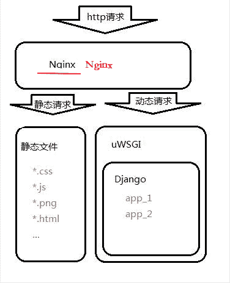

# Django 项目部署流程与 Nginx 安装配置（超详细）

> 原文：[`c.biancheng.net/view/8256.html`](http://c.biancheng.net/view/8256.html)

本节主要讲解的内容是 Nginx 如何和 uWSGI 配合使用，以及如何使用 Nginx 配置 Django 的静态资源，在本节的最后我们还要对项目部署流程做一下全面详细的总结，本节将作为本教程的最后一节，后续会根据读者的反馈再增加相应的 Django 知识介绍，最后希望各位读者阅读完这套《Python Django 框架基础教程（非常细）》能有所收获，这将是作为笔者的我最大的荣幸。

## 1\. 什么是 Nginx 及其主要作用 

Nginx (engine x) 是一个高性能的 HTTP 和反向代理 Web 服务器，同时也提供了 IMAP/POP3/SMTP 服务。Nginx 是由俄国的程序设计师**伊戈尔·赛索耶夫**用 C 语言开发的。Nginx 作为一款轻量级的 Web 服务器、反向代理服务器及电子邮件代理服务器，它以自身的稳定性、并发能力强和超低的系统资源消耗而闻名。2011 年 6 月 1 日，nginx 1.0.4 在 BSD-like 协议下发布，现在的最新版本是 2020 年 07 月 07 日发布的 nginx-1.19.1。Nginx 的主要作用是作为 Web 服务器的反向代理服务器，实现 Web 服务器的负载均衡以及站点资源的动静分离 ，我们所熟知的百度、京东、腾讯、淘宝等都使用了 Nginx。

通过上面的介绍，你虽然知道了 Nginx 拥有强大的功能，并且在实际应用中使用很广泛，但是你可能仍然处于云里雾里的感觉，所以我们就要理解一些和相关概念，比如什么是反向代理、负载均衡以及动静分离。

#### 1) 反向代理服务器

反向代理服务器位于客户端用户与目标服务器之间，但是对于用户而言，反向代理服务器就相当于目标服务器，即用户直接访问反向代理服务器就可以获得目标服务器的资源。同时，用户不需要知道目标服务器的地址，也无须在用户端作任何设定。反向代理服务器通常可用来作为 Web 加速，用来提升用户访问站点的速度，所以使用 Nignx 作为 Web 服务器的前置服务器可以降低网络和服务器的负载，从而提高访问效率。

#### 2) 什么是负载均衡

负载均衡（Load Balance），它的意思就是将工作任务分摊到多个操作单元上进行执行，比如 Web 服务器、FTP 服务器、企业关键应用服务器和其它关键任务服务器等，从而共同完成工作任务。单个服务器解决不了，我们增加服务器的数量，然后将请求分发到各个服务器上面，将原先请求到单个服务器上面的情况改为将请求分发到多个服务器上，将负载分发到不同的服务器，这就是负载均衡。

#### 3) 理解动静分离

所谓动静分离就是为了加快网站的解析速度，可以把动态页面和静态页面由不同的服务器来解析，加快解析速度，降低单个服务器的压力。进而提升整个服务访问性能和可维护性。

#### 4) Nginx 应用场景

主要有以下三大场景，一、作为虚拟主机，它可以实现在一台服务器虚拟出多个网站；二、用来充当 HTTP 服务器。Nginx 是一个 HTTP 服务器可以独立提供 HTTP 服务，也可以做网页静态服务器；三、实现反向代理、负载均衡。当网站的访问量达到一定程度后，单台服务器不能满足用户的请求，这时就需要用多台服务器组成服务集群并把 Nginx 做为反向代理服务器，实现多台服务器可以平均分担负载的目的，这样就不会造成某台服务器负载过高而宕机，而集群中另一台服务器闲置的情况。

## 2\. 实现 Nginx+uWSGI+Django 项目部署

#### 1) 项目部署原理分析

我们分析一下一个完整的 Django 项目部署在线上是什么样子的。通过上述的介绍我们了解了 Nginx 的主要作用，在整个项目中起着关键的作用。在项目部署中，Nginx 作为“带头大哥”迎难而上来接收数客户端的请求（一个 Nginx 服务器能够同一时刻支撑 5 万的并发量），并将请求分为动态请求与静态请求，而 uWSGI 是排在第二位“二哥”将 Nginx 接收到的请求转变为 Django Web 框架能看懂的形式并发送给 Django，根据客户端请求，Django 返回响应交给 uWSGIM 依次传递，最后由 Nginx 返回给客户端响应，如下图所示：
图 1：Django 项目部署流程分析图

简图如下所示，理解起来非常方便：
图 2：Django 项目部署流程简易图

#### 2) Nginx 安装与配置

理解了上面原理架构图，我们就正式开始安装配置 Nginx 吧，安装就不多介绍了可以采用在线和离线的安装方式，离线方式需要先去官网下载安装包，，官网地址：[`nginx.org/en/download.html`](https://nginx.org/en/download.html)，或者使用如下命令在线安装即可：

sudo apt-get install nginx

安装完成后，接下来就是修改 Nginx 配置文件，首先使用 root 权限进入如下目录：

root@ububtu:/etc/nginx/sites-enabled#

打开默认文件 default，按照下面所示编写配置文件，大概在 48 行左右：

```

#在 server 节点下添加新的 location 项，指向 uWSGI 的 ip 与端口(即 8000 端口)。
server {
    ...
    location / {
        uwsgi_pass 127.0.0.1:8000; #将请求转发重定向到 127.0.0.1 的 8000 端口
        include /etc/nginx/uwsgi_params;#将所有的参数转到 uwsgi 下
    }
    ...
}
```

接下来就是启动 Nginx 服务，使用如下命令进行启动：

```

$ sudo /etc/init.d/nginx start|stop|restart|status
# 或者
$ sudo service nginx start|stop|restart|status
```

最后修改 uWSGI 服务器的通信方式，配置如下：

```

[uwsgi]
# 删除掉 http 方式
# http=127.0.0.1:8000
# 改为 socket
socket=127.0.0.1:8000 
```

修改后需要先停止 uWSGI 再重新启动它，如下所示：

```

$ sudo uwsgi --stop uwsgi.pid
$ sudo uwsgi --ini uwsgi.ini
```

## 3\. Nginx 配置静态文件路径

上面我们讲到 Nginx 可以实现动静分离，这个时候也需要配置，可以按照如下所示进行操作，可以在 /home/feng 录下新建一个 Book_static 目录与 static 目录，它们两者是前者包含后者的关系，然后在 settings.py 文件中进行如下配置：

STATIC_ROOT='/home/feng/Book_static/static'

配置完成成后在项目的 manage.py 文件下执行下述命令，收集静态文件：

python3 manage.py collectstatic

收集完成后修改 Nginx 配置文件，在上述 server 中新添加 location /static 静态文件路由配置，重定向到指定的绝对路径：

```

server {
    ...
    location /static {
        #root static 文件夹所在绝对路径,示例如下:
        root /home/feng/Book_static; # 重定向,自动找到 static 目录
    }
    ...
}
```

注意：当我们每一次修改 Nginx 配置文件后都需要重新启动 Nginx 服务器。此时在浏览器地址栏输入 127.0.0.1:80/admin 就可以是实现访问了，Nginx 默认为 80 端口，此时的访问页面又恢复了正常，检查请求响应头信息如下所示：


图 3：Django 部署成功响应头信息

## 4\. 项目部署详细流程总结

首先要明确我们使用的是  Linux+Nginx+uWSGI+Django 的方式进行的部署，在企业中部署时，线上跑的服务器绝大多数都是 Linux 的服务主机，本教程中是在本地环境下搭建的部署，用了 VMware 虚拟机的充当 LInux 服务主机。

在实际的工作中，线上环境的服务器主机都购买自阿里云亦或是腾讯云（大型互联网企业都是自己的服务器集群，而对于中小型公司来说成本太高，所以一般都采用购买云服务主机的方式）它们是现在主流的云虚拟主机提供方，如果你想自己搭建一个网站在线上环境下运行，你除了需要一个域名外还要有一台云虚拟机用来部署你的项目，这些大家可以自行了解，参考网站——[阿里云网站](https://www.aliyun.com/?utm_content=se_1000301881)！下面我们对 Django 项目的部署流程进行总结归纳。

#### 1) 项目部署流程总结

项目部署的目的：在软件开发完毕后，需要将开发机器上运行的开发版软件实际安装到本地局去网服务器或者是线上服务器上进行长期、稳定的运行。首先你需要将你的项目 copy 至远程服务器，这里可以使用 scp 命令（远程连接传输命令）或者直接使用远程桌面工具 FTP、xshell 都可以，scp 命令格式如下所示：

```

Linux
$ sudo scp -a 当前项目源代码绝对路径 远程主机地址 ip 和文件夹路径
#示例	
$sudo scp -a /home/feng/django/BookStore root@88.77.66.55:/home/root/desk
Window
#使用方法：scp 源文件路径 账户@地址:目的路径
scp C:\Users\Desktop\1.txt feng@192.168.8.112:/home/project/
```

其次我们总结一下部署的具体流程，大致分为四个步骤总结如下：第一步，服务器上安装和配置相同版本的数据库，并执行数据库的备份迁移，可参考本网站《MySQL 数据库备份与恢复》一章；第二步，完成 Django 项目迁移，在安装机器上配置与开发环境相同的 Python 版本以及项目相关的依懒的包，可以使用如下命令：

```

#输出当前开发环境下模块数据包的所有信息:
$ pip3 freeze > requirement.txt
#将文件复制到服务器上,使用如下命令安装依赖包
$ pip3 install -r requirement.txt
```

第三步，用 uwsgi --inin uwsgi.ini 方式替代 python3 manage.py runserver 来启动服务器；第四步，也是最后一步，配置 Nginx 反向代理服务器，修改配置文件，并可以用 Nginx 配置静态文件路径，从而解决静态路径的问题，实现动静分离。以上就是 Django 项目部署的所有流程。

至此，这套《Python Django 框架基础教程（非常细）》教程也要给大家说再见了。Django 是一个非常重度的框架，本教程也并未囊括 Django 所有的知识点，建议大家要提升自学的能力，要懂得多查多看，比如 Django 官网就是一个很好的平台，本教程写作的过程中也是经常借鉴。

在学习过程中对于不懂的知识不可钻牛角尖，只要知道这个知识如何运用就可以，原理层面可以放过。希望你学习完本套教程能让你有所收获，也愿意聆听您的宝贵意见，最终祝所有关注本教程的人学有所成，在学习中发现编程乐趣，享受编程，热爱编程，再见！