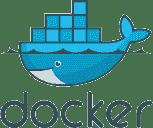

# Docker 教程：Docker 入门实践（精讲版）

> 原文：[`c.biancheng.net/docker/`](http://c.biancheng.net/docker/)

Docker 是一个开源的、轻量级的容器引擎，主要运行于 Linux 和 Windows，用于创建、管理和编排容器。

和 VMware 虚拟机相比，Docker 使用容器承载应用程序，而不使用操作系统，所以它的开销很少，性能很高。但是，Docker 对应用程序的隔离不如虚拟机彻底，所以它并不能完全取代 VMware。

这套 Docker 教程同时讲解了 Docker 的使用以及底层原理，并附带了很多操作实例，是一套不错的 Docker 入门实践指南。

> 优质资源推荐：[Docker 官网](https://www.docker.com/)、[Docker 教程（官方英文版）](https://docs.docker.com/)