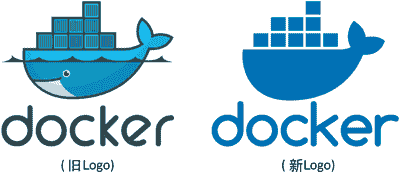
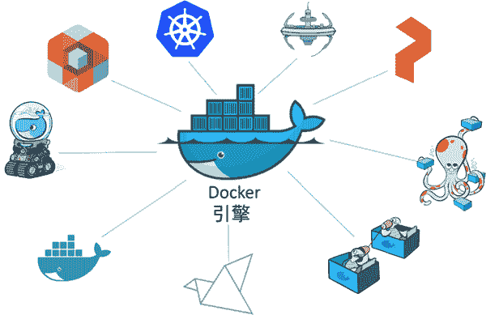

# Docker 简介以及 Docker 历史

> 原文：[`c.biancheng.net/view/3118.html`](http://c.biancheng.net/view/3118.html)

Docker 是一种运行于 Linux 和 Windows 上的软件，用于创建、管理和编排容器。

Docker 是在 GitHub 上开发的 Moby 开源项目的一部分。

Docker 公司，位于旧金山，是整个 Moby 开源项目的维护者。Docker 公司还提供包含支持服务的商业版本的 Docker。

## Docker 公司

Docker 公司位于旧金山，由法裔美籍开发者和企业家 Solumon Hykes 创立，其标志如下图所示。

有意思的是，Docker 公司起初是一家名为 dotCloud 的平台即服务（Platform-as-a-Service, PaaS）提供商。

底层技术上，dotCloud 平台利用了 Linux 容器技术。为了方便创建和管理这些容器，dotCloud 开发了一套内部工具，之后被命名为“Docker”。Docker 就是这样诞生的！

2013 年，dotCloud 的 PaaS 业务并不景气，公司需要寻求新的突破。于是他们聘请了 Ben Golub 作为新的 CEO，将公司重命名为“Docker”，放弃 dotCloud PaaS 平台，怀揣着“将 Docker 和容器技术推向全世界”的使命，开启了一段新的征程。

如今 Docker 公司被普遍认为是一家创新型科技公司，据说其市场价值约为 10 亿美元。Docker 公司已经通过多轮融资，吸纳了来自硅谷的几家风投公司的累计超过 2.4 亿美元的投资。

几乎所有的融资都发生在公司更名为“Docker”之后。

> 提示：“Docker”一词来自英国口语，意为码头工人（Dock Worker），即从船上装卸货物的人。

## Docker 运行时与编排引擎

多数技术人员在谈到 Docker 时，主要是指 Docker 引擎。

Docker 引擎是用于运行和编排容器的基础设施工具。有 VMware 管理经验的读者可以将其类比为 ESXi。

ESXi 是运行虚拟机的核心管理程序，而 Docker 引擎是运行容器的核心容器运行时。

其他 Docker 公司或第三方的产品都是围绕 Docker 引擎进行开发和集成的。

如下图所示，Docker 引擎位于中心，其他产品基于 Docker 引擎的核心功能进行集成。

Docker 引擎可以从 Docker 网站下载，也可以基于 GitHub 上的源码进行构建。无论是开源版本还是商业版本，都有 Linux 和 Windows 版本。

Docker 引擎主要有两个版本：企业版（EE）和社区版（CE）。

每个季度，企业版和社区版都会发布一个稳定版本。社区版本会提供 4 个月的支持，而企业版本会提供 12 个月的支持。

社区版还会通过 Edge 方式发布月度版。

从 2017 年第一季度开始，Docker 版本号遵循 YY.MM-xx 格式，类似于 Ubuntu 等项目。例如，2018 年 6 月第一次发布的社区版本为 18.06.0-ce。

> 注：2017 年第一季度以前，Docker 版本号遵循大版本号.小版本号的格式。采用新格式前的最后一个版本是 Docker 1.13。

## Docker 开源项目（Moby）

“Docker”一词也会用于指代开源 Docker 项目。其中包含一系列可以从 Docker 官网下载和安装的工具，比如 Docker 服务端和 Docker 客户端。

不过，该项目在 2017 年于 Austin 举办的 DockerCon 上正式命名为 Moby 项目。

由于这次改名，GitHub 上的 docker/docker 库也被转移到了 moby/moby，并且拥有了项目自己的 Logo，如下图所示。

Moby 项目的目标是基于开源的方式，发展成为 Docker 上游，并将 Docker 拆分为更多的模块化组件。

Moby 项目托管于 GitHub 的 Moby 代码库，包括子项目和工具列表。核心的 Docker 引擎项目位于 GitHub 的 moby/moby，但是引擎中的代码正持续被拆分和模块化。

作为一个开源项目，其源码是公开可得的，在遵循 Apache 协议 2.0 的情况下，任何人都可以自由地下载、贡献、调整和使用。

如果查看项目的提交历史，可以发现其中包含来自如下公司的基础技术：红帽、微软、IBM、思科，以及 HPE。此外，还可以看到一些并非来自大公司的贡献者。

多数项目及其工具都是基于 Golang 编写的，这是谷歌推出的一种新的系统级编程语言，又叫 Go 语言。使用 Go 语言的读者，将更容易为该项目贡献代码。

Mody/Docker 作为开源项目的好处在于其所有的设计和开发都是开放的，并摒弃了私有代码闭源开发模式下的陈旧方法。

因此发布过程也是公开进行的，不会再出现某个秘密的版本提前几个月就宣布要召开发布会和庆功会的荒唐情况。

Moby/Docker 不是这样运作的，项目中多数内容都是开放并欢迎任何人查看和作出贡献的。

Moby 项目以及更广泛的 Docker 运动一时间掀起了一波热潮。GitHub 上已经有数以千计的提交请求（pull request），以及数以万计的基于容器化技术的项目了，更不用说 Docker Hub 上数十亿的镜像下载。

Moby 项目已经给软件产业带来了翻天覆地的变化。

这并非妄想，Docker 已经得到了广泛的应用！

## 容器生态

Docker 公司的一个核心哲学通常被称为“含电池，但可拆卸”（Batteries included but removable）。

意思是许多 Docker 内置的组件都可以替换为第三方的组件，网络技术栈就是一个很好的例子。

Docker 核心产品内置有网络解决方案。但是网络技术栈是可插拔的，这意味着 Docker 内置的网络方案可以被替换为第三方的方案。许多人都会这样使用。

早期的时候，经常出现第三方插件比 Docker 提供的内置组件更好的情况。然而这会对 Docker 公司的商业模式造成冲击。毕竟，Docker 公司需要依靠盈利来维持基业长青。

因此，“内置的电池”变得越来越好用了。这也导致了生态内部的紧张关系和竞争的加剧。

简单来说，Docker 内置的“电池”仍然是可插拔的，然而越来越不需要将它们移除了。

尽管如此，容器生态在一种良性的合作与竞争的平衡中还是得以繁荣发展。

在谈及容器生态时，人们经常使用到诸如“co-opetition”（意即合作与竞争，英文中 co-operation 与 competition 合并的词）与“frenemy”（英文中朋友 friend 与敌人 enemy 合并的词）这样的字眼。这是一个好现象！因为良性的竞争是创新之母。

## 开放容器计划

如果不谈及开放容器计划（The Open Container Initiative, OCI）的话，对 Docker 和容器生态的探讨总是不完整的。下图所示为 OCI 的 Logo。

OCI 是一个旨在对容器基础架构中的基础组件（如镜像格式与容器运行时）进行标准化的管理委员会。

同样，如果不谈历史的话，对 OCI 的探讨也是不完整的。

一个名为 CoreOS 的公司不喜欢 Docker 的某些行事方式。因此它就创建了一个新的开源标准，称作“appc”，该标准涉及诸如镜像格式和容器运行时等方面。

此外它还开发了一个名为 rkt（发音“rocket”）的实现。

两个处于竞争状态的标准将容器生态置于一种尴尬的境地。

这使容器生态陷入了分裂的危险中，同时也令用户和消费者陷入两难。虽然竞争是一件好事，但是标准的竞争通常不是。因为它会导致困扰，降低用户接受度，对谁都无益。

考虑到这一点，所有相关方都尽力用成熟的方式处理此事，共同成立了 OCI ——一个旨在管理容器标准的轻量级的、敏捷型的委员会。

OCI 已经发布了两份规范（标准）：镜像规范和运行时规范。

提到这两项标准时，经常用到的比喻就是铁轨。它们就像对铁轨的尺寸和相关属性达成一致，让所有人都能自由地建造更好的火车、更好的车厢、更好的信号系统、更好的车站等。

只要各方都遵循标准就是安全的。没人会希望在铁轨尺寸问题上存在两个相互竞争的标准！

公平地说，这两个 OCI 规范对 Docker 的架构和核心产品设计产生了显著影响。Docker 1.11 版本中，Docker 引擎架构已经遵循 OCI 运行时规范了。

到目前为止，OCI 已经取得了不错的成效，将容器生态团结起来。然而，标准总是会减慢创新的步伐！尤其是对于超快速发展的新技术来说更是如此。

这在容器社区引起了热烈的讨论。这应该算是好事！容器技术正在重塑世界，走在技术前列的人们有热情、有想法，这很正常。

OCI 在 Linux 基金会的支持下运作，Docker 公司和 CoreOS 公司都是主要贡献者。