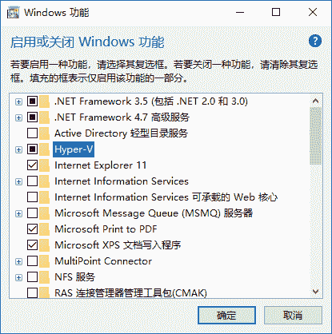

# Windows 安装 Docker（图解教程）

> 原文：[`c.biancheng.net/view/3121.html`](http://c.biancheng.net/view/3121.html)

在了解 Windows 版 Docker 之前，读者首先要知道这是由 Docker 公司提供的一个产品。这意味着它易于下载，并且有一个很灵活的安装器（installer）。

Windows 版 Docker 需要运行在一个安装了 64 位 Windows 10 操作系统的计算机上，通过启动一个独立的引擎来提供 Docker 环境。

其次，读者需要知晓 Windows 版 Docker 是一个社区版本（Community Edition，CE）的应用，并不是为生产环境设计的。

最后，读者还需要知道 Windows 版 Docker 在某些版本特性上可能是延后支持的。这是因为 Docker 公司对该产品的定位是稳定性第一，新特性其次。

以上 3 点被添加到 Windows 版 Docker 这个安装快捷简单，但并不支持生产环境部署的产品当中。

接下来我们一起了解一下如何安装 Windows 版 Docker。

在安装之前，Windows 版 Docker 的环境有以下要求。

Windows 10 Pro（专业版） / Enterprise（企业版） / Education（教育版）（1607 Anniversary Update、Build 14393 或者更新的版本）。

Windows 必须是 64 位的版本。

需要启用 Windows 操作系统中的 Hyper-V 和容器特性。

接下来的步骤会假设读者的计算机已经开启了 BIOS 设置中的硬件虚拟化支持。如果没有开启，读者需要在机器上执行下面的步骤。

首先，读者需要确认在 Windows 10 操作系统中，Hyper-V 和容器特性已安装并且开启。

1) 右键单击 Windows 开始按钮并选择“应用和功能”页面。

2) 单击“程序和功能”链接。

3) 单击“启用或关闭 Windows 功能”。

4) 确认 Hyper-V 和容器复选框已经被勾选，并单击确定按钮。

按上述步骤操作完成后，会安装并开启 Hyper-V 和容器特性，如下图所示。这时需要重启操作系统。

其中，容器特性只有在 summer 2016 Windows 10 Anniversary Update（build 14393）版本或更高版本上才能开启。

当读者完成 Hyper-V 和容器特性的安装并重启机器之后，就可以安装 Windows 版 Docker 了。

1) 访问 Docker 的下载（[`www.docker.com/products/docker-desktop`](https://www.docker.com/products/docker-desktop)）页面，并单击其中的 Download for Windows 按钮。

2) 单击后会跳转到 Docker 商店，需要读者使用自己的 Docker ID 进行登录。

3) 单击任意 Get Docker 下载链接。Docker for Windows 分为稳定版（Stable）和抢鲜版（Edge）。抢鲜版当中包含一些新特性，但是可能不够稳定。单击下载链接后，会将名为 Docker for Windows Installer.exe 的安装包下载到默认下载目录。

4) 找到上一步下载的安装包并运行即可。

以管理员身份运行安装向导，并按照提示一步一步完成整个安装过程。安装完成后 Docker 会作为系统服务自动启动，并且在 Windows 的通知栏看到 Docker 的大鲸鱼图标。

恭喜！到目前为止已经成功完成 Windows 版 Docker 的安装。

打开命令行或者 PowerShell 界面，并尝试执`docker version`命令。

Client:
Version: 18.01.0-ce
API version: 1.35
Go version: go1.9.2
Git commit: 03596f5
Built: Wed Jan 10 20:05:55 2018
OS/Arch: windows/amd64
Experimental: false
Orchestrator: swarm

Server:
Engine:
Version: 18.01.0-ce
API version: 1.35 (minimum version 1.12)
Go version: go1.9.2
Git commit: 03596f5
Built: Wed Jan 10 20:13:12 2018
OS/Arch: linux/amd64
Experimental: false

注意观察命令输出内容，其中 Server 部分中的 OS/Arch 属性展示了当前的操作系统是 linux/amd64。

这是因为在默认安装方式中，Docker daemon 是运行在 Hyper-V 虚拟机中的一个轻量级 Linux 上的。这种情况下，读者只能在 Windows 版 Docker 上运行 Linux 容器。

如果读者想要运行原生 Windows 容器（Native Windows Container），可以右击 Windows 通知栏中的 Docker 鲸鱼图标，并选择“切换到 Windows 容器”。

使用下面的命令也可以完成切换（进入 \Program Files\Docker\Docker 目录下执行）。

C:\Program Files\Docker\Docker> .\dockercli -SwitchDaemon

如果没有开启 Windows 容器特性，则会看到下图的提示。

如果已经开启了 Windows 容器特性，则只需要花费数秒就能完成切换。一旦切换完成，在命令行中执行`docker version`指令的输出内容如下。

C:\> docker version
Client:
<Snip>

Server:
Engine:
Version: 18.01.0-ce
API version: 1.35 (minimum version 1.24)
Go version: go1.9.2
Git commit: 03596f5
Built: Wed Jan 10 20:20:36 2018
OS/Arch: windows/amd64
Experimental: true

可以看到，现在 Server 版本信息变成了 windows/amd64。这意味着 Docker daemon 运行在原生 Windows 内核上，并且只能运行 Windows 容器了。

同时也可以发现，Experimental 这个属性的值为 true。这表示当前运行的 Docker 版本是实验版本。

前面提到过，Docker for Windows 有两个版本：稳定版和抢鲜版。 Windows 容器是抢鲜版中的一个实验特性。

读者可以通过运行`dockercli -Version`命令来查看当前的 Docker 版本。

`dockercli` 命令在 C:\Program Files\Docker\Docker 目录下。

C:\Program Files\Docker\Docker> .\dockercli -Version

Docker for Windows
Version: 18.01.0-ce-win48 (15285)
Channel: edge
Sha1: ee2282129dec07b8c67890bd26865c8eccdea88e
OS Name: Windows 10 Pro
Windows Edition: Professional
Windows Build Number: 16299

下面展示了一些常用的能够正常执行的 Docker 命令。

> docker image ls
REPOSITORY TAG IMAGE ID CREATED SIZE

> docker container ls
CONTAINER ID IMAGE COMMAND CREATED STATUS PORTS NAMES

> docker system info
Containers: 1
Running: 0
Paused: 0
Stopped: 1
Images: 6
Server Version: 17.12.0-ce
Storage Driver: windowsfilter
<Snip>

Windows 版 Docker 包括 Docker 引擎（客户端和 daemon）、Docker Compose、Docker Machine 以及 Docker Notary 命令行。

通过下列命令确认各个模块已经成功安装。

C:\> docker --version
Docker version 18.01.0-ce, build 03596f5

C:\> docker-compose --version
docker-compose version 1.18.0, build 8dd22a96

C:\> docker-machine --version
docker-machine.exe version 0.13.0, build 9ba6da9

C:\> notary version
notary
Version: 0.4.3
Git commit: 9211198