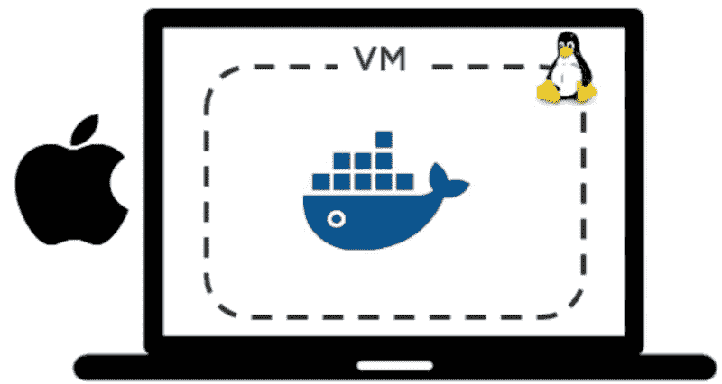

# Mac OS 安装 Docker（图解教程）

> 原文：[`c.biancheng.net/view/3122.html`](http://c.biancheng.net/view/3122.html)

Mac 版 Docker 也是由 Docker 公司提供的一个产品。

咱们大可以放心使用 Docker，而无须先成为一个内核工程师，也不必通过很极客的方法将 Docker 安装到 Mac。

Mac 版 Docker 是由 Docker 公司基于社区版的 Docker 提供的一个产品。这意味着在笔记本上安装单引擎版本的 Docker 是非常简单的。

但是同时，这也意味着 Mac 版 Docker 并不是为生产环境而设计的。如果你听说过 boot2docker，那么 Mac 版 Docker 就是一个流畅、简单并且稳定版的 boot2docker。

对于 Mac 版 Docker 来说，提供基于 Mac 原生操作系统中 Darwin 内核的 Docker 引擎没有什么意义。

所以在 Mac 版 Docker 当中，Docker daemon 是运行在一个轻量级的 Linux VM 之上的。

Mac 版 Docker 通过对外提供 daemon 和 API 的方式与 Mac 环境实现无缝集成。

这意味着读者可以在 Mac 上打开终端并直接使用 Docker 命令。

尽管在 Mac 上实现了无缝集成，还是要谨记 Mac 版 Docker 底层是基于 Linux VM 运行的，所以说 Mac 版 Docker 只能运行基于 Linux 的 Docker 容器。

不过这样已经很好了，因为大部分容器实际上都是基于 Linux 的。

下图展示了 Mac 版 Docker 的抽象架构。

Mac 版 Docker 采用 HyperKit9 实现了一个极其轻量级的 Hypervisor。HyperKit 是基于 Xhyve Hypervisor 的。

Mac 版 Docker 也利用了 DataKit 的某些特性，并运行了一个高度优化后的 Linux 发行版 Moby（基于 Alpine Linux）。

接下来开始安装 Mac 版 Docker。

1) 打开浏览器，访问 Docker 的下载页面（[`www.docker.com/products/docker-desktop`](https://www.docker.com/products/docker-desktop)），然后单击 Download for Mac 按钮。

2) 页面会跳转到 Docker 商店，需要读者使用自己的 Docker ID 和密码进行登录。

3) 单击下载链接 Get Docker CE。

Mac 版 Docker 分为两个版本：稳定版（Stable）和抢鲜版（Edge）。抢鲜版包含一些新特性，但是并不保证稳定运行。

单击链接后，会下载 Docker.dmg 安装包。

4) 运行上一步中下载的 Docker.dmg 文件。将代表 Docker 的鲸鱼图标拖拽到应用文件夹（Application folder）中。

5) 打开应用文件夹（可能会自动打开）并且双击 Docker 应用图标来启动 Docker。可能需要确认是否运行，因为这是从互联网下载的应用程序。

6) 输入 Mac 用户密码，这样安装程序可以获取到创建组件所需的权限。

7) Docker daemon 进程启动。

一个活动的鲸鱼图标会在屏幕上方状态栏中出现。一旦 Docker 成功运行，鲸鱼图标就静止了。可以单击鲸鱼图标来管理 DfM。

DfM 现在已经安装完成，读者可以打开一个终端，并运行一些常用的 Docker 指令。

尝试运行下面的命令。

$ docker version
Client:
Version: 17.05.0-ce
API version: 1.29
Go version: go1.7.5
Git commit: 89658be
Built: Thu May 4 21:43:09 2017
OS/Arch: darwin/amd64

Server:
Version: 17.05.0-ce
API version: 1.29 (minimum version 1.12)
Go version: go1.7.5
Git commit: 89658be
Built: Thu May 4 21:43:09 2017
OS/Arch: linux/amd64
Experimental: true

> 注意，Server 的 OS/Arch 属性中显示的值是 linux/amd64。这是因为 daemon 是基于前文提到过的 Linux VM 运行的。

Client 组件是原生的 Mac 应用，运行在 Mac 操作系统 Darwin 内核之上（OS/Arch: darwin/amd64）。

除此之外，还需要注意当前 Docker 版本是一个实验性质的版本（Experimental: true）。这是因为它是抢鲜版，抢鲜版中开启了一些实验特性。

运行其他 Docker 命令。

$ docker --version
Docker version 17.05.0-ce, build 89658be

$ docker image ls
REPOSITORY TAG IMAGE ID CREATED SIZE

$ docker container ls
CONTAINER ID IMAGE COMMAND CREATED STATUS PORTS NAMES

Mac 版 Docker 安装了 Docker 引擎（客户端以及服务端守护程序）、Docker Compose、Docker machine 以及 Notary 命令行。

下面的 3 条命令展示了如何确认这些组件是否成功安装，以及组件的版本信息。

$ docker --version
Docker version 17.05.0-ce, build 89658be

$ docker-compose --version
docker-compose version 1.13.0, build 1719ceb

$ docker-machine --version
docker-machine version 0.11.0, build 5b27455
$ notary version
notary
Version: 0.4.3
Git commit: 9211198