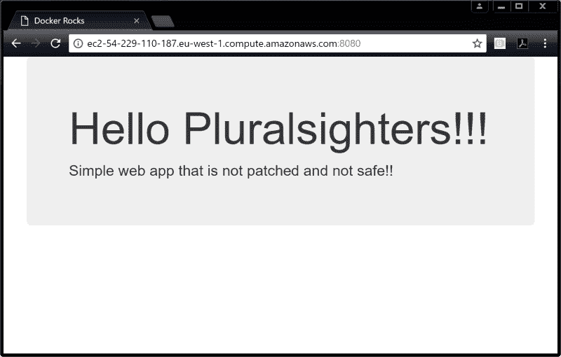
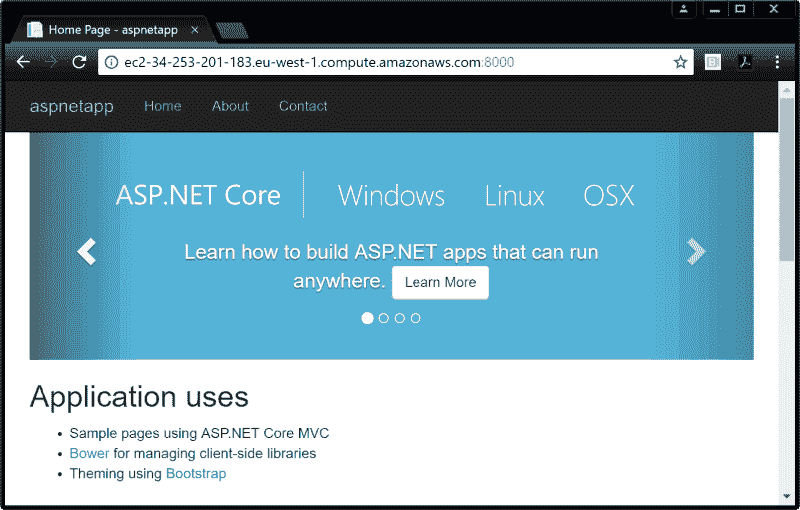

# 从开发者的角度看 Docker

> 原文：[`c.biancheng.net/view/3134.html`](http://c.biancheng.net/view/3134.html)

容器即应用！

接下来以 Linux 为例进行演示。但其实两个示例中都容器化了相同的 Web 应用代码，所以步骤也是一样的。

示例中 Web 应用代码下载：[`pan.baidu.com/s/150UgIJPvuQUf0yO3KBLegg`](https://pan.baidu.com/s/150UgIJPvuQUf0yO3KBLegg) 提取码：pkx4

进入到仓库文件目录之下，查看其内容。

$ cd psweb
$ ls -l
total 28
-rw-rw-r-- 1 ubuntu ubuntu 341 Sep 29 12:15 app.js
-rw-rw-r-- 1 ubuntu ubuntu 216 Sep 29 12:15 circle.yml
-rw-rw-r-- 1 ubuntu ubuntu 338 Sep 29 12:15 Dockerfile
-rw-rw-r-- 1 ubuntu ubuntu 421 Sep 29 12:15 package.json
-rw-rw-r-- 1 ubuntu ubuntu 370 Sep 29 12:15 README.md
drwxrwxr-x 2 ubuntu ubuntu 4096 Sep 29 12:15 test
drwxrwxr-x 2 ubuntu ubuntu 4096 Sep 29 12:15 views

如果是在 Windows 下，则需要`cd`到 dotnet-docker-samples\aspnetapp 目录当中。

Linux 的示例是一个简单的 Node.js Web 应用。Windows 示例是一个简单的 ASP.NET Web 应用。

每个仓库中都包含一个名为 Dockerfile 的文件。Dockerfile 是一个纯文本文件，其中描述了如何将应用构建到 Docker 镜像当中。

查看 Dockerfile 的全部内容。

$ cat Dockerfile

FROM alpine
LABEL maintainer="nigelpoulton@hotmail.com"
RUN apk add --update nodejs nodejs-npm
COPY . /src
WORKDIR /src
RUN npm install
EXPOSE 8080
ENTRYPOINT ["node", "./app.js"]

Windows 示例中的 Dockerfile 内容会有所不同。但是，这些区别在现阶段并不重要。Dockerfile 的 每一行都代表一个用于构建镜像的指令即可。

使用`docker image build`命令，根据 Dockerfile 中的指令来创建新的镜像。示例中新建的 Docker 镜像名为 test:latest。

一定要在包含应用代码和 Dockerfile 的目录下执行这些命令。

$ docker image build -t test:latest .

Sending build context to Docker daemon 74.75kB
Step 1/8 : FROM alpine
latest: Pulling from library/alpine
88286f41530e: Pull complete
Digest: sha256:f006ecbb824...0c103f4820a417d
Status: Downloaded newer image for alpine:latest
---> 76da55c8019d
<Snip>
Successfully built f154cb3ddbd4

Windows 示例构建可能花费比较长的时间。构建时间长短是由构建过程中要拉取的镜像大小和复杂度决定的。

一旦构建完成，就可以确认主机上是否存在 test:latest 镜像。

$ docker image ls
REPO TAG IMAGE ID CREATED SIZE
Test latest f154cb3ddbd4 1 minute ago 55.6MB
...

现在已经拥有一个新的 Docker 镜像，其中包含了应用程序。

从镜像启动容器，并测试应用。

Linux 代码如下。

$ docker container run -d \
--name web1 \
--publish 8080:8080 \
test:latest

打开 Web 浏览器，在地址栏中输入容器运行所在的 Docker 主机的 DNS 名称或者 IP 地址，并在后面加上端口号 8080。然后就能看到下图所示的 Web 页面。

如果读者使用的是 Windows 示例或者 Mac 版 Docker，则需要将地址替换为 localhost:8080 或者 127.0.0.1:8080；如果读者使用的是 Play with Docker，需要单击终端界面上的 8080 超链接。

Windows 代码如下。

> docker container run -d \
--name web1 \
--publish 8080:80 \
test:latest

打开 Web 浏览器，在地址栏中输入容器运行所在的 Docker 主机的 DNS 名称或者 IP 地址，并在后面加上端口号 8080，然后就能看到下图所示的 Web 页面。

如果使用 Windows 示例或者 Mac 版 Docker，则可参考上面的规则。

当成功将应用代码构建到了 Docker 镜像当中，然后以容器的方式启动该镜像，这个过程叫作“应用容器化”。