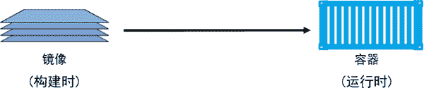

# Docker 镜像（image）详解

> 原文：[`c.biancheng.net/view/3143.html`](http://c.biancheng.net/view/3143.html)

如果曾经做过 VM 管理员，则可以把 Docker 镜像理解为 VM 模板，VM 模板就像停止运行的 VM，而 Docker 镜像就像停止运行的容器；而作为一名研发人员，则可以将镜像理解为类（Class）。

首先需要先从镜像仓库服务中拉取镜像。常见的镜像仓库服务是 Docker Hub，但是也存在其他镜像仓库服务。

拉取操作会将镜像下载到本地 Docker 主机，可以使用该镜像启动一个或者多个容器。

镜像由多个层组成，每层叠加之后，从外部看来就如一个独立的对象。镜像内部是一个精简的操作系统（OS），同时还包含应用运行所必须的文件和依赖包。

因为容器的设计初衷就是快速和小巧，所以镜像通常都比较小。

前面多次提到镜像就像停止运行的容器（类）。实际上，可以停止某个容器的运行，并从中创建新的镜像。

在该前提下，镜像可以理解为一种构建时（build-time）结构，而容器可以理解为一种运行时（run-time）结构，如下图所示。

## 镜像和容器

上图从顶层设计层面展示了镜像和容器间的关系。通常使用 docker container run 和 docker service create 命令从某个镜像启动一个或多个容器。

一旦容器从镜像启动后，二者之间就变成了互相依赖的关系，并且在镜像上启动的容器全部停止之前，镜像是无法被删除的。尝试删除镜像而不停止或销毁使用它的容器，会导致出错。

## 镜像通常比较小

容器目的就是运行应用或者服务，这意味着容器的镜像中必须包含应用/服务运行所必需的操作系统和应用文件。

但是，容器又追求快速和小巧，这意味着构建镜像的时候通常需要裁剪掉不必要的部分，保持较小的体积。

例如，Docker 镜像通常不会包含 6 个不同的 Shell 让读者选择——通常 Docker 镜像中只有一个精简的 Shell，甚至没有 Shell。

镜像中还不包含内核——容器都是共享所在 Docker 主机的内核。所以有时会说容器仅包含必要的操作系统（通常只有操作系统文件和文件系统对象）。

> 提示：Hyper-V 容器运行在专用的轻量级 VM 上，同时利用 VM 内部的操作系统内核。

Docker 官方镜像 Alpine Linux 大约只有 4MB，可以说是 Docker 镜像小巧这一特点的比较典型的例子。

但是，镜像更常见的状态是如 Ubuntu 官方的 Docker 镜像一般，大约有 110MB。这些镜像中都已裁剪掉大部分的无用内容。

Windows 镜像要比 Linux 镜像大一些，这与 Windows OS 工作原理相关。比如，未压缩的最新 Microsoft .NET 镜像（microsoft/dotnet:latest）超过 1.7GB。Windows Server 2016 Nano Server 镜像（microsoft/nanoserver:latest）在拉取并解压后，其体积略大于 1GB。

## 拉取镜像

Docker 主机安装之后，本地并没有镜像。

`docker image pull` 是下载镜像的命令。镜像从远程镜像仓库服务的仓库中下载。

默认情况下，镜像会从 Docker Hub 的仓库中拉取。docker image pull alpine:latest 命令会从 Docker Hub 的 alpine 仓库中拉取标签为 latest 的镜像。

Linux Docker 主机本地镜像仓库通常位于 /var/lib/docker/<storage-driver>，Windows Docker 主机则是 C:\ProgramData\docker\windowsfilter。

可以使用以下命令检查 Docker 主机的本地仓库中是否包含镜像。

$ docker image ls
REPOSITORY TAG IMAGE ID CREATED SIZE

将镜像取到 Docker 主机本地的操作是拉取。所以，如果读者想在 Docker 主机使用最新的 Ubuntu 镜像，需要拉取它。通过下面的命令可以将镜像拉取到本地，并观察其大小。

> 提示：如果使用 Linux，并且还没有将当前用户加入到本地 Docker UNIX 组中，则需要在下面的命令前面添加 sudo。

Windows 示例如下。

> docker image pull microsoft/powershell:nanoserver

nanoserver: Pulling from microsoft/powershell
bce2fbc256ea: Pull complete
58f68fa0ceda: Pull complete
04083aac0446: Pull complete
e42e2e34b3c8: Pull complete
0c10d79c24d4: Pull complete
715cb214dca4: Pull complete
a4837c9c9af3: Pull complete
2c79a32d92ed: Pull complete
11a9edd5694f: Pull complete
d223b37dbed9: Pull complete
aee0b4393afb: Pull complete
0288d4577536: Pull complete
8055826c4f25: Pull complete
Digest: sha256:090fe875...fdd9a8779592ea50c9d4524842
Status: Downloaded newer image for microsoft/powershell:nanoserver
>
> docker image pull microsoft/dotnet:latest

latest: Pulling from microsoft/dotnet
bce2fbc256ea: Already exists
4a8c367fd46d: Pull complete
9f49060f1112: Pull complete
0334ad7e5880: Pull complete
ea8546db77c6: Pull complete
710880d5cbd5: Pull complete
d665d26d9a25: Pull complete
caa8d44fb0b1: Pull complete
cfd178ff221e: Pull complete
Digest: sha256:530343cd483dc3e1...6f0378e24310bd67d2a
Status: Downloaded newer image for microsoft/dotnet:latest
>
> docker image ls
REPOSITORY TAG IMAGE ID CREATED SIZE
microsoft/dotnet latest 831..686d 7 hrs ago 1.65 GB
microsoft/powershell nanoserver d06..5427 8 days ago 1.21 GB

就像读者看到的一样，刚才拉取的镜像已经存在于 Docker 主机本地仓库中。同时可以看到 Windows 镜像要远大于 Linux 镜像，镜像中分层也更多。

## 镜像仓库服务

Docker 镜像存储在镜像仓库服务（Image Registry）当中。

Docker 客户端的镜像仓库服务是可配置的，默认使用 Docker Hub。

镜像仓库服务包含多个镜像仓库（Image Repository）。同样，一个镜像仓库中可以包含多个镜像。

可能这听起来让人有些迷惑，所以下图展示了包含 3 个镜像仓库的镜像仓库服务，其中每个镜像仓库都包含一个或多个镜像。

#### 官方和非官方镜像仓库

Docker Hub 也分为官方仓库（Official Repository）和非官方仓库（Unofficial Repository）。

顾名思义，官方仓库中的镜像是由 Docker 公司审查的。这意味着其中的镜像会及时更新，由高质量的代码构成，这些代码是安全的，有完善的文档和最佳实践。

非官方仓库更像江湖侠客，其中的镜像不一定具备官方仓库的优点，但这并不意味着所有非官方仓库都是不好的！非官方仓库中也有一些很优秀的镜像。

在信任非官方仓库镜像代码之前需要我们保持谨慎。说实话，读者在使用任何从互联网上下载的软件之前，都要小心，甚至是使用那些来自官方仓库的镜像时也应如此。

大部分流行的操作系统和应用在 Docker Hub 的官方仓库中都有其对应镜像。这些镜像很容易找到，基本都在 Docker Hub 命名空间的顶层。

## 镜像命名和标签

只需要给出镜像的名字和标签，就能在官方仓库中定位一个镜像（采用“:”分隔）。从官方仓库拉取镜像时，docker image pull 命令的格式如下。

docker image pull <repository>:<tag>

在之前的 Linux 示例中，通过下面的两条命令完成 Alpine 和 Ubuntu 镜像的拉取。

docker image pull alpine:latest
docker image pull ubuntu:latest

这两条命令从 alpine 和 ubuntu 仓库拉取了标有“latest”标签的镜像。

下面来介绍一下如何从官方仓库拉取不同的镜像。

$ docker image pull mongo:3.3.11
//该命令会从官方 Mongo 库拉取标签为 3.3.11 的镜像

$ docker image pull redis:latest
//该命令会从官方 Redis 库拉取标签为 latest 的镜像

$ docker image pull alpine
//该命令会从官方 Alpine 库拉取标签为 latest 的镜像

关于上述命令，需要注意以下几点。

首先，如果没有在仓库名称后指定具体的镜像标签，则 Docker 会假设用户希望拉取标签为 latest 的镜像。

其次，标签为 latest 的镜像没有什么特殊魔力！标有 latest 标签的镜像不保证这是仓库中最新的镜像！例如，Alpine 仓库中最新的镜像通常标签是 edge。通常来讲，使用 latest 标签时需要谨慎！

从非官方仓库拉取镜像也是类似的，读者只需要在仓库名称面前加上 Docker Hub 的用户名或者组织名称。

下面通过示例来展示如何从 tu-demo 仓库中拉取 v2 这个镜像，其中镜像的拥有者是 Docker Hub 账户 nigelpoulton，一个不应该被信任的账户。

$ docker image pull nigelpoulton/tu-demo:v2
//该命令会从以我自己的 Docker Hub 账号为命名空间的 tu-demo 库中下载标签为 v2 的镜像

在之前的 Windows 示例中，使用下面的两条命令拉取了 PowerShell 和 .NET 镜像。

> docker image pull microsoft/powershell:nanoserver

> docker image pull microsoft/dotnet:latest

第一条命令从 microsoft/powershell 仓库中拉取了标签为 nanoserver 的镜像，第二条命令从 microsoft/dotnet 仓库中拉取了标签为 latest 的镜像。

如果希望从第三方镜像仓库服务获取镜像（非 Docker Hub），则需要在镜像仓库名称前加上第三方镜像仓库服务的 DNS 名称。

假设上面的示例中的镜像位于 Google 容器镜像仓库服务（GCR）中，则需要在仓库名称前面加上 gcr.io，如 docker pull gcr.io/nigelpoulton/tu-demo:v2（这个仓库和镜像并不存在）。

可能需要拥有第三方镜像仓库服务的账户，并在拉取镜像前完成登录。

## 为镜像打多个标签

关于镜像有一点不得不提，一个镜像可以根据用户需要设置多个标签。这是因为标签是存放在镜像元数据中的任意数字或字符串。一起来看下面的示例。

在 `docker image pull` 命令中指定 -a 参数来拉取仓库中的全部镜像。接下来可以通过运行 `docker image ls` 查看已经拉取的镜像。

如果使用 Windows 示例，则可以将 Linux 示例中的镜像仓库 nigelpoulton/tu-demo 替换为 microsoft/nanoserver。

如果拉取的镜像仓库中包含用于多个平台或者架构的镜像，比如同时包含 Linux 和 Windows 的镜像，那么命令可能会失败。

$ docker image pull -a nigelpoulton/tu-demo

latest: Pulling from nigelpoulton/tu-demo
237d5fcd25cf: Pull complete
a3ed95caeb02: Pull complete
<Snip>
Digest: sha256:42e34e546cee61adb1...3a0c5b53f324a9e1c1aae451e9
v1: Pulling from nigelpoulton/tu-demo
237d5fcd25cf: Already exists
a3ed95caeb02: Already exists
<Snip>
Digest: sha256:9ccc0c67e5c5eaae4b...624c1d5c80f2c9623cbcc9b59a
v2: Pulling from nigelpoulton/tu-demo
237d5fcd25cf: Already exists
a3ed95caeb02: Already exists
<Snip>
Digest: sha256:d3c0d8c9d5719d31b7...9fef58a7e038cf0ef2ba5eb74c
Status: Downloaded newer image for nigelpoulton/tu-demo

$ docker image ls
REPOSITORY TAG IMAGE ID CREATED SIZE
nigelpoulton/tu-demo v2 6ac21e..bead 1 yr ago 211.6 MB
nigelpoulton/tu-demo latest 9b915a..1e29 1 yr ago 211.6 MB
nigelpoulton/tu-demo v1 9b915a..1e29 1 yr ago 211.6 MB

刚才发生了如下几件事情。

首先，该命令从 nigelpoulton/tu-demo 仓库拉取了 3 个镜像：latest、v1 以及 v2。

其次，注意看 `docker image ls` 命令输出中的 IMAGE ID 这一列。发现只有两个不同的 Image ID。这是因为实际只下载了两个镜像，其中有两个标签指向了相同的镜像。

换句话说，其中一个镜像拥有两个标签。如果仔细观察会发现 v1 和 latest 标签指向了相同的 IMAGE ID，这意味着这两个标签属于相同的镜像。

这个示例也完美证明了前文中关于 latest 标签使用的警告。latest 标签指向了 v1 标签的镜像。这意味着 latest 实际指向了两个镜像中较早的那个版本，而不是最新的版本！latest 是一个非强制标签，不保证指向仓库中最新的镜像！

过滤 `docker image ls` 的输出内容

Docker 提供 --filter 参数来过滤 `docker image ls` 命令返回的镜像列表内容。

下面的示例只会返回悬虚（dangling）镜像。

$ docker image ls --filter dangling=true
REPOSITORY TAG IMAGE ID CREATED SIZE
<none> <none> 4fd34165afe0 7 days ago 14.5MB

那些没有标签的镜像被称为悬虚镜像，在列表中展示为<none>:<none>。

通常出现这种情况，是因为构建了一个新镜像，然后为该镜像打了一个已经存在的标签。

当此情况出现，Docker 会构建新的镜像，然后发现已经有镜像包含相同的标签，接着 Docker 会移除旧镜像上面的标签，将该标签标在新的镜像之上。

例如，首先基于 alpine:3.4 构建一个新的镜像，并打上 dodge:challenger 标签。然后更新 Dockerfile，将 alpine:3.4 替换为 alpine:3.5，并且再次执行 `docker image build` 命令，该命令会构建一个新的镜像，并且标签为 dodge:challenger，同时移除了旧镜像上面对应的标签，旧镜像就变成了悬虚镜像。

可以通过 `docker image prune` 命令移除全部的悬虚镜像。如果添加了 -a 参数，Docker 会额外移除没有被使用的镜像（那些没有被任何容器使用的镜像）。

Docker 目前支持如下的过滤器。

*   dangling：可以指定 true 或者 false，仅返回悬虚镜像（true），或者非悬虚镜像（false）。
*   before：需要镜像名称或者 ID 作为参数，返回在之前被创建的全部镜像。
*   since：与 before 类似，不过返回的是指定镜像之后创建的全部镜像。
*   label：根据标注（label）的名称或者值，对镜像进行过滤。docker image ls 命令输出中不显示标注内容。

其他的过滤方式可以使用 reference。

下面就是使用 reference 完成过滤并且仅显示标签为 latest 的示例。

$ docker image ls --filter=reference="*:latest"
REPOSITORY TAG IMAGE ID CREATED SIZE
alpine latest 3fd9065eaf02 8 days ago 4.15MB
test latest 8426e7efb777 3 days ago 122MB

可以使用 --format 参数来通过 Go 模板对输出内容进行格式化。例如，下面的指令将只返回 Docker 主机上镜像的大小属性。

$ docker image ls --format "{{.Size}}"
99.3MB
111MB
82.6MB
88.8MB
4.15MB
108MB

使用下面命令返回全部镜像，但是只显示仓库、标签和大小信息。

$ docker image ls --format "{{.Repository}}: {{.Tag}}: {{.Size}}"
dodge: challenger: 99.3MB
ubuntu: latest: 111MB
python: 3.4-alpine: 82.6MB
python: 3.5-alpine: 88.8MB
alpine: latest: 4.15MB
nginx: latest: 108MB

如果读者需要更复杂的过滤，可以使用 OS 或者 Shell 自带的工具，比如 Grep 或者 AWK 。

## 通过 CLI 方式搜索 Docker Hub

`docker search` 命令允许通过 CLI 的方式搜索 Docker Hub。可以通过“NAME”字段的内容进行匹配，并且基于返回内容中任意列的值进行过滤。

简单模式下，该命令会搜索所有“NAME”字段中包含特定字符串的仓库。例如，下面的命令会查找所有“NAME”包含“nigelpoulton”的仓库。

$ docker search nigelpoulton
NAME DESCRIPTION STARS AUTOMATED
nigelpoulton/pluralsight.. Web app used in... 8 [OK]
nigelpoulton/tu-demo 7
nigelpoulton/k8sbook Kubernetes Book web app 1
nigelpoulton/web-fe1 Web front end example 0
nigelpoulton/hello-cloud Quick hello-world image 0

“NAME”字段是仓库名称，包含了 Docker ID，或者非官方仓库的组织名称。例如，下面的命令会列出所有仓库名称中包含“alpine”的镜像。

$ docker search alpine
NAME DESCRIPTION STARS OFFICIAL AUTOMATED
alpine A minimal Docker.. 2988 [OK]
mhart/alpine-node Minimal Node.js.. 332
anapsix/alpine-java Oracle Java 8... 270 [OK]
<Snip>

需要注意，上面返回的镜像中既有官方的也有非官方的。读者可以使用 --filter "is-official=true"，使命令返回内容只显示官方镜像。

$ docker search alpine --filter "is-official=true"
NAME DESCRIPTION STARS OFFICIAL AUTOMATED
alpine A minimal Docker.. 2988 [OK]

重复前面的操作，但这次只显示自动创建的仓库。

$ docker search alpine --filter "is-automated=true"
NAME DESCRIPTION OFFICIAL AUTOMATED
anapsix/alpine-java Oracle Java 8 (and 7).. [OK]
frolvlad/alpine-glibc Alpine Docker image.. [OK]
kiasaki/alpine-postgres PostgreSQL docker.. [OK]
zzrot/alpine-caddy Caddy Server Docker.. [OK]
<Snip>

关于 `docker search` 需要注意的最后一点是，默认情况下，Docker 只返回 25 行结果。但是，可以通过指定 --limit 参数来增加返回内容行数，最多为 100 行。

## 镜像和分层

Docker 镜像由一些松耦合的只读镜像层组成。如下图所示。

Docker 负责堆叠这些镜像层，并且将它们表示为单个统一的对象。

查看镜像分层的方式可以通过 docker image inspect 命令。下面同样以 ubuntu:latest 镜像为例。

$ docker image inspect ubuntu:latest
[
{
"Id": "sha256:bd3d4369ae.......fa2645f5699037d7d8c6b415a10",
"RepoTags": [
"ubuntu:latest"

<Snip>

"RootFS": {
  "Type": "layers",
  "Layers": [
   "sha256:c8a75145fc...894129005e461a43875a094b93412",
   "sha256:c6f2b330b6...7214ed6aac305dd03f70b95cdc610",
   "sha256:055757a193...3a9565d78962c7f368d5ac5984998",
   "sha256:4837348061...12695f548406ea77feb5074e195e3",
   "sha256:0cad5e07ba...4bae4cfc66b376265e16c32a0aae9"
  ]
  }
}
]

缩减之后的输出也显示该镜像包含 5 个镜像层。只不过这次的输出内容中使用了镜像的 SHA256 散列值来标识镜像层。不过，两中命令都显示了镜像包含 5 个镜像层。

`docker history` 命令显示了镜像的构建历史记录，但其并不是严格意义上的镜像分层。例如，有些 Dockerfile 中的指令并不会创建新的镜像层。比如 ENV、EXPOSE、CMD 以及 ENTRY- POINT。不过，这些命令会在镜像中添加元数据。

所有的 Docker 镜像都起始于一个基础镜像层，当进行修改或增加新的内容时，就会在当前镜像层之上，创建新的镜像层。

举一个简单的例子，假如基于 Ubuntu Linux 16.04 创建一个新的镜像，这就是新镜像的第一层；如果在该镜像中添加 Python 包，就会在基础镜像层之上创建第二个镜像层；如果继续添加一个安全补丁，就会创建第三个镜像层。

该镜像当前已经包含 3 个镜像层，如下图所示（这只是一个用于演示的很简单的例子）。

在添加额外的镜像层的同时，镜像始终保持是当前所有镜像的组合，理解这一点非常重要。下图中举了一个简单的例子，每个镜像层包含 3 个文件，而镜像包含了来自两个镜像层的 6 个文件。

上图中的镜像层跟之前图中的略有区别，主要目的是便于展示文件。

下图中展示了一个稍微复杂的三层镜像，在外部看来整个镜像只有 6 个文件，这是因为最上层中的文件 7 是文件 5 的一个更新版本。

这种情况下，上层镜像层中的文件覆盖了底层镜像层中的文件。这样就使得文件的更新版本作为一个新镜像层添加到镜像当中。

Docker 通过存储引擎（新版本采用快照机制）的方式来实现镜像层堆栈，并保证多镜像层对外展示为统一的文件系统。

Linux 上可用的存储引擎有 AUFS、Overlay2、Device Mapper、Btrfs 以及 ZFS。顾名思义，每种存储引擎都基于 Linux 中对应的文件系统或者块设备技术，并且每种存储引擎都有其独有的性能特点。

Docker 在 Windows 上仅支持 windowsfilter 一种存储引擎，该引擎基于 NTFS 文件系统之上实现了分层和 CoW[1]。

下图展示了与系统显示相同的三层镜像。所有镜像层堆叠并合并，对外提供统一的视图。

## 共享镜像层

多个镜像之间可以并且确实会共享镜像层。这样可以有效节省空间并提升性能。

回顾一下之前用于拉取 nigelpoulton/tu-demo 仓库下全部包含标签的 docker image pull 命令（包含 -a 参数）。

$ docker image pull -a nigelpoulton/tu-demo

latest: Pulling from nigelpoulton/tu-demo
237d5fcd25cf: Pull complete
a3ed95caeb02: Pull complete
<Snip>
Digest: sha256:42e34e546cee61adb100...a0c5b53f324a9e1c1aae451e9

v1: Pulling from nigelpoulton/tu-demo
237d5fcd25cf: Already exists
a3ed95caeb02: Already exists
<Snip>
Digest: sha256:9ccc0c67e5c5eaae4beb...24c1d5c80f2c9623cbcc9b59a

v2: Pulling from nigelpoulton/tu-demo
237d5fcd25cf: Already exists
a3ed95caeb02: Already exists
<Snip>
eab5aaac65de: Pull complete
Digest: sha256:d3c0d8c9d5719d31b79c...fef58a7e038cf0ef2ba5eb74c

Status: Downloaded newer image for nigelpoulton/tu-demo

$ docker image ls
REPOSITORY TAG IMAGE ID CREATED SIZE
nigelpoulton/tu-demo v2 6ac...ead 4 months ago 211.6 MB
nigelpoulton/tu-demo latest 9b9...e29 4 months ago 211.6 MB
nigelpoulton/tu-demo v1 9b9...e29 4 months ago 211.6 MB

注意那些以 Already exists 结尾的行。

由这几行可见，Docker 很聪明，可以识别出要拉取的镜像中，哪几层已经在本地存在。

在本例中，Docker 首先尝试拉取标签为 latest 的镜像。然后，当拉取标签为 v1 和 v2 的镜像时，Docker 注意到组成这两个镜像的镜像层，有一部分已经存在了。出现这种情况的原因是前面 3 个镜像相似度很高，所以共享了很多镜像层。

如前所述，Docker 在 Linux 上支持很多存储引擎（Snapshotter）。每个存储引擎都有自己的镜像分层、镜像层共享以及写时复制（CoW）技术的具体实现。

但是，其最终效果和用户体验是完全一致的。尽管 Windows 只支持一种存储引擎，还是可以提供与 Linux 相同的功能体验。

## 根据摘要拉取镜像

咱们前面介绍了通过标签来拉取镜像，这也是常见的方式。但问题是，标签是可变的！这意味着可能偶尔出现给镜像打错标签的情况，有时甚至会给新镜像打一个已经存在的标签。这些都可能导致问题！

假设镜像 golftrack:1.5 存在一个已知的 Bug。因此可以拉取该镜像后修复它，并使用相同的标签将更新的镜像重新推送回仓库。

一起来思考下刚才发生了什么。镜像 golftrack:1.5 存在 Bug，这个镜像已经应用于生产环境。如果创建一个新版本的镜像，并修复了这个 Bug。

那么问题来了，构建新镜像并将其推送回仓库时使用了与问题镜像相同的标签！原镜像被覆盖，但在生产环境中遗留了大量运行中的容器，没有什么好办法区分正在使用的镜像版本是修复前还是修复后的，因为两个镜像的标签是相同的！

Docker 1.10 中引入了新的内容寻址存储模型。作为模型的一部分，每一个镜像现在都有一个基于其内容的密码散列值。

为了讨论方便，用摘要代指这个散列值。因为摘要是镜像内容的一个散列值，所以镜像内容的变更一定会导致散列值的改变。这意味着摘要是不可变的。这种方式可以解决前面讨论的问题。

每次拉取镜像，摘要都会作为 `docker image pull` 命令返回代码的一部分。只需要在 `docker image ls` 命令之后添加 --digests 参数即可在本地查看镜像摘要。

接下来通过示例进行相关演示。

$ docker image pull alpine
Using default tag: latest
latest: Pulling from library/alpine
e110a4a17941: Pull complete
Digest: sha256:3dcdb92d7432d56604d...6d99b889d0626de158f73a
Status: Downloaded newer image for alpine:latest

$ docker image ls --digests alpine
REPOSITORY TAG DIGEST IMAGE ID CREATED SIZE
alpine latest sha256:3dcd...f73a 4e38e38c8ce0 10 weeks ago 4.8 MB

从上面的代码片段中可知，Alpine 镜像的签名值如下。

sha256:3dcdb92d7432d56604d... 6d99b889d0626de158f73a。

现在已知镜像的摘要，那么可以使用摘要值再次拉取这个镜像。这种方式可以确保准确拉取想要的镜像。

没有原生 Docker 命令支持从远端镜像仓库服务（如 Docker Hub）中获取镜像签名。这意味着只能先通过标签方式拉取镜像到本地，然后自己维护镜像的摘要列表。镜像摘要在未来绝对不会发生变化。

下面通过示例首先在 Docker 主机上删除 alpine:latest 镜像，然后显示如何通过摘要（而不是标签）来再次拉取该镜像。

$ docker image rm alpine:latest
Untagged: alpine:latest
Untagged: alpine@sha256:c0537...7c0a7726c88e2bb7584dc96
Deleted: sha256:02674b9cb179d...abff0c2bf5ceca5bad72cd9
Deleted: sha256:e154057080f40...3823bab1be5b86926c6f860

$ docker image pull alpine@sha256:c0537...7c0a7726c88e2bb7584dc96
sha256:c0537...7726c88e2bb7584dc96: Pulling from library/alpine
cfc728c1c558: Pull complete
Digest: sha256:c0537ff6a5218...7c0a7726c88e2bb7584dc96
Status: Downloaded newer image for alpine@sha256:c0537...bb7584dc96

## 镜像散列值（摘要）

从 Docker 1.10 版本开始，镜像就是一系列松耦合的独立层的集合。

镜像本身就是一个配置对象，其中包含了镜像层的列表以及一些元数据信息。

镜像层才是实际数据存储的地方（比如文件等，镜像层之间是完全独立的，并没有从属于某个镜像集合的概念）。

镜像的唯一标识是一个加密 ID，即配置对象本身的散列值。每个镜像层也由一个加密 ID 区分，其值为镜像层本身内容的散列值。

这意味着修改镜像的内容或其中任意的镜像层，都会导致加密散列值的变化。所以，镜像和其镜像层都是不可变的，任何改动都能很轻松地被辨别。

这就是所谓的内容散列（Content Hash）。

到目前为止，事情都很简单。但是接下来的内容就有点儿复杂了。

在推送和拉取镜像的时候，都会对镜像层进行压缩来节省网络带宽以及仓库二进制存储空间。

但是压缩会改变镜像内容，这意味着镜像的内容散列值在推送或者拉取操作之后，会与镜像内容不相符！这显然是个问题。

例如，在推送镜像层到 Docker Hub 的时候，Docker Hub 会尝试确认接收到的镜像没有在传输过程中被篡改。

为了完成校验，Docker Hub 会根据镜像层重新计算散列值，并与原散列值进行比较。

因为镜像在传输过程中被压缩（发生了改变），所以散列值的校验也会失败。

为避免该问题，每个镜像层同时会包含一个分发散列值（Distribution Hash）。这是一个压缩版镜像的散列值，当从镜像仓库服务拉取或者推送镜像的时候，其中就包含了分发散列值，该散列值会用于校验拉取的镜像是否被篡改过。

这个内容寻址存储模型极大地提升了镜像的安全性，因为在拉取和推送操作后提供了一种方式来确保镜像和镜像层数据是一致的。

该模型也解决了随机生成镜像和镜像层 ID 这种方式可能导致的 ID 冲突问题。

## 多层架构的镜像

Docker 最值得称赞的一点就是使用方便。例如，运行一个应用就像拉取镜像并运行容器这么简单。无须担心安装、依赖或者配置的问题。开箱即用。

但是，随着 Docker 的发展，事情开始变得复杂——尤其是在添加了新平台和架构之后，例如 Windows、ARM 以及 s390x。

这是会突然发现，在拉取镜像并运行之前，需要考虑镜像是否与当前运行环境的架构匹配，这破坏了 Docker 的流畅体验。

多架构镜像（Multi-architecture Image）的出现解决了这个问题！

Docker（镜像和镜像仓库服务）规范目前支持多架构镜像。这意味着某个镜像仓库标签（repository:tag）下的镜像可以同时支持 64 位 Linux、PowerPC Linux、64 位 Windows 和 ARM 等多种架构。

简单地说，就是一个镜像标签之下可以支持多个平台和架构。下面通过实操演示该特性。

为了实现这个特性，镜像仓库服务 API 支持两种重要的结构：Manifest 列表（新）和 Manifest。

Manifest 列表是指某个镜像标签支持的架构列表。其支持的每种架构，都有自己的 Mainfest 定义，其中列举了该镜像的构成。

下图使用 Golang 官方镜像作为示例。图左侧是 Manifest 列表，其中包含了该镜像支持的每种架构。

Manifest 列表的每一项都有一个箭头，指向具体的 Manifest，其中包含了镜像配置和镜像层数据。

在具体操作之前，先来了解一下原理。

假设要在 Raspberry Pi（基于 ARM 架构的 Linux）上运行 Docker。

在拉取镜像的时候，Docker 客户端会调用 Docker Hub 镜像仓库服务相应的 API 完成拉取。

如果该镜像有 Mainfest 列表，并且存在 Linux on ARM 这一项，则 Docker Client 就会找到 ARM 架构对应的 Mainfest 并解析出组成该镜像的镜像层加密 ID。

然后从 Docker Hub 二进制存储中拉取每个镜像层。

下面的示例就展示了多架构镜像是如何在拉取官方 Golang 镜像（支持多架构）时工作的，并且通过一个简单的命令展示了 Go 的版本和所在主机的 CPU 架构。

需要注意的是，两个例子都使用相同的命令 docker container run。不需要告知 Docker 具体的镜像版本是 64 位 Linux 还是 64 位 Windows。

示例中只运行了普通的命令，选择当前平台和架构所需的正确镜像版本是有由 Docker 完成的。

64 位 Linux 示例如下。

$ docker container run --rm golang go version

Unable to find image 'golang:latest' locally
latest: Pulling from library/golang
723254a2c089: Pull complete
<Snip>
39cd5f38ffb8: Pull complete
Digest: sha256:947826b5b6bc4...
Status: Downloaded newer image for golang:latest
go version go1.9.2 linux/amd64

64 位 Windows 示例如下。

PS> docker container run --rm golang go version

Using default tag: latest
latest: Pulling from library/golang
3889bb8d808b: Pull complete
8df8e568af76: Pull complete
9604659e3e8d: Pull complete
9f4a4a55f0a7: Pull complete
6d6da81fc3fd: Pull complete
72f53bd57f2f: Pull complete
6464e79d41fe: Pull complete
dca61726a3b4: Pull complete
9150276e2b90: Pull complete
cd47365a14fb: Pull complete
1783777af4bb: Pull complete
3b8d1834f1d7: Pull complete
7258d77b22dd: Pull complete
Digest: sha256:e2be086d86eeb789...e1b2195d6f40edc4
Status: Downloaded newer image for golang:latest
go version go1.9.2 windows/amd64

前面的操作包括从 Docker Hub 拉取 Golang 镜像，以容器方式启动，执行 go version 命令，并且输出 Go 的版本和主机 OS / CPU 架构信息。

每个示例的最后一行都展示了 go version 命令的输出内容。可以看到两个示例使用了完全相同的命令，但是 Linux 示例中拉取的是 linux/amd64 镜像，而 Windows 示例中拉取的是 windows/amd64 镜像。

所有官方镜像都支持 Manifest 列表。但是，全面支持各种架构的工作仍在推进当中。

创建支持多架构的镜像需要镜像的发布者做更多的工作。同时，某些软件也并非跨平台的。在这个前提下，Manifest 列表是可选的——在没有 Manifest 列表的情况下，镜像仓库服务会返回普通的 Manifest。

## 删除镜像

当读者不再需要某个镜像的时候，可以通过 `docker image rm` 命令从 Docker 主机删除该镜像。其中，rm 是 remove 的缩写。

删除操作会在当前主机上删除该镜像以及相关的镜像层。这意味着无法通过 docker image ls 命令看到删除后的镜像，并且对应的包含镜像层数据的目录会被删除。

但是，如果某个镜像层被多个镜像共享，那只有当全部依赖该镜像层的镜像都被删除后，该镜像层才会被删除。

下面的示例中通过镜像 ID 来删除镜像，可能跟读者机器上镜像 ID 有所不同。

$ docker image rm 02674b9cb179
Untagged: alpine@sha256:c0537ff6a5218...c0a7726c88e2bb7584dc96
Deleted: sha256:02674b9cb179d57...31ba0abff0c2bf5ceca5bad72cd9
Deleted: sha256:e154057080f4063...2a0d13823bab1be5b86926c6f860

如果被删除的镜像上存在运行状态的容器，那么删除操作不会被允许。再次执行删除镜像命令之前，需要停止并删除该镜像相关的全部容器。

一种删除某 Docker 主机上全部镜像的快捷方式是在 `docker image rm` 命令中传入当前系统的全部镜像 ID，可以通过 docker image ls 获取全部镜像 ID（使用 -q 参数）。

如果是在 Windows 环境中，那么只有在 PowerShell 终端中执行才会生效。在 CMD 中执行并不会生效。

$ docker image rm $(docker image ls -q) -f

为了理解具体工作原理，首先下载一组镜像，然后通过运行 `docker image ls -q`。

$ docker image rm $(docker image ls -q) -f
Untagged: ubuntu:latest
Untagged: ubuntu@sha256:f4691c9...2128ae95a60369c506dd6e6f6ab
Deleted: sha256:bd3d4369aebc494...fa2645f5699037d7d8c6b415a10
Deleted: sha256:cd10a3b73e247dd...c3a71fcf5b6c2bb28d4f2e5360b
Deleted: sha256:4d4de39110cd250...28bfe816393d0f2e0dae82c363a
Deleted: sha256:6a89826eba8d895...cb0d7dba1ef62409f037c6e608b
Deleted: sha256:33efada9158c32d...195aa12859239d35e7fe9566056
Deleted: sha256:c8a75145fcc4e1a...4129005e461a43875a094b93412
Untagged: alpine:latest
Untagged: alpine@sha256:3dcdb92...313626d99b889d0626de158f73a
Deleted: sha256:4e38e38c8ce0b8d...6225e13b0bfe8cfa2321aec4bba
Deleted: sha256:4fe15f8d0ae69e1...eeeeebb265cd2e328e15c6a869f

$ docker image ls
REPOSITORY TAG IMAGE ID CREATED SIZE

可以看到 `docker image ls -q` 命令只返回了系统中本地拉取的全部镜像的 ID 列表。将这个列表作为参数传给 `docker image rm`会删除本地系统中的全部镜像。