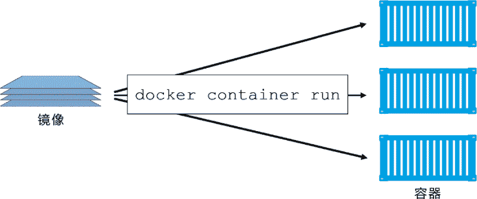
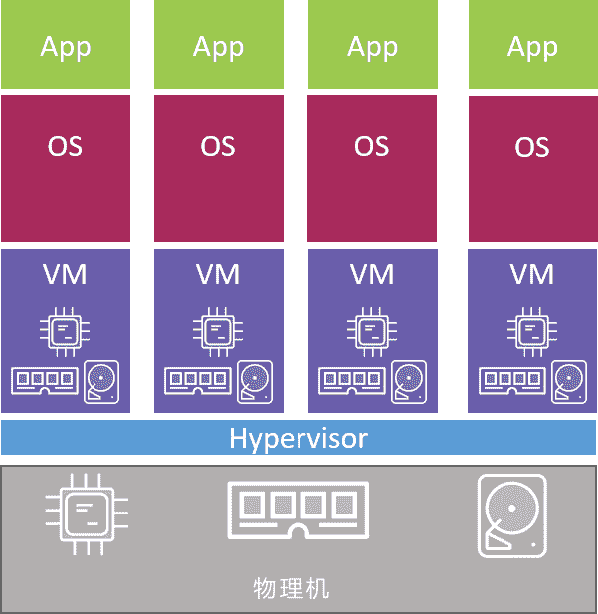
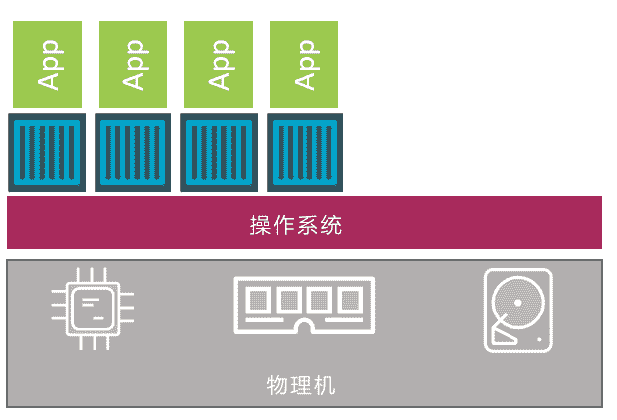
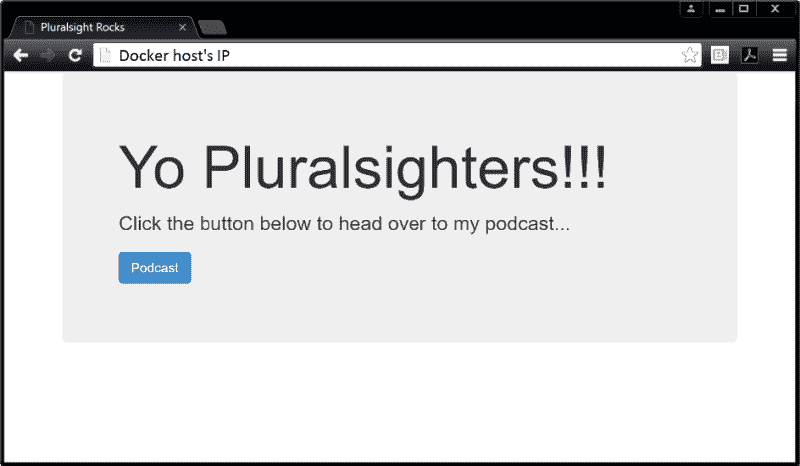

# Docker 容器（container）详解

> 原文：[`c.biancheng.net/view/3150.html`](http://c.biancheng.net/view/3150.html)

容器是镜像的运行时实例。正如从虚拟机模板上启动 VM 一样，用户也同样可以从单个镜像上启动一个或多个容器。

虚拟机和容器最大的区别是容器更快并且更轻量级——与虚拟机运行在完整的操作系统之上相比，容器会共享其所在主机的操作系统/内核。

下图为使用单个 Docker 镜像启动多个容器的示意图。


启动容器的简便方式是使用`docker container run`命令。

该命令可以携带很多参数，在其基础的格式`docker container run <image> <app>`中，指定了启动所需的镜像以及要运行的应用。

`docker container run -it ubuntu /bin/bash`则会启动某个 Ubuntu Linux 容器，并运行 Bash Shell 作为其应用。

如果想启动 PowerShell 并运行一个应用，则可以使用命令`docker container run -it microsoft- /powershell:nanoserver pwsh.exe`。

-it 参数可以将当前终端连接到容器的 Shell 终端之上。

容器随着其中运行应用的退出而终止。其中 Linux 容器会在 Bash Shell 退出后终止，而 Windows 容器会在 PowerShell 进程终止后退出。

一个简单的验证方法就是启动新的容器，并运行 sleep 命令休眠 10s。容器会启动，然后运行休眠命令，在 10s 后退出。

如果在 Linux 主机（或者在 Linux 容器模式下的 Windows 主机上）运行`docker container run alpine:latest sleep 10`命令，Shell 会连接到容器 Shell 10s 的时间，然后退出。

可以使用 `docker container stop` 命令手动停止容器运行，并且使用 `docker container start` 再次启动该容器。

如果再也不需要该容器，则使用 `docker container rm` 命令来删除容器。

## 容器和虚拟机

容器和虚拟机都依赖于宿主机才能运行。宿主机可以是笔记本，是数据中心的物理服务器，也可以是公有云的某个实例。

在下面的示例中，假设宿主机是一台需要运行 4 个业务应用的物理服务器。

在虚拟机模型中，首先要开启物理机并启动 Hypervisor 引导程序。一旦 Hypervisor 启动，就会占有机器上的全部物理资源，如 CPU、RAM、存储和 NIC。

Hypervisor 接下来就会将这些物理资源划分为虚拟资源，并且看起来与真实物理资源完全一致。

然后 Hypervisor 会将这些资源打包进一个叫作虚拟机（VM）的软件结构当中。这样用户就可以使用这些虚拟机，并在其中安装操作系统和应用。

前面提到需要在物理机上运行 4 个应用，所以在 Hypervisor 之上需要创建 4 个虚拟机并安装 4 个操作系统，然后安装 4 个应用。当操作完成后，结构如下图所示。


而容器模型则略有不同。

服务器启动之后，所选择的操作系统会启动。在 Docker 世界中可以选择 Linux，或者内核支持内核中的容器原语的新版本 Windows。

与虚拟机模型相同，OS 也占用了全部硬件资源。在 OS 层之上，需要安装容器引擎（如 Docker）。

容器引擎可以获取系统资源，比如进程树、文件系统以及网络栈，接着将资源分割为安全的互相隔离的资源结构，称之为容器。

每个容器看起来就像一个真实的操作系统，在其内部可以运行应用。按照前面的假设，需要在物理机上运行 4 个应用。

因此，需要划分出 4 个容器并在每个容器中运行一个应用，如下图所示。


从更高层面上来讲，Hypervisor 是硬件虚拟化（Hardware Virtualization）——Hypervisor 将硬件物理资源划分为虚拟资源。

容器是操作系统虚拟化（OS Virtualization）——容器将系统资源划分为虚拟资源。

## 虚拟机的额外开销

基于前文所述内容，接下来会着重探讨 Hypervisor 模型的一个主要问题。

首先我们的目标是在一台物理机上运行 4 个业务相关应用。每种模型示例中都安装了一个操作系统或者 Hypervisor（一种针对虚拟机高度优化后的操作系统）。

虚拟机模型将底层硬件资源划分到虚拟机当中。每个虚拟机都是包含了虚拟 CPU、虚拟 RAM、虚拟磁盘等资源的一种软件结构。

因此，每个虚拟机都需要有自己的操作系统来声明、初始化并管理这些虚拟资源。

但是，操作系统本身是有其额外开销的。例如，每个操作系统都消耗一点 CPU、一点 RAM、一点存储空间等。

每个操作系统都需要独立的许可证，并且都需要打补丁升级，每个操作系统也都面临被攻击的风险。

通常将这种现象称作 OS Tax 或者 VM Tax，每个操作系统都占用一定的资源。

容器模型具有在宿主机操作系统中运行的单个内核。在一台主机上运行数十个甚至数百个容器都是可能的——容器共享一个操作系统/内核。

这意味着只有一个操作系统消耗 CPU、RAM 和存储资源，只有一个操作系统需要授权，只有一个操作系统需要升级和打补丁。同时，只有一个操作系统面临被攻击的风险。简言之，就是只有一份 OS 损耗。

在上述单台机器上只需要运行 4 个业务应用的场景中，也许问题尚不明显。但当需要运行成百上千应用的时候，就会引起质的变化。

另一个值得考虑的事情是启动时间。因为容器并不是完整的操作系统，所以其启动要远比虚拟机快。

切记，在容器内部并不需要内核，也就没有定位、解压以及初始化的过程——更不用提在内核启动过程中对硬件的遍历和初始化了。

这些在容器启动的过程中统统都不需要！唯一需要的是位于下层操作系统的共享内核是启动了的！最终结果就是，容器可以在 1s 内启动。唯一对容器启动时间有影响的就是容器内应用启动所花费的时间。

这就是容器模型要比虚拟机模型简洁并且高效的原因了。使用容器可以在更少的资源上运行更多的应用，启动更快，并且支付更少的授权和管理费用，同时面对未知攻击的风险也更小。

除了上述的理论基础之外，接下来请跟随本书一起使用容器完成一些实战。

## 检查 Docker daemon

通常登录 Docker 主机后的第一件事情是检查 Docker 是否正在运行。

```

$ docker version
Client:
Version: API 17.05.0-ce
version: Go 1.29
version: Git go1.7.5
commit: 89658be
Built: Thu May 4 22:10:54 2017
OS/Arch: linux/amd64

Server:
Version: 17.05.0-ce
API version: 1.29 (minimum version 1.12)
Go version: go1.7.5
Git commit: 89658be
Built: Thu May 4 22:10:54 2017
OS/Arch: linux/amd64
Experimental: false
```

当命令输出中包含 Client 和 Server 的内容时，可以继续下面的操作。如果在 Server 部分中包含了错误码，这表示 Docker daemon 很可能没有运行，或者当前用户没有权限访问。

如果在 Linux 中遇到无权限访问的问题，需要确认当前用户是否属于本地 Docker UNIX 组。如果不是，可以通过`usermod -aG docker <user>`来添加，然后退出并重新登录 Shell，改动即可生效。

如果当前用户已经属于本地 docker 用户组，那么问题可能是 Docker daemon 没有运行导致。

根据 Docker 主机的操作系统在下面的内容中选择一条合适的命令，来检查 Docker daemon 的状态。

```

//使用 Systemd 在 Linux 系统中执行该命令
$ service docker status
docker start/running, process 29393

//使用 Systemd 在 Linux 系统中执行该命令
$ systemctl is-active docker
active

//在 Windows Server 2016 的 PowerShell 窗口中运行该命令
> Get-Service docker

Status Name DisplayName
------ ---- -----------
Running Docker docker
```

## 启动一个简单容器

启动容器的一个简单的方式是通过 `docker container run` 命令。

下面的命令启动了一个简单的容器，其中运行了容器化版本的 Ubuntu Linux。

Windows 示例。

docker container run -it microsoft/powershell:nanoserver pwsh.exe

命令的基础格式为：

docker container run <options> <im- age>:<tag> <app>

示例中使用 `docker container run` 来启动容器，这也是启动新容器的标准命令。

命令中使用了 -it 参数使容器具备交互性并与终端进行连接。接下来，命令中指定了具体镜像 ubuntu:latest 或者 microsoft/powershell:nanoserver。

最终，在命令中指定了运行在容器中的程序，Linux 示例中是 Bash Shell，Windows 示例中为 PowerShell。

当敲击回车键之后，Docker 客户端选择合适的 API 来调用 Docker daemon。

Docker daemon 接收到命令并搜索 Docker 本地缓存，观察是否有命令所请求的镜像。

在上面引用的示例中，本地缓存并未包含该镜像，所以 Docker 接下来查询在 Docker Hub 中是否存在对应镜像。找到该镜像后，Docker 将镜像拉取到本地，存储在本地缓存当中。

在标准的、开箱即用的 Linux 安装版中，Docker daemon 通过位于 /var/run/docker.sock 的本地 IPC/Unix socket 来实现 Docker 远程 API；在 Windows 中，Docker daemon 通过监听名为 npipe:////./pipe/docker_engine 的管道来实现。

通过配置，也可以借助网络来实现 Docker Client 和 daemon 之间的通信。

Docker 默认非 TLS 网络端口为 2375，TLS 默认端口为 2376。

一旦镜像拉取到本地，daemon 就创建容器并在其中运行指定的应用。

如果仔细观察，就会发现 Shell 提示符发生了变化，说明目前已经位于容器内部了。

在上面的示例中，Shell 提示符已经变为 root@3027eb644874:/#。@ 之后的一长串数字就是容器唯一 ID 的前 12 个字符。

若尝试在容器内执行一些基础命令，可能会发现某些指令无法正常工作。这是因为大部分容器镜像都是经过高度优化的。这意味着某些命令或者包可能没有安装。

下面的示例展示了两个命令，一条执行成功，一条执行失败。

root@3027eb644874:/# ls -l
total 64
drwxr-xr-x 2 root root 4096 Aug 19 00:50 bin
drwxr-xr-x 2 root root 4096 Apr 12 20:14 boot
drwxr-xr-x 5 root root 380 Sep 13 00:47 dev
drwxr-xr-x 45 root root 4096 Sep 13 00:47 etc
drwxr-xr-x 2 root root 4096 Apr 12 20:14 home
drwxr-xr-x 8 root root 4096 Sep 13 2015 lib
drwxr-xr-x 2 root root 4096 Aug 19 00:50 lib64
drwxr-xr-x 2 root root 4096 Aug 19 00:50 media
drwxr-xr-x 2 root root 4096 Aug 19 00:50 mnt
drwxr-xr-x 2 root root 4096 Aug 19 00:50 opt
dr-xr-xr-x 129 root root 0 Sep 13 00:47 proc
drwx------ 2 root root 4096 Aug 19 00:50 root
drwxr-xr-x 6 root root 4096 Aug 26 18:50 run
drwxr-xr-x 2 root root 4096 Aug 26 18:50 sbin
drwxr-xr-x 2 root root 4096 Aug 19 00:50 srv
dr-xr-xr-x 13 root root 0 Sep 13 00:47 sys
drwxrwxrwt 2 root root 4096 Aug 19 00:50 tmp
drwxr-xr-x 11 root root 4096 Aug 26 18:50 usr
drwxr-xr-x 13 root root 4096 Aug 26 18:50 var

root@3027eb644874:/# ping www.docker.com
bash: ping: command not found

从上面的输出中可以看出，ping 工具包并不是官方 Ubuntu 镜像的一部分。

## 容器进程

在前面启动 Ubuntu 容器之时，让容器运行 Bash Shell（/bin/bash）。这使得 Bash Shell 成为容器中运行的且唯一运行的进程。可以通过`ps -elf`命令在容器内部查看。

root@3027eb644874:/# ps -elf
F S UID 4 PID PPID NI ADDR SZ WCHAN STIME TTY TIME CMD
S root 0 1 0 0 - 4558 wait 00:47 ? 00:00:00 /bin/bash
R root 11 1 0 - 8604 - 00:52 ? 00:00:00 ps -elf

上面的输出中看起来好像有两个正在运行的进程，其实并非如此。

列表中 PID 为 1 的进程，是容器被告知要运行的 Bash Shell；第二个进程是 ps -elf 命令产生的，这是个临时进程，并且在输出后就已经退出了。也就是说，这个容器当前只运行了一个进程 /bin/bash。

Windows 容器有所不同，通常会运行相当多的进程。

这意味着如果通过输入 `exit` 退出 Bash Shell，那么容器也会退出（终止）。

原因是容器如果不运行任何进程则无法存在，杀死 Bash Shell 即杀死了容器唯一运行的进程，导致这个容器也被杀死。

这对于 Windows 容器来说也是一样的，杀死容器中的主进程，则容器也会被杀死。

按下 Ctrl-PQ 组合键则会退出容器但并不终止容器运行。这样做会切回到 Docker 主机的 Shell，并保持容器在后台运行。

可以使用 `docker container ls` 命令来观察当前系统正在运行的容器列表。

$ docker container ls
CNTNR ID IMAGE COMMAND CREATED STATUS NAMES
302．..74 ubuntu:latest /bin/bash 6 mins Up 6mins sick_montalcini

当前容器仍然在运行，并且可以通过 docker container exec 命令将终端重新连接到 Docker，理解这一点很重要。

$ docker container exec -it 3027eb644874 bash
root@3027eb644874:/#

用于重连 Windows Nano Server PowerShell 容器的命令是 `docker container exec -it <container-name-or-ID> pwsh.exe`。

Shell 提示符切换到了容器。这时再次运行 ps 命令，会看到两个 Bash 或者 PowerShell 进程，这是因为 `docker container exec` 命令创建了新的 Bash 或者 PowerShell 进程并且连接到容器。

这意味着在当前 Shell 输入 exit 并不会导致容器终止，因为原 Bash 或者 PowerShell 进程还在运行当中。

输入 exit 退出容器，并通过命令 `docker container ps` 来确认容器依然在运行中。果然容器还在运行。

如果在自己的 Docker 主机上运行示例，则需要使用下面两个命令来停止并删除容器（需要将 ID 替换为自己容器的 ID）。

$ docker container stop 3027eb64487
3027eb64487

$ docker container rm 3027eb64487
3027eb64487

## 容器生命周期

人们认为容器不擅长持久化工作或者持久化数据，很大程度上是因为容器在非持久化领域上表现得太出色。

但是在一个领域做得很好并不意味着不擅长其他的领域。很多虚拟机管理员会记得微软或者 Oracle 告诉他们不能在虚拟机中运行他们的应用，至少他们不会支持这么做。

下面来介绍一下容器的生命周期，从创建、运行、休眠，直至销毁的整个过程。

前面介绍了如何使用 `docker container run` 命令来启动容器。接下来会重新启动一个新的容器，这样就可以观察期完整的生命周期。

下面的示例中会采用 Linux Docker 主机来运行 Ubuntu 容器。但同时，示例内容在前面例子中使用过的 Windows PowerShell 容器中也是生效的。

$ docker container run --name percy -it ubuntu:latest /bin/bash
root@9cb2d2fd1d65:/#

这就是新建的容器，名称为“percy”，意指持久化（persistent）。

接下来把该容器投入使用，将一部分数据写入其中。

在新容器内部 Shell 中，执行下面的步骤来将部分数据写入到 tmp 目录下的某个文件中，并确认数据是否写入成功。

root@9cb2d2fd1d65:/# cd tmp

root@9cb2d2fd1d65:/tmp# ls -l
total 0

root@9cb2d2fd1d65:/tmp# echo "DevOps FTW" > newfile

root@9cb2d2fd1d65:/tmp# ls -l
total 4
-rw-r--r-- 1 root root 14 May 23 11:22 newfile

root@9cb2d2fd1d65:/tmp# cat newfile
DevOps FTW

按 Ctrl-PQ 组合键退出当前容器。

现在使用 `docker container stop` 命令来停止容器运行，切换到暂停（vacation）状态。

$ docker container stop percy
percy

可以在 `docker container stop` 命令中指定容器的名称或者 ID。具体格式为：

docker container stop <container-id or container-name>

现在运行 docker container ls 命令列出全部处于运行中状态的容器。

$ docker container ls
CONTAINER ID IMAGE COMMAND CREATED STATUS PORTS NAMES

新建的容器没有在上面的列表中出现，原因是读者通过 `docker container stop` 命令使该容器停止运行。加上 -a 参数再次运行前面的命令，就会显示出全部的容器，包括处于停止状态的。

$ docker container ls -a
CNTNR ID IMAGE COMMAND CREATED STATUS NAMES
9cb...65 ubuntu:latest /bin/bash 4 mins Exited (0) percy

现在可以看到该容器显示当前状态为 Exited(0)。停止容器就像停止虚拟机一样。尽管已经停止运行，容器的全部配置和内容仍然保存在 Docker 主机的文件系统之中，并且随时可以重新启动。

使用 `docker container start` 命令可以将容器重新启动。

$ docker container start percy
percy

$ docker container ls
CONTAINER ID IMAGE COMMAND CREATED STATUS NAMES
9cb2d2fd1d65 ubuntu:latest "/bin/bash" 4 mins Up 3 secs percy

现在停止的容器已经重新启动了，此时可以确认之前创建的文件是否还存在。使用 `docker container exec` 命令连接到重启后的容器。

$ docker container exec -it percy bash
root@9cb2d2fd1d65:/#

Shell 提示符发生变化，提示正在容器内部空间进行操作。

确认之前创建的文件依然存在，并且文件中仍包含之前写入的数据。

root@9cb2d2fd1d65:/# cd tmp
root@9cb2d2fd1d65:/# ls -l
-rw-r--r-- 1 root root 14 Sep 13 04:22 newfile
root@9cb2d2fd1d65:/#
root@9cb2d2fd1d65:/# cat newfile
DevOps FTW

像是魔术一般，之前创建的文件依然存在，并且文件中包含的数据正是离开的方式！这证明停止容器运行并不会损毁容器或者其中的数据。

尽管上面的示例阐明了容器的持久化特性，还是需要指出卷（volume）才是在容器中存储持久化数据的首选方式。

现在停止该容器并从系统中删除它。

通过在 `docker container rm` 命令后面添加 -f 参数来一次性删除运行中的容器是可行的。

但是，删除容器的最佳方式还是分两步，先停止容器然后删除。这样可以给容器中运行的应用/进程一个停止运行并清理残留数据的机会。

在下一个示例中会停止 percy 容器，删除它并确认操作成功。如果读者终端仍连接到 percy 容器，则需要按下 Ctrl-PQ 组合键先返回 Docker 主机终端。

$ docker container stop percy
percy

$ docker container rm percy
percy

$ docker container ls -a
CONTAINER ID IMAGE COMMAND CREATED STATUS PORTS NAMES

现在容器已经删除了——在系统中消失。如果这是一个有用的容器，那么之后可以作为无服务的工具使用；如果没有用处，则充其量也就是一个蹩脚的终端。

总结一下容器的生命周期。可以根据需要多次停止、启动、暂停以及重启容器，并且这些操作执行得很快。

但是容器及其数据是安全的。直至明确删除容器前，容器都不会丢弃其中的数据。就算容器被删除了，如果将容器数据存储在卷中，数据也会被保存下来。

## 优雅地停止容器

Linux 世界中，大部分容器都会运行单一进程；在 Windows 中可能运行若干个，但是下面的原则对于两者都适用。

前面的示例中容器正在运行 /bin/bash 应用。当使用 `docker container rm <container> -f` 来销毁运行中的容器时，不会发出任何告警。

这个过程相当暴力——有点像悄悄接近容器后在脑后突施冷枪。毫无征兆地被销毁，会令容器和应用猝不及防，来不及“处理后事”。

但是，`docker container stop` 命令就有礼貌多了（就像用枪指着容器的脑袋然后说“你有 10s 时间说出你的遗言”）。

该命令给容器内进程发送将要停止的警告信息，给进程机会来有序处理停止前要做的事情。一旦 docker stop 命令返回后，就可以使用 `docker container rm` 命令删除容器了。

这背后的原理可以通过 Linux/POSIX 信号来解释。`docker container stop` 命令向容器内的 PID 1 进程发送了 SIGTERM 这样的信号。

就像前文提到的一样，会为进程预留一个清理并优雅停止的机会。如果 10s 内进程没有终止，那么就会收到 SIGKILL 信号。这是致命一击。但是，进程起码有 10s 的时间来“解决”自己。

`docker container rm <container> -f` 命令不会先友好地发送 SIGTERM，这条命令会直接发出 SIGKILL。就像刚刚所打的比方一样，该命令悄悄接近并对容器发起致命一击。

## 利用重启策略进行容器的自我修复

通常建议在运行容器时配置好重启策略。这是容器的一种自我修复能力，可以在指定事件或者错误后重启来完成自我修复。

重启策略应用于每个容器，可以作为参数被强制传入 `docker-container run` 命令中，或者在 Compose 文件中声明（在使用 Docker Compose 以及 Docker Stacks 的情况下）。

容器支持的重启策略包括 always、unless-stopped 和 on-failed。

always 策略是一种简单的方式。除非容器被明确停止，比如通过 `docker container stop` 命令，否则该策略会一直尝试重启处于停止状态的容器。

一种简单的证明方式是启动一个新的交互式容器，并在命令后面指定 --restart always 策略，同时在命令中指定运行 Shell 进程。

当容器启动的时候，会登录到该 Shell。退出 Shell 时会杀死容器中 PID 为 1 的进程，并且杀死这个容器。

但是因为指定了 --restart always 策略，所以容器会自动重启。如果运行 `docker container ls` 命令，就会看到容器的启动时间小于创建时间。下面请看示例。

$ docker container run --name neversaydie -it --restart always alpine sh

//等待几秒后输入 exit

/# exit

$ docker container ls
CONTAINER ID IMAGE COMMAND CREATED STATUS
0901afb84439 alpine "sh" 35 seconds ago Up 1 second

注意，容器于 35s 前被创建，但却在 1s 前才启动。这是因为在容器中输入退出命令的时候，容器被杀死，然后 Docker 又重新启动了该容器。

--restart always 策略有一个很有意思的特性，当 daemon 重启的时候，停止的容器也会被重启。

例如，新创建一个容器并指定 --restart always 策略，然后通过 `docker container stop` 命令停止该容器。

现在容器处于 Stopped (Exited) 状态。但是，如果重启 Docker daemon，当 daemon 启动完成时，该容器也会重新启动。

always 和 unless-stopped 的最大区别，就是那些指定了 --restart unless-stopped 并处于 Stopped (Exited) 状态的容器，不会在 Docker daemon 重启的时候被重启。

下面创建两个新容器，其中“always”容器指定 --restart always 策略，另一个“unless- stopped”容器指定了 --restart unless-stopped 策略。

两个容器均通过 `docker container stop` 命令停止，接着重启 Docker。结果“always”容器会重启，但是“unless-stopped”容器不会。

#### 1) 创建两个新容器

$ docker container run -d --name always \
--restart always \
alpine sleep 1d

$ docker container run -d --name unless-stopped \
--restart unless-stopped \
alpine sleep 1d

$ docker container ls
CONTAINER ID IMAGE COMMAND STATUS NAMES
3142bd91ecc4 alpine "sleep 1d" Up 2 secs unless-stopped
4f1b431ac729 alpine "sleep 1d" Up 17 secs always

现在有两个运行的容器了。一个叫作“always”，另一个叫作“unless-stopped”。

#### 2) 停止两个容器

$ docker container stop always unless-stopped

$ docker container ls -a
CONTAINER ID IMAGE STATUS NAMES
3142bd91ecc4 alpine Exited (137) 3 seconds ago unless-stopped
4f1b431ac729 alpine Exited (137) 3 seconds ago always

#### 3) 重启 Docker

重启 Docker 的过程在不同的操作系统上可能不同。下面介绍一下如何在 Linux 上使用 systemd 重启 Docker，在 Windows Server 2016 上可以使用 restart-service 重启。

$ systemlctl restart docker

#### 4) 一旦 Docker 重启成功，检查两个容器的状态

$ docker container ls -a
CONTAINER CREATED STATUS NAMES
314．.cc4 2 minutes ago Exited (137) 2 minutes ago unless-stopped
4f1..729 2 minutes ago Up 9 seconds always

注意到“always”容器（启动时指定了 --restart always 策略）已经重启了，但是“unless-stopped”容器（启动时指定了 --restart unless-stopped 策略）并没有重启。

on-failure 策略会在退出容器并且返回值不是 0 的时候，重启容器。

就算容器处于 stopped 状态，在 Docker daemon 重启的时候，容器也会被重启。

如果读者使用 Docker Compose 或者 Docker Stack，可以在 service 对象中配置重启策略，示例如下。

version: "3.5"
services:
myservice:
<Snip>
restart_policy:
condition: always | unless-stopped | on-failure

## Web 服务器示例

到目前为止，已经介绍了如何启动一个简单的容器，并与其进行交互。同时也知道了如何停止、重启以及删除一个容器。现在来看一个 Linux Web 服务器示例。

在该示例中，会使用到 Pluralsight 视频教程网站中的一个镜像。这个镜像会在 8080 端口启动一个相当简单的 Web 服务。

使用 `docker container stop` 以及 `docker container rm` 命令清理当前系统中的全部容器，然后运行下面的 `docker container run` 命令。

$ docker container run -d --name webserver -p 80:8080 \
nigelpoulton/pluralsight-docker-ci

Unable to find image 'nigelpoulton/pluralsight-docker-ci:latest' locally
latest: Pulling from nigelpoulton/pluralsight-docker-ci
a3ed95caeb02: Pull complete
3b231ed5aa2f: Pull complete
7e4f9cd54d46: Pull complete
929432235e51: Pull complete
6899ef41c594: Pull complete
0b38fccd0dab: Pull complete
Digest: sha256:7a6b0125fe7893e70dc63b2...9b12a28e2c38bd8d3d
Status: Downloaded newer image for nigelpoulton/plur...docker-ci:latest
6efa1838cd51b92a4817e0e7483d103bf72a7ba7ffb5855080128d85043fef21

注意，当前 Shell 提示符并未发生变化。这是因为使用了 -d 参数启动容器，并在后台运行。这种后台启动的方式不会将当前终端连接到容器当中。

该示例在 `docker container run` 命令中抛出了一些额外的参数，一起来快速了解一下。

已经知道 `docker container run` 会启动一个新容器，但是这次使用 -d 参数替换了 -it。-d 表示后台模式，告知容器在后台运行。

然后为容器命名，并且指定了 -p 80:8080。-p 参数将 Docker 主机的端口映射到容器内。

本例中，将 Docker 主机的 80 端口映射到了容器内的 8080 端口。这意味着当有流量访问主机的 80 端口的时候，流量会直接映射到容器内的 8080 端口。

之所以如此是因为当前使用的镜像，其 Web 服务监听了 8080 端口。这意味着容器启动时会运行一个 Web 服务，监听 8080 端口。

最终，命令中还指定 Docker 所使用的镜像：nigelpoulton/pluralsight-docker-ci。这个镜像不一定保持更新，并且可能存在缺陷。

使用 `docker container ls` 命令可以查看当前运行的容器以及端口的映射情况。端口信息按照 host-port:container-port 的格式显示，明确这一点很重要。

$ docker container ls
CONTAINER ID COMMAND STATUS PORTS NAMES
6efa1838cd51 /bin/sh -c... Up 2 mins 0.0.0.0:80->8080/tcp webserver

为了提高可读性，上面输出中的部分列并未展示。

现在容器已经运行，端口也映射成功，可以通过浏览器来访问该容器，需要在浏览器中指定 Docker 主机的 IP 地址或 DNS 名称，端口号是 80。下图展示了由容器服务提供的网页。


docker container stop、docker container pause、docker container start 和 docker container rm 命令同样适用于容器。

同时，持久性的规则也适用于容器——停止或暂停容器并不会导致容器销毁，或者内部存储的数据丢失。

## 查看容器详情

在前面的示例当中，读者可能发现当运行 `docker container run` 命令的时候，并没有指定容器中的具体应用。但是容器却启动了一个简单的 Web 服务。这是如何发生的？

当构建 Docker 镜像的时候，可以通过嵌入指令来列出希望容器运行时启动的默认应用。如果运行 `docker image inspect` 命令来查看运行容器时使用的镜像，就能看到容器启动时将要运行的应用列表了。

$ docker image inspect nigelpoulton/pluralsight-docker-ci
[
{
"Id": "sha256:07e574331ce3768f30305519...49214bf3020ee69bba1",
"RepoTags": [
  "nigelpoulton/pluralsight-docker-ci:latest"

  <Snip>

],
"Cmd": [
  "/bin/sh",
  "-c",
  "#(nop) CMD [\"/bin/sh\" \"-c\" \"cd /src \u0026\u0026 node \
  .app.js\"]"
],
<Snip>

为了方便阅读，仅截取输出内容中我们感兴趣的部分。

Cmd 一项中展示了容器将会执行的命令或应用，除非在启动的时候读者指定另外的应用。如果去掉示例脚本中的转义字符，可以得到这样的命令：/bin/sh -c "cd /src && node ./app.js。这是基于该镜像的容器会默认运行的应用。

在构建镜像时指定默认命令是一种很普遍的做法，因为这样可以简化容器的启动。

这也为镜像指定了默认的行为，并且从侧面阐述了镜像的用途——可以通过 Inspect 镜像的方式来了解所要运行的应用。

## 快速清理

接下来了解一种简单且快速的清理 Docker 主机上全部运行容器的方法。

这种处理方式会强制删除所有的容器，并且不会给容器完成清理的机会。

这种操作一定不能在生产环境系统或者运行着重要容器的系统上执行。

在 Docker 主机的 Shell 中运行下面的命令，可以删除全部容器。

$()

在本例中，因为只有一个运行中的容器，所以只有一个容器被删除（6efa1838cd51）。

但是该命令的工作方式，就跟前面章节中用于删除某台 Docker 主机上全部容器的命令 `rm $(docker image ls -q)` 一样，`docker container rm` 命令会删除容器。

如果将 $(docker container ls -aq) 作为参数传递给 `docker container rm` 命令，等价于将系统中每个容器的 ID 传给该命令。

-f 标识表示强制执行，所以即使是处于运行状态的容器也会被删除。接下来，无论是运行中还是停止的容器，都会被删除并从系统中移除。

上面的命令在 Windows Docker 主机的 PowerShell 终端内同样生效。