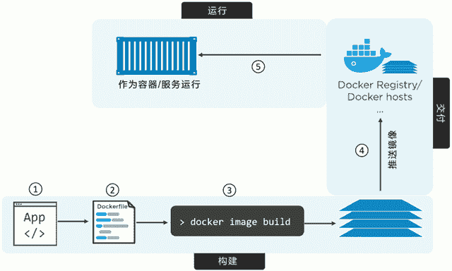
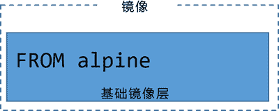
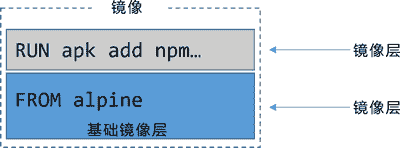
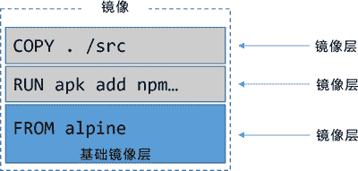
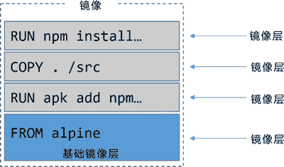
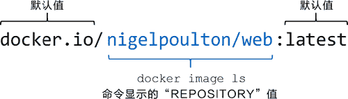
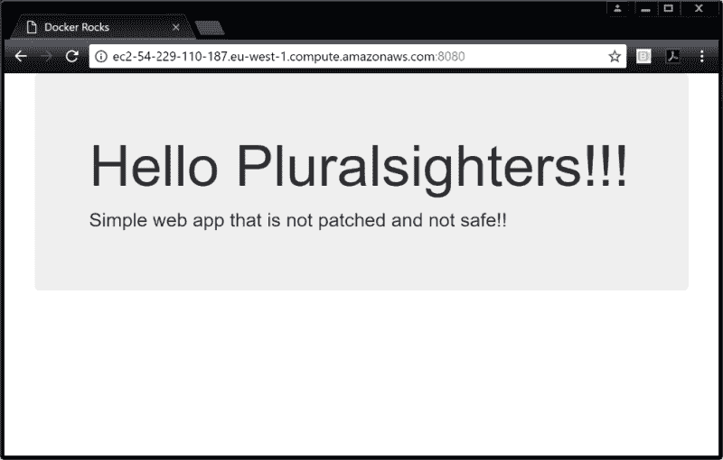
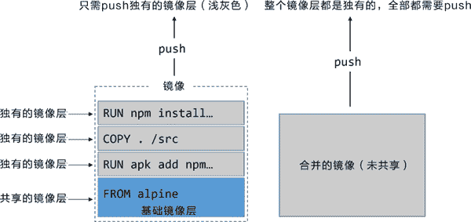

# Docker 应用容器化（将应用程序部署到容器中）

> 原文：[`c.biancheng.net/view/3159.html`](http://c.biancheng.net/view/3159.html)

Docker 的核心思想就是如何将应用整合到容器中，并且能在容器中实际运行。

将应用整合到容器中并且运行起来的这个过程，称为“容器化”（Containerizing），有时也叫作“Docker 化”（Dockerizing）。

容器是为应用而生的，具体来说，容器能够简化应用的构建、部署和运行过程。

完整的应用容器化过程主要分为以下几个步骤。

*   编写应用代码。
*   创建一个 Dockerfile，其中包括当前应用的描述、依赖以及该如何运行这个应用。
*   对该 Dockerfile 执行 docker image build 命令。
*   等待 Docker 将应用程序构建到 Docker 镜像中。

一旦应用容器化完成（即应用被打包为一个 Docker 镜像），就能以镜像的形式交付并以容器的方式运行了。

下图展示了上述步骤。

## 单体应用容器化

接下来我们会逐步展示如何将一个简单的单节点 Node.js Web 应用容器化。

如果是 Windows 操作系统的话，处理过程也是大同小异。

应用容器化的过程大致分为如下几个步骤：

*   获取应用代码。
*   分析 Dockerfile。
*   构建应用镜像。
*   运行该应用。
*   测试应用。
*   容器应用化细节。
*   生产环境中的多阶段构建。
*   最佳实践。

#### 1) 获取应用代码

应用代码可以从网盘获取（[`pan.baidu.com/s/150UgIJPvuQUf0yO3KBLegg`](https://pan.baidu.com/s/150UgIJPvuQUf0yO3KBLegg) 提取码：pkx4）。

$ cd psweb

$ ls -l
total 28
-rw-r--r-- 1 root root 341 Sep 29 16:26 app.js
-rw-r--r-- 1 root root 216 Sep 29 16:26 circle.yml
-rw-r--r-- 1 root root 338 Sep 29 16:26 Dockerfile
-rw-r--r-- 1 root root 421 Sep 29 16:26 package.json
-rw-r--r-- 1 root root 370 Sep 29 16:26 README.md
drwxr-xr-x 2 root root 4096 Sep 29 16:26 test
drwxr-xr-x 2 root root 4096 Sep 29 16:26 views

该目录下包含了全部的应用源码，以及包含界面和单元测试的子目录。这个应用结构非常简单。

应用代码准备就绪后，接下来分析一下 Dockerfile 的具体内容。

#### 2) 分析 Dockerfile

在代码目录当中，有个名称为 Dockerfile 的文件。这个文件包含了对当前应用的描述，并且能指导 Docker 完成镜像的构建。

在 Docker 当中，包含应用文件的目录通常被称为构建上下文（Build Context）。通常将 Dockerfile 放到构建上下文的根目录下。

另外很重要的一点是，文件开头字母是大写 D，这里是一个单词。像“dockerfile”或者“Docker file”这种写法都是不允许的。

接下来了解一下 Dockerfile 文件当中都包含哪些具体内容。

$ cat Dockerfile

FROM alpine
LABEL maintainer="nigelpoulton@hotmail.com"
RUN apk add --update nodejs nodejs-npm
COPY . /src
WORKDIR /src
RUN npm install
EXPOSE 8080
ENTRYPOINT ["node", "./app.js"]

Dockerfile 主要包括两个用途：

*   对当前应用的描述。
*   指导 Docker 完成应用的容器化（创建一个包含当前应用的镜像）。

不要因 Dockerfile 就是一个描述文件而对其有所轻视！Dockerfile 能实现开发和部署两个过程的无缝切换。

同时 Dockerfile 还能帮助新手快速熟悉这个项目。Dockerfile 对当前的应用及其依赖有一个清晰准确的描述，并且非常容易阅读和理解。

因此，要像重视你的代码一样重视这个文件，并且将它纳入到源控制系统当中。

下面是这个文件中的一些关键步骤概述：以 alpine 镜像作为当前镜像基础，指定维护者（maintainer）为“nigelpoultion@hotmail.com”，安装 Node.js 和 NPM，将应用的代码复制到镜像当中，设置新的工作目录，安装依赖包，记录应用的网络端口，最后将 app.js 设置为默认运行的应用。

具体分析一下每一步的作用。

每个 Dockerfile 文件第一行都是 FROM 指令。

FROM 指令指定的镜像，会作为当前镜像的一个基础镜像层，当前应用的剩余内容会作为新增镜像层添加到基础镜像层之上。

本例中的应用基于 Linux 操作系统，所以在 FROM 指令当中所引用的也是一个 Linux 基础镜像；如果要容器化的应用是一个基于 Windows 操作系统的应用，就需要指定一个像 microsoft/aspnetcore-build 这样的 Windows 基础镜像了。

截至目前，基础镜像的结构如下图所示。

接下来，Dockerfile 中通过标签（LABLE）方式指定了当前镜像的维护者为“nigelpoulton@hotmail. com”。

每个标签其实是一个键值对（Key-Value），在一个镜像当中可以通过增加标签的方式来为镜像添加自定义元数据。

备注维护者信息有助于为该镜像的潜在使用者提供沟通途径，这是一种值得提倡的做法。

`RUN apk add --update nodejs nodejs-npm` 指令使用 alpine 的 apk 包管理器将 nodejs 和 nodejs-npm 安装到当前镜像之中。

RUN 指令会在 FROM 指定的 alpine 基础镜像之上，新建一个镜像层来存储这些安装内容。当前镜像的结构如下图所示。

COPY. / src 指令将应用相关文件从构建上下文复制到了当前镜像中，并且新建一个镜像层来存储。COPY 执行结束之后，当前镜像共包含 3 层，如下图所示。

下一步，Dockerfile 通过 WORKDIR 指令，为 Dockerfile 中尚未执行的指令设置工作目录。

该目录与镜像相关，并且会作为元数据记录到镜像配置中，但不会创建新的镜像层。

然后，`RUN npm install` 指令会根据 package.json 中的配置信息，使用 npm 来安装当前应用的相关依赖包。

npm 命令会在前文设置的工作目录中执行，并且在镜像中新建镜像层来保存相应的依赖文件。

目前镜像一共包含 4 层，如下图所示。

因为当前应用需要通过 TCP 端口 8080 对外提供一个 Web 服务，所以在 Dockerfile 中通过 EXPOSE 8080 指令来完成相应端口的设置。

这个配置信息会作为镜像的元数据被保存下来，并不会产生新的镜像层。

最终，通过 ENTRYPOINT 指令来指定当前镜像的入口程序。ENTRYPOINT 指定的配置信息也是通过镜像元数据的形式保存下来，而不是新增镜像层。

#### 3) 容器化当前应用/构建具体的镜像

到目前为止，应该已经了解基本的原理和流程，接下来是时候尝试构建自己的镜像了。

下面的命令会构建并生成一个名为 web:latest 的镜像。命令最后的点（.）表示 Docker 在进行构建的时候，使用当前目录作为构建上下文。

一定要在命令最后包含这个点，并且在执行命令前，要确认当前目录是 psweb（包含 Dockerfile 和应用代码的目录）。

命令执行结束后，检查本地 Docker 镜像库是否包含了刚才构建的镜像。

$ docker image ls
REPO TAG IMAGE ID CREATED SIZE
web latest fc69fdc4c18e 10 seconds ago 64.4MB

恭喜，应用容器化已经成功了！

读者可以通过 `docker image inspect web:latest` 来确认刚刚构建的镜像配置是否正确。这个命令会列出 Dockerfile 中设置的所有配置项。

#### 4) 推送镜像到仓库

在创建一个镜像之后，将其保存在一个镜像仓库服务是一个不错的方式。这样存储镜像会比较安全，并且可以被其他人访问使用。

Docker Hub 就是这样的一个开放的公共镜像仓库服务，并且这也是 `docker image push` 命令默认的推送地址。

在推送镜像之前，需要先使用 Docker ID 登录 Docker Hub。除此之外，还需要为待推送的镜像打上合适的标签。

接下来介绍一下如何登录 Docker Hub，并将镜像推送到其中。

在后续的例子中，需要用自己的 Docker ID 替换示例中所使用的 ID。所以每当看到“nigelpoulton”时，记得替换为自己的 Docker ID。

$ docker login
Login with **your** Docker ID to push and pull images from Docker Hub...
Username: nigelpoulton
Password:
Login Succeeded

推送 Docker 镜像之前，还需要为镜像打标签。这是因为 Docker 在镜像推送的过程中需要如下信息。

*   Registry（镜像仓库服务）。
*   Repository（镜像仓库）。
*   Tag（镜像标签）。

无须为 Registry 和 Tag 指定值。当没有为上述信息指定具体值的时候，Docker 会默认 Registry=docker.io、Tag=latest。

但是 Docker 并没有给 Repository 提供默认值，而是从被推送镜像中的 REPOSITORY 属性值获取。

这一点可能不好理解，下面会通过一个完整的例子来介绍如何向 Docker Hub 中推送一个镜像。

在前面的例子中执行了 `docker image ls` 命令。在该命令对应的输出内容中可以看到，镜像仓库的名称是 web。

这意味着执行 `docker image push` 命令，会尝试将镜像推送到 docker.io/web:latest 中。

但是其实 nigelpoulton 这个用户并没有 web 这个镜像仓库的访问权限，所以只能尝试推送到 nigelpoulton 这个二级命名空间（Namespace）之下。

因此需要使用 nigelpoulton 这个 ID，为当前镜像重新打一个标签。

$ docker image tag web:latest nigelpoulton/web:latest

为镜像打标签命令的格式是 docker image tag <current-tag> <new-tag>，其作用是为指定的镜像添加一个额外的标签，并且不需要覆盖已经存在的标签。

再次执行 `docker image ls` 命令，可以看到这个镜像现在有了两个标签，其中一个包含 Docker ID nigelpoulton。

$ docker image ls
REPO TAG IMAGE ID CREATED SIZE
web latest fc69fdc4c18e 10 secs ago 64.4MB
nigelpoulton/web latest fc69fdc4c18e 10 secs ago 64.4MB

现在将该镜像推送到 Docker Hub。

$ docker image push nigelpoulton/web:latest
The push refers to repository [docker.io/nigelpoulton/web]
2444b4ec39ad: Pushed
ed8142d2affb: Pushed
d77e2754766d: Pushed
cd7100a72410: Mounted from library/alpine
latest: digest: sha256:68c2dea730...f8cf7478 size: 1160

下图展示了 Docker 如何确定镜像所要推送的目的仓库。

因为权限问题，所以需要把上面例子中出现的 ID（nigelpoulton）替换为自己的 Docker ID，才能进行推送操作。

在接下来的例子当中，将使用 web:latest 这个标签。

#### 5) 运行应用程序

前文中容器化的这个应用程序其实很简单，从 app.js 这个文件内容中可以看出，这其实就是一个在 8080 端口提供 Web 服务的应用程序。

下面的命令会基于 web:latest 这个镜像，启动一个名为 c1 的容器。该容器将内部的 8080 端口与 Docker 主机的 80 端口进行映射。

这意味读者可以打开一个浏览器，在地址栏输入 Docker 主机的 DNS 名称或者 IP 地址，然后就能直接访问这个 Web 应用了。

如果 Docker 主机已经运行了某个使用 80 端口的应用程序，读者可以在执行 `docker container run` 命令时指定一个不同的映射端口。例如，可以使用 -p 5000:8080 参数，将 Docker 内部应用程序的 8080 端口映射到主机的 5000 端口。

$ docker container run -d --name c1 \
-p 80:8080 \
web:latest

-d 参数的作用是让应用程序以守护线程的方式在后台运行。

-p 80:8080 参数的作用是将主机的 80 端口与容器内的 8080 端口进行映射。

接下来验证一下程序是否真的成功运行，并且对外提供服务的端口是否正常工作。

$ docker container ls

ID IMAGE COMMAND STATUS PORTS
49．. web:latest "node ./app.js" UP 6 secs 0.0.0.0:80->8080/tcp

为了方便阅读，只截取了命令输出内容的一部分。从上面的输出内容中可以看到，容器已经正常运行。需要注意的是，80 端口已经成功映射到了 8080 之上，并且任意外部主机（0.0.0.0:80）均可以通过 80 端口访问该容器。

#### 6) APP 测试

打开浏览器，在地址栏输入 DNS 名称或者 IP 地址，就能访问到正在运行的应用程序了。可以看到下图所示的界面。

如果没有出现这样的界面，尝试执行下面的检查来确认原因所在。

使用 `docker container ls`指令来确认容器已经启动并且正常运行。容器名称是 c1，并且从输出内容中能看到 0.0.0.0:80->8080/tcp。

确认防火墙或者其他网络安全设置没有阻止访问 Docker 主机的 80 端口。

如此，应用程序已经容器化并成功运行了。

#### 7) 详述

到现在为止，应当成功完成一个示例应用程序的容器化。下面是其中一些细节部分的回顾和总结。

Dockerfile 中的注释行，都是以#开头的。

除注释之外，每一行都是一条指令（Instruction）。指令的格式是指令参数如下。

INSTRUCTION argument

指令是不区分大小写的，但是通常都采用大写的方式。这样 Dockerfile 的可读性会高一些。

`Docker image build` 命令会按行来解析 Dockerfile 中的指令并顺序执行。

部分指令会在镜像中创建新的镜像层，其他指令只会增加或修改镜像的元数据信息。

在上面的例子当中，新增镜像层的指令包括 FROM、RUN 以及 COPY，而新增元数据的指令包括 EXPOSE、WORKDIR、ENV 以 及 ENTERPOINT。

关于如何区分命令是否会新建镜像层，一个基本的原则是，如果指令的作用是向镜像中增添新的文件或者程序，那么这条指令就会新建镜像层；如果只是告诉 Docker 如何完成构建或者如何运行应用程序，那么就只会增加镜像的元数据。

可以通过 `docker image history` 来查看在构建镜像的过程中都执行了哪些指令。

在上面的输出内容当中，有两点是需要注意的。

首先，每行内容都对应了 Dockerfile 中的一条指令（顺序是自下而上）。CREATE BY 这一列中还展示了当前行具体对应 Dockerfile 中的哪条指令。

其次，从这个输出内容中，可以观察到只有 4 条指令会新建镜像层（就是那些 SIZE 列对应的数值不为零的指令），分别对应 Dockerfile 中的 FROM、RUN 以及 COPY 指令。

虽然其他指令看上去跟这些新建镜像层的指令并无区别，但实际上它们只在镜像中新增了元数据信息。这些指令之所以看起来没有区别，是因为 Docker 对之前构建镜像层方式的兼容。

可以通过执行 `docker image inspect` 指令来确认确实只有 4 个层被创建了。

$ docker image inspect web:latest
<Snip>
},
"RootFS": {
"Type": "layers",
"Layers": [
    "sha256:cd7100...1882bd56d263e02b6215",
    "sha256:b3f88e...cae0e290980576e24885",
    "sha256:3cfa21...cc819ef5e3246ec4fe16",
    "sha256:4408b4...d52c731ba0b205392567"
]
},

使用 FROM 指令引用官方基础镜像是一个很好的习惯，这是因为官方的镜像通常会遵循一些最佳实践，并且能帮助使用者规避一些已知的问题。

除此之外，使用 FROM 的时候选择一个相对较小的镜像文件通常也能避免一些潜在的问题。

通过 `docker image build` 命令具体的输出内容，可以了解镜像构建的过程。

在下面的片段中，可以看到基本的构建过程是，运行临时容器 -> 在该容器中运行 Dockerfile 中的指令 -> 将指令运行结果保存为一个新的镜像层 -> 删除临时容器。

Step 3/8 : RUN apk add --update nodejs nodejs-npm
---> Running in e690ddca785f << Run inside of temp container
fetch http://dl-cdn...APKINDEX.tar.gz
fetch http://dl-cdn...APKINDEX.tar.gz
(1/10) Installing ca-certificates (20171114-r0)
<Snip>
OK: 61 MiB in 21 packages
---> c1d31d36b81f << Create new layer
Removing intermediate container << Remove temp container
Step 4/8 : COPY . /src

生产环境中的多阶段构建

对于 Docker 镜像来说，过大的体积并不好！

越大则越慢，这就意味着更难使用，而且可能更加脆弱，更容易遭受攻击。

鉴于此，Docker 镜像应该尽量小。对于生产环境镜像来说，目标是将其缩小到仅包含运行应用所必需的内容即可。问题在于，生成较小的镜像并非易事。

不同的 Dockerfile 写法就会对镜像的大小产生显著影响。

常见的例子是，每一个 RUN 指令会新增一个镜像层。因此，通过使用 && 连接多个命令以及使用反斜杠（\）换行的方法，将多个命令包含在一个 RUN 指令中，通常来说是一种值得提倡的方式。

另一个问题是开发者通常不会在构建完成后进行清理。当使用 RUN 执行一个命令时，可能会拉取一些构建工具，这些工具会留在镜像中移交至生产环境。

有多种方式来改善这一问题——比如常见的是采用建造者模式（Builder Pattern）。但无论采用哪种方式，通常都需要额外的培训，并且会增加构建的复杂度。

建造者模式需要至少两个 Dockerfile，一个用于开发环境，一个用于生产环境。

首先需要编写 Dockerfile.dev，它基于一个大型基础镜像（Base Image），拉取所需的构建工具，并构建应用。

接下来，需要基于 Dockerfile.dev 构建一个镜像，并用这个镜像创建一个容器。

这时再编写 Dockerfile.prod，它基于一个较小的基础镜像开始构建，并从刚才创建的容器中将应用程序相关的部分复制过来。

整个过程需要编写额外的脚本才能串联起来。

这种方式是可行的，但是比较复杂。

多阶段构建（Multi-Stage Build）是一种更好的方式！

多阶段构建能够在不增加复杂性的情况下优化构建过程。

下面介绍一下多阶段构建方式。

多阶段构建方式使用一个 Dockerfile，其中包含多个 FROM 指令。每一个 FROM 指令都是一个新的构建阶段（Build Stage），并且可以方便地复制之前阶段的构件。

示例源码可从百度网盘获取（[`pan.baidu.com/s/1M2paPY0f0lE5wm48HBk-Zw`](https://pan.baidu.com/s/1M2paPY0f0lE5wm48HBk-Zw) 提取码: 2e7s ），Dockerfile 位于 app 目录。

这是一个基于 Linux 系统的应用，因此只能运行在 Linux 容器环境上。

Dockerfile 如下所示。

FROM node:latest AS storefront
WORKDIR /usr/src/atsea/app/react-app
COPY react-app .
RUN npm install
RUN npm run build

FROM maven:latest AS appserver
WORKDIR /usr/src/atsea
COPY pom.xml .
RUN mvn -B -f pom.xml -s /usr/share/maven/ref/settings-docker.xml dependency
\:resolve
COPY . .
RUN mvn -B -s /usr/share/maven/ref/settings-docker.xml package -DskipTests

FROM java:8-jdk-alpine AS production
RUN adduser -Dh /home/gordon gordon
WORKDIR /static
COPY --from=storefront /usr/src/atsea/app/react-app/build/ .
WORKDIR /app
COPY --from=appserver /usr/src/atsea/target/AtSea-0.0.1-SNAPSHOT.jar .
ENTRYPOINT ["java", "-jar", "/app/AtSea-0.0.1-SNAPSHOT.jar"]
CMD ["--spring.profiles.active=postgres"]

首先注意到，Dockerfile 中有 3 个 FROM 指令。每一个 FROM 指令构成一个单独的构建阶段。

各个阶段在内部从 0 开始编号。不过，示例中针对每个阶段都定义了便于理解的名字。

*   阶段 0 叫作 storefront。
*   阶段 1 叫作 appserver。
*   阶段 2 叫作 production。

storefront 阶段拉取了大小超过 600MB 的 node:latest 镜像，然后设置了工作目录，复制一些应用代码进去，然后使用 2 个 RUN 指令来执行 npm 操作。

这会生成 3 个镜像层并显著增加镜像大小。指令执行结束后会得到一个比原镜像大得多的镜像，其中包含许多构建工具和少量应用程序代码。

appserver 阶段拉取了大小超过 700MB 的 maven:latest 镜像。然后通过 2 个 COPY 指令和 2 个 RUN 指令生成了 4 个镜像层。

这个阶段同样会构建出一个非常大的包含许多构建工具和非常少量应用程序代码的镜像。

production 阶段拉取 java:8-jdk-alpine 镜像，这个镜像大约 150MB，明显小于前两个构建阶段用到的 node 和 maven 镜像。

这个阶段会创建一个用户，设置工作目录，从 storefront 阶段生成的镜像中复制一些应用代码过来。

之后，设置一个不同的工作目录，然后从 appserver 阶段生成的镜像中复制应用相关的代码。最后，production 设置当前应用程序为容器启动时的主程序。

重点在于 COPY --from 指令，它从之前的阶段构建的镜像中仅复制生产环境相关的应用代码，而不会复制生产环境不需要的构件。

还有一点也很重要，多阶段构建这种方式仅用到了一个 Dockerfile，并且 `docker image build` 命令不需要增加额外参数。

下面演示一下构建操作。克隆代码库并切换到 app 目录，并确保其中有 Dockerfile。

$ cd atsea-sample-shop-app/app

$ ls -l
total 24
-rw-r--r-- 1 root root 682 Oct 1 22:03 Dockerfile
-rw-r--r-- 1 root root 4365 Oct 1 22:03 pom.xml
drwxr-xr-x 4 root root 4096 Oct 1 22:03 react-app
drwxr-xr-x 4 root root 4096 Oct 1 22:03 src

执行构建（这可能会花费几分钟）。

$ docker image build -t multi:stage .

Sending build context to Docker daemon 3.658MB
Step 1/19 : FROM node:latest AS storefront
latest: Pulling from library/node
aa18ad1a0d33: Pull complete
15a33158a136: Pull complete
<Snip>
Step 19/19 : CMD --spring.profiles.active=postgres
---> Running in b4df9850f7ed
---> 3dc0d5e6223e
Removing intermediate container b4df9850f7ed
Successfully built 3dc0d5e6223e
Successfully tagged multi:stage

示例中 multi:stage 标签是自行定义的，可以根据自己的需要和规范来指定标签名称。不过并不要求一定必须为多阶段构建指定标签。

执行 `docker image ls` 命令查看由构建命令拉取和生成的镜像。

$ docker image ls

REPO TAG IMAGE ID CREATED SIZE
node latest 9ea1c3e33a0b 4 days ago 673MB
<none> <none> 6598db3cefaf 3 mins ago 816MB
maven latest cbf114925530 2 weeks ago 750MB
<none> <none> d5b619b83d9e 1 min ago 891MB
java 8-jdk-alpine 3fd9dd82815c 7 months ago 145MB
multi stage 3dc0d5e6223e 1 min ago 210MB

输出内容的第一行显示了在 storefront 阶段拉取的 node:latest 镜像，下一行内容为该阶段生成的镜像（通过添加代码，执行 npm 安装和构建操作生成该镜像）。

这两个都包含许多的构建工具，因此镜像体积非常大。

第 3～4 行是在 appserver 阶段拉取和生成的镜像，它们也都因为包含许多构建工具而导致体积较大。

最后一行是 Dockerfile 中的最后一个构建阶段（stage2/production）生成的 multi:stage 镜像。

可见它明显比之前阶段拉取和生成的镜像要小。这是因为该镜像是基于相对精简的 java:8-jdk-alpine 镜像构建的，并且仅添加了用于生产环境的应用程序文件。

最终，无须额外的脚本，仅对一个单独的 Dockerfile 执行 `docker image build` 命令，就创建了一个精简的生产环境镜像。

多阶段构建是随 Docker 17.05 版本新增的一个特性，用于构建精简的生产环境镜像。

## 最佳实践

下面介绍一些最佳实践。

#### 1) 利用构建缓存

Docker 的构建过程利用了缓存机制。观察缓存效果的一个方法，就是在一个干净的 Docker 主机上构建一个新的镜像，然后再重复同样的构建。

第一次构建会拉取基础镜像，并构建镜像层，构建过程需要花费一定时间；第二次构建几乎能够立即完成。

这就是因为第一次构建的内容（如镜像层）能够被缓存下来，并被后续的构建过程复用。

`docker image build` 命令会从顶层开始解析 Dockerfile 中的指令并逐行执行。而对每一条指令，Docker 都会检查缓存中是否已经有与该指令对应的镜像层。

如果有，即为缓存命中（Cache Hit），并且会使用这个镜像层；如果没有，则是缓存未命中（Cache Miss），Docker 会基于该指令构建新的镜像层。

缓存命中能够显著加快构建过程。

下面通过实例演示其效果。

示例用的 Dockerfile 如下。

FROM alpine
RUN apk add --update nodejs nodejs-npm
COPY . /src
WORKDIR /src
RUN npm install
EXPOSE 8080
ENTRYPOINT ["node", "./app.js"]

第一条指令告诉 Docker 使用 alpine:latest 作为基础镜像。

如果主机中已经存在这个镜像，那么构建时会直接跳到下一条指令；如果镜像不存在，则会从 Docker Hub（docker.io）拉取。

下一条指令（RUN apk...）对镜像执行一条命令。

此时，Docker 会检查构建缓存中是否存在基于同一基础镜像，并且执行了相同指令的镜像层。

在此例中，Docker 会检查缓存中是否存在一个基于 alpine:latest 镜像且执行了 `RUN apk add --update nodejs nodejs-npm` 指令构建得到的镜像层。

如果找到该镜像层，Docker 会跳过这条指令，并链接到这个已经存在的镜像层，然后继续构建；如果无法找到符合要求的镜像层，则设置缓存无效并构建该镜像层。

此处“设置缓存无效”作用于本次构建的后续部分。也就是说 Dockerfile 中接下来的指令将全部执行而不会再尝试查找构建缓存。

假设 Docker 已经在缓存中找到了该指令对应的镜像层（缓存命中），并且假设这个镜像层的 ID 是 AAA。

下一条指令会复制一些代码到镜像中（COPY . /src）。因为上一条指令命中了缓存，Docker 会继续查找是否有一个缓存的镜像层也是基于 AAA 层并执行了 COPY . /src 命令。

如果有，Docker 会链接到这个缓存的镜像层并继续执行后续指令；如果没有，则构建镜像层，并对后续的构建操作设置缓存无效。

假设 Docker 已经有一个对应该指令的缓存镜像层（缓存命中），并且假设这个镜像层的 ID 是 BBB。

那么 Docker 将继续执行 Dockerfile 中剩余的指令。

理解以下几点很重要。

首先，一旦有指令在缓存中未命中（没有该指令对应的镜像层），则后续的整个构建过程将不再使用缓存。

在编写 Dockerfile 时须特别注意这一点，尽量将易于发生变化的指令置于 Dockerfile 文件的后方执行。

这意味着缓存未命中的情况将直到构建的后期才会出现，从而构建过程能够尽量从缓存中获益。

通过对 `docker image build` 命令加入 --nocache=true 参数可以强制忽略对缓存的使用。

还有一点也很重要，那就是 COPY 和 ADD 指令会检查复制到镜像中的内容自上一次构建之后是否发生了变化。

例如，有可能 Dockerfile 中的 COPY . /src 指令没有发生变化，但是被复制的目录中的内容已经发生变化了。

为了应对这一问题，Docker 会计算每一个被复制文件的 Checksum 值，并与缓存镜像层中同一文件的 checksum 进行对比。如果不匹配，那么就认为缓存无效并构建新的镜像层。

#### 2) 合并镜像

合并镜像并非一个最佳实践，因为这种方式利弊参半。

总体来说，Docker 会遵循正常的方式构建镜像，但之后会增加一个额外的步骤，将所有的内容合并到一个镜像层中。

当镜像中层数太多时，合并是一个不错的优化方式。例如，当创建一个新的基础镜像，以便基于它来构建其他镜像的时候，这个基础镜像就最好被合并为一层。

缺点是，合并的镜像将无法共享镜像层。这会导致存储空间的低效利用，而且 push 和 pull 操作的镜像体积更大。

执行 `docker image build` 命令时，可以通过增加 --squash 参数来创建一个合并的镜像。

下图阐释了合并镜像层带来的存储空间低效利用的问题。

两个镜像的内容是完全一样的，区别在于是否进行了合并。在使用 `docker image push` 命令发送镜像到 Docker Hub 时，合并的镜像需要发送全部字节，而不合并的镜像只需要发送不同的镜像层即可。

#### 3) 使用 no-install-recommends

在构建 Linux 镜像时，若使用的是 APT 包管理器，则应该在执行 apt-get install 命令时增加 no-install-recommends 参数。

这能够确保 APT 仅安装核心依赖（Depends 中定义）包，而不是推荐和建议的包。这样能够显著减少不必要包的下载数量。

#### 4) 不要安装 MSI 包（Windows）

在构建 Windows 镜像时，尽量避免使用 MSI 包管理器。因其对空间的利用率不高，会大幅增加镜像的体积。