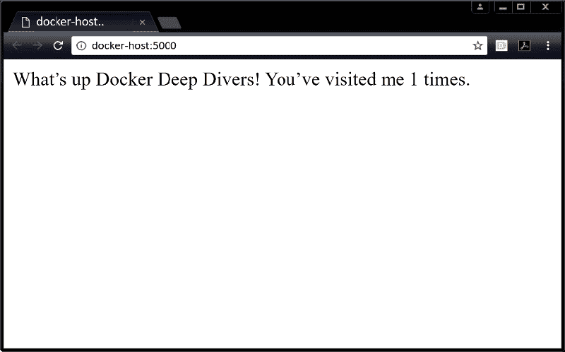

# Docker 根据 docker-compose 文件部署应用

> 原文：[`c.biancheng.net/view/3173.html`](http://c.biancheng.net/view/3173.html)

下面将实际部署 Compose 文件中定义的应用。可以从我的百度网盘（[`pan.baidu.com/s/1Q0tcQnSqUQ06rfEdH_MBaw`](https://pan.baidu.com/s/1Q0tcQnSqUQ06rfEdH_MBaw) 提取码: a55v）下载所需的文件。

将代码下载到本地，并部署到新创建的名为 counter-app 的目录中。

该目录包含所需的所有文件，可以作为构建上下文。

Docker Compose 会使用目录名（counter-app）作为项目名称，这一点在后续的操作中会看到，Docker Compose 会将所有的资源名称中加上前缀 counter-app_。

进入 counter-app 目录中，检查文件是否存在。

$ cd counter-app
$ ls
app.py docker-compose.yml Dockerfile requirements.txt ...

简要介绍这几个文件。

*   app.py：是应用程序代码（一个 Python Flask 应用）。
*   docker-compose.yml：是 Compose 文件，其中定义了 Docker 如何部署应用。
*   Dockerfile：定义了如何构建 web-fe 服务所使用的镜像。
*   requirements.txt：列出了应用所依赖的 Python 包。

app.py 显然是应用的核心文件，而 docker-compose.yml 文件将应用的所有组件组织起来。

下面使用 Docker Compose 将应用启动起来。以下所有的命令都是运行在刚才创建的 counter-app 目录下的。

$ docker-compose up &

[1] 1635
Creating network "counterapp_counter-net" with the default driver
Creating volume "counterapp_counter-vol" with default driver
Pulling redis (redis:alpine)...
alpine: Pulling from library/redis
1160f4abea84: Pull complete
a8c53d69ca3a: Pull complete
<Snip>
web-fe_1 | * Debugger PIN: 313-791-729

启动应用将花费几秒钟时间，其输出也非常详尽。下面我们来讲解一下 `docker-compose` 命令。

常用的启动一个 Compose 应用（通过 Compose 文件定义的多容器应用称为“Compose 应用”）的方式就是 `docker-compose up` 命令。

它会构建所需的镜像，创建网络和卷，并启动容器。

默认情况下，`docker-compose up` 会查找名为 docker-compose.yml 或 docker-compose.yaml 的 Compose 文件。

如果 Compose 文件是其他文件名，则需要通过 -f 参数来指定。

如下命令会基于名为 prod-equus-bass.yml 的 Compose 文件部署应用。

$ docker-compose -f prod-equus-bass.yml up

使用 -d 参数在后台启动应用也是常见的用法，代码如下。

docker-compose up -d

--OR--

docker-compose -f prod-equus-bass.yml up -d

前面的示例命令在前台启动应用（没有使用 -d 参数），但是使用了 & 将终端窗口返回。

这种用法不太正规，所有的日志还是会直接输出到我们后续可能会用的终端窗口上。

这样应用就构建并启动起来了，可以直接使用 docker 命令来查看 Docker Compose 创建的镜像、容器、网络和卷。

$ docker image ls
REPOSITORY TAG IMAGE ID CREATED SIZE
counterapp_web-fe latest 96..6ff9e 3 minutes ago 95.9MB
python 3.4-alpine 01..17a02 2 weeks ago 85.5MB
redis alpine ed..c83de 5 weeks ago 26.9MB

可以看到有 3 个在部署过程中构建或拉取的镜像。

counterapp_web-fe:latest 镜像源自 docker-compose.yml 文件中的 build: . 指令。

该指令让 Docker 基于当前目录下的 Dockerfile 来构建一个新的镜像。

该镜像基于 python:3.4-alpine 构建，其中包含 Python Flask Web 应用的程序代码。更多信息可以通过查看 Dockerfile 的内容进行了解。

*   FROM python:3.4-alpine << 基础镜像
*   ADD . /code << 将 app 复制到镜像中
*   WORKDIR /code << 设置工作目录
*   RUN pip install -r requirements.txt << 安装依赖
*   CMD ["python", "app.py"] << 设置默认启动命令

为了方便理解，每一行都添加了注释。部署时要删除掉。

请注意，Docker Compose 会将项目名称（counter-app）和 Compose 文件中定义的资源名称（web-fe）连起来，作为新构建的镜像的名称。

Docker Compose 部署的所有资源的名称都会遵循这一规范。

由于 Compose 文件的 .Services.redis 项中指定了 image: "redis:alpine"，因此会从 Docker Hub 拉取 redis:alpine 镜像。

如下命令列出了两个容器。每个容器的名称都以项目名称（所在目录名称）为前缀。此外，它们还都以一个数字为后缀用于标识容器实例序号，因为 Docker Compose 允许扩缩容。

$ docker container ls
ID COMMAND STATUS PORTS NAMES
12.. "python app.py" Up 2 min 0.0.0.0:5000->5000/tcp counterapp_web-fe_1
57.. "docker-entry.." Up 2 min 6379/tcp counterapp_redis_1

counterapp_web-fe 容器中运行的是应用的 Web 前端。其中执行的是 app.py，并且被映射到了 Docker 主机的 5000 端口，稍后会进行连接。

如下的网络和卷列表显示了名为 counterapp_counter-net 的网络和名为 counterapp_counter-vol 的卷。

$ docker network ls
NETWORK ID NAME DRIVER SCOPE
1bd949995471 bridge bridge local
40df784e00fe counterapp_counter-net bridge local
f2199f3cf275 host host local
67c31a035a3c none null local

$ docker volume ls
DRIVER VOLUME NAME
<Snip>
local counterapp_counter-vol

应用部署成功后，读者可以用 Docker 主机的浏览器连接 5000 端口来查看应用的运行效果，如下图所示。

单击浏览器的刷新按钮，计数会增加。

如果使用 & 启动应用，那么可以在终端窗口中看到包含 HTTP 响应码 200 的日志。这表明请求收到了正确的响应，每次加载页面都会有日志打印出来。

web-fe_1 | 172.18.0.1 - - [09/Jan/2018 11:13:21] "GET / HTTP/1.1" 200 -
web-fe_1 | 172.18.0.1 - - [09/Jan/2018 11:13:33] "GET / HTTP/1.1" 200 -

到此，多容器的应用已经借助 Docker Compose 成功部署了。