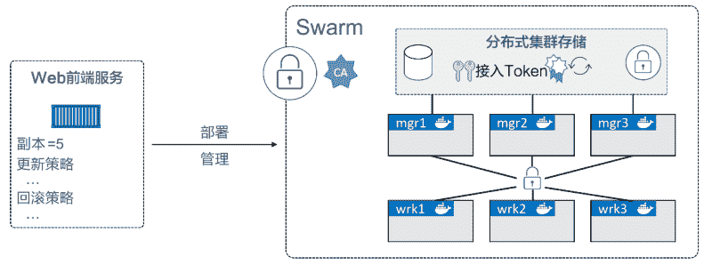

# Docker Swarm 简介

> 原文：[`c.biancheng.net/view/3176.html`](http://c.biancheng.net/view/3176.html)

Swarm 是 Docker 官方提供的一款集群管理工具，其主要作用是把若干台 Docker 主机抽象为一个整体，并且通过一个入口统一管理这些 Docker 主机上的各种 Docker 资源。

Swarm 和 Kubernetes 比较类似，但是更加轻，具有的功能也较 kubernetes 更少一些。

Docker Swarm 包含两方面：一个企业级的 Docker 安全集群，以及一个微服务应用编排引擎。

集群方面，Swarm 将一个或多个 Docker 节点组织起来，使得用户能够以集群方式管理它们。

Swarm 默认内置有加密的分布式集群存储（encrypted distributed cluster store）、加密网络（Encrypted Network）、公用 TLS（Mutual TLS）、安全集群接入令牌 Secure Cluster Join Token）以及一套简化数字证书管理的 PKI（Public Key Infrastructure）。我们可以自如地添加或删除节点。

编排方面，Swarm 提供了一套丰富的 API 使得部署和管理复杂的微服务应用变得易如反掌。通过将应用定义在声明式配置文件中，就可以使用原生的 Docker 命令完成部署。

此外，甚至还可以执行滚动升级、回滚以及扩缩容操作，同样基于简单的命令即可完成。

以往，Docker Swarm 是一个基于 Docker 引擎之上的独立产品。自 Docker 1.12 版本之后，它已经完全集成在 Docker 引擎中，执行一条命令即可启用。到 2018 年，除了原生 Swarm 应用，它还可以部署和管理 Kubernetes 应用。

## Docker Swarm 初步介绍

从集群角度来说，一个 Swarm 由一个或多个 Docker 节点组成。这些节点可以是物理服务器、虚拟机、树莓派（Raspberry Pi）或云实例。唯一的前提就是要求所有节点通过可靠的网络相连。

节点会被配置为管理节点（Manager）或工作节点（Worker）。管理节点负责集群控制面（Control Plane），进行诸如监控集群状态、分发任务至工作节点等操作。工作节点接收来自管理节点的任务并执行。

Swarm 的配置和状态信息保存在一套位于所有管理节点上的分布式 etcd 数据库中。该数据库运行于内存中，并保持数据的最新状态。关于该数据库最棒的是，它几乎不需要任何配置，作为 Swarm 的一部分被安装，无须管理。

关于集群管理，最大的挑战在于保证其安全性。搭建 Swarm 集群时将不可避免地使用 TLS，因为它被 Swarm 紧密集成。

在安全意识日盛的今天，这样的工具值得大力推广。Swarm 使用 TLS 进行通信加密、节点认证和角色授权。自动密钥轮换（Automatic Key Rotation）更是锦上添花！其在后台默默进行，用户甚至感知不到这一功能的存在。

关于应用编排，Swarm 中的最小调度单元是服务。它是随 Swarm 引入的，在 API 中是一个新的对象元素，它基于容器封装了一些高级特性，是一个更高层次的概念。当容器被封装在一个服务中时，我们称之为一个任务或一个副本，服务中增加了诸如扩缩容、滚动升级以及简单回滚等特性。

综上所述，从概括性的视角来看 Swarm，如下图所示。

