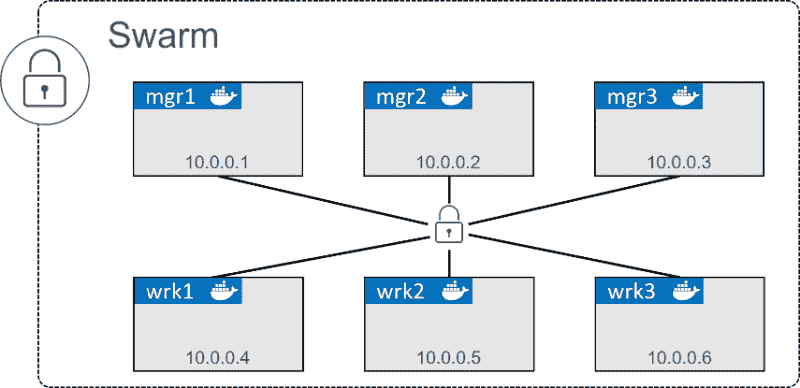
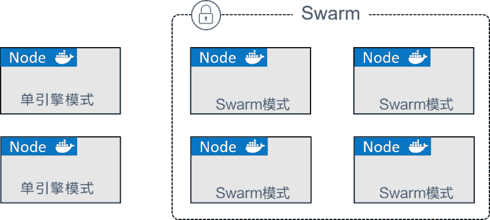
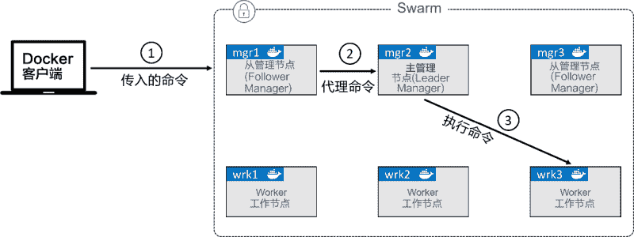
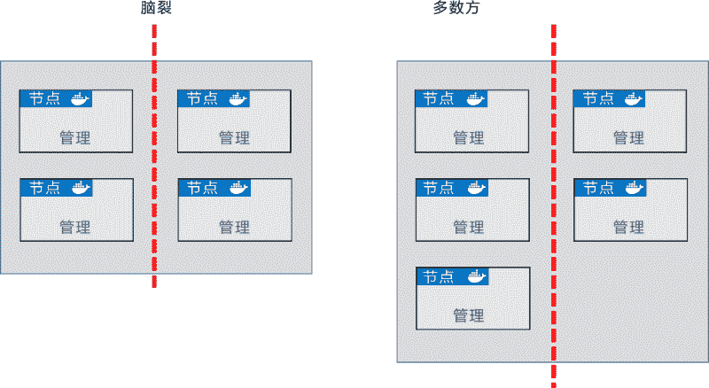

# Docker Swarm 集群搭建教程

> 原文：[`c.biancheng.net/view/3178.html`](http://c.biancheng.net/view/3178.html)

接下来通过实例演示一下如何使用 Swarm 来创建安全的集群。

实例中包含 3 个管理节点和 3 个工作节点，如下图所示，可以根据需要自行调整管理节点和工作节点的数量、名称和 IP。

每个节点都需要安装 Docker，并且能够与 Swarm 的其他节点通信。

如果配置有域名解析就更好了，这样在命令的输出中更容易识别出节点，也更有利于排除故障。

在网络方面，需要在路由器和防火墙中开放如下端口。

*   2377/tcp：用于客户端与 Swarm 进行安全通信。
*   7946/tcp 与 7946/udp：用于控制面 gossip 分发。
*   4789/udp：用于基于 VXLAN 的覆盖网络。

如果满足以上前提，就可以着手开始搭建 Swarm 集群了。

搭建 Swarm 的过程有时也被称为初始化 Swarm，大体流程包括初始化第一个管理节点 -> 加入额外的管理节点 -> 加入工作节点 -> 完成。

## 初始化一个全新的 Swarm

不包含在任何 Swarm 中的 Docker 节点，称为运行于单引擎（Single-Engine）模式。一旦被加入 Swarm 集群，则切换为 Swarm 模式，如下图所示。

在单引擎模式下的 Docker 主机上运行 `docker swarm init` 会将其切换到 Swarm 模式，并创建一个新的 Swarm，将自身设置为 Swarm 的第一个管理节点。

更多的节点可以作为管理节点或工作节点加入进来。这一操作也会将新加入的节点切换为 Swarm 模式。

以下的步骤会将 mgr1 切换为 Swarm 模式，并初始化一个新的 Swarm。接下来将 wrk1、wrk2 和 wrk3 作为工作节点接入，自动将它们切换为 Swarm 模式。然后将 mgr2 和 mgr3 作为额外的管理节点接入，并同样切换为 Swarm 模式。最终有 6 个节点切换到 Swarm 模式，并运行于同一个 Swarm 中。

1) 登录到 mgr1 并初始化一个新的 Swarm

如果在 Windows 的 PowerShell 终端执行如下命令的话，不要忘了将反斜杠替换为反引号。

$ docker swarm init \
--advertise-addr 10.0.0.1:2377 \
--listen-addr 10.0.0.1:2377

Swarm initialized: current node (d21lyz...c79qzkx) is now a manager.

将这条命令拆开分析如下。

`docker swarm init` 会通知 Docker 来初始化一个新的 Swarm，并将自身设置为第一个管理节点。同时也会使该节点开启 Swarm 模式。

--advertise-addr 指定其他节点用来连接到当前管理节点的 IP 和端口。这一属性是可选的，当节点上有多个 IP 时，可以用于指定使用哪个 IP。此外，还可以用于指定一个节点上没有的 IP，比如一个负载均衡的 IP。

--listen-addr 指定用于承载 Swarm 流量的 IP 和端口。其设置通常与 --advertise-addr 相匹配，但是当节点上有多个 IP 的时候，可用于指定具体某个 IP。并且，如果 --advertise-addr 设置了一个远程 IP 地址（如负载均衡的 IP 地址），该属性也是需要设置的。建议执行命令时总是使用这两个属性来指定具体 IP 和端口。

Swarm 模式下的操作默认运行于 2337 端口。虽然它是可配置的，但 2377/tcp 是用于客户端与 Swarm 进行安全（HTTPS）通信的约定俗成的端口配置。

2) 列出 Swarm 中的节点。

$ docker node ls
ID HOSTNAME STATUS AVAILABILITY MANAGER STATUS
d21...qzkx * mgr1 Ready Active Leader

注意到 mgr1 是 Swarm 中唯一的节点，并且作为 Leader 列出。

3) 在 mgr1 上执行 `docker swarm join-token` 命令

`docker swarm join-token` 命令用来获取添加新的工作节点和管理节点到 Swarm 的命令和 Token。

$ docker swarm join-token worker
To add a manager to this swarm, run the following command:
docker swarm join \
--token SWMTKN-1-0uahebax...c87tu8dx2c \
10.0.0.1:2377

$ docker swarm join-token manager
To add a manager to this swarm, run the following command:
docker swarm join \
--token SWMTKN-1-0uahebax...ue4hv6ps3p \
10.0.0.1:2377

请注意，工作节点和管理节点的接入命令中使用的接入 Token（SWMTKN...）是不同的。因此，一个节点是作为工作节点还是管理节点接入，完全依赖于使用了哪个 Token。接入 Token 应该被妥善保管，因为这是将一个节点加入 Swarm 的唯一所需！

4) 登录到 wrk1，并使用包含工作节点接入 Token 的 `docker swarm join` 命令将其接入 Swarm。

$ docker swarm join \
--token SWMTKN-1-0uahebax...c87tu8dx2c \
10.0.0.1:2377 \
--advertise-addr 10.0.0.4:2377 \
--listen-addr 10.0.0.4:2377

This node joined a swarm as a worker.

--advertise-addr 与 --listen-addr 属性是可选的。在网络配置方面，请尽量明确指定相关参数，这是一种好的实践。

5) 在 wrk2 和 wrk3 上重复上一步骤来将这两个节点作为工作节点加入 Swarm。

确保使用 --advertise-addr 与 --listen-addr 属性来指定各自的 IP 地址。

6) 登录到 mgr2，然后使用含有管理节点接入 Token 的 `docker swarm join` 命令，将该节点作为工作节点接入 Swarm。

$ docker swarm join \
--token SWMTKN-1-0uahebax...ue4hv6ps3p \
10.0.0.1:2377 \
--advertise-addr 10.0.0.2:2377 \
--listen-addr 10.0.0.1:2377

This node joined a swarm as a manager.

7) 在 mgr3 上重复以上步骤，记得在 --advertise-addr 与 --listen-addr 属性中指定 mgr3 的 IP 地址。

8) 在任意一个管理节点上执行 `docker node ls` 命令来列出 Swarm 节点。

$ docker node ls
ID HOSTNAME STATUS AVAILABILITY MANAGER STATUS
0g4rl...babl8 * mgr2 Ready Active Reachable
2xlti...l0nyp mgr3 Ready Active Reachable
8yv0b...wmr67 wrk1 Ready Active
9mzwf...e4m4n wrk3 Ready Active
d21ly...9qzkx mgr1 Ready Active Leader
e62gf...l5wt6 wrk2 Ready Active

至此，已经成功创建了 6 个节点的 Swarm，其中包含 3 个管理节点和 3 个工作节点。

在这个过程中，每个节点的 Docker 引擎都被切换到 Swarm 模式下。并且，Swarm 已经自动启用了 TLS 以策安全。

注意，mgr2 的 ID 列还显示了一个星号（*），这个星号会告知用户执行 `docker node ls` 命令所在的节点。本例中，命令是在 mgr2 节点执行的。

每次将节点加入 Swarm 都指定 --advertise-addr 与 --listen-addr 属性是痛苦的。然而，一旦 Swarm 中的网络配置出现问题将会更加痛苦。况且，手动将节点加入 Swarm 也不是一种日常操作，所以在执行该命令时额外指定这两个属性是值得的。

现在已经有一个运行中的 Swarm 了，下面看一下如何进行高可用（HA）管理。

## Swarm 管理器高可用性（HA）

Swarm 的管理节点内置有对 HA 的支持。这意味着，即使一个或多个节点发生故障，剩余管理节点也会继续保证 Swarm 的运转。

从技术上来说，Swarm 实现了一种主从方式的多管理节点的 HA。这意味着，即使你可能有多个管理节点，也总是仅有一个节点处于活动状态。

通常处于活动状态的管理节点被称为“主节点”（leader），而主节点也是唯一一个会对 Swarm 发送控制命令的节点。也就是说，只有主节点才会变更配置，或发送任务到工作节点。如果一个备用（非活动）管理节点接收到了 Swarm 命令，则它会将其转发给主节点。

这一过程如下图所示。步骤 ① 指命令从一个远程的 Docker 客户端发送给一个管理节点；步骤 ② 指非主节点将命令转发给主节点；步骤 ③ 指主节点对 Swarm 执行命令。

仔细观察上图会发现，管理节点或者是 Leader 或者是 Follower。这是 Raft 的术语，因为 Swarm 使用了 Raft 共识算法的一种具体实现来支持管理节点的 HA。

关于 HA，有以下两条最佳实践原则。

*   部署奇数个管理节点。
*   不要部署太多管理节点（建议 3 个或 5 个）。

部署奇数个管理节点有利于减少脑裂（Split-Brain）情况的出现机会。假如有 4 个管理节点，当网络发生分区时，可能会在每个分区有两个管理节点。这种情况被称为脑裂。

每个分区都知道曾经有 4 个节点，但是当前网络中仅有两个节点，糟糕的是，每个分区都无法知道其余两个节点是否运行，也无从得知本分区是否掌握大多数（Quorum）。

虽然在脑裂情况下集群依然在运行，但是已经无法变更配置，或增加和管理应用负载了。不过，如果部署有 3 个或 5 个管理节点，并且也发生了网络分区，就不会出现每个分区拥有同样数量的管理节点的情况。

这意味着掌握多数管理节点的分区能够继续对集群进行管理。下图中右侧的例子，阐释了这种情况，左侧的分区知道自己掌握了多数的管理节点。

对于所有的共识算法来说，更多的参与节点就意味着需要花费更多的时间来达成共识。这就像决定去哪吃饭，只有 3 个人的时候总是比有 33 个人的时候能更快确定。

考虑到这一点，最佳的实践原则是部署 3 个或 5 个节点用于 HA。7 个节点可以工作，但是通常认为 3 个或 5 个是更优的选择。当然绝对不要多于 7 个，因为需要花费更长的时间来达成共识。

关于管理节点的 HA 再补充一点。显然将管理节点分布到不同的可用域（Availability Zone）中是一种不错的实践方式，但是一定要确保它们之间的网络连接是可靠的，否则由于底层网络分区导致的问题将是令人痛苦的。

## 内置的 Swarm 安全机制

Swarm 集群内置有繁多的安全机制，并提供了开箱即用的合理的默认配置——如 CA 设置、接入 Token、公用 TLS、加密集群存储、加密网络、加密节点 ID 等。

## 锁定 Swarm

尽管内置有如此多的原生安全机制，重启一个旧的管理节点或进行备份恢复仍有可能对集群造成影响。

一个旧的管理节点重新接入 Swarm 会自动解密并获得 Raft 数据库中长时间序列的访问权，这会带来安全隐患。

进行备份恢复可能会抹掉最新的 Swarm 配置。

为了规避以上问题，Docker 提供了自动锁机制来锁定 Swarm，这会强制要求重启的管理节点在提供一个集群解锁码之后才有权从新接入集群。

通过在执行 `docker swarm init` 命令来创建一个新的 Swarm 集群时传入 --autolock 参数可以直接启用锁。

然而，前面已经搭建了一个 Swarm 集群，这时也可以使用 `docker swarm update` 命令来启用锁。

在某个 Swarm 管理节点上运行如下命令。

$ docker swarm update --autolock=true
Swarm updated.
To unlock a swarm manager after it restarts, run the
`docker swarm unlock`command and provide the following key:

SWMKEY-1-5+ICW2kRxPxZrVyBDWzBkzZdSd0Yc7Cl2o4Uuf9NPU4

Please remember to store this key in a password manager, since without
it you will not be able to restart the manager.

请确保将解锁码妥善保管在安全的地方！

重启某一个管理节点，以便观察其是否能够自动重新接入集群。

$ service docker restart

尝试列出 Swarm 中的节点。

$ docker node ls
Error response from daemon: Swarm is encrypted and needs to be unlocked

before it can be used.

尽管 Docker 服务已经重启，该管理节点仍然未被允许重新接入集群。

为了进一步验证，可以到其他管理节点执行 `docker node ls` 命令，会发现重启的管理节点会显示 down 以及 unreachable。

执行 `docker swarm unlock` 命令来为重启的管理节点解锁 Swarm。该命令需要在重启的节点上执行，同时需要提供解锁码。

$ docker swarm unlock
Please enter unlock key: <enter your key>

该节点将被允许重新接入 Swarm，并且再次执行 `docker node ls` 命令会显示 ready 和 reachable。

至此，Swarm 集群已经搭建起来，相信大家已经对主节点和管理节点 HA 有了一定了解。