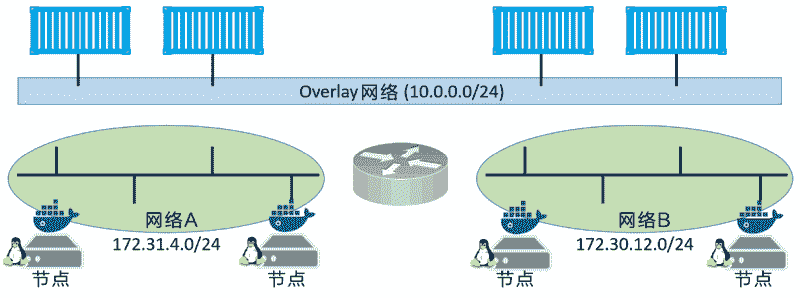
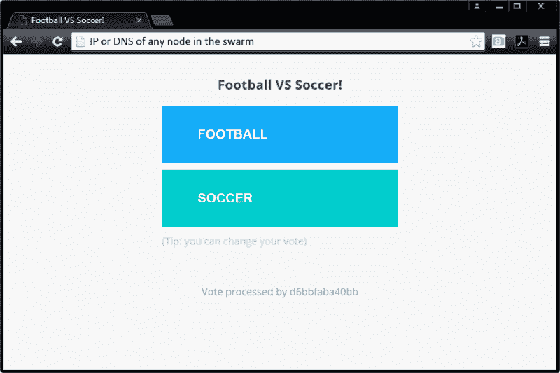

# Docker Swarm 服务的部署及相关操作

> 原文：[`c.biancheng.net/view/3180.html`](http://c.biancheng.net/view/3180.html)

服务是自 Docker 1.12 后新引入的概念，并且仅适用于 Swarm 模式。

使用服务仍能够配置大多数熟悉的容器属性，比如容器名、端口映射、接入网络和镜像。此外还增加了额外的特性，比如可以声明应用服务的期望状态，将其告知 Docker 后，Docker 会负责进行服务的部署和管理。

举例说明，假如某应用有一个 Web 前端服务，该服务有相应的镜像。测试表明对于正常的流量来说 5 个实例可以应对。那么就可以将这一需求转换为一个服务，该服务声明了容器使用的镜像，并且服务应该总是有 5 个运行中的副本。

下面通过示例来看看如何创建刚刚描述的内容。

使用 `docker service create` 命令创建一个新的服务。

在 Windows 上创建新服务的命令也是一样的。然而本例中使用的是 Linux 镜像，它在 Windows 上并不能运行。请使用 Windows 的小伙伴将镜像替换为一个 Windows Web Server 的镜像，以便能正常运行。

再次强调，在 PowerShell 终端中输入命令的时候，使用反引号（`）进行换行。

$ docker service create --name web-fe \
-p 8080:8080 \
--replicas 5 \
nigelpoulton/pluralsight-docker-ci

z7ovearqmruwk0u2vc5o7ql0p

需要注意的是，该命令与熟悉的 `docker container run` 命令的许多参数是相同的。这个例子中，使用 --name 和 -p 定义服务的方式，与单机启动容器的定义方式是一样的。

通过上面的命令和输出可以看出。使用 `docker service creale` 命令告知 Docker 正在声明一个新服务，并传递 --name 参数将其命名为 web-fe。将每个节点上的 8080 端口映射到服务副本内部的 8080 端口。接下来，使用 --replicas 参数告知 Docker 应该总是有 5 个此服务的副本。最后，告知 Docker 哪个镜像用于副本，重要的是，要了解所有的服务副本使用相同的镜像和配置。

敲击回车键之后，主管理节点会在 Swarm 中实例化 5 个副本，管理节点也会作为工作节点运行。相关各工作节点或管理节点会拉取镜像，然后启动一个运行在 8080 端口上的容器。

这还没有结束。所有的服务都会被 Swarm 持续监控，Swarm 会在后台进行轮训检查（Reconciliation Loop），来持续比较服务的实际状态和期望状态是否一致。如果一致，则无须任何额外操作；如果不一致，Swarm 会使其一致。换句话说，Swarm 会一直确保实际状态能够满足期望状态的要求。

举例说明，假如运行有 web-fe 副本的某个工作节点宕机了，则 web-fe 的实际状态从 5 个副本降为 4 个，从而不能满足期望状态的要求。Docker 变回启动一个新的 web-fe 副本来使实际状态与期望状态保持一致。这一特性功能强大，使得服务在面对节点宕机等问题时具有自愈能力。

#### 1) 查看服务

使用 `docker service ls` 命令可以查看 Swarm 中所有运行中的服务。

$ docker service ls
ID NAME MODE REPLICAS IMAGE PORTS
z7o...uw web-fe replicated 5/5 nigel...ci:latest *:8080->8080/tcp

输出显示有一个运行中的服务及其相关状态信息。比如，可以了解服务的名称，以及 5 个期望的副本（容器）中有 5 个是运行状态。

如果在部署服务后立即执行该命令，则可能并非所有的副本都处于运行状态。这通常取决于各个节点拉取镜像的时间。

执行 `docker service ps` 命令可以查看服务副本列表及各副本的状态。

$ docker service ps web-fe
ID NAME IMAGE NODE DESIRED CURRENT
817．..f6z web-fe.1 nigelpoulton/... mgr2 Running Running 2 mins
a1d...mzn web-fe.2 nigelpoulton/... wrk1 Running Running 2 mins
cc0...ar0 web-fe.3 nigelpoulton/... wrk2 Running Running 2 mins
6f0...azu web-fe.4 nigelpoulton/... mgr3 Running Running 2 mins
dyl...p3e web-fe.5 nigelpoulton/... mgr1 Running Running 2 mins

此命令格式为 `docker service ps <service-name or serviceid>`。每一个副本会作为一行输出，其中显示了各副本分别运行在 Swarm 的哪个节点上，以及期望的状态和实际状态。

关于服务更为详细的信息可以使用 `docker service inspect` 命令查看。

$ docker service inspect --pretty web-fe
ID: z7ovearqmruwk0u2vc5o7ql0p
Name: Service
Mode: Replicated
Replicas: 5
Placement:
UpdateConfig:
Parallelism: 1
On failure: pause
Monitoring Period: 5s
Max failure ratio: 0
Update order: stop-first
RollbackConfig:
Parallelism: 1
On failure: pause
Monitoring Period: 5s
Max failure ratio: 0
Rollback order: stop-first
ContainerSpec:
Image: nigelpoulton/pluralsight-docker-ci:latest@sha256:7a6b01...d8d3d
Resources: Endpoint
Mode: vip Ports:
PublishedPort = 8080
Protocol = tcp
TargetPort = 8080
PublishMode = ingress

以上例子使用了 --pretty 参数，限制输出中仅包含最感兴趣的内容，并以易于阅读的格式打印出来。

不加 --pretty 的话会给出更加详尽的输出。建议大家通读 `docker inspect` 命令的输出内容，其中不仅包含大量信息，也是了解底层运行机制的途径。

#### 2) 副本服务 vs 全局服务

服务的默认复制模式（Replication Mode）是副本模式（replicated）。

这种模式会部署期望数量的服务副本，并尽可能均匀地将各个副本分布在整个集群中。

另一种模式是全局模式（global），在这种模式下，每个节点上仅运行一个副本。可以通过给 `docker service create` 命令传递 --mode global 参数来部署一个全局服务。

#### 3) 服务的扩缩容

服务的另一个强大特性是能够方便地进行扩缩容。

假设业务呈爆发式增长，则 Web 前端服务接收到双倍的流量压力。所幸通过一个简单的 `docker service scale` 命令即可对 web-fe 服务进行扩容。

$ docker service scale web-fe=10
web-fe scaled to 10

该命令会将服务副本数由 5 个增加到 10 个。后台会将服务的期望状态从 5 个增加到 10 个。

运行 docker service ls 命令来检查操作是否成功。

$ docker service ls
ID NAME NODE REPLICAS IMAGE PORTS
z7o...uw web-fe replicated 10/10 nigel...ci:latest *:8080->8080/tcp

执行 `docker service ps` 命令会显示服务副本在各个节点上是均衡分布的。

$ docker service ps web-fe
ID NAME IMAGE NODE DESIRED CURRENT
nwf...tpn web-fe.1 nigelpoulton/... mgr1 Running Running 7 mins
yb0...e3e web-fe.2 nigelpoulton/... wrk3 Running Running 7 mins
mos...gf6 web-fe.3 nigelpoulton/... wrk2 Running Running 7 mins
utn...6ak web-fe.4 nigelpoulton/... wrk3 Running Running 7 mins
2ge...fyy web-fe.5 nigelpoulton/... mgr3 Running Running 7 mins
64y...m49 web-fe.6 igelpoulton/... wrk3 Running Running about a min
ild...51s web-fe.7 nigelpoulton/... mgr1 Running Running about a min
vah...rjf web-fe.8 nigelpoulton/... wrk2 Running Running about a mins
xe7...fvu web-fe.9 nigelpoulton/... mgr2 Running Running 45 seconds ago
l7k...jkv web-fe.10 nigelpoulton/... mgr2 Running Running 46 seconds ago

在底层实现上，Swarm 执行了一个调度算法，默认将副本尽量均衡分配给 Swarm 中的所有节点。

各节点分配的副本数是平均分配的，并未将 CPU 负载等指标考虑在内。

再次执行 `docker service scale` 命令将副本数从 10 个降为 5 个。

$ docker service scale web-fe=5
web-fe scaled to 5

#### 4) 删除服务

删除一个服务的操作相对比较简单。

如下 `docker service rm` 命令可用于删除之前部署的服务。

$ docker service rm web-fe
web-fe

执行 `docker service ls` 命令以验证服务确实已被删除。

$ docker service ls
ID NAME MODE REPLICAS IMAGE PORTS

请谨慎使用 `docker service rm` 命令，因为它在删除所有服务副本时并不会进行确认。

#### 5) 滚动升级

对部署的应用进行滚动升级是常见的操作。长期以来，这一过程是令人痛苦的。我曾经牺牲了许多的周末时光来进行应用程序主版本的升级，而且再也不想这样做了。

然而，多亏了 Docker 服务，对一个设计良好的应用来说，实施滚动升级已经变得简单多了！

为了演示如何操作，下面将部署一个新的服务。但是在此之前，先创建一个新的覆盖网络（Overlay Network）给服务使用。

这并非必须的操作，只是希望能够让大家了解如何创建网络并将服务接入网络。

$ docker network create -d overlay uber-net
43wfp6pzea470et4d57udn9ws

该命令会创建一个名为 uber-net 的覆盖网络，接下来会将其与要创建的服务结合使用。覆盖网络是一个二层网络，容器可以接入该网络，并且所有接入的容器均可互相通信。

即使这些容器所在的 Docker 主机位于不同的底层网络上，该覆盖网络依然是相通的。本质上说，覆盖网络是创建于底层异构网络之上的一个新的二层容器网络。

如下图所示，两个底层网络通过一个三层交换机连接，而基于这两个网络之上是一个覆盖网络。

Docker 主机通过两个底层网络相连，而容器则通过覆盖网络相连。对于同一覆盖网络中的容器来说，即使其各自所在的 Docker 主机接入的是不同的底层网络，也是互通的。

执行 `docker network ls` 来查看网络是否创建成功，且在 Docker 主机可见。

$ docker network ls
NETWORK ID NAME DRIVER SCOPE
<Snip>
43wfp6pzea47 uber-net overlay swarm

可见，uber-net 网络已被成功创建，其 SCOPE 为 swarm，并且目前仅在 Swarm 的管理节点可见。

下面创建一个新的服务，并将其接入 uber-net 网络。

$ docker service create --name uber-svc \
--network uber-net \
-p 80:80 --replicas 12 \
nigelpoulton/tu-demo:v1

dhbtgvqrg2q4sg07ttfuhg8nz

看一下上面的 `docker service create` 命令中做了哪些声明。

首先，将服务命名为 uber-svc，并用 --network 参数声明所有的副本都连接到 uber-net 网络。

然后，在整个 swarm 中将 80 端口暴露出来，并将其映射到 12 个容器副本的 80 端口。

最后，声明所有的副本都基于 nigelpoulton/tu-demo:v1 镜像。

执行 `docker service ls` 和 `docker service ps` 命令以检查新创建服务的状态。

$ docker service ls
ID NAME REPLICAS IMAGE
dhbtgvqrg2q4 uber-svc 12/12 nigelpoulton/tu-demo:v1

$ docker service ps uber-svc
ID NAME IMAGE NODE DESIRED CURRENT STATE
0v...7e5 uber-svc.1 nigelpoulton/...:v1 wrk3 Running Running 1 min
bh...wa0 uber-svc.2 nigelpoulton/...:v1 wrk2 Running Running 1 min
23．..u97 uber-svc.3 nigelpoulton/...:v1 wrk2 Running Running 1 min
82．..5y1 uber-svc.4 nigelpoulton/...:v1 mgr2 Running Running 1 min
c3...gny uber-svc.5 nigelpoulton/...:v1 wrk3 Running Running 1 min
e6...3u0 uber-svc.6 nigelpoulton/...:v1 wrk1 Running Running 1 min
78．..r7z uber-svc.7 nigelpoulton/...:v1 wrk1 Running Running 1 min
2m...kdz uber-svc.8 nigelpoulton/...:v1 mgr3 Running Running 1 min
b9...k7w uber-svc.9 nigelpoulton/...:v1 mgr3 Running Running 1 min
ag...v16 uber-svc.10 nigelpoulton/...:v1 mgr2 Running Running 1 min
e6...dfk uber-svc.11 nigelpoulton/...:v1 mgr1 Running Running 1 min
e2...k1j uber-svc.12 nigelpoulton/...:v1 mgr1 Running Running 1 min

通过对服务声明 -p 80:80 参数，会建立 Swarm 集群范围的网络流量映射，到达 Swarm 任何节点 80 端口的流量，都会映射到任何服务副本的内部 80 端口。

默认的模式，是在 Swarm 中的所有节点开放端口，称为入站模式（Ingress Mode）。此外还有主机模式（Host Mode），即仅在运行有容器副本的节点上开放端口。

以主机模式开放服务端口，需要较长格式的声明语法，代码如下。

docker service create --name uber-svc \
--network uber-net \
--publish published=80,target=80,mode=host \
--replicas 12 \
nigelpoulton/tu-demo:v1

打开浏览器，使用 Swarm 中任何一个节点的 IP，进入 80 端口的界面，查看服务运行情况，如下图所示。

如上图所示，这是一个简单的投票程序，它能够注册对“footbal”或“soccer”的投票。可随意在浏览器中使用其他节点的 IP，均能够打开该页面，因为 -p 80:80 参数会在所有 Swarm 节点创建一个入站模式的端口映射。

即使某个节点上并未运行服务的副本，依然可以进入该页面，所有节点都配置有映射，因此会将请求转发给运行有服务副本的节点。

假设本次投票已经结束，而公司希望开启一轮新的投票。现在已经为下一轮投票构建了一个新镜像，并推送到了 Docker Hub 仓库，新镜像的 tag 由 v1 变更为 v2。

此外还假设，本次升级任务在将新镜像更新到 Swarm 中时采用一种阶段性的方式，每次更新两个副本，并且中间间隔 20s。

那么就可以采用如下的 `docker service update` 命令来完成。

$ docker service update \
--image nigelpoulton/tu-demo:v2 \
--update-parallelism 2 \
--update-delay 20s uber-svc

仔细观察该命令，`docker service update` 通过变更该服务期望状态的方式来更新运行中的服务。

这一次我们指定了 tag 为 v2 的新镜像。接下来用 --update-parallelism 和 --update-delay 参数声明每次使用新镜像更新两个副本，其间有 20s 的延迟。最终，告知 Docker 以上变更是对 uber-svc 服务展开的。

如果对该服务执行 `docker service ps` 命令会发现，有些副本的版本号是 v2 而有些依然是 v1。

如果给予该操作足够的时间（4min），则所有的副本最终都会达到新的期望状态，即基于 v2 版本的镜像。

$ docker service ps uber-svc
ID NAME IMAGE NODE DESIRED CURRENT STATE
7z...nys uber-svc.1 nigel...v2 mgr2 Running Running 13 secs
0v...7e5 \_uber-svc.1 nigel...v1 wrk3 Shutdown Shutdown 13 secs
bh...wa0 uber-svc.2 nigel...v1 wrk2 Running Running 1 min
e3...gr2 uber-svc.3 nigel...v2 wrk2 Running Running 13 secs
23．..u97 \_uber-svc.3 nigel...v1 wrk2 Shutdown Shutdown 13 secs
82．..5y1 uber-svc.4 nigel...v1 mgr2 Running Running 1 min
c3...gny uber-svc.5 nigel...v1 wrk3 Running Running 1 min
e6...3u0 uber-svc.6 nigel...v1 wrk1 Running Running 1 min
78．..r7z uber-svc.7 nigel...v1 wrk1 Running Running 1 min
2m...kdz uber-svc.8 nigel...v1 mgr3 Running Running 1 min
b9...k7w uber-svc.9 nigel...v1 mgr3 Running Running 1 min
ag...v16 uber-svc.10 nigel...v1 mgr2 Running Running 1 min
e6...dfk uber-svc.11 nigel...v1 mgr1 Running Running 1 min
e2...k1j uber-svc.12 nigel...v1 mgr1 Running Running 1 min

如果在更新操作完成前打开浏览器，使用 Swarm 中任一节点的 IP 进入页面，并多次单击刷新按钮，就会看到滚动更新的效果。

有些请求会被旧版本的副本处理，而有些请求会被新版本的副本处理。一段时间之后，所有的请求都会被新版本的服务副本处理。

此时如果对服务执行 `docker inspect --pretty` 命令，会发现更新时对并行和延迟的设置已经成为服务定义的一部分了。

这意味着，之后的更新操作将会自动使用这些设置，直到再次使用 `docker service update` 命令覆盖它们。

$ docker service inspect --pretty uber-svc
ID: mub0dgtc8szm80ez5bs8wlt19
Name:Service uber-svc
Mode: Replicated
Replicas: 12
UpdateStatus:
State: updating
Started: About a minute
Message: update in progress
Placement:
UpdateConfig:
Parallelism: 2
Delay: 20s
On failure: pause
Monitoring Period: 5s
Max failure ratio: 0
Update order: stop-first
RollbackConfig:
Parallelism: 1
On failure: pause
Monitoring Period: 5s
Max failure ratio: 0
Rollback order: stop-first
ContainerSpec:
Image: nigelpoulton/tu-demo:v2@sha256:d3c0d8c9...cf0ef2ba5eb74c
Resources: Networks:
uber-net Endpoint
Mode: vip Ports:

PublishedPort = 80
Protocol = tcp
TargetPort = 80
PublishMode = ingress

如上还应注意到关于服务的网络配置的内容。Swarm 中的所有运行副本的节点都会使用前面创建的 uber-net 覆盖网络。

可以通过在运行副本的任一节点执行 `docker network ls` 命令来验证这一点。

此外，请注意 docker inspect 输出的 Networks 部分，不仅显示了 uber-ne t 网络，还显示了 Swarm 范围的 80:80 端口映射。