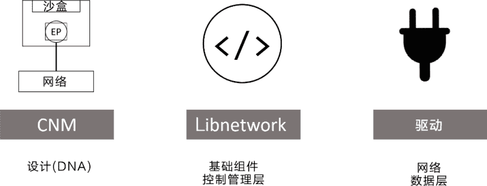
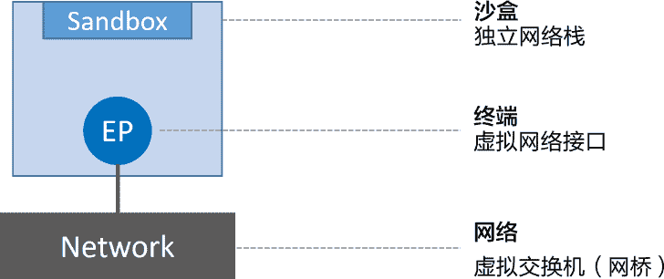
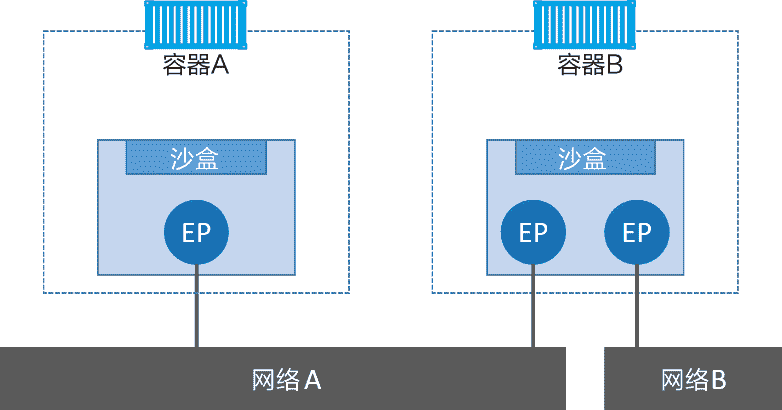
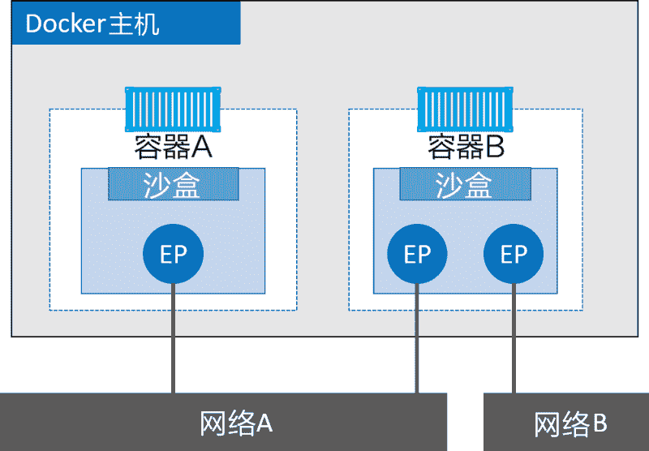
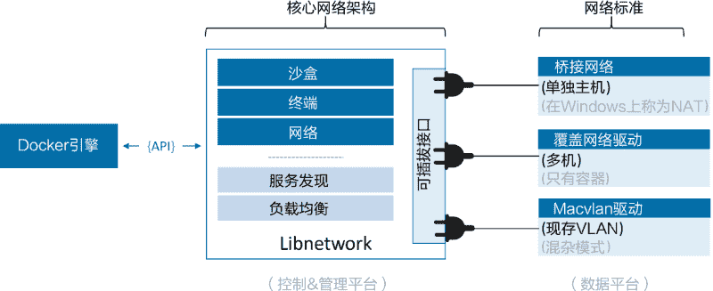

# Docker 网络（CNM、Libnetwork 和驱动）简介

> 原文：[`c.biancheng.net/view/3185.html`](http://c.biancheng.net/view/3185.html)

网络已经无处不在。每当基础设施出现问题时，被抱怨的通常是网络，很大一部分原因是，网络负责连接一切——无网络，无 APP！

在 Docker 早期阶段，网络设计确实非常复杂，那时候配置网络几乎是一种乐趣。

Docker 在容器内部运行应用，这些应用之间的交互依赖于大量不同的网络，这意味着 Docker 需要强大的网络功能。幸运的是，Docker 对于容器之间、容器与外部网络和 VLAN 之间的连接均有相应的解决方案。

后者对于那些需要跟外部系统（如虚拟机和物理机）的服务打交道的容器化应用来说至关重要。

Docker 网络架构源自一种叫作容器网络模型（CNM）的方案，该方案是开源的并且支持插接式连接。

Libnetwork 是 Docker 对 CNM 的一种实现，提供了 Docker 核心网络架构的全部功能。不同的驱动可以通过插拔的方式接入 Libnetwork 来提供定制化的网络拓扑。

为了实现开箱即用的效果，Docker 封装了一系列本地驱动，覆盖了大部分常见的网络需求。其中包括单机桥接网络（Single-Host Bridge Network）、多机覆盖网络（Multi-Host Overlay），并且支持接入现有 VLAN。

Docker 生态系统中的合作伙伴通过提供驱动的方式，进一步拓展了 Docker 的网络功能。Libnetwork 提供了本地服务发现和基础的容器负载均衡解决方案。

## 基础理论

在顶层设计中，Docker 网络架构由 3 个主要部分构成：CNM、Libnetwork 和驱动。

*   CNM 是设计标准。在 CNM 中，规定了 Docker 网络架构的基础组成要素。
*   Libnetwork 是 CNM 的具体实现，并且被 Docker 采用，Libnetwork 通过 Go 语言编写，并实现了 CNM 中列举的核心组件。
*   驱动通过实现特定网络拓扑的方式来拓展该模型的能力。

下图展示了顶层设计中的每个部分是如何组装在一起的。

#### 1) CNM

一切都始于设计！

Docker 网络架构的设计规范是 CNM。CNM 中规定了 Docker 网络的基础组成要素，完整内容见 GitHub 的 docker/libnetwork 库。

抽象来讲，CNM 定义了 3 个基本要素：沙盒（Sandbox）、终端（Endpoint）和网络（Network）。

*   沙盒是一个独立的网络栈。其中包括以太网接口、端口、路由表以及 DNS 配置。
*   终端就是虚拟网络接口。就像普通网络接口一样，终端主要职责是负责创建连接。在 CNM 中，终端负责将沙盒连接到网络。
*   网络是 802.1d 网桥（类似大家熟知的交换机）的软件实现。因此，网络就是需要交互的终端的集合，并且终端之间相互独立。

下图展示了 3 个组件是如何连接的。

Docker 环境中最小的调度单位就是容器，而 CNM 也恰如其名，负责为容器提供网络功能。

下图展示了 CNM 组件是如何与容器进行关联的——沙盒被放置在容器内部，为容器提供网络连接。

容器 A 只有一个接口（终端）并连接到了网络 A。容器 B 有两个接口（终端）并且分别接入了网络 A 和网络 B。容器 A 与 B 之间是可以相互通信的，因为都接入了网络 A。但是，如果没有三层路由器的支持，容器 B 的两个终端之间是不能进行通信的。

需要重点理解的是，终端与常见的网络适配器类似，这意味着终端只能接入某一个网络。因此，如果容器需要接入到多个网络，就需要多个终端。

下图对前面的内容进行拓展，加上了 Docker 主机。虽然容器 A 和容器 B 运行在同一个主机上，但其网络堆栈在操作系统层面是互相独立的，这一点由沙盒机制保证。

#### 2) Libnetwork

CNM 是设计规范文档，Libnetwork 是标准的实现。Libnetwork 是开源的，采用 Go 语言编写，它跨平台（Linux 以及 Windows），并且被 Docker 所使用。

在 Docker 早期阶段，网络部分代码都存在于 daemon 当中。daemon 变得臃肿，并且不符合 UNIX 工具模块化设计原则，即既能独立工作，又易于集成到其他项目。

所以，Docker 将该网络部分从 daemon 中拆分，并重构为一个叫作 Libnetwork 的外部类库。

现在，Docker 核心网络架构代码都在 Libnetwork 当中。Libnetwork 实现了 CNM 中定义的全部 3 个组件。此外它还实现了本地服务发现（Service Discovery）、基于 Ingress 的容器负载均衡，以及网络控制层和管理层功能。

#### 3) 驱动

如果说 Libnetwork 实现了控制层和管理层功能，那么驱动就负责实现数据层。比如，网络连通性和隔离性是由驱动来处理的，驱动层实际创建网络对象也是如此，其关系如下图所示。

Docker 封装了若干内置驱动，通常被称作原生驱动或者本地驱动。

在 Linux 上包括 Bridge、Overlay 以及 Macvlan，在 Windows 上包括 NAT、Overlay、Transport 以及 L2 Bridge。

第三方也可以编写 Docker 网络驱动。这些驱动叫作远程驱动，例如 Calico、Contiv、Kuryr 以及 Weave。

每个驱动都负责其上所有网络资源的创建和管理。举例说明，一个叫作“prod-fe-cuda”的覆盖网络由 Overlay 驱动所有并管理。这意味着 Overlay 驱动会在创建、管理和删除其上网络资源的时候被调用。

为了满足复杂且不固定的环境需求，Libnetwork 支持同时激活多个网络驱动。这意味着 Docker 环境可以支持一个庞大的异构网络。