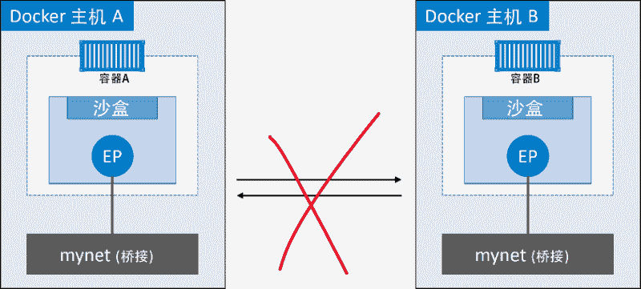
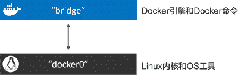
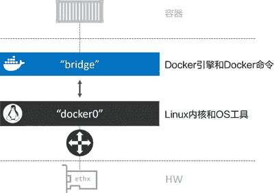
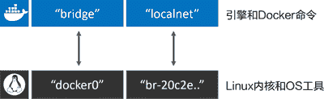
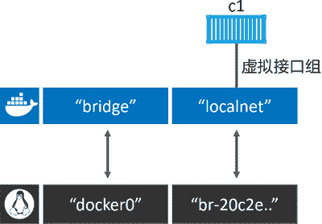
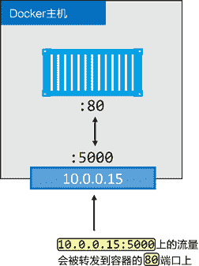
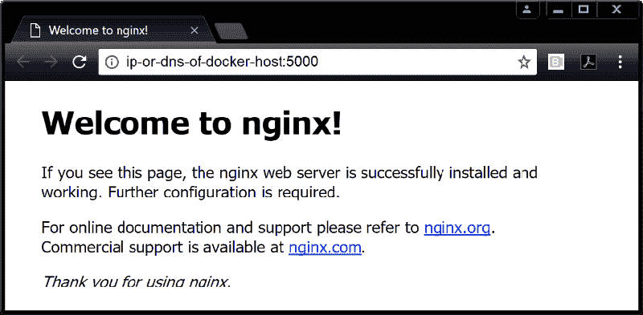

# Docker 单机桥接网络详解

> 原文：[`c.biancheng.net/view/3189.html`](http://c.biancheng.net/view/3189.html)

最简单的 Docker 网络就是单机桥接网络。

从名称中可以看到两点，单机意味着该网络只能在单个 Docker 主机上运行，并且只能与所在 Docker 主机上的容器进行连接，桥接意味着这是 802.1.d 桥接的一种实现（二层交换机）。

Linux Docker 创建单机桥接网络采用内置的桥接驱动，而 Windows Docker 创建时使用内置的 NAT 驱动。实际上，这两种驱动工作起来毫无差异。

下图展示了两个均包含相同本地桥接网络 mynet 的 Docker 主机。虽然网络是相同的，但却是两个独立的网络。这意味着图中容器无法直接进行通信，因为并不在一个网络当中。

每个 Docker 主机都有一个默认的单机桥接网络。

在 Linux 上网络名称为 bridge，在 Windows 上叫作 nat。除非读者通过命令行创建容器时指定参数--network，否则默认情况下，新创建的容器都会连接到该网络。

下面列出了 `docker network ls` 命令在刚完成安装的 Docker 主机上的输出内容。输出内容做了截取处理，只展示了每个主机上的默认网络。注意，网络的名称和创建时使用的驱动名称是一致的——这只是个巧合。

//Linux
$ docker network ls
NETWORK ID NAME DRIVER SCOPE
333e184cd343 bridge bridge local

//Windows
> docker network ls
NETWORK ID NAME DRIVER SCOPE
095d4090fa32 nat nat local

`docker network inspect` 命令就是一个信息宝藏。推荐各位小伙伴仔细阅读该命令的输出内容。

docker network inspect bridge
[
    {
    "Name": "bridge", << 在 Windows 上是 nat
    "Id": "333e184...d9e55",
    "Created": "2018-01-15T20:43:02.566345779Z",
    "Scope": "local",
    "Driver": "bridge", << 在 Windows 上是 nat
    "EnableIPv6": false,
    "IPAM": {
        "Driver": "default",
        "Options": null,
        "Config": [
            {
            "Subnet": "172.17.0.0/16"
            }
        ]
    },
        "Internal": false,
        "Attachable": false,
        "Ingress": false,
        "ConfigFrom": {
            "Network": ""
        },
    <Snip>
    }
]

在 Linux 主机上，Docker 网络由 Bridge 驱动创建，而 Bridge 底层是基于 Linux 内核中久经考验达 15 年之久的 Linux Bridge 技术。

这意味着 Bridge 是高性能并且非常稳定的！同时这还表示可以通过标准的 Linux 工具来查看这些网络，代码如下。

$ ip link show docker0
3: docker0: <BROADCAST,MULTICAST,UP,LOWER_UP> mtu 1500 qdisc...
link/ether 02:42:af:f9:eb:4f brd ff:ff:ff:ff:ff:ff

在 Linux Docker 主机之上，默认的“bridge”网络被映射到内核中为“docker0”的 Linux 网桥。可以通过 `docker network inspect` 命令观察到上面的输出内容。

$ docker network inspect bridge | grep bridge.name
"com.docker.network.bridge.name": "docker0",

Docker 默认“bridge”网络和 Linux 内核中的“docker0”网桥之间的关系如下图所示。

下图对上图的内容进行了扩展，在顶部补充了接入“bridge”网络的容器。

“bridge”网络在主机内核中映射到名为“docker0”的 Linux 网桥，该网桥可以通过主机以太网接口的端口映射进行反向关联。

接下来使用 `docker network create` 命令创建新的单机桥接网络，名为“localnet”。

//Linux
$ docker network create -d bridge localnet

//Windows
> docker network create -d nat localnet

新的网络创建成功，并且会出现在 `docker network ls` 命名的输出内容当中。如果使用 Linux，那么在主机内核中还会创建一个新的 Linux 网桥。

接下来通过使用 Linux brctl 工具来查看系统中的 Linux 网桥。小伙伴可能需要通过命令 `apt-get install bridge-utils` 来安装 brctl 二进制包，或者根据所使用的 Linux 发行版选择合适的命令。

$ brctl show
bridge name bridge id STP enabled interfaces
docker0 8000.0242aff9eb4f no
br-20c2e8ae4bbb 8000.02429636237c no

输出内容中包含了两个网桥。第一行是前文提过的 docker0 网桥，该网桥对应 Docker 中的默认网络 bridge；第二个网桥（br-20c2e8ae4bbb）与新建的“localnet”Docker 桥接网络相对应。

两个网桥目前都没有开启 STP，并且也都没有任何设备接入（对应的 interfaces 列为空）。

目前，主机上的网桥配置如下图所示。

接下来创建一个新的容器，并接入到新建桥接网络 localnet 当中。如果是在 Windows 上进行操作，需要将命令中“alpine sleep 1d”替换为“microsoft/powershell:nanoserver pwsh.exe -Command Start-Sleep 86400”。

$ docker container run -d --name c1 \
--network localnet \
alpine sleep 1d

容器现在接入了 localnet 网络当中。读者可以通过 `docker network inspect` 命令来确认。

$ docker network inspect localnet --format
'{{json .Containers}}' {
    "4edcbd...842c3aa": {
        "Name": "c1",
        "EndpointID": "43a13b...3219b8c13",
        "MacAddress": "02:42:ac:14:00:02",
        "IPv4Address": "172.20.0.2/16",
        "IPv6Address": ""
    }
},

输出内容表明“c1”容器已经位于桥接（Bridge/NAT）网络 localnet 之上。

如果再次运行 `brctl show` 命令，就能看到 c1 的网络接口连接到了 br-20c2e8ae4bbb 网桥。

$ brctl show
bridge name bridge id STP enabled interfaces
br-20c2e8ae4bbb 8000.02429636237c no vethe792ac0
docker0 8000.0242aff9eb4f no

下图展示了上述关系。

如果在相同网络中继续接入新的容器，那么在新接入容器中是可以通过“c1”的容器名称来 ping 通的。这是因为新容器都注册到了指定的 Docker DNS 服务，所以相同网络中的容器可以解析其他容器的名称。

> 提示：Linux 上默认的 Bridge 网络是不支持通过 Docker DNS 服务进行域名解析的。自定义桥接网络可以！

下面一起来测试一下。

1) 创建名为“c2”的容器，并接入“c1”所在的 localnet 网络。

//Linux
$ docker container run -it --name c2 \
--network localnet \
alpine sh

//Windows
> docker container run -it --name c2 `
--network localnet `
microsoft/powershell:nanoserver

当前终端会切换到“c2”容器中。

2) 在“c2”容器中，通过“c1”容器名称执行 ping 命令。

> ping c1
Pinging c1 [172.26.137.130] with 32 bytes of data:
Reply from 172.26.137.130: bytes=32 time=1ms TTL=128
Reply from 172.26.137.130: bytes=32 time=1ms TTL=128
Control-C

命令生效了！这是因为 c2 容器运行了一个本地 DNS 解析器，该解析器将请求转发到了 Docker 内部 DNS 服务器当中。

DNS 服务器中记录了容器启动时通过 --name 或者 --net-alias 参数指定的名称与容器之间的映射关系。

如果读者仍处于容器中，可以尝试运行一些网络相关的命令。这是一种很好的了解 Docker 容器网络工作原理的方式。下面的片段是在之前创建的 Windows 容器“c2”中运行 `ipconfig` 命令的输出内容。可以在前面 `docker network inspect nat` 命令输出中找到对应的 IP 地址。

> ipconfig
Windows IP Configuration
Ethernet adapter Ethernet:
Connection-specific DNS Suffix . :
Link-local IPv6 Address . . . . . : fe80::14d1:10c8:f3dc:2eb3%4
IPv4 Address. . . . . . . . . . . : 172.26.135.0
Subnet Mask . . . . . . . . . . . : 255.255.240.0
Default Gateway . . . . . . . . . : 172.26.128.1

到目前为止，前面提到的桥接网络中的容器只能与位于相同网络中的容器进行通信。但是，可以使用端口映射（Port Mapping）来绕开这个限制。

端口映射允许将某个容器端口映射到 Docker 主机端口上。对于配置中指定的 Docker 主机端口，任何发送到该端口的流量，都会被转发到容器。下图中展示了具体流量动向。

如上图所示，容器内部应用开放端口为 80。该端口被映射到了 Docker 主机的 10.0.0.15 接口的 5000 端口之上。最终结果就是访问 10.0.0.15:5000 的所有流量都被转发到了容器的 80 端口。

接下来通过示例了解将容器上运行着 Web 服务的端口 80，映射到 Docker 主机端口 5000 的过程。

示例使用 Linux 的 Nginx。如果使用 Windows 的话，可以将 Nginx 替换为某个 Windows 的 Web 服务镜像。

1) 运行一个新的 Web 服务容器，并将容器 80 端口映射到 Docker 主机的 5000 端口。

$ docker container run -d --name web \
--network localnet \
--publish 5000:80 \
nginx

2) 确认端口映射。

$ docker port web
80/tcp -> 0.0.0.0:5000

这表示容器 80 端口已经映射到 Docker 主机所有接口上的 5000 端口。

3) 通过 Web 浏览器访问 Docker 主机 5000 端口，验证配置是否生效，如下图所示。为了完成测试，需要知道 Docker 主机的 IP 地址或者 DNS 名称。如果使用 Windows 版 Docker 或者 Mac 版 Docker，可以使用 localhost 或者 127.0.0.1。

外部系统现在可以通过 Docker 主机的 TCP 端口 5000，来访问运行在桥接网络上的 Nginx 容器了。

端口映射工作原理大致如此，但这种方式比较笨重并且不能扩展。举个例子，在只有单一容器的情况下，它可以绑定到主机的任意端口。这意味着其他容器就不能再使用已经被 Nginx 容器占用的 5000 端口了。这也是单机桥接网络只适用于本地开发环境以及非常小的应用的原因。