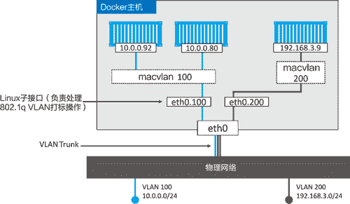

# Docker Macvlan 网络驱动使用详解

> 原文：[`c.biancheng.net/view/3191.html`](http://c.biancheng.net/view/3191.html)

能够将容器化应用连接到外部系统以及物理网络的能力是非常必要的。常见的例子是部分容器化的应用——应用中已容器化的部分需要与那些运行在物理网络和 VLAN 上的未容器化部分进行通信。

Docker 内置的 Macvlan 驱动（Windows 上是 Transparent）就是为此场景而生。通过为容器提供 MAC 和 IP 地址，让容器在物理网络上成为“一等公民”。下图展示了具体内容。

Macvlan 的优点是性能优异，因为无须端口映射或者额外桥接，可以直接通过主机接口（或者子接口）访问容器接口。但是，Macvlan 的缺点是需要将主机网卡（NIC）设置为混杂模式（Promiscuous Mode），这在大部分公有云平台上是不允许的。

所以 Macvlan 对于公司内部的数据中心网络来说很棒（假设公司网络组能接受 NIC 设置为混杂模式），但是 Macvlan 在公有云上并不可行。

接下来通过图片和一个假想场景加深对 Macvlan 的理解。

假设有一个物理网络，其上配置了两个 VLAN——VLAN 100：10.0.0.0/24 和 VLAN 200：192.168.3.0/24，如下图所示。

接下来，添加一个 Docker 主机并连接到该网络，如下图所示。

有一个需求是将容器接入 VLAN 100。为了实现该需求，首先使用 Macvlan 驱动创建新的 Docker 网络。但是，Macvlan 驱动在连接到目标网络前，需要设置几个参数。比如以下几点。

*   子网信息。
*   网关。
*   可分配给容器的 IP 范围。
*   主机使用的接口或者子接口。

下面的命令会创建一个名为 macvlan100 的 Macvlan 网络，该网络会连接到 VLAN 100。

$ docker network create -d macvlan \
--subnet=10.0.0.0/24 \
--ip-range=10.0.00/25 \
--gateway=10.0.0.1 \
-o parent=eth0.100 \
macvlan100

该命令会创建 macvlan100 网络以及 eth0.100 子接口。当前配置如下图所示。

Macvlan 采用标准 Linux 子接口，需要为其打上目标 VLAN 网络对应的 ID。在本例中目标网络是 VLAN 100，所以将子接口标记为 .100（etho.100）。

通过 --ip-range 参数告知 Macvlan 网络在子网中有哪些 IP 地址可以分配给容器。这些地址必须被保留，不能用于其他节点或者 DHCP 服务器，因为没有任何管理层功能来检查 IP 区域重合的问题。

macvlan100 网络已为容器准备就绪，执行以下命令将容器部署到该网络中。

$ docker container run -d --name mactainer1 \
--network macvlan100 \
alpine sleep 1d

当前配置如下图所示。但是切记，下层网络（VLAN 100）对 Macvlan 的魔法毫不知情，只能看到容器的 MAC 和 IP 地址。在该基础之上，mactainer1 容器可以 ping 通任何加入 VLAN 100 的系统，并进行通信。

> 注意：如果上述命令不能执行，可能是因为主机 NIC 不支持混杂模式。切记公有云平台不允许混杂模式。

目前已经拥有了 Macvlan 网络，并有一台容器通过 Macvlan 接入了现有的 VLAN 当中。但是，这并不是结束。Docker Macvlan 驱动基于稳定可靠的同名 Linux 内核驱动构建而成。

因此，Macvlan 也支持 VLAN 的 Trunk 功能。这意味着可以在相同的 Docker 主机上创建多个 Macvlan 网络，并且将容器按照下图的方式连接起来。

以上内容基本能涵盖 Macvlan。Windows 也提供了类似的解决方案 Transparent 驱动。

#### 用于故障排除的容器和服务日志

当认为遇到容器间网络连接问题时，检查 daemon 日志以及容器日志（应用日志）是非常有必要的。

在 Windows 上，daemon 日志存储在 ∼AppData\Local\Docker，可以通过 Windows 事件查看器来浏览。在 Linux 上，daemon 日志的存储位置取决于当前系统正在使用的初始化方式。

如果是 Systemd，日志会存储在 Journald，并且可以通过 `journalctl -u docker.service` 命令查看；如果不是 Systemd 读者需要查看如下位置。

*   Ubuntu 系统：upstart:/var/log/upstart/docker.log。
*   RHEL 系列：systems:/var/log/messages。
*   Debian：/var/log/daemon.log。
*   Mac 版 Docker：∼/Library/Containers/com.docker.docker/Data/com. docker.driver.amd64-linux/console-ring。

还可以设置 daemon 日志的详细程度。可以通过编辑 daemon 配置文件（daemon.json），将 debug 设置为 true，并同时设置 log-level 为下面的某个值。

*   debug：最详细的日志级别。
*   info：默认值，次详细日志级别。
*   warn：第三详细日志级别。
*   error：第四详细日志级别。
*   fatal：最粗略的日志级别。

下面的片段摘自 daemon.json，其中开启了调试模式，并设置日志级别为 debug。该配置在所有 Docker 平台均有效。

{
    <Snip>
    "debug":true,
    "log-level":"debug",
    <Snip>
}

修改配置文件之后，需要重启 Docker 才会生效。这就是 daemon 日志了。容器日志又是什么？

可以通过 `docker container logs` 命令查看单独的容器日志，通过 `docker service logs` 可以查看 Swarm 服务日志。但是，Docker 支持多种日志驱动，并不是每种都能通过 `docker logs` 命令查看的。

就像引擎日志的驱动和配置一样，每个 Docker 主机也为容器提供了默认的日志驱动以及配置。其中包括 json-file（默认）、journald（只在运行 systemd 的 Linux 主机中生效）、syslog、splunk 和 gelf。

json-file 和 journald 可能是较容易配置的，并且均可通过 `doker logs` 和 `docker service logs` 命令查看。具体命令格式为：

docker logs <container-name> 和 docker service logs <service-name>

如果采用了其他日志驱动，可以通过第三方平台提供的原生工具进行查看。

下面的片段为 daemon.json 文件的一部分，展示如何配置 Docker 主机使用 syslog 方式。

{
    "log-driver": "syslog"
}

可以为某个容器或者服务配置单独的日志策略，只需在启动的时候通过 --log- driver 和 --log-opts 指定特定的日志驱动即可。这样会覆盖掉 daemon.json 中的配置。

容器日志生效的前提是应用进程在容器内部 PID 为 1，并且将正常日志输出到 STDOUT，将异常日志输出到 STDERR。日志驱动就会将这些“日志”转发到日志驱动配置指定的位置。

如果应用日志是写到某个文件的，可以利用符号链接将日志文件重定向到 STDOUT 和 STDERR。

下面的例子展示了通过运行 docker logs 命令查看某个使用 json-file 日志驱动，并且名为 vantage-db 容器的日志。

$ docker logs vantage-db
1:C 2 Feb 09:53:22.903 # oO0OoO0OoO0Oo Redis is starting oO0OoO0OoO0Oo
1:C 2 Feb 09:53:22.904 # Redis version=4.0.6, bits=64, commit=00000000, modi\
fied=0, pid=1
1:C 2 Feb 09:53:22.904 # Warning: no config file specified, using the defaul\
t config.
1:M 2 Feb 09:53:22.906 * Running mode=standalone, port=6379.
1:M 2 Feb 09:53:22.906 # WARNING: The TCP backlog setting of 511 cannot be e\
nforced because...
1:M 2 Feb 09:53:22.906 # Server initialized
1:M 2 Feb 09:53:22.906 # WARNING overcommit_memory is set to 0!

通常是很有可能在 daemon 日志或者容器日志中找到网络连接相关异常的。