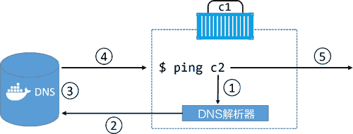

# Docker Service Discovery 服务发现

> 原文：[`c.biancheng.net/view/3194.html`](http://c.biancheng.net/view/3194.html)

作为核心网络架构，Libnetwork 还提供了一些重要的网络服务——服务发现。

服务发现（Service Discovery）允许容器和 Swarm 服务通过名称互相定位。唯一的要求就是需要处于同一个网络当中。

其底层实现是利用了 Docker 内置的 DNS 服务器，为每个容器提供 DNS 解析功能。下图展示了容器“c1”通过名称 ping 容器“c2”的过程。Swarm 服务原理相同。

下面逐步分析整个过程。

1) ping c2 命令调用本地 DNS 解析器，尝试将“c2”解析为具体 IP 地址。每个 Docker 容器都有本地 DNS 解析器。

2) 如果本地解析器在本地缓存中没有找到“c2”对应的 IP 地址，本地解析器会向 Docker DNS 服务器发起一个递归查询。本地服务解析器是预先配置好并知道 Docker DNS 服务器细节的。

3) Docker DNS 服务器记录了全部容器名称和 IP 地址的映射关系，其中容器名称是容器在创建时通过 --name 或者 --net-alias 参数设置的。这意味着 Docker DNS 服务器知道容器“c2”的 IP 地址。

4) DNS 服务返回“c2”对应的 IP 地址到“c1”本地 DNS 解析器。之所以会这样是因为两个容器位于相同的网络当中，如果所处网络不同则该命令不可行。

5) ping 命令被发往“c2”对应的 IP 地址。

每个启动时使用了 --name 参数的 Swarm 服务或者独立的容器，都会将自己的名称和 IP 地址注册到 Docker DNS 服务。这意味着容器和服务副本可以通过 Docker DNS 服务互相发现。

但是，服务发现是受网络限制的。这意味着名称解析只对位于同一网络中的容器和服务生效。如果两个容器在不同的网络，那么就不能互相解析。

关于服务发现和名称解析最后要说一点。

用户可以为 Swarm 服务和独立容器进行自定义的 DNS 配置。举个例子，--dns 参数允许读者指定自定义的 DNS 服务列表，以防出现内置的 Docker DNS 服务器解析失败的情况。

此外也可以使用 --dns-search 参数指定自定义查询时所使用的域名（例如当查询名称并非完整域名的时候）。

在 Linux 上，上述工作都是通过在容器内部 /etc/resolve.conf 文件内部增加条目来实现的。