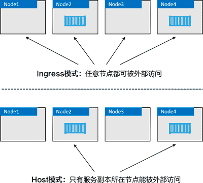
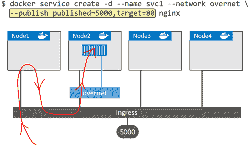
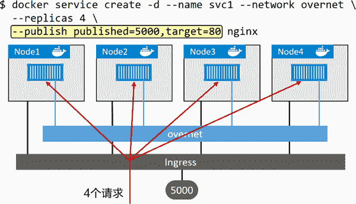

# Docker 服务发布模式：Ingress 和 Host

> 原文：[`c.biancheng.net/view/3195.html`](http://c.biancheng.net/view/3195.html)

Docker Swarm 支持两种服务发布模式，两种模式均保证服务从集群外可访问。

*   Ingress 模式（默认）。
*   Host 模式。

通过 Ingress 模式发布的服务，可以保证从 Swarm 集群内任一节点（即使没有运行服务的副本）都能访问该服务；以 Host 模式发布的服务只能通过运行服务副本的节点来访问。下图展示了两种模式的区别。

Ingress 模式是默认方式，这意味着任何时候读者通过 -p 或者 --publish 发布服务的时候，默认都是 Ingress 模式；如果需要以 Host 模式发布服务，则读者需要使用 --publish 参数的完整格式，并添加 mode=host。下面一起来看 Host 模式的例子。

$ docker service create -d --name svc1 \
--publish published=5000,target=80,mode=host \
nginx

关于该命令的一些说明。docker service mode 允许读者使用完整格式语法或者简单格式语法来发布服务。简单格式如 -p 5000:80，前面已经多次出现。但是，读者不能使用简单格式发布 Host 模式下的服务。

完整格式如 --publish published=5000,target=80,mode=host。该方式采用逗号分隔多个参数，并且逗号前后不允许有空格。具体选项说明如下。

*   published=5000 表示服务通过端口 5000 提供外部服务。
*   target=80 表示发送到 published 端口 5000 的请求，会映射到服务副本的 80 端口之上。
*   mode=host 表示只有外部请求发送到运行了服务副本的节点才可以访问该服务。

通常使用 Ingress 模式。

在底层，Ingress 模式采用名为 Service Mesh 或者 Swarm Mode Service Mesh 的四层路由网络来实现。下图展示了 Ingress 模式下一个外部请求是如何流转，最终访问到服务的。

上图中最上方命令部署了一个名为“svc1”的 Swarm 服务。该服务连接到了 overnet 网络，并发布到 5000 端口。

按上述方式发布 Swarm 服务（--publish published=5000,target=80）会在 Ingress 网络的 5000 端口进行发布。因为 Swarm 全部节点都接入了 Ingress 网络，所以这个端口被发布到了 Swarm 范围内。

集群确保到达 Ingress 网络中任意节点的 5000 端口的流量，都会被路由到 80 端口的“svc1”服务。

当前“svc1”服务只部署了一个副本，集群中有一条映射规则：“所有访问 Ingress 网络 5000 端口的流量都需要路由到运行了“svc1”服务副本的节点之上”。

红线展示了访问 Node 的 15000 端口的流量，通过 Ingress 网络，被路由到了 Node2 节点正在运行的服务副本之上。

入站流量可能访问 4 个 Swarm 节点中的任意一个，但是结果都是一样的，了解这一点很重要。这是因为服务通过 Ingress 网络实现了 Swarm 范围内的发布。

此外，还有一点很重要：如果存在多个运行中的副本，流量会平均到每个副本之上，如下图中展示的一样。

