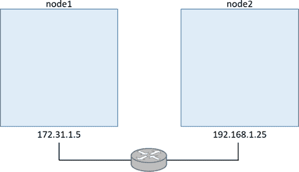
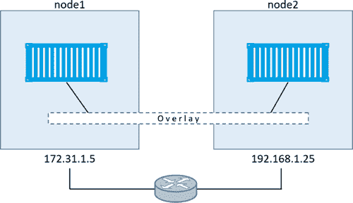
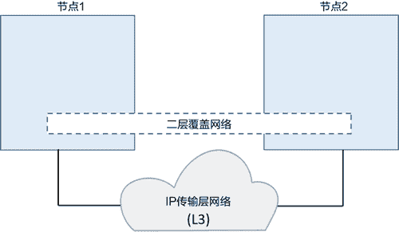
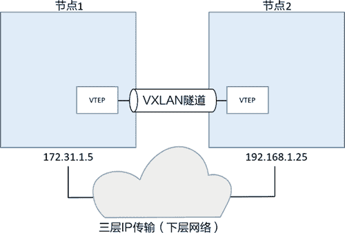
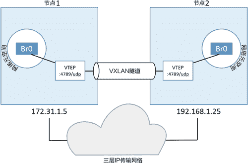
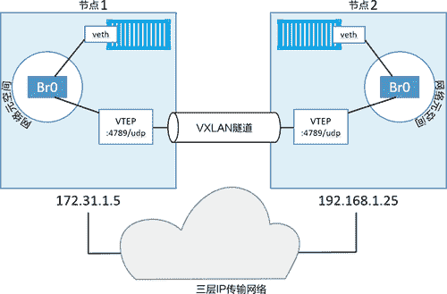
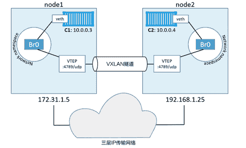

# Docker overlay 覆盖网络及 VXLAN 详解

> 原文：[`c.biancheng.net/view/3198.html`](http://c.biancheng.net/view/3198.html)

在现实世界中，容器间通信的可靠性和安全性相当重要，即使容器分属于不同网络中的不同主机。这也是覆盖网络大展拳脚的地方，它允许创建扁平的、安全的二层网络来连接多个主机，容器可以连接到覆盖网络并直接互相通信。

Docker 提供了原生覆盖网络的支持，易于配置且非常安全。其背后是基于 Libnetwork 以及相应的驱动来构建的。

Libnetwork 是 CNM 的典型实现，从而可以通过插拔驱动的方式来实现不同的网络技术和拓扑结构。

Docker 提供了一些诸如 Overlay 的原生驱动，同时第三方也可以提供驱动。

在 2015 年 3 月，Docker 公司收购了一个叫作 Socket Plane 的网络初创企业。收购的原因有二，首先是因为这会给 Docker 带来真正意义的网络架构，其次是让容器间联网变得非常简单，以至于开发人员都可以配置它。

Docker 公司在这两点上都取得了巨大的成功。但是，简洁的网络命令实际由大量的组件构成。这部分内容是在进行生产环境部署和问题定位前必须要了解的。

## 在 Swarm 模式下构建并测试 Docker 覆盖网络

要完成下面的示例，需要两台 Docker 主机，并通过一个路由器上两个独立的二层网络连接在一起。如下图所示，注意节点位于不同网络之上。

可以选择 Linux 容器主机或者 Windows 容器主机。Linux 内核版本不能低于 4.4（高版本更好），Windows 需要 Windows Server 2016 版本，并且应安装最新的补丁。

#### 1) 构建 Swarm

首先需要将两台主机配置为包含两个节点的 Swarm 集群。接下来会在 node1 节点上运行 `docker swarm init` 命令使其成为管理节点，然后在 node2 节点上运行 `docker swarm join` 命令来使其成为工作节点。

在 node1 节点上运行下面的命令。

$ docker swarm init \
--advertise-addr=172.31.1.5 \
--listen-addr=172.31.1.5:2377

Swarm initialized: current node (1ex3...o3px) is now a manager.

在 node2 上运行下面的命令。如果需要在 Windows 环境下生效，则需要修改 Windows 防火墙规则，打开 2377/tcp、7946/tcp 以及 7946/udp 等几个端口。

$ docker swarm join \
--token SWMTKN-1-0hz2ec...2vye \
172.31.1.5:2377
This node joined a swarm as a worker.

现在就已经创建好了包含管理节点 node1 和工作节点 node2 两个节点的 Swarm 集群了。

#### 2) 创建新的覆盖网络

现在创建一个名为 uber-net 的覆盖网络。

在 node1（管理节点）节点上运行下面的命令。若要这些命令在 Windows 上也能运行，需要在 Windows Docker 节点上添加 4789/udp 规则。

$ docker network create -d overlay uber-net
c740ydi1lm89khn5kd52skrd9

刚刚创建了一个崭新的覆盖网络，能连接 Swarm 集群内的所有主机，并且该网络还包括一个 TLS 加密的控制层！如果还想对数据层加密的话，只需在命令中增加 -o encrypted 参数。

可以通过 `docker network ls` 命令列出每个节点上的全部网络。

$ docker network ls
NETWORK ID NAME DRIVER SCOPE
ddac4ff813b7 bridge bridge local
389a7e7e8607 docker_gwbridge bridge local
a09f7e6b2ac6 host host local
ehw16ycy980s ingress overlay swarm
2b26c11d3469 none null local
c740ydi1lm89 uber-net overlay swarm

在 Windows Docker 主机上输出内容如下。

NETWORK ID NAME DRIVER SCOPE
8iltzv6sbtgc ingress overlay swarm
6545b2a61b6f nat nat local
96d0d737c2ee none null local
nil5ouh44qco uber-net overlay swarm

列表的最下方就是刚刚创建的网络 uber-net。其他的网络是在安装 Docker 以及初始化 Swarm 集群的时候创建的。

如果在 node2 节点上运行 `docker network ls` 命令，就会发现无法看到 uber-net 网络。这是因为只有当运行中的容器连接到覆盖网络的时候，该网络才变为可用状态。这种延迟生效策略通过减少网络梳理，提升了网络的扩展性。

#### 3) 将服务连接到覆盖网络

现在覆盖网络已经就绪，接下来新建一个 Docker 服务并连接到该网络。Docker 服务会包含两个副本（容器），一个运行 node1 节点上，一个运行在 node2 节点上。这样会自动将 node2 节点接入 uber-net 网络。

在 node1 节点上运行下面的命令。

Linux 示例如下。

$ docker service create --name test \
--network uber-net \
--replicas 2 \
ubuntu sleep infinity

Windows 示例如下。

> docker service create --name test `
--network uber-net `
--replicas 2 `
microsoft\powershell:nanoserver Start-Sleep 3600

Windows 示例使用反引号的方式将单条命令分为多行，以提高命令的可读性。PowerShell 中使用反引号来转义换行字符。

该命令创建了名为 test 的新服务，连接到了 uber-net 这个覆盖网络，并且还基于指定的镜像创建了两个副本（容器）。在两个示例中，均在容器中采用 sleep 命令来保持容器运行，并在休眠结束后退出该容器。

由于运行了两个副本（容器），而 Swarm 包含两个节点，因此每个节点上都会运行一个副本。

可以通过 `docker service ps` 命令来确认上面的操作。

$ docker service ps test
ID NAME IMAGE NODE DESIRED STATE CURRENT STATE
77q...rkx test.1 ubuntu node1 Running Running
97v...pa5 test.2 ubuntu node2 Running Running

当 Swarm 在覆盖网络之上启动容器时，会自动将容器运行所在节点加入到网络当中。这意味着此时在 node2 节点上就可以看到 uber-net 网络了。

目前已经成功在两个由物理网络连接的节点上创建了新的覆盖网络。同时，还将两个容器连接到了该网络当中。

#### 4) 测试覆盖网络

现在使用 ping 命令来测试覆盖网络。

如下图所示，在两个独立的网络中分别有一台 Docker 主机，并且两者都接入了同一个覆盖网络。目前在每个节点上都有一个容器接入了覆盖网络。测试一下两个容器之间是否可以 ping 通。

为了执行该测试，需要知道每个容器的 IP 地址（为了测试，暂时忽略相同覆盖网络上的容器可以通过名称来互相 ping 通的事实）。

运行 `docker network inspect` 查看被分配给覆盖网络的 Subnet。

$ docker network inspect uber-net

{
  "Name": "uber-net",
  "Id": "c740ydi1lm89khn5kd52skrd9",
  "Scope": "swarm",
  "Driver": "overlay",
  "EnableIPv6": false,
  "IPAM": {
   "Driver": "default",
   "Options": null,
   "Config": [
    {
     "Subnet": "10.0.0.0/24",
     "Gateway": "10.0.0.1"
    }
   <Snip>

由以上输出可见，uber-net 的子网是 10.0.0.0/24。注意，这与两个节点的任意底层物理网络 IP 均不相符（172.31.1.0/24 和 192.168.1.0/24）。

在 node1 和 node2 节点上运行下面两条命令。这两条命令可以获取到容器 ID 和 IP 地址。在第二条命令中一定要使用读者自己的环境中的容器 ID。

需要在两台节点上分别运行上述命令，获取两个容器的 ID 和 IP 地址。

下图展示了配置现状。在运行环境中，子网和 IP 地址信息可能不同。

![配置现状
由图可知，一个二层覆盖网络横跨两台主机，并且每个容器在覆盖网络中都有自己的 IP 地址。这意味着 node1 节点上的容器可以通过 node2 节点上容器的 IP 地址 10.0.0.4 来 ping 通，该 IP 地址属于覆盖网络。尽管两个节点分属于不同的二层网络，还是可以直接 ping 通。接下来验证这一点。

登录到 node1 的容器，并 ping 另一个的容器。

在 Linux Ubuntu 容器中执行该操作的话，需要安装 ping 工具包。如果读者使用 Windows PowerShell 示例，ping 工具已默认安装。

Linux 示例如下。

Windows 示例如下。

> docker container exec -it 1a4f29e5a4b6 pwsh.exe
Windows PowerShell
Copyright (C) 2016 Microsoft Corporation. All rights reserved.

PS C:\> ping 10.0.0.4

Pinging 10.0.0.4 with 32 bytes of data:
Reply from 10.0.0.4: bytes=32 time=1ms TTL=128
Reply from 10.0.0.4: bytes=32 time<1ms TTL=128
Reply from 10.0.0.4: bytes=32 time=2ms TTL=128
Reply from 10.0.0.4: bytes=32 time=2ms TTL=12
PS C:\>

由运行结果可知 node1 上的容器可以通过覆盖网络 ping 通 node2 之上的容器了。

还可以在容器内部跟踪 ping 命令的路由信息。路由信息只有一条，证明容器间通信确实通过覆盖网络直连。

如果希望 Linux 示例中的 traceroute 可执行，需要安装 traceroute 包。

Linux 示例如下。

$ root@396c8b142a85:/# traceroute 10.0.0.4
traceroute to 10.0.0.4 (10.0.0.4), 30 hops max, 60 byte packets
1 test-svc.2.97v...a5.uber-net (10.0.0.4) 1.110ms 1.034ms 1.073ms

Windows 示例如下。

PS C:\> tracert 10.0.0.3

Tracing route to test.2.ttcpiv3p...7o4.uber-net [10.0.0.4]
over a maximum of 30 hops:

1 <1 ms <1 ms <1 ms test.2.ttcpiv3p...7o4.uber-net [10.0.0.4]

Trace complete.

到目前为止，已经通过单条命令创建了覆盖网络，并向该网络中接入了容器。这些容器分布在两个不同的主机上，两台主机分属于不同的二层网络。在找出两台容器的 IP 之后，验证了容器可以通过覆盖网络完成直连。

## 工作原理

现在已经知道如何创建并使用容器覆盖网络，接下来介绍一下这一切背后的技术原理。

#### 1) VXLAN 入门

首先必须知道，Docker 使用 VXLAN 隧道技术创建了虚拟二层覆盖网络。所以，在详解之前，先快速了解一下 VXLAN。

在 VXLAN 的设计中，允许用户基于已经存在的三层网络结构创建虚拟的二层网络。在前面的示例中创建了一个子网掩码为 10.0.0.0/24 的二层网络，该网络是基于一个三层 IP 网络实现的，三层 IP 网络由 172.31.1.0/24 和 192.168.1.0/24 这两个二层网络构成。具体如下图所示。

VXLAN 的美妙之处在于它是一种封装技术，能使现存的路由器和网络架构看起来就像普通的 IP/UDP 包一样，并且处理起来毫无问题。

为了创建二层覆盖网络，VXLAN 基于现有的三层 IP 网络创建了隧道。小伙伴可能听过基础网络（Underlay Network）这个术语，它用于指代三层之下的基础部分。

VXLAN 隧道两端都是 VXLAN 隧道终端（VXLAN Tunnel Endpoint, VTEP）。VTEP 完成了封装和解压的步骤，以及一些功能实现所必需的操作，如下图所示。

#### 2) 梳理一下两个容器的示例

在前面的示例中，读者通过 IP 网络将两台主机连接起来。每个主机运行了一个容器，之后又为容器连接创建了一个 VXLAN 覆盖网络。

为了实现上述场景，在每台主机上都新建了一个 Sandbox（网络命名空间）。正如前文所讲，Sandbox 就像一个容器，但其中运行的不是应用，而是当前主机上独立的网络栈。

在 Sandbox 内部创建了一个名为 Br0 的虚拟交换机（又称做虚拟网桥）。同时 Sandbox 内部还创建了一个 VTEP，其中一端接入到名为 Br0 的虚拟交换机当中，另一端接入主机网络栈（VTEP）。

在主机网络栈中的终端从主机所连接的基础网络中获取到 IP 地址，并以 UDP Socket 的方式绑定到 4789 端口。不同主机上的两个 VTEP 通过 VXLAN 隧道创建了一个覆盖网络，如下图所示。

这是 VXLAN 上层网络创建和使用所必需的。

接下来每个容器都会有自己的虚拟以太网（veth）适配器，并接入本地 Br0 虚拟交换机。目前拓扑结构如下图所示，虽然是在主机所属网络互相独立的情况下，但这样能更容易看出两个分别位于不同主机上的容器之间是如何通过 VXLAN 上层网络进行通信的。

#### 3) 通信示例

在本例中，将 node1 上的容器称为 C1，node2 上的容器称为 C2，如下图所示。假设 C1 希望 ping 通 C2，类似前面章节中的示例。

C1 发起 ping 请求，目标 IP 为 C2 的地址 10.0.0.4。该请求的流量通过连接到 Br0 虚拟交换机 veth 接口发出。虚拟交换机并不知道将包发送到哪里，因为在虚拟交换机的 MAC 地址映射表（ARP 映射表）中并没有与当前目的 IP 对应的 MAC 地址。

所以虚拟交换机会将该包发送到其上的全部端口。连接到 Br0 的 VTEP 接口知道如何转发这个数据帧，所以会将自己的 MAC 地址返回。这就是一个代理 ARP 响应，并且虚拟交换机 Br0 根据返回结果学会了如何转发该包。接下来虚拟交换机会更新自己的 ARP 映射表，将 10.0.0.4 映射到本地 VTEP 的 MAC 地址上。

现在 Br0 交换机已经学会如何转发目标为 C2 的流量，接下来所有发送到 C2 的包都会被直接转发到 VTEP 接口。VTEP 接口知道 C2，是因为所有新启动的容器都会将自己的网络详情采用网络内置 Gossip 协议发送给相同 Swarm 集群内的其他节点。

交换机会将包转发到 VTEP 接口，VTEP 完成数据帧的封装，这样就能在底层网络传输。具体来说，封装操作就是把 VXLAN Header 信息添加以太帧当中。

VXLAN Header 信息包含了 VXLAN 网络 ID（VNID），其作用是记录 VLAN 到 VXLAN 的映射关系。每个 VLAN 都对应一个 VNID，以便包可以在解析后被转发到正确的 VLAN。

封装的时候会将数据帧放到 UDP 包中，并设置 UDP 的目的 IP 字段为 node2 节点的 VTEP 的 IP 地址，同时设置 UDP Socket 端口为 4789。这种封装方式保证了底层网络即使不知道任何关于 VXLAN 的信息，也可以完成数据传输。

当包到达 node2 之后，内核发现目的端口为 UDP 端口 4789，同时还知道存在 VTEP 接口绑定到该 Socket。所以内核将包发给 VTEP，由 VTEP 读取 VNID，解压包信息，并根据 VNID 发送到本地名为 Br0 的连接到 VLAN 的交换机。在该交换机上，包被发送给容器 C2。

以上大体介绍了 Docker 覆盖网络是如何利用 VXLAN 技术的。

最后一件需要注意的是，Docker 支持使用同样的覆盖网络实现三层路由。例如，读者可以创建包含两个子网的覆盖网络，Docker 会负责子网间的路由。创建的命令如 docker network create --subnet=10.1.1.0/24 --subnet=11.1.1.0/24 -d overlay prod-net。该命令会在 Sandbox 中创建两个虚拟交换机，默认支持路由。