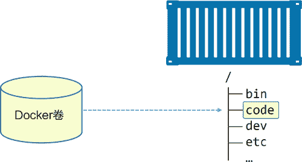

# Docker 卷与持久化数据

> 原文：[`c.biancheng.net/view/3203.html`](http://c.biancheng.net/view/3203.html)

数据主要分为两类，持久化的与非持久化的。

持久化数据是需要保存的数据。例如客户信息、财务、预定、审计日志以及某些应用日志数据。非持久化数据是不需要保存的那些数据。

两者都很重要，并且 Docker 均有对应的支持方式。

每个 Docker 容器都有自己的非持久化存储。非持久化存储自动创建，从属于容器，生命周期与容器相同。这意味着删除容器也会删除全部非持久化数据。

如果希望自己的容器数据保留下来（持久化），则需要将数据存储在卷上。卷与容器是解耦的，从而可以独立地创建并管理卷，并且卷并未与任意容器生命周期绑定。最终效果即用户可以删除一个关联了卷的容器，但是卷并不会被删除。

对于微服务设计模式来说，容器是不错的选择。通常与微服务挂钩的词有暂时以及无状态。所以，微服务就是无状态的、临时的工作负载，同时容器即微服务。因此，我们经常会轻易下结论，认为容器就是用于临时场景。

但这种说法是错误的，而且是大错特错！

## 容器与非持久数据

毫无疑问，容器擅长无状态和非持久化事务。

每个容器都被自动分配了本地存储。默认情况下，这是容器全部文件和文件系统保存的地方。之前我们可能听过一些非持久存储相关的名称，如本地存储、GraphDriver 存储以及 SnapShotter 存储。

总之，非持久存储属于容器的一部分，并且与容器的生命周期一致，容器创建时会创建非持久化存储，同时该存储也会随容器的删除而删除。

在 Linux 系统中，该存储的目录在 /var/lib/docker/<storage-driver>/ 之下，是容器的一部分。在 Windows 系统中位于 C\ProgramData\Docker\windowsfilter\ 目录之下。

如果在生产环境中使用 Linux 运行 Docker，需要确认当前存储驱动（GraphDriver）与 Linux 版本是否相符。下面列举了一些指导建议。

*   RedHat Enterprise Linux：Docker 17.06 或者更高的版本中使用 Overlay2 驱动。在更早的版本中，使用 Device Mapper 驱动。这适用于 Oracle Linux 以及其他 Red Hat 相关发行版。
*   Ubuntu：使用 Overlay2 或者 AUFS 驱动。如果正在使用 Linux4.x 或者更高版本的内核，建议使用 Overlay2。
*   SUSE Linux Enterprise Server：使用 Btrfs 存储驱动。
*   Windows：Windows 只有一种驱动，已经默认设置。

上述清单只作为建议。随着时间发展，Overlay2 驱动正在逐渐流行，可能在未来会成为大多数平台上的推荐存储驱动。如果使用 Docker 企业版（EE），并且有技术支持合约，建议通过咨询获取最新的兼容矩阵。

默认情况下，容器的所有存储都使用本地存储。所以默认情况下容器全部目录都是用该存储。

## 容器与持久化数据

在容器中持久化数据的方式推荐采用卷。

总体来说，用户创建卷，然后创建容器，接着将卷挂载到容器上。卷会挂载到容器文件系统的某个目录之下，任何写到该目录下的内容都会写到卷中。即使容器被删除，卷与其上面的数据仍然存在。

如下图所示，Docker 卷挂载到容器的 /code 目录。任何写入 /code 目录的数据都会保存到卷当中，并且在容器删除后依然存在。

上图中，/code 目录是一个 Docker 卷。容器其他目录均使用临时的本地存储。卷与目录 /code 之间采用带箭头的虚线连接，这是为了表明卷与容器是非耦合的关系。

#### 1) 创建和管理容器卷

Docker 中卷属于一等公民。抛开其他原因，这意味着卷在 API 中拥有一席之地，并且有独立的 `docker volume` 子命令。

使用下面的命令创建名为 myvol 的新卷。

$ docker volume create myvol

默认情况下，Docker 创建新卷时采用内置的 local 驱动。恰如其名，本地卷只能被所在节点的容器使用。使用 -d 参数可以指定不同的驱动。

第三方驱动可以通过插件方式接入。这些驱动提供了高级存储特性，并为 Docker 集成了外部存储系统。下图展示的就是外部存储系统被用作卷存储。驱动集成了外部存储系统到 Docker 环境当中，同时能使用其高级特性。

截止到目前为止，已经存在 25 种卷插件，涵盖了块存储、文件存储、对象存储等。

*   块存储：相对性能更高，适用于对小块数据的随机访问负载。目前支持 Docker 卷插件的块存储例子包括 HPE 3PAR、Amazon EBS 以及 OpenStack 块存储服务（Cinder）。
*   文件存储：包括 NFS 和 SMB 协议的系统，同样在高性能场景下表现优异。支持 Docker 卷插件的文件存储系统包括 NetApp FAS、Azure 文件存储以及 Amazon EFS。
*   对象存储：适用于较大且长期存储的、很少变更的二进制数据存储。通常对象存储是根据内容寻址，并且性能较低。支持 Docker 卷驱动的例子包括 Amazon S3、Ceph 以及 Minio。

现在卷已经创建成功，可以通过 `docker volume ls` 命令进行查看，还可以使用 `docker volume inspect` 命令查看详情。

$ docker volume ls
DRIVER VOLUME NAME
local myvol

$ docker volume inspect myvol
[
    {
        "CreatedAt": "2018-01-12T12:12:10Z",
        "Driver": "local",
        "Labels": {},
        "Mountpoint": "/var/lib/docker/volumes/myvol/_data",
        "Name": "myvol",
        "Options": {},
        "Scope": "local"
    }
]

inspect 命令输出中有几点很有意思。Driver 和 Scope 都是 local。这意味着卷使用默认 local 驱动创建，只能用于当前 Docker 主机上的容器。Mountpoint 属性说明卷位于 Docker 主机上的位置。

在本例中卷位于 Docker 主机的 /var/lib/docker/volumes/myvol/_data 目录。在 Windows Docker 主机上对应内容为 Mountpoint": "C:\\ProgramData\\Docker\\ volumes\\myvol\\_data。

使用 local 驱动创建的卷在 Docker 主机上均有其专属目录，在 Linux 中位于 /var/lib/docker/volumes 目录下，在 Windows 中位于 C:\ProgramData\Docker\volumes 目录下。

这意味着可以在 Docker 主机文件系统中查看卷，甚至在 Docker 主机中对其进行读取数据或者写入数据操作。

可以在 Docker 服务以及容器中使用 myvol 卷。例如，可以在 `docker container run` 命令后增加参数 --flag 将卷挂载到新建容器中。稍后通过几个例子进行说明。

有两种方式删除 Docker 卷。

docker volume prune。
docker volume rm。

`docker volume prune` 会删除未装入到某个容器或者服务的所有卷，所以谨慎使用！`docker volume rm` 允许删除指定卷。两种删除命令都不能删除正在被容器或者服务使用的卷。

因为没有使用 myvol 卷，所以请通过 prune 命令进行删除。

$ docker volume prune

WARNING! This will remove all volumes not used by at least one container.
Are you sure you want to continue? [y/N] y

Deleted Volumes:
myvol
Total reclaimed space: 0B

现在已经完成创建、查看以及删除卷的操作了。上述操作均未涉及容器，这也验证了卷是独立的这一特性。

到目前，读者已经了解了卷的创建、列表、查看以及删除命令。此外，还可以通过在 Dockerfile 中使用 VOLUME 指令的方式部署卷。具体的格式为 VOLUME <container-mount-point。

但是，在 Dockerfile 中无法指定主机目录。这是因为主机目录通常情况下是相对主机的一个目录，意味着这个目录在不同主机间会变化，并且可能导致构建失败。如果通过 Dockerfile 指定，那么每次部署时都需要指定主机目录。

#### 2) 演示卷在容器和服务中的使用

通过前面的学习我们已经了解了卷相关的基本命令，接下来看一下如何在容器和服务中使用卷。

接下来的内容是基于某个没有卷的系统，演示内容适用于 Linux 和 Windows。

使用下面的命令创建一个新的独立容器，并挂载一个名为 bizvol 的卷。

Windows 示例如下。

所有的 Windows 示例都在 PowerShell 中执行，请注意反引号（`）用于将命令拆至多行。

> docker container run -dit --name voltainer `
--mount source=bizvol,target=c:\vol `
microsoft/powershell:nanoserver

即使系统中没有叫作 bizvol 的卷，命令也应该能够成功运行。这里引出了很有意思的一点。如果指定了已经存在的卷，Docker 会使用该卷。如果指定的卷不存在，Docker 会创建一个卷。

在当前示例中，bizvol 这个卷并不存在，所以 Docker 新建一个卷并挂载到新容器内部。这意味着读者可以通过 `docker volume ls` 命令看到该卷。

$ docker volume ls
DRIVER VOLUME NAME
local bizvol

尽管容器和卷各自拥有独立的生命周期，Docker 也不允许删除正在被容器使用的卷。

$ docker volume rm bizvol
Error response from daemon: unable to remove volume: volume is in use -
[b44 d3f82...dd2029ca]

目前卷是空的。执行 exec 连接到容器并向卷中写入一部分数据。示例引用的是 Linux，如果读者使用 Windows 示例，则需要将 `docker container exec` 命令结尾的 sh 替换为 pwsh.exe。其他命令在 Linux 和 Windows 上面均可以生效。

$ docker container exec -it voltainer sh

/# echo "I promise to write a review of the book on Amazon" > /vol/file1

/# ls -l /vol
total 4

-rw-r--r-- 1 root root 50 Jan 12 13:49 file1

/# cat /vol/file1
I promise to write a review of the book on Amazon

输入 exit 命令返回到 Docker 主机 Shell 中，然后使用下面命令删除容器。

$ docker container rm voltainer -f
voltainer

即使容器被删除，卷依旧存在。

$ docker container ls -a
CONTAINER ID IMAGE COMMAND CREATED STATUS

$ docker volume ls
DRIVER VOLUME NAME
local bizvol

由于卷仍然存在，因此可以进入到其在主机的挂载点并查看前面写入的数据是否还在。

在 Docker 主机的终端上执行下面的命令。第一条命令会证明文件依然存在，第二条命令展示了文件的内容。

如果是 Windows 示例，一定要使用 C:\ProgramData\Docker\volumes\bizvol\_data 目录。

$ ls -l /var/lib/docker/volumes/bizvol/_data/
total 4
-rw-r--r-- 1 root root 50 Jan 12 14:25 file1

$ cat /var/lib/docker/volumes/bizvol/_data/file1
I promise to write a review of the book on Amazon

根据运行结果可以看出，卷和数据都还在。

甚至将 bizvol 挂载到一个新的服务或者容器都是可以的。下面的命令会创建一个名为 hellcat 的新 Docker 服务，并且将 bizvol 挂载到该服务副本的 /vol 目录。

$ docker service create \
--name hellcat \
--mount source=bizvol,target=/vol \
alpine sleep 1d

overall progress: 1 out of 1 tasks
1/1: running [====================================>]
verify: Service converged

上述命令没有指定 --replicas 参数，所以服务只会部署一个副本。找到 Swarm 集群中运行了该服务的节点。

$ docker service ps hellcat
ID NAME NODE DESIRED STATE CURRENT STATE
l3nh... hellcat.1 node1 Running Running 19 seconds ago

在本例中，副本运行在 node1 节点上。登录到 node1 节点，然后获取服务副本容器 ID。

node1$ docker container ls
CTR ID IMAGE COMMAND STATUS NAMES
df6..a7b alpine:latest "sleep 1d" Up 25 secs hellcat.1.l3nh...

注意，容器的名称包括了 service-name、replica-number 以及 replica-ID，采用句号分隔。

登录到该容器并检查数据是否在 /vol 中。在 exec 例子中会使用服务副本的容器 ID。如果使用 Windows 示例，记得将 sh 替换为 pwsh.exe。

node1$ docker container exec -it df6 sh

/# cat /vol/file1
I promise to write a review of the book on Amazon

这样卷中保存了原始数据，并且在新容器中也可以使用。

## 在集群节点间共享存储

Docker 能够集成外部存储系统，使得集群间节点共享外部存储数据变得简单。例如，独立存储 LUN 或者 NFS 共享可以应用到多个 Docker 主机，因此无论容器或者服务副本运行在哪个节点上，都可以共享该存储。下图展示了位于共享存储的卷被两个 Docker 节点共享的场景。接下来这些 Docker 节点可以将共享卷应用到容器之上。

构建这样的环境需要外部存储系统的相关知识，并了解应用如何从共享存储读取或者写入数据。这种配置主要关注数据损坏（Data Corruption）。

基于下图，设想下面的场景：Node 1 上的容器 A 在共享卷中更新了部分数据。但是为了快速返回，数据实际写入了本地缓存而不是卷中。此时，容器 A 认为数据已经更新。但是，在 Node 1 的容器 A 将缓存数据刷新并提交到卷前，Node 2 的容器 B 更新了相同部分的数据，但是值不同，并且更新方式为直接写入卷中。

此时，两个容器均认为自己已经将数据写入卷中，但实际上只有容器 B 写入了。容器 A 会在稍后将自己的缓存数据写入缓存，覆盖了 Node 2 的容器 B 所做的一些变更。但是 Node 2 上的容器 B 对此一无所知。数据损坏就是这样发生的。

为了避免这种情况，需要在应用程序中进行控制。