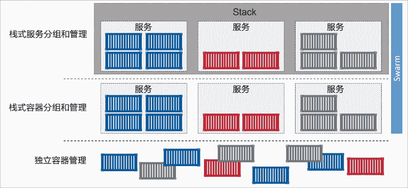
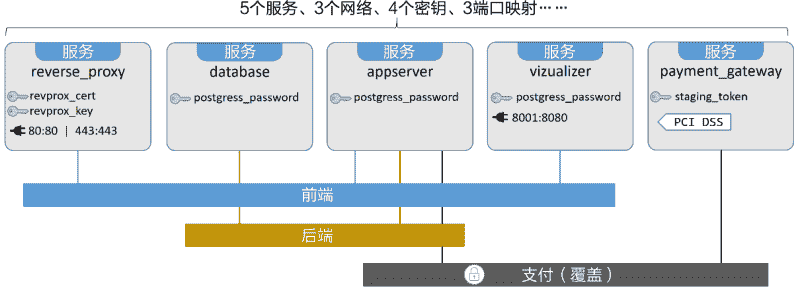

# Docker Stack 是什么

> 原文：[`c.biancheng.net/view/3208.html`](http://c.biancheng.net/view/3208.html)

大规模场景下的多服务部署和管理是一件很难的事情。

幸运的是，Docker Stack 为解决该问题而生，Docker Stack 通过提供期望状态、滚动升级、简单易用、扩缩容、健康检查等特性简化了应用的管理，这些功能都封装在一个完美的声明式模型当中。

在笔记本上测试和部署简单应用很容易。但这只能算业余选手。在真实的生产环境进行多服务的应用部署和管理，这才是专业选手的水平。

幸运的是，Stack 正为此而生！Stack 能够在单个声明文件中定义复杂的多服务应用。Stack 还提供了简单的方式来部署应用并管理其完整的生命周期：初始化部署 -> 健康检查 -> 扩容 -> 更新 -> 回滚，以及其他功能！

步骤很简单。在 Compose 文件中定义应用，然后通过 docker stack deploy 命令完成部署和管理。

Compose 文件中包含了构成应用所需的完整服务栈。此外还包括了卷、网络、安全以及应用所需的其他基础架构。然后基于该文件使用 docker stack deploy 命令来部署应用。

Stack 是基于 Docker Swarm 之上来完成应用的部署。因此诸如安全等高级特性，其实都是来自 Swarm。

简而言之，Docker 适用于开发和测试。Docker Stack 则适用于大规模场景和生产环境。

如果了解 Docker Compose，就会发现 Docker Stack 非常简单。事实上在许多方面，Stack 一直是期望的 Compose——完全集成到 Docker 中，并能够管理应用的整个生命周期。

从体系结构上来讲，Stack 位于 Docker 应用层级的最顶端。Stack 基于服务进行构建，而服务又基于容器，如下图所示。

在后续的讲解中会一直使用示例应用 AtSea Shop。该示例托管在 Github 的 dockersamples/atsea-sample-shop-app 库中，基于 Apache 2.0 许可证开源。

使用该应用是因为其复杂度适中，不会因为太复杂而难以完整解释。除此之外，该应用还是个多服务应用，并且利用了认证和安全相关的技术。应用架构如下图所示。

如上图所示，该应用由 5 个服务、3 个网络、4 个密钥以及 3 组端口映射构成。具体细节将会结合 Stack 文件进行分析。

提示：服务一词时，指的是 Docker 服务（由若干容器组成的集合，作为一个整体进行统一管理，并且在 Docker API 中存在对应的服务对象）。

复制 Github 仓库，以获取全部源代码文件。

$ git clone https://github.com/dockersamples/atsea-sample-shop-app.git Cloning
into 'atsea-sample-shop-app'...
remote: Counting objects: 636, done.
remote: Total 636 (delta 0), reused 0 (delta 0), pack-reused 636
Receiving objects: 100% (636/636), 7.23 MiB | 28.25 MiB/s, done.
Resolving deltas: 100% (197/197), done.

该应用的代码由若干目录和源码文件组成。读者可以随意浏览这些文件。但是接下来，重点关注的文件是 docker-stack.yml。该文件通常被称为 Stack 文件，在该文件中定义了应用及其依赖。

在该文件整体结构中，定义了 4 种顶级关键字。

*   version：代表了 Compose 文件格式的版本号。为了应用于 Stack，需要 3.0 或者更高的版本。
*   services：中定义了组成当前应用的服务都有哪些。
*   networks：列出了必需的网络。
*   secrets：定义了应用用到的密钥。

如果展开顶级的关键字，可以看到类似上图中的结构。Stack 文件由 5 个服务构成，分别为“reverse_proxy”“database”“appserver”“visualizer”“payment_gateway”。Stack 文件中包含 3 个网络，分别为“front-tier”“back-tier”“payment”。

最后，Stack 文件中有 4 个密钥，分别为“postgres_password”“staging_token”“revprox_key”“revprox_cert”。

version: "3.2"
services:
reverse_proxy:
database:
appserver:
visualizer:
payment_gateway:
networks:
front-tier:
back-tier:
payment:
secrets:
postgres_password:
staging_token:
revprox_key:
revprox_cert:

Stack 文件定义了应用的很多依赖要素，理解这一点很重要。因此，Stack 文件是应用的一个自描述文件，并且作为一个很好的工具弥合了开发和运维之间的隔阂。