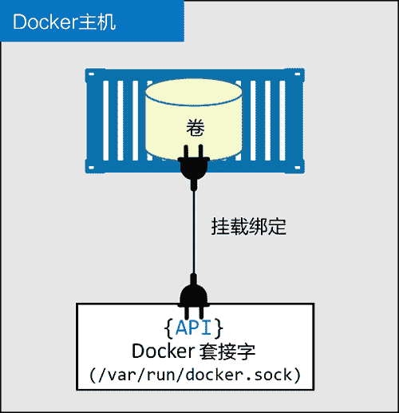

# Docker Stack 配置文件详解

> 原文：[`c.biancheng.net/view/3211.html`](http://c.biancheng.net/view/3211.html)

Stack 文件就是 Docker Compose 文件。唯一的要求就是 version：一项需要是“3.0”或者更高的值。具体可以关注 Docker 文档中关于 Compose 文件的最新版本信息。

在 Docker 根据某个 Stack 文件部署应用的时候，首先会检查并创建 networks：关键字对应的网络。如果对应网络不存在，Docker 会进行创建。

## 网络

networks:
front-tier:
back-tier:
payment:
driver: overlay
driver_opts:
encrypted: 'yes'

该文件中定义了 3 个网络：front-tier、back-tier 以及 payment。默认情况下，这些网络都会采用 overlay 驱动，新建对应的覆盖类型的网络。但是 payment 网络比较特殊，需要数据层加密。

默认情况下，覆盖网络的所有控制层都是加密的。如果需要加密数据层，有两种选择。

*   在 docker network create 命令中指定 -o encrypted 参数。
*   在 Stack 文件中的 driver_opts 之下指定 encrypted:'yes'。

数据层加密会导致额外开销，而影响额外开销大小的因素有很多，比如流量的类型和流量的多少。但是，通常额外开销会在 10% 的范围之内。

正如前面提到的，全部的 3 个网络均会先于密钥和服务被创建。

## 密钥

密钥属于顶级对象，在当前 Stack 文件中定义了 4 个。

secrets:
postgres_password:
external: true
staging_token:
external: true
revprox_key:
external: true
revprox_cert:
external: true

注意，4 个密钥都被定义为 external。这意味着在 Stack 部署之前，这些密钥必须存在。

当然在应用部署时按需创建密钥也是可以的，只需要将 file: <filename> 替换为 external: true。但该方式生效的前提是，需要在主机文件系统的对应路径下有一个文本文件，其中包含密钥所需的值，并且是未加密的。这种方式存在明显的安全隐患。

## 服务

部署中的主要操作都在服务这个环节。

每个服务都是一个 JSON 集合（字典），其中包含了一系列关键字。我们会依次介绍每个关键字，并解释操作的具体内容。

#### 1) reverse_proxy 服务

正如读者所见，reverse_proxy 服务定义了镜像、端口、密钥以及网络。

reverse_proxy:
image: dockersamples/atseasampleshopapp_reverse_proxy
ports:
- "80:80"
- "443:443"
secrets:
- source: revprox_cert
target: revprox_cert
- source: revprox_key
target: revprox_key
networks:
- front-tier

image 关键字是服务对象中唯一的必填项。顾名思义，该关键字定义了将要用于构建服务副本的 Docker 镜像。

Docker 是可选项，除非指定其他值，否则镜像会从 Docker Hub 拉取。可以通过在镜像前添加对应第三方镜像仓库服务 API 的 DNS 名称的方式，来指定某个镜像从第三方服务拉取。例如 Google 的容器服务的 DNS 名称为 gcr.io。

Docker Stack 和 Docker Compose 的一个区别是，Stack 不支持构建。这意味着在部署 Stack 之前，所有镜像必须提前构建完成。

ports 关键字定义了两个映射。

*   80:80 将 Swarm 节点的 80 端口映射到每个服务副本的 80 端口。
*   443:443 将 Swarm 节点的 443 端口映射到每个服务副本的 443 端口。

默认情况下，所有端口映射都采用 Ingress 模式。这意味着 Swarm 集群中每个节点的对应端口都会映射并且是可访问的，即使是那些没有运行副本的节点。

另一种方式是 Host 模式，端口只映射到了运行副本的 Swarm 节点上。但是，Host 模式需要使用完整格式的配置。例如，在 Host 模式下将端口映射到 80 端口的语法如下所示。

ports:
- target: 80
published: 80
mode: host

推荐使用完整语法格式，这样可以提高易读性，并且更灵活（完整语法格式支持 Ingress 模式和 Host 模式）。但是，完整格式要求 Compose 文件格式的版本至少是 3.2。

secret 关键字中定义了两个密钥：revprox_cert 以及 revprox_key。这两个密钥必须在顶级关键字 secrets 下定义，并且必须在系统上已经存在。

密钥以普通文件的形式被挂载到服务副本当中。文件的名称就是 stack 文件中定义的 target 属性的值，其在 Linux 下的路径为 /run/secrets，在 Windows 下的路径为 C:\ProgramData\Docker\secrets。Linux 将 /run/secrets 作为内存文件系统挂载，但是 Windows 并不会这样。

本服务密钥中定义的内容会在每个服务副本中被挂载，具体路径为 /run/secrets/revprox_cert 和 /run/secrets/revprox_key。若将其中之一挂载为 /run/secrets/uber_secret，需要在 stack 文件中定义如下内容。

secrets:
- source: revprox_cert
target: uber_secret

networks 关键字确保服务所有副本都会连接到 front-tier 网络。网络相关定义必须位于顶级关键字 networks 之下，如果定义的网络不存在，Docker 会以 Overlay 网络方式新建一个网络。

#### 2) database 服务

数据库服务也在 Stack 文件中定义了，包括镜像、网络以及密钥。除上述内容之外，数据库服务还引入了环境变量和部署约束。

database:
image: dockersamples/atsea_db
environment:
POSTGRES_USER: gordonuser
POSTGRES_DB_PASSWORD_FILE: /run/secrets/postgres_password
POSTGRES_DB: atsea
networks:
- back-tier
secrets:
- postgres_password
deploy:
placement:
constraints:
- 'node.role == worker'

environment 关键字允许在服务副本中注入环境变量。在该服务中，使用了 3 个环境变量来定义数据库用户、数据库密码的位置（挂载到每个服务副本中的密钥）以及数据库服务的名称。

environment:
POSTGRES_USER: gordonuser
POSTGRES_DB_PASSWORD_FILE: /run/secrets/postgres_password
POSTGRES_DB: atsea

将三者作为密钥传递会更安全，因为这样可以避免将数据库名称和数据库用户以明文变量的方式记录在文件当中。

该服务还在 deploy 关键字下定义了部署约束。这样保证了当前服务只会运行在 Swarm 集群的 worker 节点之上。

deploy:
placement:
constraints:
- 'node.role == worker'

部署约束是一种拓扑感知定时任务，是一种很好的优化调度选择的方式。Swarm 目前允许通过如下几种方式进行调度。

*   节点 ID，如 node.id==o2p4kw2uuw2a。
*   节点名称，如 node.hostname==wrk-12。
*   节点角色，如 node.role!=manager。
*   节点引擎标签，如 engine.labels.operatingsystem==ubuntu16.04。
*   节点自定义标签，如 node.labels.zone==prod1。

> 注意： == 和 != 操作符均支持。

#### 3) appserver 服务

appserver 服务使用了一个镜像，连接到 3 个网络，并且挂载了一个密钥。此外 appserver 服务还在 deploy 关键字下引入了一些额外的特性。

appserver:
image: dockersamples/atsea_app
networks:
- front-tier
- back-tier
- payment
deploy:
replicas: 2
update_config:
parallelism: 2
failure_action: rollback
placement:
constraints:
- 'node.role == worker'
restart_policy:
condition: on-failure
delay: 5s
max_attempts: 3
window: 120s
secrets:
- postgres_password

接下来进一步了解 deploy 关键字中新增的内容。

首先，services.appserver.deploy.replicas = 2 设置期望服务的副本数量为 2。缺省情况下，默认值为 1。如果服务正在运行，并且需要修改副本数，则需要显示声明该值。这意味着需要更新 stack 文件中的 services.appserver.deploy.replicas，设置一个新值，然后重新部署当前 stack。

services.appserver.deploy.update_config 定义了 Docker 在服务滚动升级的时候具体如何操作。对于当前服务，Docker 每次会更新两个副本（parallelism），并且在升级失败后自动回滚。

回滚会基于之前的服务定义启动新的副本。failure_action 的默认操作是 pause，会在服务升级失败后阻止其他副本的升级。failure_action 还支持 continue。

update_config:
parallelism: 2
failure_action: rollback

services.appserver.deploy.restart-policy 定义了 Swarm 针对容器异常退出的重启策略。当前服务的重启策略是，如果某个副本以非 0 返回值退出（condition: onfailure），会立即重启当前副本。重启最多重试 3 次，每次都会等待至多 120s 来检测是否启动成功。每次重启的间隔是 5s。

restart_policy:
condition: on-failure
delay: 5s
max_attempts: 3
window: 120s

#### 4) visualizer 服务

visualizer 服务中指定了镜像，定义了端口映射规则、更新配置以及部署约束。此外还挂载了一个指定卷，并且定义了容器的优雅停止方式。

visualizer:
image: dockersamples/visualizer:stable
ports:
- "8001:8080"
stop_grace_period: 1m30s
volumes:
- "/var/run/docker.sock:/var/run/docker.sock"
deploy:
update_config:
failure_action: rollback
placement:
constraints:
- 'node.role == manager'

当 Docker 停止某个容器的时候，会给容器内部 PID 为 1 的进程发送 SIGTERM 信号。容器内 PID 为 1 的进程会有 10s 的优雅停止时间来执行一些清理操作。如果进程没有处理该信号，则 10s 后就会被 SIGKILL 信号强制结束。stop_grace_period 属性可以调整默认为 10s 的优雅停止时长。

volumes 关键字用于挂载提前创建的卷或者主机目录到某个服务副本当中。在本例中，会挂载 Docker 主机的 /var/run/docker.sock 目录到每个服务副本的 /var/run/docker.sock 路径。这意味着在服务副本中任何对 /var/run/docker.sock 的读写操作都会实际指向 Docker 主机的对应目录中。

/var/run/docker.sock 恰巧是 Docker 提供的 IPC 套接字，Docker daemon 通过该套接字对其他进程暴露其 API 终端。这意味着如果给某个容器访问该文件的权限，就是允许该容器接收全部的 API 终端，即等价于给予了容器查询和管理 Docker daemon 的能力。在大部分场景下这是决不允许的。但是，这是一个实验室环境中的示例应用。

该服务需要 Docker 套接字访问权限的原因是需要以图形化方式展示当前 Swarm 中服务。为了实现这个目标，当前服务需要能访问管理节点的 Docker daemon。为了确保能访问管理节点 Docker daemon，当前服务通过部署约束的方式，强制服务副本只能部署在管理节点之上，同时将 Docker 套接字绑定挂载到每个服务副本中。绑定挂载如下图所示。

#### 5) payment_gateway 服务

payment_gateway 服务中指定了镜像，挂载了一个密钥，连接到网络，定义了部分部署策略，并且使用了两个部署约束。

payment_gateway:
image: dockersamples/atseasampleshopapp_payment_gateway
secrets:
- source: staging_token
target: payment_token
networks:
- payment
deploy:
update_config:
failure_action: rollback
placement:
constraints:
- 'node.role == worker'
- 'node.labels.pcidss == yes'

除了部署约束 node.label 之外，其余配置项在前面都已经出现过了。通过 `docker node update` 命令可以自定义节点标签，并添加到 Swarm 集群的指定节点。

因此，node.label 配置只适用于 Swarm 集群中指定的节点上（不能用于单独的容器或者不属于 Swarm 集群的容器之上）。

在本例中，payment_gateway 服务被要求只能运行在符合 PCI DSS（支付卡行业标准，译者注）标准的节点之上。为了使其生效，可以将某个自定义节点标签应用到 Swarm 集群中符合要求的节点之上。示例中在搭建应用部署实验环境的时候完成了该操作。

因为当前服务定义了两个部署约束，所以服务副本只会部署在两个约束条件均满足的节点之上，即具备 pcidss=yes 节点标签的 worker 节点。

关于 Stack 文件的分析到这里就结束了，目前对于应用需求应该有了较好的理解。前文中提到，Stack 文件是应用文档化的重要部分之一。已经了解该应用包含 5 个服务、3 个网络以及 4 个密钥。此外还知道了每个服务都会连接到哪个网络、有哪些端口需要发布、应用会使用到哪些镜像以及哪些服务需要在特定的节点上发布。