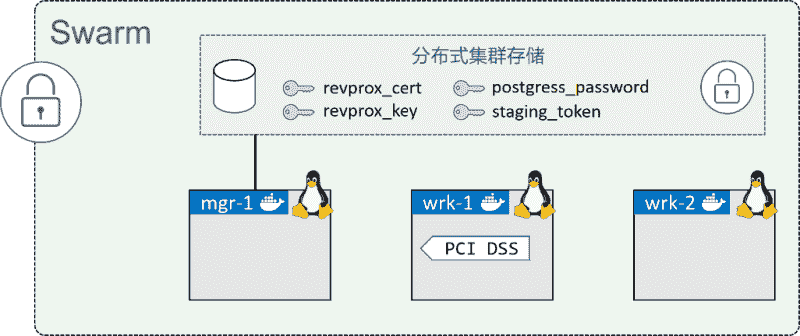

# Docker Swarm 模式下 Docker Stack 部署应用

> 原文：[`c.biancheng.net/view/3213.html`](http://c.biancheng.net/view/3213.html)

在讲解使用 Docker Stack 部署应用之前，有几个前置处理需要完成。

*   Swarm 模式：应用将采用 Docker Stack 部署，而 Stack 依赖 Swarm 模式。
*   标签：某个 Swarm worker 节点需要自定义标签。
*   密钥：应用所需的密钥需要在部署前创建完成。

## 搭建应用实验环境

接下来的讲解中会完成基于 Linux 的三节点 Swarm 集群搭建，同时能满足上面应用的全部前置依赖。完成之后，实验环境如下图所示。

接下来内容分为 3 个步骤。

*   创建新的 Swarm。
*   添加节点标签。
*   创建密钥。

首先创建新的三节点 Swarm 集群。

#### 1) 初始化 Swarm

在任意 Swarm 管理节点的机器上，运行下面的命令。

$ docker swarm init
Swarm initialized: current node (lhma...w4nn) is now a manager.
<Snip>

#### 2) 添加工作节点

复制前面输出中出现的 `docker swarm join` 命令。将复制内容粘贴到工作节点上并运行。

//Worker 1 (wrk-1)
wrk-1$ docker swarm join --token SWMTKN-1-2hl6...-...3lqg 172.31.40.192:2377
This node joined a swarm as a worker.

//Worker 2 (wrk-2)
wrk-2$ docker swarm join --token SWMTKN-1-2hl6...-...3lqg 172.31.40.192:2377
This node joined a swarm as a worker.

#### 3) 确认当前 Swarm 由一个管理节点和两个工作节点构成

在管理节点中运行下面的命令。

$ docker node ls
ID HOSTNAME STATUS AVAILABILITY MANAGER STATUS
lhm...4nn * mgr-1 Ready Active Leader
b74...gz3 wrk-1 Ready Active
o9x...um8 wrk-2 Ready Active

Swarm 集群目前就绪。payment_gateway 服务配置了部署约束，限制该服务只能运行在有 pcidss=yes 标签的工作节点之上。本步骤中将在 wrk-1 上添加该节点标签。

在实际操作中，添加该标签之前必须将某个 Docker 节点按 PCI 规范进行标准化。但是，这只是一个实验环境，所以就暂且跳过这一过程，直接将标签添加到 wrk-1 节点。

在 Swarm 管理节点运行下面的命令。

#### 1) 添加节点标签到 wrk-1

$ docker node update --label-add pcidss=yes wrk-1

Node 标签只在 Swarm 集群之内生效。

#### 2) 确认节点标签

$ docker node inspect wrk-1
[
    {
    "ID": "b74rzajmrimfv7hood6l4lgz3",
    "Version": {
        "Index": 27
    },
    "CreatedAt": "2018-01-25T10:35:18.146831621Z",
    "UpdatedAt": "2018-01-25T10:47:57.189021202Z",
    "Spec": {
        "Labels": {
            "pcidss": "yes"

        },
<Snip>

wrk-1 工作节点现在已经配置完成，所以该节点可以运行 payment_gateway 服务副本了。

应用定义了 4 个密钥，这些都需要在应用部署前创建。

postgress_password。
staging_token。
revprox_cert。
revprox_key。

在管理节点运行下面的命令，来创建这些密钥。

#### 1) 创建新的键值对

密钥中有 3 个是需要加密 key 的。在本步骤中会创建加密 key，下一步会将加密 key 放到 Docker 密钥文件当中。

$ openssl req -newkey rsa:4096 -nodes -sha256 \
-keyout domain.key -x509 -days 365 -out domain.crt

#### 2) 创建 revprox_cert、revprox_key 以及 postgress_password 密钥

$ docker secret create revprox_cert domain.crt
cqblzfpyv5cxb5wbvtrbpvrrj

$ docker secret create revprox_key domain.key
jqd1ramk2x7g0s2e9ynhdyl4p

$ docker secret create postgres_password domain.key
njpdklhjcg8noy64aileyod6l

#### 3) 创建 stage_token 密钥

$ echo staging | docker secret create staging_token -
sqy21qep9w17h04k3600o6qsj

#### 4) 列出所有密钥

$ docker secret ls
ID NAME CREATED UPDATED
njp...d6l postgres_password 47 seconds ago 47 seconds ago
cqb...rrj revprox_cert About a minute ago About a minute ago
jqd...l4p revprox_key About a minute ago About a minute ago
sqy...qsj staging_token 23 seconds ago 23 seconds ago

上面已经完成了全部的前置准备。是时候开始部署应用了！

## 部署示例应用

如果还没有代码，请先复制应用的 GitHub 仓库到 Swarm 管理节点。

$ git clone https://github.com/dockersamples/atsea-sample-shop-app.git
Cloning into 'atsea-sample-shop-app'...
remote: Counting objects: 636, done.
Receiving objects: 100% (636/636), 7.23 MiB | 3.30 MiB/s, done. remote:
Total 636 (delta 0), reused 0 (delta 0), pack-reused 636 Resolving
deltas: 100% (197/197), done.
Checking connectivity... done.

$ cd atsea-sample-shop-app

现在已经拥有了源码，可以开始部署应用了。

Stack 通过 `docker stack deploy` 命令完成部署。基础格式下，该命令允许传入两个参数。

*   Stack 文件的名称。
*   Stack 的名称。

应用的 GitHub 仓库中包含一个名为 docker-stack.yml 的 Stack 文件。这里会使用该文件。这里为 Stack 起名 seastack。

在 Swarm 管理节点的 atsea-sample-shop-app 目录下运行下面的命令。

$ docker stack deploy -c docker-stack.yml seastack
Creating network seastack_default
Creating network seastack_back-tier
Creating network seastack_front-tier
Creating network seastack_payment
Creating service seastack_database
Creating service seastack_appserver
Creating service seastack_visualizer
Creating service seastack_payment_gateway
Creating service seastack_reverse_proxy

可以运行 `docker network ls` 以及 `docker service ls` 命令来查看应用的网络和服务情况。

下面是命令输出中几个需要注意的地方。

网络是先于服务创建的。这是因为服务依赖于网络，所以网络需要在服务启动前创建。

Docker 将 Stack 名称附加到由他创建的任何资源名称前作为前缀。在本例中，Stack 名为 seastack，所以所有资源名称的格式都如：seastack_<resource>。例如，payment 网络的名称是 seastack_payment。而在部署之前创建的资源则没有被重命名，比如密钥。

另一个需要注意的点是出现了新的名为 seastack_default 的网络。该网络并未在 Stack 文件中定义，那为什么会创建呢？每个服务都需要连接到网络，但是 visualizer 服务并没有指定具体的网络。因此，Docker 创建了名为 seastack_default 的网络，并将 visualizer 连接到该网络。

可以通过两个命令来确认当前 Stack 的状态。`docker stack ls` 列出了系统中全部 Stack，包括每个 Stack 下面包含多少服务。`docker stack ps <stack-name>` 针对某个指定 Stack 展示了更详细的信息，例如期望状态以及当前状态。下面一起来了解下这两条命令。

$ docker stack ls
NAME SERVICES
Seastack 5

$ docker stack ps seastack
NAME NODE DESIRED STATE CURRENT STATE
seastack_reverse_proxy.1 wrk-2 Running Running 7 minutes ago
seastack_payment_gateway.1 wrk-1 Running Running 7 minutes ago
seastack_visualizer.1 mgr-1 Running Running 7 minutes ago
seastack_appserver.1 wrk-2 Running Running 7 minutes ago
seastack_database.1 wrk-2 Running Running 7 minutes ago
seastack_appserver.2 wrk-1 Running Running 7 minutes ago

在服务启动失败时，`docker stack ps` 命令是首选的问题定位方式。该命令展示了 Stack 中每个服务的概况，包括服务副本所在节点、当前状态、期望状态以及异常信息。从下面的输出信息中能看出 reverse_proxy 服务在 wrk-2 节点上两次尝试启动副本失败。

$ docker stack ps seastack
NAME NODE DESIRED CURRENT ERROR
STATE STATE
reverse_proxy.1 wrk-2 Shutdown Failed "task: non-zero exit (1)"
\_reverse_proxy.1 wrk-2 Shutdown Failed "task: non-zero exit (1)"

如果想查看具体某个服务的详细信息，可以使用 `docker service logs` 命令。读者需要将服务名称 /ID 或者副本 ID 作为参数传入。如果传入服务名称或 ID，可以看到所有服务副本的日志信息。如果传入的是副本 ID，则只会看到对应副本的日志信息。

下面的 `docker service logs` 命令展示了 `seastack_reverse_proxy` 服务的全部副本日志，其中包含了前面输出中的两次副本启动失败的日志。

#1host not found#1host not found

输出内容为了适应页面展示，已经经过裁剪，但是还是可以看到全部 3 个服务副本的日志（两个启动失败，1 个正在运行）。每行的开始都是副本的名称，包括服务名称、副本序号、副本 ID 以及副本所在主机的名称。接下来是具体的日志输出。

> 提示：大家可能已经注意到前面日志中全部副本的序号都是 1。这是因为 Docker 每次只创建一个副本，并且只有当前面的副本启动失败时才会创建新的。

因为输出内容经过裁剪，所以具体原因很难明确，但看起来前两次副本启动失败原因是其依赖的某个服务仍然在启动中（一种启动时服务间依赖导致的竞争条件）。

可以继续跟踪日志（--follow），查看日志尾部内容（--tail），或者获取额外的详细信息（--details）。