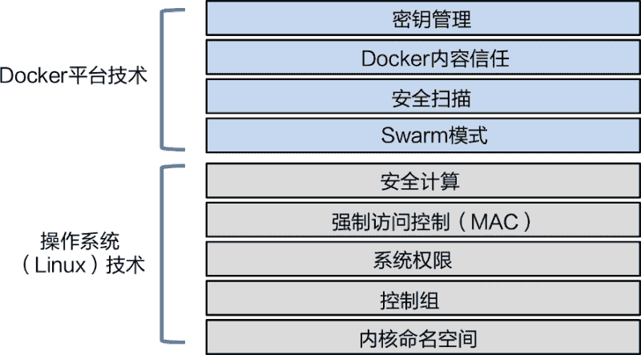

# Docker 安全简介

> 原文：[`c.biancheng.net/view/3218.html`](http://c.biancheng.net/view/3218.html)

好的安全性是基于分层隔离的，而 Docker 恰好有很多分层。Docker 支持所有主流 Linux 安全机制，同时 Docker 自身还提供了很多简单的并且易于配置的安全技术。

接下来主要介绍一些 Docker 中保障容器安全运行的一些技术。

安全本质就是分层！通俗地讲，拥有更多的安全层，就能拥有更多的安全性。而 Docker 提供了很多安全层。下图展示了一部分安全技术。

Linux Docker 利用了大部分 Linux 通用的安全技术。这些技术包括了命名空间（Namespace）、控制组（CGroup）、系统权限（Capability），强制访问控制（MAC）系统以及安全计算（Seccomp）。

对于上述每种技术，Docker 都设置合理的默认值，实现了流畅的并且适度安全的开箱即用体验。同时，Docker 也允许用户根据特定需求自定义调整每项安全配置。

Docker 平台本身也提供了一些非常棒的原生安全技术。并且重要的是，这些技术使用起来都很简单！

#### 1) Docker Swarm 模式

默认是开启安全功能的。无须任何配置，就可以获得加密节点 ID、双向认证、自动化 CA 配置、自动证书更新、加密集群存储、加密网络等安全功能。

#### 2) Docker 内容信任（Docker Content Trust, DCT）

允许用户对镜像签名，并且对拉取的镜像的完整度和发布者进行验证。

#### 3) Docker 安全扫描（Docker Security Scanning）

分析 Docker 镜像，检查已知缺陷，并提供对应的详细报告。

#### 4) Docker 密钥

使安全成为 Docker 生态系统中重要的一环。Docker 密钥存储在加密集群存储中，在容器传输过程中实时解密，使用时保存在内存文件系统，并运行了一个最小权限模型。

重要的是，要知道 Docker 在使用主流 Linux 安全技术的同时，还提供了额外的扩展以及一些新的安全技术。Linux 安全技术看起来可能略为复杂，但是 Docker 平台的安全技术却非常简单。

大家都知道安全是非常重要的。同时，安全又很复杂并且枯燥无味。

在最初决定向平台中添加安全功能时，就选择了简单易用的方式。Docker 知道如果安全相关配置特别复杂，那么就没有人会去使用。所以，Docker 平台提供的绝大部分安全功能使用起来都很简单。

并且大部分的安全设置都配有默认值，意味着用户无须任何配置，就能得到一个相当安全的平台。当然，默认配置不一定是最合适的，但至少在最开始能够保障一定的安全性。如果默认配置与用户需求不符，那么用户也可以进行自定义配置。