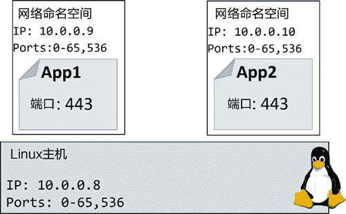
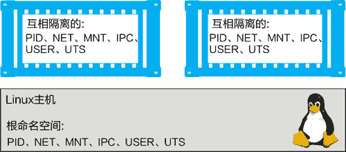
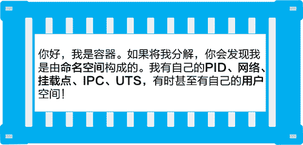
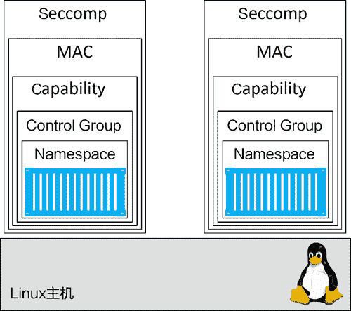

# Docker Linux 安全技术简介

> 原文：[`c.biancheng.net/view/3221.html`](http://c.biancheng.net/view/3221.html)

每个优秀的容器平台都应该使用命名空间和控制组技术来构建容器。最佳的容器平台还会集成其他容器安全技术，例如系统权限、强制访问控制系统（如 SELinux 和 AppArmor）以及安全计算。正如用户所期望的，Docker 中集成了上述全部安全技术！

下面主要对 Docker 中用到的主要 Linux 技术进行简要介绍。

## Namespace

内核命名空间属于容器中非常核心的一部分！ 该技术能够将操作系统（OS）进行拆分，使一个操作系统看起来像多个互相独立的操作系统一样。

这种技术可以用来做一些非常酷的事情，比如在相同的 OS 上运行多个 Web 服务，同时还不存在端口冲突的问题。该技术还允许多个应用运行在相同 OS 上并且不存在竞争，同时还能共享配置文件以及类库。

举两个简单的例子。

用户可以在相同的 OS 上运行多个 Web 服务，每个端口都是 443。为了实现该目的，可以将两个 Web 服务应用分别运行在自己的网络命名空间中。这样可以生效的原因是每个网络命名空间都拥有自己的 IP 地址以及对应的全部端口。

也可能需要将每个 IP 映射到 Docker 主机的不同端口之上，但是使用 IP 上的哪个端口则无须其他额外配置。

用户还可以运行多个应用，应用间共享类库和配置文件，但是版本可能不同。为了实现该目标，需要在自己的挂载命名空间中运用每个应用程序。这样做能生效的原因，是每个挂载命名空间内都有系统上任意目录的独立副本。

下图展示了一个抽象的例子，两个应用运行在相同的主机上，并且同时使用 443 端口。每个 Web 服务应用都运行在自己的网络命名空间之内。

Linux Docker 现在利用了下列内核命名空间。

*   进程 ID（PID）。
*   网络（NET）。
*   文件系统/挂载（MNT）。
*   进程内通信（IPC）。
*   用户（USER）。
*   UTS。

下面会简要介绍每种技术都做了些什么。但重要的是要理解，Docker 容器是由各种命名空间组合而成的。再次强调一遍，Docker 容器本质就是命名空间的有组织集合。

例如，每个容器都由自己的 PID、NET、MNT、IPC、UTS 构成，还可能包括 USER 命名空间。这些命名空间有机的组合就是所谓的容器。下图展示了两个运行在相同 Linux 主机上的容器。

接下来简要介绍一下 Docker 是如何使用每个命名空间的。

#### 1) 进程 ID 命名空间

Docker 使用 PID 命名空间为每个容器提供互相独立的容器树。每个容器都拥有自己的进程树，意味着每个容器都有自己的 PID 为 1 的进程。PID 命名空间也意味着容器不能看到其他容器的进程树，或者其所在主机的进程树。

#### 2) 网络命名空间

Docker 使用 NET 命名空间为每个容器提供互相隔离的网络栈。网络栈中包括接口、ID 地址、端口地址以及路由表。例如，每个容器都有自己的 eth0 网络接口，并且有自己独立的 IP 和端口地址。

#### 3) 挂载点命名空间

每个容器都有互相隔离的根目录 /。这意味着每个容器都有自己的 /etc、/var、/dev 等目录。容器内的进程不能访问 Linux 主机上的目录，或者其他容器的目录，只能访问自己容器的独立挂载命名空间。

#### 4) 进程内通信命名空间

Docker 使用 IPC 命名空间在容器内提供共享内存。IPC 提供的共享内存在不同容器间也是互相独立的。

#### 5) 用户命名空间

Docker 允许用户使用 USER 命名空间将容器内用户映射到 Linux 主机不同的用户上。常见的例子就是将容器内的 root 用户映射到 Linux 主机的非 root 用户上。用户命名空间对于 Docker 来说还属于新生事物且非必选项。该部分内容在未来可能出现改变。

#### 6) UTS 命名空间

Docker 使用 UTS 命名空间为每个容器提供自己的主机名称。

如下图所示，容器本质就是命名空间的有机组合！

## Control Group

如果说命名空间用于隔离，那么控制组就是用于限额。

假设容器就是酒店中的房间。每个容器间都是互相独立的，但是每个房间都共享一部分公共资源，比如供应水电、共享游泳池、共享健身、共享早餐餐吧等。

CGroup 允许用户设置一些限制（以酒店作为类比）来保证不会存在单一容器占用全部的公共资源，如用光全部水或者吃光早餐餐吧的全部食物。

抛开酒店的例子，在 Docker 的世界中，容器之间是互相隔离的，但却共享 OS 资源，比如 CPU、RAM 以及硬盘 I/O。CGroup 允许用户设置限制，这样单个容器就不能占用主机全部的 CPU、RAM 或者存储 I/O 资源了。

## Capability

以 root 身份运行容器不是什么好主意，root 拥有全部的权限，因此很危险。但是，如果以非 root 身份在后台运行容器的话，非 root 用户缺少权限，处处受限。所以用户需要一种技术，能选择容器运行所需的 root 用户权限。了解一下 Capability！

在底层，Linux root 用户是由许多能力组成的。其中一部分包括以下几点。

*   CAP_CHOWN：允许用户修改文件所有权。
*   CAP_NET_BIND_SERVICE：允许用户将 socket 绑定到系统端口号。
*   CAP_SETUID：允许用户提升进程优先级。
*   CAP_SYS_BOOT：允许用户重启系统。

Docker 采用 Capability 机制来实现用户在以 root 身份运行容器的同时，还能移除非必须的 root 能力。如果容器运行只需要 root 的绑定系统网络端口号的能力，则用户可以在启动容器的同时移除全部 root 能力，然后再将 CAP_NET_BIND_SERVICE 能力添加回来。

## MAC

Docker 采用主流 Linux MAC 技术，例如 AppArmor 以及 SELinux。

基于用户的 Linux 发行版本，Docker 对新容器增加了默认的 AppArmor 配置文件。根据 Docker 文档的描述，默认配置文件提供了“适度的保护，同时还能兼容大部分应用”。

Docker 允许用户在启动容器的时候不设置相应策略，还允许用户根据需求自己配置合适的策略。

## Seccomp

Docker 使用过滤模式下的 Seccomp 来限制容器对宿主机内核发起的系统调用。

按照 Docker 的安全理念，每个新容器都会设置默认的 Seccomp 配置，文件中设置了合理的默认值。这样做是为了在不影响应用兼容性的前提下，提供适度的安全保障。

用户同样可以自定义 Seccomp 配置，同时也可以通过向 Docker 传递指定参数，使 Docker 启动时不设置任何 Seccomp 配置。

## Linux 安全技术总结

Docker 基本支持所有的 Linux 重要安全技术，同时对其进行封装并赋予合理的默认值，这在保证了安全的同时也避免了过多的限制，如下图所示。

自定义设置某些安全技术会非常复杂，因为这需要用户深入理解安全技术的运作原理，同时还要了解 Linux 内核的工作机制。希望这些技术在未来能够简化配置的过程，但就现阶段而言，使用 Docker 在对安全技术的封装中提供的默认值是很不错的选择。