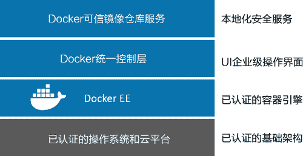
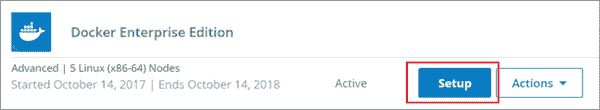
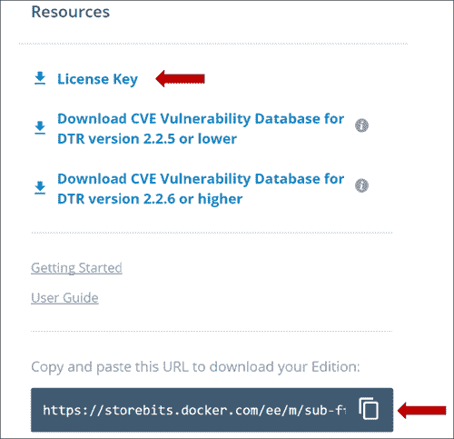

# Docker EE 企业版安装教程

> 原文：[`c.biancheng.net/view/3228.html`](http://c.biancheng.net/view/3228.html)

Docker 和容器就像风暴一样席卷了整个应用开发世界——构建、打包以及运行应用从未变得如此简单。所以各大企业纷纷介入也没有什么好奇怪的。但与追求最前沿技术的开发者相比，企业有着更严格的需求。

企业需要 Docker 能实现私有化部署。这通常意味着 Docker 需要一个本地化部署方案，并且由企业自己掌控和维护。这还意味着角色和安全功能需要满足企业内部的组织结构，并且在安全部门的监管之下。同时还需要一份重要的售后支持协议。

Docker 企业版（Enterprise Edition，EE）应运而生！

Docker EE 是企业版的 Docker。其内部包括了上百个引擎、操作界面以及私有安全注册。用户可以本地化部署，并且其中包括了一份支持协议。

上层架构如下图所示。

## Docker EE 引擎

Docker 引擎提供 Docker 全部核心功能。核心功能包括镜像、容器管理、网络、卷、集群、安全等。目前包括两个版本：社区版（CE）和企业版（EE）。

两个版本最大的不同，也是用户最关心的，就是发布周期和相应支持了。

Docker EE 是按季度发布，采用基于时间版本的方案。例如，2018 年 6 月发布的 Docker EE 叫作 18.06.x-ee。Docker 公司提供持续一年的支持，并且为每个版本打补丁。

## 安装 Docker EE

安装 Docker EE 很简单。但是，不同平台的安装方式略有不同。这里介绍在 Ubuntu 16.04 的安装过程，但其他平台的安装也非常简单。

Docker EE 是基于订阅模式的服务，所以用户需要一个 Docker ID 并且激活订阅。然后就可以获得专享 Docker EE 仓库，在接下来的步骤中会用到。试用许可证通常也是可行的。

提示：在 Windows 服务器上的 Docker 通常都安装 Docker EE。可以参考《Windows Server 安装 Docker》一节。

下面的命令可能需要 sudo 前缀。

1) 检查是否拥有最新包列表

$ apt-get update

2) 安装过程需要通过 HTTPS 访问 Docker EE。

$ apt-get install -y \
apt-transport-https \
curl \
software-properties-common

3) 登录 Docker 存储，复制 Docker EE 仓库 URL。

使用浏览器访问 Docker Store。单击右上方的用户名并选择 My Content。选择某个已经订阅的 Docker EE，单击 Setup，如下图所示。

复制 Resources 面板下面的仓库 URL。下载许可证，如下图所示。

4) 在环境变量中设置专享的 Docker EE 仓库 URL。

$ DOCKER_EE_REPO=<paste-in-your-unique-ee-url>

5) 将官方 Docker GPG 密钥加入全部密钥环（keyring）。

$ curl -fsSL "${DOCKER_EE_REPO}/ubuntu/gpg" | sudo apt-key add -

6) 设置最新的稳定版仓库。可能要用最新的稳定版本替换最后一行的值。

$ add-apt-repository \
"deb [arch=amd64] $DOCKER_EE_REPO/ubuntu \
$(lsb_release -cs) \
stable-17.06"

7) 运行 apt-get update，从刚设置的 Docker EE 仓库中拉取最新包列表。

$ apt-get update

8) 卸载之前的 Docker。

$ apt-get remove docker docker-engine docker-ce docker.io

9) 安装 Docker EE。

$ apt-get install docker-ee -y

10) 检查安装是否成功。

$ docker --version
Docker version 17.06.2-ee-6, build e75fdb8

至此安装完成，这时就可以启动 Docker EE 引擎了。