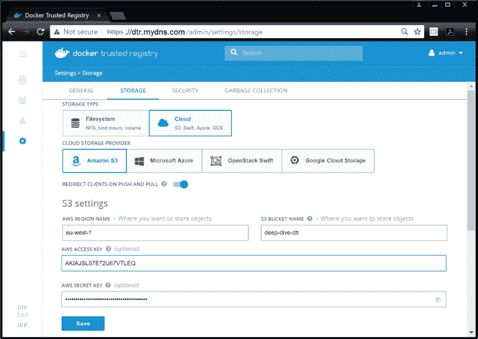

# Docker 镜像仓库本地化部署教程（DTR）

> 原文：[`c.biancheng.net/view/3253.html`](http://c.biancheng.net/view/3253.html)

Docker 可信镜像仓库服务，是安全、高可用并且支持本地部署的 Docker 服务，通常使用 DTR 代指。如果知道 Docker Hub 是什么，可以将 DTR 理解为私有的 Docker Hub，可以在本地部署，并且自行管理。

在安装前有几点需要说明。

如果条件允许，使用专用节点来运行 DTR。在 DTR 生产环境节点中绝对不要运行用户工作负载。

在 UCP 中，需要运行奇数个 DTR 实例。3 个或者 5 个实例有较好的容错性。生产环境下的推荐配置如下。

*   3 个专用 UCP 管理节点。
*   3 个专用 DTR 实例。
*   按应用需求增加工作节点。
*   接下来会在单个节点上完成 DTR 的安装和配置。

## 安装 DTR

在 UCP 集群中配置首个 DTR 实例包括下面几个步骤。

为了完成下面步骤，需要一个用于安装 DTR 的 UCP 节点和一个监听 443 端口的负载均衡，并处于 TCP 透传模式，同时在 443 端口开启了 /health 健康检查。下图展示了完整架构图。

1) 登录 UCP Web 界面，单击 Admin > Admin Settings > Docker Trusted Registry。

2) 填写 DTR 配置表，如下所示。

*   DTR 外部 URL（DTR EXTERNAL URL）：设置外部负载均衡器的 URL。
*   UCP 节点（UCP NODE）：选择希望安装 DTR 的节点名称。
*   禁用 UCP 的 TLS 认证（Disable TLS Verification For UCP）：如果使用自签名证书，勾选该复选框。

3) 复制表格底部的长命令。

4) 将命令粘贴到 UCP 管理节点。

命令中包含 --ucp-node，告诉 UCP 需要执行该命令的具体节点。

下面示例中的 DTR 安装命令与上图中的配置相符。示例中假设当前已经在 dtr.mydns.com 配置了负载均衡器。

$ docker run -it --rm docker/dtr install \
--dtr-external-url dtr.mydns.com \
--ucp-node dtr1 \
--ucp-url https://34.252.195.122 \
--ucp-username admin --ucp-insecure-tls

5) 一旦安装完成，就可以通过浏览器访问负载均衡器。访问后会自动登录 DTR，如下图所示。DTR 已经应用，但尚未为其配置 HA。

## 为 DTR 配置高可用

配置多副本的高可用 DTR 依赖共享存储。共享存储可以是 NFS 或者对象存储，可以本地部署或者在公有云上部署。下面的步骤中会采用 Amazon S3 Bucket 作为共享存储来完成高可用 DTR 配置。

1) 登录 DTR 控制台，进入 Settings。

2) 选择存储（Storage）标签页，并配置共享存储。

下图展示了如何将位于 eu-west-1 可用域中名为 deep-dive-dtr 的 AWS S3 bucket 存储配置为 DTR 的共享存储。小伙伴在本地不能使用该存储。

DTR 现在配置了共享存储，可以开始增加额外的副本了。

1) 在 UCP 集群管理节点运行下面命令。

$ docker run -it --rm \
docker/dtr:2.4.1 join \
--ucp-node dtr2 \
--existing-replica-id 47f20fb864cf \
--ucp-insecure-tls

--ucp-node 参数指定了命令创建新 DTR 副本所在的节点。如果使用自签名证书，必须指定 --insecure-tls 参数。

我们需要替换示例中的镜像版本和副本 ID。副本 ID 在初始化安装副本的输出内容中可以找到。

2) 按提示输入 UCP URL、端口以及管理员证书。

添加成功后，会看到如下信息。

INFO[0166] Join is complete
INFO[0166] Replica ID is set to: a6a628053157
INFO[0166] There are currently 2 replicas in your DTR cluster
INFO[0166] You have an even number of replicas which can impact availability
INFO[0166] It is recommended that you have 3, 5 or 7 replicas in your cluster

一定要遵循前面的建议来安装副本，保证数量为奇数。这时需要更新负载均衡的配置信息，这样流量可以发送到新的副本之上。

DTR 现在已经配置了 HA，这意味着现在某个副本宕机不会影响服务可用性。下图展示了高可用 DTR 配置。

需要注意，当前负载均衡器会向全部 3 个 DTR 副本发送流量，也会对全部 3 个节点执行健康检查。全部 3 个 DTR 副本共享同一个外部存储。

在上图中，负载均衡器和共享存储都是第三方产品，按照单点部署进行展示（非高可用）。为了保证整体环境的高可用，建议确认这些产品都支持高可用，并且对其内容和配置信息进行备份（例如保证负载均衡器和存储系统原生支持高可用，并且配置了备份策略）。

## 备份 DTR

因为使用了 UCP 的缘故，DTR 自带 backup 命令，属于安装 DTR 所用镜像的一部分。该备份命令会将分散于多个卷的 DTR 配置信息进行备份，包括以下几种。

*   DTR 配置。
*   仓库原生信息。
*   公证信息。
*   证书。

DTR 自带备份并不支持对镜像的备份功能。通常镜像保存在高可用的存储后端，依赖非 Docker 工具执行自己独立的备份计划。

在 UCP 管理节点执行下面命令对 DTR 进行备份。

$ read -sp 'ucp password: ' UCP_PASSWORD; \
docker run --log-driver none -i --rm \
--env UCP_PASSWORD=$UCP_PASSWORD \
docker/dtr:2.4.1 backup \
--ucp-insecure-tls \
--ucp-username admin \
> ucp.bkp

read 命令会提示用户输入 UCP 管理账户的密码，并保存到 UCP_PASSWORD 变量当中；第二行告诉 Docker 启动新的临时容器来执行备份操作；第三行将 UCP 密码设置为容器的环境变量；第四行执行了备份命令；第五行使用自签名证书保证命令可执行；第六行设置 UCP 用户名为“admin”；最后一行指定备份文件为当前目录下的 ucp.bkp。

按照提示输入 UCP URL 和副本 ID。该信息也可以在备份命令中指定。备份结束后，会在当前工作目录下新增一个名为 ucp.bkp 的文件。该文件应当按照公司的备份策略，由公司备份工具进行统一管理。

## 从备份恢复 DTR

从备份恢复 DTR 是下策，只有副本都宕机，并且没有其他方式恢复时才可以尝试。在只是单副本宕机，其他副本仍然可用的情况下，应当使用 dtr join 命令增加新的副本。

如果确定需要从副本恢复，步骤如下。

1) 停止并删除 DTR 节点（可能已经停止）。

2) 恢复共享存储中的镜像（可能不需该步骤）。

3) 恢复 DTR。

在准备恢复 DTR 的节点上执行下面的命令。当然该节点必须是要恢复的 DTR 所在 UCP 集群中的一员。在恢复时需要使用与创建备份相同版本的 docker/dtr 镜像。

1) 停止并删除 DTR。

$ docker run -it --rm \
docker/dtr:2.4.1 destroy \
--ucp-insecure-tls

INFO[0000] Beginning Docker Trusted Registry replica destroy
ucp-url (The UCP URL including domain and port): https://34.252.195.122:443
ucp-username (The UCP administrator username): admin
ucp-password:
INFO[0020] Validating UCP cert
INFO[0020] Connecting to UCP
INFO[0021] Searching containers in UCP for DTR replicas
INFO[0023] This cluster contains the replicas: 47f20fb864cf a6a628053157
Choose a replica to destroy [47f20fb864cf]:
INFO[0030] Force removing replica
INFO[0030] Stopping containers
INFO[0035] Removing containers
INFO[0045] Removing volumes
INFO[0047] Replica removed.

按提示输入 UCP URL、管理证书以及要删除的副本 ID。如果有多副本，可以多次运行该命令来删除。

2) 如果镜像在共享存储中丢失，需要首先恢复镜像。

3) 使用下面的命令恢复 DTR。

需要将第 5 行与第 6 行中的内容替换为本地环境的值。因为 restore 命令不支持交互式，所以当 restore 命令开始执行后，没有提示输入前面的内容。

$ read -sp 'ucp password: ' UCP_PASSWORD; \
docker run -i --rm \
--env UCP_PASSWORD=$UCP_PASSWORD \
docker/dtr:2.4.1 restore \
--ucp-url <ENTER_YOUR_ucp-url> \
--ucp-node <ENTER_DTR_NODE_hostname> \
--ucp-insecure-tls \
--ucp-username admin \
< ucp.bkp

DTR 现在已经恢复。UCP 管理节点、工作节点以及 DTR 节点需要通过网络互相通信。下图总结了端口需求。