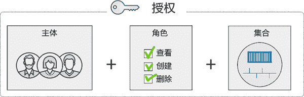
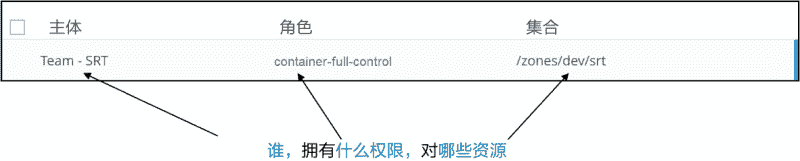
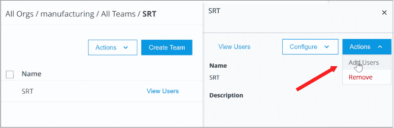
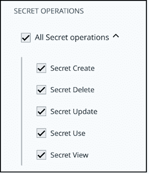
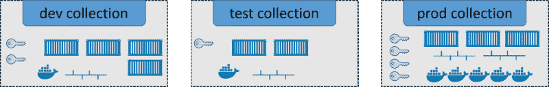
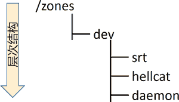
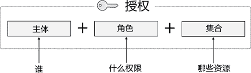
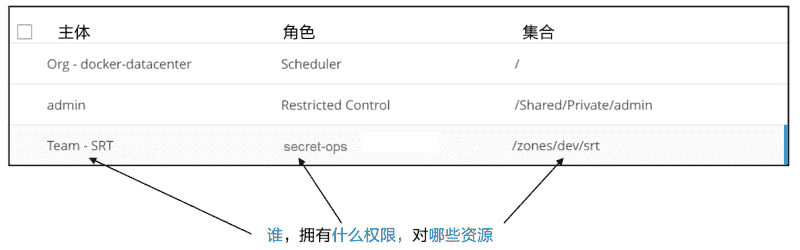
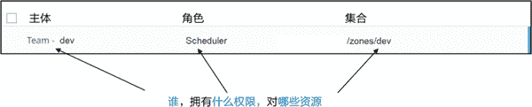

# Docker 角色权限控制（RBAC）详解

> 原文：[`c.biancheng.net/view/3256.html`](http://c.biancheng.net/view/3256.html)

我在最近 10 年职业生涯中的大部分时光从事的是财务服务部门的 IT 运营。在我工作的大多数环境中，基于角色的权限控制（RBAC）和对活动目录（AD）的集成都是必须的。因此，如果想销售不包含这两个特性的产品，用户通常是不买账的。不过，Docker EE 具备这两个特性。下面我们主要讨论一下 RBAC。

UCP 通过一种称为授权（Grant）的东西实现了 RBAC。大体上，一个授权有以下 3 个概念构成。

*   主体（Subject）。
*   角色（Role）。
*   集合（Collection）。

主体即一个或多个用户，或一个团队。角色是一系列权限的组合，而集合则是权限作用的资源，如下图所示。

如下图所示，SRT 团队具有对 /zones/dev/srt 集合中所有资源的 container-full-control 权限。

创建一个授权包含如下步骤。

*   创建用户和团队。
*   创建一个自定义的角色。
*   创建一个集合。
*   创建一个授权。

只有 UCP 管理员才可以创建和管理用户、团队、角色、集合和授权。因此读者需要以 UCP 管理员的身份登录才能进行下面的操作。

## 创建用户和团队

将用户置于团队中进行组管理，然后为团队分配授权是一种最佳实践。当然也可以为单独的用户分配授权，但并不推荐。下面创建一些用户和团队。

1) 登录到 UCP。

2) 展开 User Management（用户管理），然后单击 Users（用户）。这里可以创建用户。

3) 单击 Organization & Teams（组织&团队）。这里可以创建组织。在本例后续的步骤中，将会使用一个称为“manufacturing”的组织。

4) 单击 manufacturing 组织，并创建一个团队。团队存在于组织中，不能在组织之外创建一个团队，并且一个团队只能存在于一个组织中。

5) 向团队中添加用户。添加用户时，单击进入团队，然后选择 Actions（操作）菜单中的 Add Users（添加用户）。下图显示了如何向 manufacturing 组织中的 SRT 团队添加用户。

现在已经有用户和团队了。UCP 会向 DTR 共享其用户数据库，因此在 UCP 中创建的用户和团队在 DTR 中也是可见的。

## 创建一个自定义的角色

自定义的角色是很强大的，它提供了非常细粒度的权限分配机制。下面将创建一个名为 secret-opt 的新的自定义角色，该角色允许被分配的主体创建、删除、更新、使用和查看 Docker 密钥。

1) 展开左侧导航栏中的 User Management 页签，然后选择 Roles（角色）。

2) 创建一个新角色。

3) 给角色命名。本例会创建一个名为“secret-opts”的自定义角色，并放开所有与密钥相关的操作权限。

4) 选择 SECRET OPERATIONS（密钥选项）并浏览可分配给角色的操作项列表。列表较长，可以用来指定具体的某个操作项。

5) 选择希望分配给角色的 API 操作。本例中，分配所有与密钥相关的 API 操作，下图所示。

6) 单击 Create（创建）。

这个角色已经在系统中创建好，并可以被分配给多个授权。下面创建一个集合。

## 创建一个集合

通过前面的学习已经了解了网络、卷、密钥、服务以及节点都是 Swarm 资源—— 它们保存在 Swarm 配置文件 /var/lib/docker/swarm。使用集合可以根据组织架构和 IT 需要来对资源进行分组。例如，IT 基础架构可能会分为 3 个域（zone）：prod、test 和 dev。这种情况下，就可以创建 3 个集合，然后分别分配资源，如下图所示。

每一个资源只可以存在于某一个集合中。

下面，创建一个新的名为 zones/dev/srt 的资源，然后给它分配一个密钥。集合是支持层次结构的，因此本例中应依次创建 3 个嵌套的集合：zones > dev > srt。

在 Docker UCP Web 界面中进行如下操作。

1) 在左侧导航栏中选择 Collections（集合），然后选择 Create Collection（创建集合）。

2) 创建名为 zones 的根集合。

3) 单击 /zones 集合的 View Children（查看子集合）。

4) 创建一个名为 dev 的内嵌子集合。

5) 单击 /zones/dev 集合的 View Children（查看子集合）。

6) 创建名为 srt 的子集合。

到此为止，/zones/dev/srt 集合就创建好了。然而，它还是空的。下面将为其添加一个密钥。

1) 创建一个新的密钥。可以用命令行或 UCP Web 界面创建它。这里介绍 Web 界面的方式。在 UCP Web 界面单击 Secrets > Create Secret（创建密钥）。填写名称等信息，然后单击 Save。在创建密钥的同时也可以为其配置集合，但是这里并不这样操作。

2) 在 UCP Web 界面中选择该密钥。

3) 在 Configure（配置）下拉菜单中单击 Collection。

4) 依次进入 View Children 层次结构并最终选择 /zones/dev/srt，然后单击 Save。

现在该密钥已属于 /zones/dev/srt 集合，并且无法再加入其他集合。

在创建授权之前，关于集合还有一点需要注意。集合采用的是层次结构，适用于某集合的权限同样适用于其子集合。如下图所示，dev 团队具有对 /zones/dev 集合的权限，因此，该团队自动具有 srt、hellcat 和 daemon 子集合的权限。

## 创建一个授权

现在有用户、团队、自定义角色和集合，可以创建授权了。本例会为 srt-dev 团队创建一个授权，该授权对 /zones/dev/srt 集合中的所有资源拥有自定义角色 secret-ops 的权限。

授权即配置谁，对哪些资源，拥有什么权限，如下图所示。

1) 在左侧导航栏展开 User Management 页签，然后单击 Grant（授权）。

2) 创建一个新的授权。

3) 单击 Subject（主体），然后选择 manufacturing 组织下的 SRT 团队。也可以选择整个组织。这样的话，组织中的所有团队都会被包含在该授权中。

4) 单击 Role，然后选择自定义的 secret-ops 角色。

5) 单击 Collections，然后选择 /zones/dev/srt 集合。此时可能需要在顶级 Swarm 集合下查找子集合 /zones。

6) 单击 Save 来创建授权。

现在授权已经创建好了，在系统的所有授权的列表中可以找到它，如下图所示。manufacturing/SRT 团队中的所有用户都有权对 /zones/dev/srt 集合中的资源进行与密钥相关的操作。

授权生效后仍然可以进行修改。例如，可以添加用户到团队或添加资源到集合。但是无法修改分配给角色的 API 操作。当想要修改角色中的权限时，需要创建一个新的配置有所需权限的角色。

## 节点 RBAC

这是最后一点关于 RBAC 的介绍。为了调度将集群中的工作节点进行分组是可行的。例如，有时会为开发、测试和 QA 负载运行一个集群——用一个集群可能会减少管理开销，并且可以轻松地将节点分配给 3 个不同的环境。但此时仍然希望能够对工作节点进行区分，从而实现诸如仅 dev 团队的用户才可以对 dev 集合中的节点进行调度的效果。

这同样可以基于授权来实现。首先，需要将 UCP 工作节点分配给自定义的集合。然后，基于该集合、内置的 Scheduler 角色以及希望为其分配权限的团队，来创建授权。

下图中所示的简单示例表示允许 dev 团队中的成员将服务和容器调度到 /zones/dev 集合中的工作节点。

