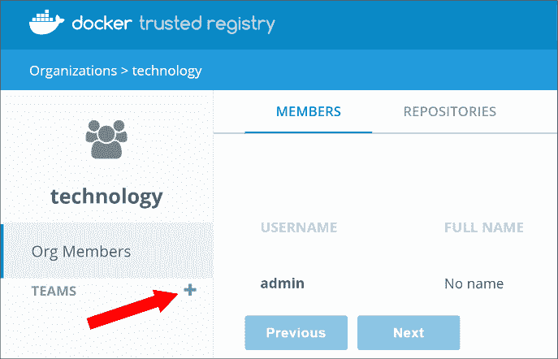
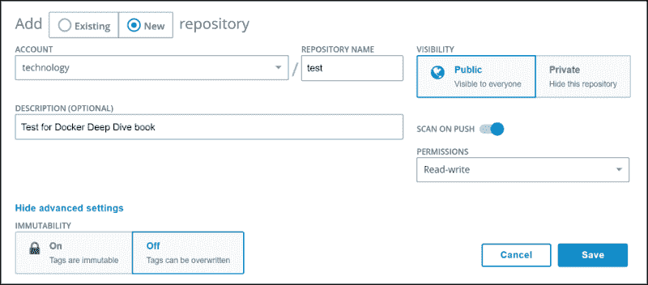
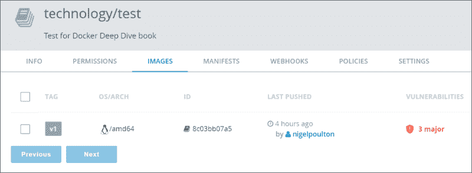

# Docker 镜像仓库配置及使用（DTR）

> 原文：[`c.biancheng.net/view/3263.html`](http://c.biancheng.net/view/3263.html)

在《Docker 镜像仓库》一节中介绍了如何安装 DTR、如何将其接入后端共享存储、如何配置高可用以及如何使 DCP 和 DTR 共享一个公共的单点登录子系统。

## 配置 Docker 可信镜像仓库服务

大多数的 DTR 配置项可在 DTR Web 界面的 Settings（设置）页中进行设置。在 General（通用）页签中可以配置以下内容。

*   自动更新设置。
*   许可。
*   负载均衡地址。
*   证书。
*   单点登录。

使用 Domains & proxies（域&代理）下的 TLS Settings（TLS 设置）可以修改 UCP 使用的证书。默认情况下，DTR 使用自签名证书，但是用户可以在该页面配置自定义的证书。

Storage（存储）页签用来配置镜像存储所使用的后端存储。其他存储相关的选项包括其他云服务提供商的对象存储服务，以及卷和共享 NFS 的配置。

Security（安全）页签用于开启或关闭镜像扫描（Image Scanning），采用二进制级别的扫描来查找镜像中的缺陷。在开启镜像扫描的情况下，用户可以选择基于在线（online）或离线（offline）方式来更新缺陷库。在线方式会自动通过互联网同步数据库，而离线方式则用于无法接入互联网的 DTR 实例，通过手动更新数据库来完成。

同样重要的一点是 Garbage Collection（垃圾回收）页签，当镜像库中的镜像层不再被引用时，DTR 会对这些镜像层进行垃圾回收，该页签用于进行与之相关的配置。默认情况下，不被引用的镜像层不会被回收，从而会导致磁盘空间的浪费。

如果启用垃圾回收，不被任何镜像引用的镜像层便会被删除，而被至少一个镜像引用的镜像层不会被删除。

## 使用 Docker 可信镜像仓库服务

Docker 可信镜像服务是一种安全的、自行配置和管理的私有镜像库。它被集成在 UCP 以达到良好的开箱即用的使用体验。

接下来将会介绍如何从 DTR 推送和拉取镜像，以及如何使用 DTR Web 界面来查看和管理镜像库。

#### 1) 登录到 DTR 界面并创建镜像库及权限

下面登录到 DTR，并创建一个新的镜像库，该库对所有的 technology/devs 团队的成员开放推送和拉取镜像的权限。

登录到 DTR。DTR 的 URL 可以在 UCP Web 界面的 Admin > Admin Settings > Docker Trusted Registry 下找到。注意，DTR Web 界面可以通过端口 443 的 HTTPS 访问。

创建一个新的组织和团队，然后添加一个用户。本例将创建一个名为 technology 的组织、一个名为 devs 的团队和一个名为 nigelpoulton 的用户。

① 单击左侧导航栏的 Organizations（组织）。

② 单击 New Organization（新建组织）并命名为 technology。

③ 选择新创建的 technology 组织，并单击 TEAMS（组织）旁的 + 按钮，如下图所示。

④ 在选择 devs 团队的情况下，添加一个用户。

本例会添加名为 nigelpoulton 的用户，小伙伴环境中的用户名会有不同。DTR 中对组织和团队的修改也会反映在 UCP 中，因为它们共享账号数据库。

接下来创建一个新的镜像库，并添加 technology/devs 团队的读/写权限。

在 DTR Web 界面中进行如下操作。

*   进入 Organizations > technology > devs。
*   选择 Repositories（库）页签，并创建一个新的镜像库。
*   对镜像库进行如下配置。

在 technology 组织下创建的新镜像库命名为 test。将其配置为公开（Public），开启推送时扫描（SCAN ON PUSH），并分配读 / 写（Read-write）权限。具体配置如下图所示。

⑤ 保存修改。

至此，在 DTR 上已经有一个名为 <dtr-url>/technology 的镜像库了，technology/devs 团队对其有读/写权限，因此他们可以对其进行 push 和 pull 操作。

#### 2) 推送镜像到 DTR 库

在演示如何推送一个新镜像到刚刚创建的镜像库。具体通过以下几个步骤来完成。

① 拉取一个镜像并从新打标签。

② 为客户端配置一组证书。

③ 推送打了新标签的镜像到 DTR 库。

④ 在 DTR Web 界面中检查操作过程。

首先拉取一个镜像，并为其打标签，以便能够推送到 DTR 仓库。拉取什么镜像并不重要。本例使用的是 alpine:latest 镜像，因为它很小。

为了推送一个镜像到一个具体的仓库，需要将镜像用库的名称打标签。本例中，DTR 库的全限定名为 dtr.mydns.com/technology/test。这个名字是由 DTR 的 DNS 域名与镜像库的名称组合得到的。

为该镜像打标签，以便能够推送到 DTR 库。

$ docker image tag alpine:latest dtr.mydns.com/technology/test:v1

下一步就是要配置 Docker 客户端，使其用对该库有读 / 写权限的组内的用户来认证。总体来说就是为该用户创建一组证书，并配置 Docker 客户端使用这些证书。

① 以管理员身份登录 UCP，或使用有读/写权限的用户登录。

② 导航到目标用户账号，然后创建一个 client bundle。

③ 复制 Bundle 文件到需要进行配置的 Docker 客户端。

④ 登录到 Docker 客户端，并执行以下命令。

⑤ 解压 Bundle，并执行 Shell 脚本来进行配置。

以下命令可用于 Mac 和 Linux。

$ eval "$(<env.sh)"

⑥ 执行 docker version 命令以确定环境配置和证书配置是否正确。

如果输出内容的 Server 部分显示 Version 为 ucp/x.x.x，则表示已经正确配置。这是因为 Shell 脚本对 Docker 客户端进行了配置，使其连接到 UCP Manager 上的一个远端 daemon。并且还会令 Docker 客户端使用证书对所有的命令进行签名。

接下来登录到 DTR。小伙伴的 DTR URL 和用户名会有差异。

$ docker login dtr.mydns.com
Username: nigelpoulton
Password:
Login Succeeded

现在可以推送打标签的镜像到 DTR 了。

$ docker image push dtr.mydns.com/technology/test:v1
The push refers to a repository [dtr.mydns.com/technology/test]
cd7100a72410: Pushed
v1: digest: sha256:8c03...acbc size: 528

可见推送操作是成功的，下面在 DTR 的 Web 界面中进行确认。

① 先登录到 DTR 的 Web 界面。

② 单击左侧导航栏中的 Repositories。

③ 单击 technology/test 库的 View Details（查看细节）。

④ 单击 IMAGES（镜像）页签。

DTR 库中的镜像如下图所示。可见图中镜像为基于 Linux 的镜像，它有 3 个主要缺陷。缺陷信息的出现是由于之前对镜像库中新推送的镜像开启了缺陷扫描。

现在已经成功地将镜像推送到 DTR 上的新镜像库中。这时可以通过勾选镜像左侧的复选框来删除它。由于删除操作是不可逆的，因此一定要谨慎操作。