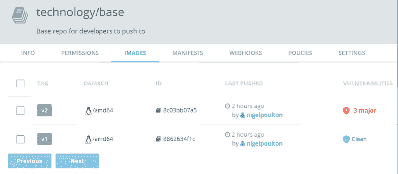
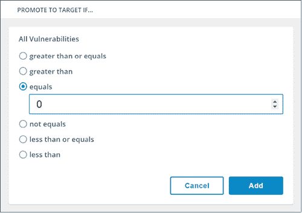
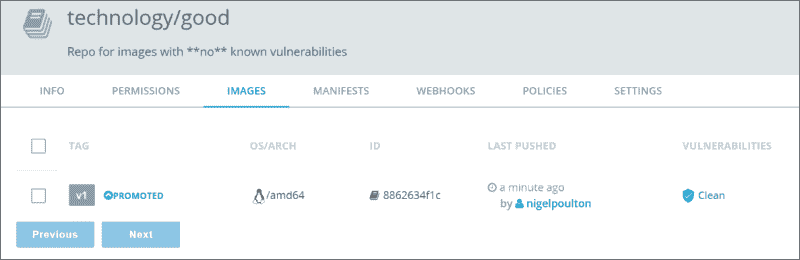
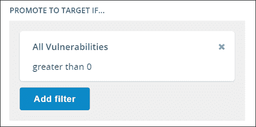
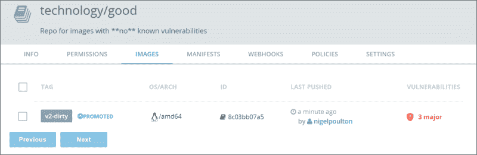
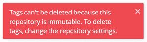

# Docker 镜像提升（Image Promotion）

> 原文：[`c.biancheng.net/view/3265.html`](http://c.biancheng.net/view/3265.html)

DTR 还有两个有意思的特性。镜像提升（Image Promotion）和不可变镜像库。

利用镜像提升功能可以构建一条基于一定策略的自动化流水线，它能够通过同一个 DTR 中的多个镜像库实现镜像提升。

举例说明，开发者可能会推送一些镜像到名为 base 的镜像库，但并不希望他们直接将镜像推送到生产库，因为镜像中可能会有缺陷。

这种情况下，可以利用 DTR 为 base 库配置一定的策略，该策略会扫描所有推送上来的镜像，并根据扫描结果将其升级到其他库中。如果扫描出问题，就将镜像提升到隔离库；如果通过扫描检查，则提升到 QA 或生产库。镜像在流水线中转移时，甚至可以重新打标签。

下面的例子所使用的 DTR 有 3 个镜像库：base、good 和 bad。

good 和 bad 库是空的，但是 base 库中有两个镜像，如下图所示。

由图可见，两个镜像都完成了扫描，v1 没有问题，但是 v2 有 3 个大问题。

下面对 base 库创建两个策略，将扫描没有问题的镜像提升到 good 库，而将有缺陷的镜像则提升至 bad 库。

以下操作全部在 base 库完成。

1) 单击 Policies（策略）页签，并确保 Is source（是源镜像）为选择状态。

2) 单击 New promotion policy（新建提升策略）。

3) 在 PROMOTE TO TARGET IF...（提升到目标，如果……）下，选择 All Vulnerabilities（所有缺陷），并创建一个 equals 0（等于 0）的策略，如下图所示。

这样会创建一个针对所有无缺陷镜像的策略。在进入下一步之前不要忘了单击 Add（添加）按钮。

4) 对于 TARGET REPOSITORY（目标库）选择 technology/good，并单击 Save & Apply（保存并生效）。仅单击 Save 会使得策略对镜像库及后续推送来的新镜像生效，但不会影响库中现存的镜像。

Save & Apply 可达到同样效果，不过对于库中现存的镜像也会生效。如果单击了 Save & Apply，该策略会立即检查库中的所有镜像，并提升无缺陷的镜像。因此 v1 镜像会被提升至 technology/good 库。

5) 查看 techonology/good 库。如下图所示，v1 镜像已经被提升，并且在界面中显示为 PROMOTED（已提升）。

提升策略已经起作用。下面创建另一个策略，用于将有问题的镜像提升至 technology/bad 库。

在 technology/base 库执行如下操作。

1) 创建另一个新的提升策略。

2) 该策略的条件设置为 All Vulnerabilities greater than 0（缺陷数 > 0），并单击 Add，如下图所示。

3) 将 technology/bad 添加为目标库，并且对 TAG NAME IN TARGET 添加“-dirty”，标签名为“%n-dirty”，在提升的同时会对镜像打标签。如下图所示。

4) 单击 Save&Apply。

5) 检查 technology/bad 库，确认策略正在执行，v2 镜像提升并重新打标签。

现在无缺陷的镜像已经被提升到 technology/good 库，如果将这个库设置为不可变的话是一个好主意，这样能够避免镜像被覆盖或删除。

1) 进入 technology/good 库，并单击 Settings 页签。

2) 设置 IMMUTABILITY 为 On，并单击 Save。

3) 尝试删除镜像。会看到如下图所示的错误。

