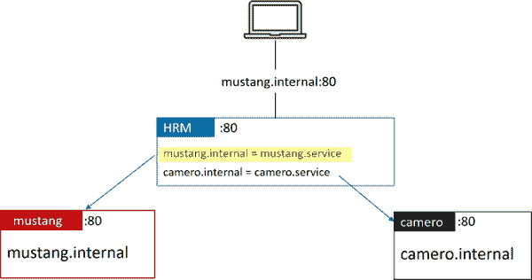
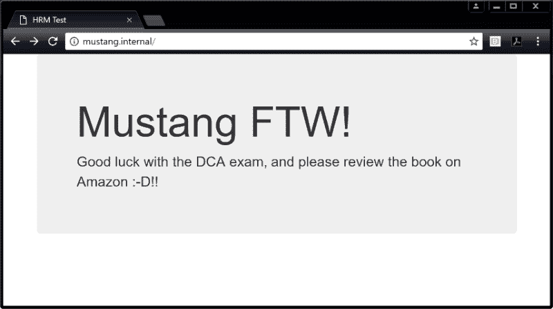

# Docker HTTP 路由网格（HRM）

> 原文：[`c.biancheng.net/view/3266.html`](http://c.biancheng.net/view/3266.html)

Docker Swarm 内置有四层路由网格的功能，称为 Swarm 路由网格（Swarm Routing Mesh）。这一功能可以使 Swarm 服务暴露给集群中的所有节点，并且能够在服务的各个副本之间实现对入站流量的负载均衡。其效果就是可以基本实现流量均衡到达服务的所有副本。

不过，该负载均衡并不作用于应用层。例如，它无法根据 HTTP 头部数据进行七层路由。为了弥补这一点，UCP 实现了七层路由网格，称为 HTTP 路由网格（HTTP Routing Mesh，HRM）。这一功能以 Swarm 路由网格为基础。

HRM 使得多个 Swarm 服务可以发布在同一个 Swarm 端口上，并根据 HTTP 请求头中的主机名将流量路由到正确的服务中。

下图展示的是包含两个服务的简单示例。

在上图中，笔记本客户端向 mustang.internal 的 80 端口发出了一个 HTTP 请求。UCP 集群中有两个监听 80 端口的服务。mustang 服务在 80 端口监听发送给 mustang.internal 主机的流量。camero 服务也监听 80 端口，不过它被配置为接收到达 camero.internal 的流量。

其实还有第三个称为 HRM 的服务，用来维护主机名与 UCP 服务之间的映射关系。HRM 会接收所有到达 80 端口的流量，查看 HTTP 请求头，并决定将其路由到哪个服务。

下面举例予以说明，并对一些细节进行解释。

这里就采用上图所示的例子。过程为首先开启 HRM 的 80 端口。接着使用 nigelpoulton/dockerbook:mustang 镜像部署一个名为“mustang”的服务，并为该服务创建一个主机路由，从而所有对“mustang.internal”的请求都会被路由到该服务。

然后使用 nigelpoulton/dockerbook:camero 镜像创建一个名为“camero”的服务，并为该服务创建一个主机路由，实现该服务与“mustang.internal”的映射。

也可以使用可解析的 DNS 域名，比如“mustang.mycompany.com”，只需要配置好域名解析，使得所有发向这些地址的请求都能够解析到 UCP 集群前的负载均衡器即可。如果没有负载均衡器，那么可以将流量指向集群中任一个节点的 IP。下面具体操作一下。

1) 登录到 UCP Web 界面。

2) 进入 Admin > Admin Settings > Routing Mesh（路由网格）。

3) 勾选 Enable Routing Mesh（启用路由网格）复选框，确保 HTTP Port 配置为 80。

4) 单击 Save。

这样就完成了 UCP 集群开启 HRM 的配置。这一操作，其底层会部署一个名为 ucp-hrm 的系统服务，以及一个名为 ucp-hrm 的覆盖网络。

如果查看 ucp-hrm 系统服务，会发现它是以入站模式（Ingress Mode）发布在 80 端口的。也就是说 ucp-hrm 是部署在集群上的，并且会在集群中的所有节点上绑定 80 端口。

因此，到达集群 80 端口的所有流量都会被该服务处理。当 Mustang 和 Camero 服务部署之后，ucp-hrm 服务的主机映射会被更新，它也就知道如何来进行流量的路由。

现在 HRM 已经部署好了，下面部署服务。

1) 选择左侧导航栏中的 Services，并单击 Create Service。

2) 按照如下步骤部署“mustang”。

Details/Name: mustang。
Details/Image: nigelpoulton/dockerbook:mustang。
Network/Ports/Publish Port: 单击 Publish Port + 选项。
Network/Ports/Internal Port: 8080。
Network/Ports/Add Hostname Based Routes: 单击选项添加一个基于主机名的路由。
Network/Ports/External Scheme: Http://。
Network/Ports/Routing Mesh Host: mustang.internal。
Network/Ports/Networks: 确保服务接入 ucp-hrm 网络。

3) 单击 Create 来部署服务。

4) 部署“camero”服务。

部署该服务的过程与部署“mustang”服务类似，不同之处来自于以下几点。

Details/Name: camero。
Details/Image: nigelpoulton/dockerbook:camero。
Network/Ports/Routing Mesh Host: camero.internal。

5) 单击 Create。

每个服务的部署会花费几秒时间，一旦完成，就可以在网页浏览器中进行测试了，输入 mustang.internal 可以访问 Mustang 服务（如下图所示），而 camero.internal 可以访问 camero 服务。

为了使 mustang.internal 和 camero.internal 能够被解析到 UCP 集群，需要进行域名解析的配置。解析的地址即为集群前的一个负载均衡器，从而可以将流量转发到集群的 80 端口。不过如果为测试环境，并没有负载均衡器，则可以通过编辑 hosts 文件的方式，配置域名到集群中某个节点 IP 的映射。

下面回顾一下其工作过程。

HTTP 路由网格是运行于 Swarm 路由网格传输层基础之上的一个 Docker UCP 特性。具体来说，HRM 增加了基于主机名规则的应用层路由。

启用 HRM 的时候会部署一个名为 ucp-hrm 的 UCP 系统服务。该服务是 Swarm 范围的，监听 80 或 443 端口。这意味着所有到达集群这两个端口之一的流量都会被发送到 ucp-hrm 服务。而 ucp-hrm 服务会接收、解析，并路由所有到达集群中的流量。

到此已经完成了两个用户服务的部署。在部署服务时，需要创建基于主机名的映射，该映射会被加入 ucp-hrm 服务。

“mustang”服务创建的映射，使得它能够收到所有到达 80 端口的，HTTP 头指向“mustang.internal”的流量。“camero”服务与之类似，接收所有到达 80 端口的，HTTP 头指向“camero.internal”的流量。总体来说，ucp-hrm 服务将完成如下两个任务。

所有发往“mustang.internal”的 80 端口的流量都会被转发至“mustang”服务。所有发往“camero.internal”的 80 端口的流量都会被转发至“camero”服务。