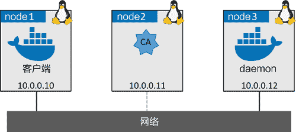

# Docker daemon 通信与安全客户端

> 原文：[`c.biancheng.net/view/3268.html`](http://c.biancheng.net/view/3268.html)

Docker 使用了客户端—服务端模型。客户端使用 CLI，同时服务端（daemon）实现功能，并对外提供 REST API。

客户端叫作 docker（在 Windows 上是 docker.exe），daemon 叫作 dockerd（在 Windows 上是 dockerd.exe）。默认安装方式将客户端和服务端安装在同一台主机上，并且配置通过本地安全 PIC Socket 进行通信。

*   Linux：/var/run/docker.sock。
*   Windows：//./pipe/docker_engine。

不过，也可以配置客户端和服务端通过网络进行通信。但是 daemon 默认网络配置使用不安全的 HTTP Socket，端口是 2375/tcp，如下图所示

默认使用 2375 作为客户端和服务端之间未加密通信方式的端口，而 2376 则用于加密通信。在实验室这样还可以，但是生产环境却是不能接受的。TLS 就是解决之道！

Docker 允许用户配置客户端和 daemon 间只接收安全的 TLS 方式连接。生产环境中推荐这种配置，即使在可信内部网络中，也建议如此配置！

Docker 为客户端与 daemon 间使用基于 TLS 的安全通信提供了两种模式。

*   daemon 模式：Docker daemon 只接收认证客户端的链接。
*   客户端模式：Docker 客户端只接收拥有证书的 Docker daemon 发起的链接，其中证书需要由可信 CA 签发。

同时使用两种模式能提供最高的安全等级。下面会使用简单的实验环境来完成 Docker 的 daemon 模式和客户端模式 TLS 的配置过程。

## 实验环境准备

在接下来的讲解中会使用一个简单实验环境。环境中包括 3 个 Linux 节点，分别为 CA、Docker 客户端以及 Docker daemon。很关键的一点是，3 个主机之间可以互相通过名称解析。

node1 会配置为 Docker 客户端，node3 会配置为 Docker 安全 daemon，node2 会配置为 CA。

小伙伴可以按照下面内容在自己的环境进行实验，但是在下面示例中用到的名称和 IP 如下图所示。

总体来说步骤如下。

配置 CA 和证书。

*   创建 CA（自签名）。
*   创建并为 daemon 签发密钥。
*   创建并为客户端签发密钥。
*   分发密钥。

配置 Docker 使用 TLS。

*   配置 daemon 模式。
*   配置客户端模式。

#### 1) 创建 CA（自签名）

如果在实验环境操作，只需要完成下面的步骤，来搭建签名证书所需的 CA。当然，这也只是构建一个简单的 CA，方便演示如何配置 Docker，并不会尝试构建生产环境级别 PKI。

在实验环境 CA 节点运行下面的命令。

① 为 CA 创建新的私钥。

在操作过程中需要设置密码。

$ openssl genrsa -aes256 -out ca-key.pem 4096

Generating RSA private key, 4096 bit long modulus
...............................................++
..++
e is 65537 (0x10001)
Enter pass phrase for ca-key.pem:
Verifying - Enter pass phrase for ca-key.pem:

在当前目录下会生成一个名为 ca-key.pem 的新文件，这就是 CA 私钥。

② 使用 CA 私钥来生成公钥（证书）。

需要输入前面过程中设置的密码。

$ openssl req -new -x509 -days 730 -key ca-key.pem -sha256 -out ca.pem

工作目录下又出现第二个文件，名为 ca.pem，这是 CA 的公钥，或者说“证书”。现在当前目录下有了两个文件：ca-key.pem 和 ca.pem，这就是 CA 的私钥和公钥，也是 CA 的身份凭证。

#### 2) 为 daemon 创建密钥对

在本步骤中，会为 node3 生成新的密钥对。该节点准备运行 Docker 安全 daemon。一共分 4 步，创建私钥 -> 创建签名请求 -> 添加 IP 地址 -> 并设置为服务端认证有效、生成证书。

在 CA 节点（node2）运行全部命令。

① 为 daemon 创建私钥。

$ openssl genrsa -out daemon-key.pem 4096
<Snip>

在当前工作目录下已经创建了名为 daemon-key.pem 的新文件，这就是 daemon 节点的私钥。

② 创建证书签名请求（CSR）并发送到 CA，这样就可以完成 daemon 证书的创建和签名。要确保使用正确的 DNS 名称来指代想要运行 Docker 安全 daemon 的节点。示例中使用了 node3。

$ openssl req -subj "/CN=node3" \
-sha256 -new -key daemon-key.pem -out daemon.csr

现在工作目录下有了第四个文件。该文件是 CSR，名称为 daemon.csr。

③ 为证书添加属性。

需要创建一个文件，其中包含了 CA 签发证书时需要加入到 daemon 证书的扩展属性。这些属性包括 daemon 的 DNS 名称和 IP 地址，同时配置证书使用服务端认证。

创建的新文件名为 extfile.cnf，包含下面列举的值。示例中使用了上图中 daemon 节点的 DNS 名称和 IP。

subjectAltName = DNS:node3,IP:10.0.0.12
extendedKeyUsage = serverAuth

④ 生成证书。

使用 CSR 文件、CA 密钥、extfile.cnf 文件完成签名以及 daemon 证书配置。命令输出中包含 daemon 的公钥（证书）和一个名为 daemon-cert.perm 的文件。

$ openssl x509 -req -days 730 -sha256 \
-in daemon.csr -CA ca.pem -CAkey ca-key.pem \
-CAcreateserial -out daemon-cert.pem -extfile extfile.cnf

此时，已经拥有了一个可用的 CA，同时运行 Docker 安全 daemon 的 node3 节点也有了自己的一对密钥。

继续下面内容之前，删除 CSR 和 extfile.cnf。

$ rm daemon.csr extfile.cnf

#### 3) 为客户端创建密钥对

在本节中，会将前面对于 node3 的操作在 Docker 客户端节点 node1 上重复一遍。

在 CA（node2）上运行全部命令。

① 为 node1 创建密钥。

这会在工作目录下创建名为 client-key.pem 的新文件。

$ openssl genrsa -out client-key.pem 4096

② 创建 CSR。确保所使用的节点 DNS 名称是正确的，该节点对应 Docker 安全客户端。示例中使用 node1。

$ openssl req -subj '/CN=node1' -new -key client-key.pem -out client.csr

该命令会在当前目录下创建名为 client.csr 的新文件。

③ 创建名为 extfile.cnf 的文件，并用下面的值填充。这样会将证书设置为客户端认证可用。

extendedKeyUsage = clientAuth

④ 使用 CSR、CA 公钥、私钥和 extfile.cnf 为 node1 创建证书。该步骤会在当前目录下创建名为 client-cert.pem 的客户端公钥。

$ openssl x509 -req -days 730 -sha256 \
-in client.csr -CA ca.pem -CAkey ca-key.pem \
-CAcreateserial -out client-cert.pem -extfile extfile.cnf

删除 CSR 和 extfile.cnf 文件，因为不会再用到它们了。

$ rm client.csr extfile.cnf

此时，在工作目录下应该有如下 7 个文件。

*   ca-key.pem << CA private key
*   ca.pem << CA public key (cert)
*   ca.srl << Tracks serial numbers
*   client-cert.pem << client public key (Cert)
*   client-key.pem << client private key
*   daemon-cert.pem << daemon public key (cert)
*   daemon-key.pem << daemon private key

在继续之前，需要移除密钥文件的写权限，将密钥文件对自己以及其他属于当前组的用户变为只读。

$ chmod 0400 ca-key.pem client-key.pem daemon-key.pem

#### 4) 分发密钥

现在已经有了全部的密钥和证书，是时候将他们分发到客户端和 daemon 节点上了。复制如下文件。

*   从 CA 复制 ca.pem、daemon-cert.pem，以及 daemon-key.pem 到 node3（daemon 节点）
*   从 CA 复制 ca.pem、client-cert.pem，以及 client-key.pem 到 deno1（客户端节点）

下面会介绍如何使用 scp 完成复制操作，也可随意选择其他工具使用。

在 node2（CA 节点）密钥所在目录下运行下面的命令。

// Daemon files
$ scp ./ca.pem ubuntu@daemon:/home/ubuntu/.docker/ca.pem
$ scp ./daemon-cert.pem ubuntu@daemon:/home/ubuntu/.docker/cert.pem
$ scp ./daemon-key.pem ubuntu@daemon:/home/ubuntu/.docker/key.pem
//Client files
$ scp ./ca.pem ubuntu@client:/home/ubuntu/.docker/ca.pem
$ scp ./client-cert.pem ubuntu@client:/home/ubuntu/.docker/cert.pem
$ scp ./client-key.pem ubuntu@client:/home/ubuntu/.docker/key.pem

关于命令需要注意以下几点。

*   第 2、3、5 以及第 6 条命令在复制过程中对文件进行了重命名。重命名非常重要，因为 Docker 对文件的命名规范有规定。
*   命令假设使用的环境是 Ubuntu Linux，并且使用 ubuntu 作为用户账户。
*   在执行命令前，需要分别在 daemon 和客户端所在节点上提前创建 /home/ubuntu/.docker 这个隐藏目录。此外还需要修改 .docker 目录的权限，允许复制操作执行。可以使用 chmod 777.docker，但这种方式并不安全。切记，当前只是为了快速创建一个 CA 和证书，才可以这么做。在安全的 PKI 构建中该操作决不允许。
*   如果当前环境是 AWS，需要在每条命令之后通过 -i <key> 来指定实例的私钥。

当前环境如下图所示。

node1 和 node3 节点只会信任由其 CA 公钥签名的 CA 以及证书。配置了正确的证书后，就可以开始配置 Docker 的客户端和 daemon 使用 TLS 了。

## 配置 Docker 使用 TLS

前文提到，Docker 支持两种 TLS 模式。daemon 模式、客户端模式。

daemon 模式保证 daemon 只处理来自拥有有效证书的客户端发起的连接，客户端模式使得客户端只能连接到拥有有效证书的 daemon。

下面会将 node1 上的 daemon 配置为 daemon 模式并进行验证，然后会将 node2 节点上的客户端进程配置为客户端模式并进行验证。

#### 1) 为 Docker daemon 配置 TLS

启动 daemon 安全模式，只需在 daemon.json 配置文件中增加几个守护参数即可。

*   tlsverify：开启 TLS 认证。
*   tlscacert：指定 daemon 可信任的 CA。
*   tlscert：向 Docker 指定 daemon 证书的位置。
*   tlskey：向 Docker 指定 daemon 私钥的位置。
*   hosts：向 Docker 指定需要绑定 daemon 的具体 Socket。

上述内容配置在与平台无关的 daemon.json 配置文件当中。在 Linux 上位于 /etc/docker，在 Windows 上位于 C:\ProgramData\Docker\config\。

在 Docker 安全 daemon 节点上执行下面的全部操作（在示例环境中是 node3）。编辑 daemon.json 文件，并添加如下行。

{
    "hosts": ["tcp://node3:2376"],
    "tls": true,
    "tlsverify": true,
    "tlscacert": "/home/ubuntu/.docker/ca.pem",
    "tlscert": "/home/ubuntu/.docker/cert.pem",
    "tlskey": "/home/ubuntu/.docker/key.pem"
}

运行 systemd 的 Linux 系统不允许在 daemon.json 中使用“hosts”选项。替换方案是在 systemd 配置文件中进行重写。最简单的方式是通过 `sudo systemdctl edit docker` 命令进行修改。该命令会在编辑器中打开名为 /etc/systemd/system/docker.service.d/override.conf 的新文件。在其中加入下列 3 行内容，然后保存。

现在 TLS 和主机选型都设置完成，是时候重启 Docker 了。一旦 Docker 重启完成，可以使用 ps 命令，根据其输出内容检查新的 hosts 值是否生效。

$ ps -elf | grep dockerd
4 S root ... /usr/bin/dockerd -H tcp://node3:2376

输出内容中如果有“-H tcp://node3:2376”，则可以证明 daemon 正在监听网络。端口 2376 是 Docker TLS 使用的标准端口。2375 默认是非安全端口。

如果运行的是普通命令，会出现无法工作的情况，如 docker version。这是因为刚才配置了 daemon 监听网络，但是 Docker 客户端仍尝试使用本地 IPC Socket。加上 -H tcp://node3:2376 参数后再次运行该命令。

$ docker -H tcp://node3:2376 version
Client:
Version: 18.01.0-ce
API version: 1.35
<Snip>
Get http://daemon:2376/v1.35/version: net/http: HTTP/1.x transport connectio\
n broken: malformed HTTP response "\x15\x03\x01\x00\x02\x02".
* Are you trying to connect to a TLS-enabled daemon without TLS?

命令看起来没什么问题，但是仍然不工作。这是因为 daemon 拒绝了来自未认证客户端的连接。

Docker daemon 已经配置为监听网络，并且拒绝了来自未认证客户端的连接。接下来配置 node1 节点上的 Docker client 使用 TLS。

#### 2) 为 Docker 客户端配置 TLS

本节将从以下两方面配置 node1 节点上的 Docker 客户端。

*   通过网络连接某个远程 daemon。
*   为所有 docker 命令进行签名。

在将要运行 Docker 安全客户端的节点上（示例环境中为 node1）执行下面的全部命令。配置下列环境变量，使客户端可以通过网络连接到远端 daemon。

export DOCKER_HOST=tcp://node3:2376

尝试下面的命令。

$ docker version
Client:
Version: 18.01.0-ce
<Snip>
Get http://daemon:2376/v1.35/version: net/http: HTTP/1.x transport connectio\
n broken: malformed HTTP response "\x15\x03\x01\x00\x02\x02".
* Are you trying to connect to a TLS-enabled daemon without TLS?

Docker 客户端通过网络发送命令到远端 daemon，但是 daemon 只接收受认证的连接。设置另外一个环境变量，告知 Docker 客户端使用自己证书对全部命令进行签名。

export DOCKER_TLS_VERIFY=1

再次运行 docker version 命令。

$ docker version
Client:
Version: 18.01.0-ce
<Snip>
Server:
Engine:
Version: 18.01.0-ce
API version: 1.35 (minimum version 1.12)
Go version: go1.9.2
Git commit: 03596f5
Built: Wed Jan 10 20:09:37 2018
OS/Arch: linux/amd64
Experimental: false

至此，客户端成功通过安全连接与远程 daemon 完成通信。最终配置如下图所示。

在进行快速回顾前，有几点需要说明一下。

*   最后的示例可以成功，是因为将客户端 TLS 密钥复制到了 Docker 期望的目录下。该目录位于用户 home 目录下，名为 .docker。同时密钥也修改为 Docker 期望的名称（ca.pem、cert.pem，以及 key.pem）。可以通过配置环境变量 DOCKER_CERT_PATH 来指定其他的目录。
*   可能希望持久化环境中的变量（DOCKER_HOST 和 DOCKER_TLS_VERIFY）。

## Docker TLS 回顾

daemon 模式会拒绝那些没有有效签名的客户端命令，客户端模式下客户端不会连接没有有效证书的远端 daemon。

通过 Docker daemon 配置文件完成 daemon 的 TLS 配置。文件名为 daemon.json，是跨平台的。下面的 daemon.json 可以在大部分操作系统中使用。

{
    "hosts": ["tcp://node3:2376"],
    "tls": true,
    "tlsverify": true,
    "tlscacert": "/home/ubuntu/.docker/ca.pem",
    "tlscert": "/home/ubuntu/.docker/cert.pem",
    "tlskey": "/home/ubuntu/.docker/key.pem"
}

hosts 告诉 Docker daemon 需要绑定的 Socket。示例中将其绑定到了某个网络的 2376 端口上。用户可以选择任意空闲端口，但按惯例 Docker 安全连接都使用 2376 端口。使用 systemd 的 Linux 系统不能配置该参数，需要使用 systemd 重写文件来实现。

tls 和 tlsverify 强制 daemon 只使用加密和认证连接。tlscacert 告诉 Docker 可以信任的 CA。配置后 Docker 会信任由该 CA 签发的全部证书。tlscert 告诉 Docker daemon 证书的位置。tlskey 告诉 Docker daemon 私钥的位置。

修改上述任意配置，都需要重启 Docker 后才能生效。只需设置两个环境变量，就可以完成 Docker 客户端 TLS 配置。

DOCKER_HOST。
DOCKER_TLS_VERIFY。

DOCKER_HOST 为客户端指定如何查找 daemon。

export DOCKER_HOST=tcp://node3:2376 让 Docker 客户端通过主机 node3 的 2376 端口连接到 daemon。

export DOCKER_TLS_VERIFY=1 使 Docker 客户端对其发出的全部命令都进行签名。