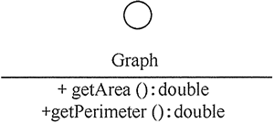
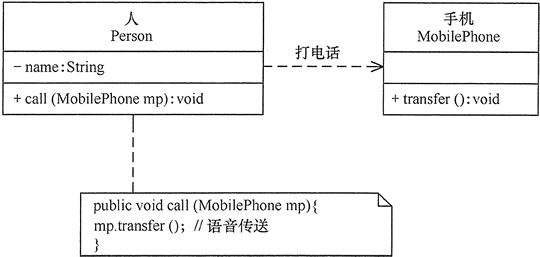
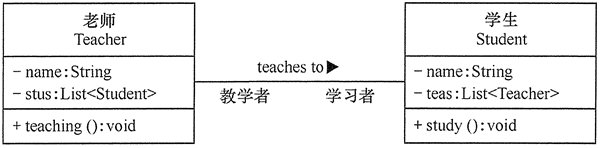
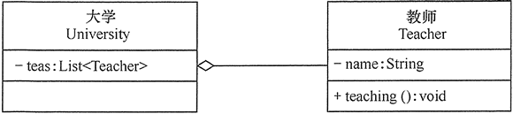
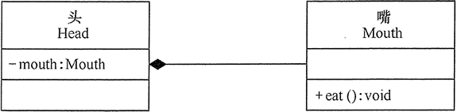
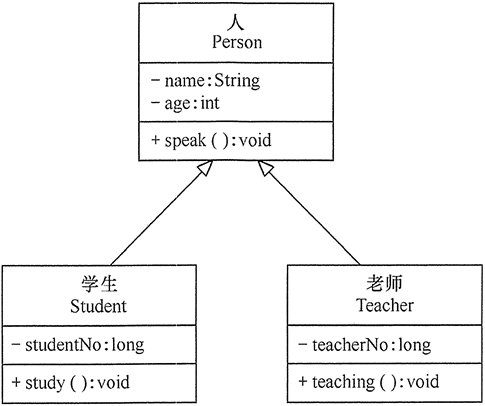
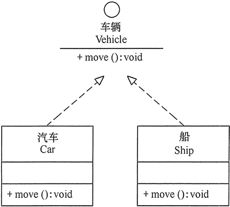

# UML 中的类图及类图之间的关系

## 统一建模语言简介

统一建模语言（Unified Modeling Language，UML）是用来设计软件蓝图的可视化建模语言，1997 年被国际对象管理组织（OMG）采纳为面向对象的建模语言的国际标准。它的特点是简单、统一、图形化、能表达软件设计中的动态与静态信息。

统一建模语言能为软件开发的所有阶段提供模型化和可视化支持。而且融入了软件工程领域的新思想、新方法和新技术，使软件设计人员沟通更简明，进一步缩短了设计时间，减少开发成本。它的应用领域很宽，不仅适合于一般系统的开发，而且适合于并行与分布式系统的建模。

UML 从目标系统的不同角度出发，定义了用例图、类图、对象图、状态图、活动图、时序图、协作图、构件图、部署图等 9 种图。

本教程主要介绍软件设计模式中经常用到的类图，以及类之间的关系。另外，在实验部分将简单介绍 UML 建模工具的使用方法，当前业界使用最广泛的是 Rational Rose。使用 Umlet 的人也很多，它是一个轻量级的开源 UML 建模工具，简单实用，常用于小型软件系统的开发与设计。

## 类、接口和类图

#### 1\. 类

类（Class）是指具有相同属性、方法和关系的对象的抽象，它封装了数据和行为，是面向对象程序设计（OOP）的基础，具有封装性、继承性和多态性等三大特性。在 UML 中，类使用包含类名、属性和操作且带有分隔线的矩形来表示。

(1) 类名（Name）是一个字符串，例如，Student。

(2) 属性（Attribute）是指类的特性，即类的成员变量。UML 按以下格式表示：

```
[可见性]属性名:类型[=默认值]
```

例如：-name:String

注意：“可见性”表示该属性对类外的元素是否可见，包括公有（Public）、私有（Private）、受保护（Protected）和朋友（Friendly）4 种，在类图中分别用符号+、-、#、~表示。

(3) 操作（Operations）是类的任意一个实例对象都可以使用的行为，是类的成员方法。UML 按以下格式表示：

```
[可见性]名称(参数列表)[:返回类型]
```

例如：+display():void。

图 1 所示是学生类的 UML 表示。


图 1 Student 类

#### 2\. 接口

接口（Interface）是一种特殊的类，它具有类的结构但不可被实例化，只可以被子类实现。它包含抽象操作，但不包含属性。它描述了类或组件对外可见的动作。在 UML 中，接口使用一个带有名称的小圆圈来进行表示。

图 2 所示是图形类接口的 UMDL 表示。


图 2 Graph 接口

#### 3\. 类图

类图（ClassDiagram）是用来显示系统中的类、接口、协作以及它们之间的静态结构和关系的一种静态模型。它主要用于描述软件系统的结构化设计，帮助人们简化对软件系统的理解，它是系统分析与设计阶段的重要产物，也是系统编码与测试的重要模型依据。

类图中的类可以通过某种编程 语言直接实现。类图在软件系统开发的整个生命周期都是有效的，它是面向对象系统的建模中最常见的图。图 3 所示是“计算长方形和圆形的周长与面积”的类图，图形接口有计算面积和周长的抽象方法，长方形和圆形实现这两个方法供访问类调用。


图 3 “计算长方形和圆形的周长与面积”的类图

## 类之间的关系

在软件系统中，类不是孤立存在的，类与类之间存在各种关系。根据类与类之间的耦合度从弱到强排列，UML 中的类图有以下几种关系：依赖关系、关联关系、聚合关系、组合关系、泛化关系和实现关系。其中泛化和实现的耦合度相等，它们是最强的。

#### 1\. 依赖关系

依赖（Dependency）关系是一种使用关系，它是对象之间耦合度最弱的一种关联方式，是临时性的关联。在代码中，某个类的方法通过局部变量、方法的参数或者对静态方法的调用来访问另一个类（被依赖类）中的某些方法来完成一些职责。

在 UML 类图中，依赖关系使用带箭头的虚线来表示，箭头从使用类指向被依赖的类。图 4 所示是人与手机的关系图，人通过手机的语音传送方法打电话。


图 4 依赖关系的实例

#### 2\. 关联关系

关联（Association）关系是对象之间的一种引用关系，用于表示一类对象与另一类对象之间的联系，如老师和学生、师傅和徒弟、丈夫和妻子等。关联关系是类与类之间最常用的一种关系，分为一般关联关系、聚合关系和组合关系。我们先介绍一般关联。

关联可以是双向的，也可以是单向的。在 UML 类图中，双向的关联可以用带两个箭头或者没有箭头的实线来表示，单向的关联用带一个箭头的实线来表示，箭头从使用类指向被关联的类。也可以在关联线的两端标注角色名，代表两种不同的角色。

在代码中通常将一个类的对象作为另一个类的成员变量来实现关联关系。图 5 所示是老师和学生的关系图，每个老师可以教多个学生，每个学生也可向多个老师学，他们是双向关联。


图 5 关联关系的实例

#### 3\. 聚合关系

聚合（Aggregation）关系是关联关系的一种，是强关联关系，是整体和部分之间的关系，是 has-a 的关系。

聚合关系也是通过成员对象来实现的，其中成员对象是整体对象的一部分，但是成员对象可以脱离整体对象而独立存在。例如，学校与老师的关系，学校包含老师，但如果学校停办了，老师依然存在。

在 UML 类图中，聚合关系可以用带空心菱形的实线来表示，菱形指向整体。图 6 所示是大学和教师的关系图。


图 6 聚合关系的实例

#### 4.组合关系

组合（Composition）关系也是关联关系的一种，也表示类之间的整体与部分的关系，但它是一种更强烈的聚合关系，是 cxmtains-a 关系。

在组合关系中，整体对象可以控制部分对象的生命周期，一旦整体对象不存在，部分对象也将不存在，部分对象不能脱离整体对象而存在。例如，头和嘴的关系，没有了头，嘴也就不存在了。

在 UML 类图中，组合关系用带实心菱形的实线来表示，菱形指向整体。图 7 所示是头和嘴的关系图。


图 7 组合关系的实例

#### 5.泛化关系

泛化（Generalization）关系是对象之间耦合度最大的一种关系，表示一般与特殊的关系，是父类与子类之间的关系，是一种继承关系，是 is-a 的关系。

在 UML 类图中，泛化关系用带空心三角箭头的实线来表示，箭头从子类指向父类。在代码实现时，使用面向对象的继承机制来实现泛化关系。例如，Student 类和 Teacher 类都是 Person 类的子类，其类图如图 8 所示。


图 8 泛化关系的实例

#### 6.实现关系

实现（Realization）关系是接口与实现类之间的关系。在这种关系中，类实现了接口，类中的操作实现了接口中所声明的所有的抽象操作。

在 UML 类图中，实现关系使用带空心三角箭头的虚线来表示，箭头从实现类指向接口。例如，汽车和船实现了交通工具，其类图如图 9 所示。


图 9 实现关系的实例