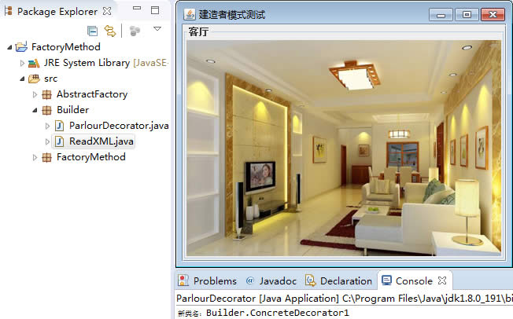

# 建造者模式（Bulider 模式）详解

在软件开发过程中有时需要创建一个复杂的对象，这个复杂对象通常由多个子部件按一定的步骤组合而成。例如，计算机是由 OPU、主板、内存、硬盘、显卡、机箱、显示器、键盘、鼠标等部件组装而成的，采购员不可能自己去组装计算机，而是将计算机的配置要求告诉计算机销售公司，计算机销售公司安排技术人员去组装计算机，然后再交给要买计算机的采购员。

生活中这样的例子很多，如游戏中的不同角色，其性别、个性、能力、脸型、体型、服装、发型等特性都有所差异；还有汽车中的方向盘、发动机、车架、轮胎等部件也多种多样；每封电子邮件的发件人、收件人、主题、内容、附件等内容也各不相同。

以上所有这些产品都是由多个部件构成的，各个部件可以灵活选择，但其创建步骤都大同小异。这类产品的创建无法用前面介绍的工厂模式描述，只有建造者模式可以很好地描述该类产品的创建。

## 模式的定义与特点

建造者（Builder）模式的定义：指将一个复杂对象的构造与它的表示分离，使同样的构建过程可以创建不同的表示，这样的设计模式被称为建造者模式。它是将一个复杂的对象分解为多个简单的对象，然后一步一步构建而成。它将变与不变相分离，即产品的组成部分是不变的，但每一部分是可以灵活选择的。

该模式的主要优点如下：

1.  各个具体的建造者相互独立，有利于系统的扩展。
2.  客户端不必知道产品内部组成的细节，便于控制细节风险。

其缺点如下：

1.  产品的组成部分必须相同，这限制了其使用范围。
2.  如果产品的内部变化复杂，该模式会增加很多的建造者类。

建造者（Builder）模式和工厂模式的关注点不同：建造者模式注重零部件的组装过程，而工厂方法模式更注重零部件的创建过程，但两者可以结合使用。

## 模式的结构与实现

建造者（Builder）模式由产品、抽象建造者、具体建造者、指挥者等 4 个要素构成，现在我们来分析其基本结构和实现方法。

#### 1\. 模式的结构

建造者（Builder）模式的主要角色如下。

1.  产品角色（Product）：它是包含多个组成部件的复杂对象，由具体建造者来创建其各个滅部件。
2.  抽象建造者（Builder）：它是一个包含创建产品各个子部件的抽象方法的接口，通常还包含一个返回复杂产品的方法 getResult()。
3.  具体建造者(Concrete Builder）：实现 Builder 接口，完成复杂产品的各个部件的具体创建方法。
4.  指挥者（Director）：它调用建造者对象中的部件构造与装配方法完成复杂对象的创建，在指挥者中不涉及具体产品的信息。

其结构图如图 1 所示。


图 1 建造者模式的结构图

#### 2\. 模式的实现

图 1 给出了建造者（Builder）模式的主要结构，其相关类的代码如下。

(1) 产品角色：包含多个组成部件的复杂对象。

```
class Product
{
    private String partA;
    private String partB;
    private String partC;
    public void setPartA(String partA)
    {
        this.partA=partA;
    }
    public void setPartB(String partB)
    {
        this.partB=partB;
    }
    public void setPartC(String partC)
    {
        this.partC=partC;
    }
    public void show()
    {
        //显示产品的特性
    }
}
```

(2) 抽象建造者：包含创建产品各个子部件的抽象方法。

```
abstract class Builder
{
    //创建产品对象
    protected Product product=new Product();
    public abstract void buildPartA();
    public abstract void buildPartB();
    public abstract void buildPartC();
    //返回产品对象
    public Product getResult()
    {
        return product;
    }
}
```

(3) 具体建造者：实现了抽象建造者接口。

```
public class ConcreteBuilder extends Builder
{
    public void buildPartA()
    {
        product.setPartA("建造 PartA");
    }
    public void buildPartB()
    {
        product.setPartA("建造 PartB");
    }
    public void buildPartC()
    {
        product.setPartA("建造 PartC");
    }
}
```

(4) 指挥者：调用建造者中的方法完成复杂对象的创建。

```
class Director
{
    private Builder builder;
    public Director(Builder builder)
    {
        this.builder=builder;
    }
    //产品构建与组装方法
    public Product construct()
    {
        builder.buildPartA();
        builder.buildPartB();
        builder.buildPartC();
        return builder.getResult();
    }
}
```

(5) 客户类。

```
public class Client
{
    public static void main(String[] args)
    {
        Builder builder=new ConcreteBuilder();
        Director director=new Director(builder);
        Product product=director.construct();
        product.show();
    }
}
```

## 模式的应用实例

【例 1】用建造者（Builder）模式描述客厅装修。

分析：客厅装修是一个复杂的过程，它包含墙体的装修、电视机的选择、沙发的购买与布局等。客户把装修要求告诉项目经理，项目经理指挥装修工人一步步装修，最后完成整个客厅的装修与布局，所以本实例用建造者模式实现比较适合。

这里客厅是产品，包括墙、电视和沙发等组成部分。具体装修工人是具体建造者，他们负责装修与墙、电视和沙发的布局。项目经理是指挥者，他负责指挥装修工人进行装修。

另外，客厅类中提供了 show() 方法，可以将装修效果图显示出来（点此下载装修效果图的图片）。客户端程序通过对象生成器类 ReadXML 读取 XML 配置文件中的装修方案数据（点此下载 XML 文件），调用项目经理进行装修。其类图如图 2 所示。


图 2 客厅装修的结构图
程序代码如下：

```
package Builder;
import java.awt.*;
import javax.swing.*;
public class ParlourDecorator
{
    public static void main(String[] args)
    {
        try
        {
            Decorator d;
            d=(Decorator) ReadXML.getObject();
            ProjectManager m=new ProjectManager(d);       
            Parlour p=m.decorate();
            p.show();
        }
        catch(Exception e)
        {
            System.out.println(e.getMessage());
        }
    }
}
//产品：客厅
class Parlour
{
    private String wall;    //墙
    private String TV;    //电视
    private String sofa;    //沙发  
    public void setWall(String wall)
    {
        this.wall=wall;
    }
    public void setTV(String TV)
    {
        this.TV=TV;
    }
    public void setSofa(String sofa)
    {
        this.sofa=sofa;
    }   
    public void show()
    {
        JFrame jf=new JFrame("建造者模式测试");
        Container contentPane=jf.getContentPane();
        JPanel p=new JPanel();   
        JScrollPane sp=new JScrollPane(p);  
        String parlour=wall+TV+sofa;
        JLabel l=new JLabel(new ImageIcon("src/"+parlour+".jpg"));
        p.setLayout(new GridLayout(1,1));
        p.setBorder(BorderFactory.createTitledBorder("客厅"));
        p.add(l);
        contentPane.add(sp,BorderLayout.CENTER);       
        jf.pack();  
        jf.setVisible(true);
        jf.setDefaultCloseOperation(JFrame.EXIT_ON_CLOSE);
    }   
}
//抽象建造者：装修工人
abstract class Decorator
{
    //创建产品对象
    protected  Parlour product=new Parlour();
    public  abstract void buildWall();
    public  abstract void buildTV();
    public  abstract void buildSofa();
    //返回产品对象
    public  Parlour getResult()
    {
        return  product;
    }
}
//具体建造者：具体装修工人 1
class ConcreteDecorator1  extends Decorator
{
    public void buildWall()
    {
        product.setWall("w1");
    }
    public void buildTV()
    {
        product.setTV("TV1");
    }
    public void buildSofa()
    {
        product.setSofa("sf1");
    }
}
//具体建造者：具体装修工人 2
class ConcreteDecorator2 extends Decorator
{
    public void buildWall()
    {
        product.setWall("w2");
      }
      public void buildTV()
      {
          product.setTV("TV2");
      }
      public void buildSofa()
      {
          product.setSofa("sf2");
      }
}
//指挥者：项目经理
class ProjectManager
{
    private Decorator builder;
    public ProjectManager(Decorator builder)
    {
          this.builder=builder;
    }
    //产品构建与组装方法
    public Parlour decorate()
    {
          builder.buildWall();
        builder.buildTV();
        builder.buildSofa();
        return builder.getResult();
    }
}
```

```
package Builder;
import javax.xml.parsers.*;
import org.w3c.dom.*;
import java.io.*;
class ReadXML
{
    public static Object getObject()
    {
        try
        {
            DocumentBuilderFactory dFactory=DocumentBuilderFactory.newInstance();
            DocumentBuilder builder=dFactory.newDocumentBuilder();
            Document doc;                           
            doc=builder.parse(new File("src/Builder/config.xml"));
            NodeList nl=doc.getElementsByTagName("className");
            Node classNode=nl.item(0).getFirstChild();
            String cName="Builder."+classNode.getNodeValue();
            System.out.println("新类名："+cName);
            Class<?> c=Class.forName(cName);
              Object obj=c.newInstance();
            return obj;
         }  
         catch(Exception e)
         {
                   e.printStackTrace();
                   return null;
         }
    }
}
```

程序运行结果如图 3 所示。


图 3 客厅装修的运行结果

## 模式的应用场景

建造者（Builder）模式创建的是复杂对象，其产品的各个部分经常面临着剧烈的变化，但将它们组合在一起的算法却相对稳定，所以它通常在以下场合使用。

*   创建的对象较复杂，由多个部件构成，各部件面临着复杂的变化，但构件间的建造顺序是稳定的。
*   创建复杂对象的算法独立于该对象的组成部分以及它们的装配方式，即产品的构建过程和最终的表示是独立的。

## 模式的扩展

建造者（Builder）模式在应用过程中可以根据需要改变，如果创建的产品种类只有一种，只需要一个具体建造者，这时可以省略掉抽象建造者，甚至可以省略掉指挥者角色。