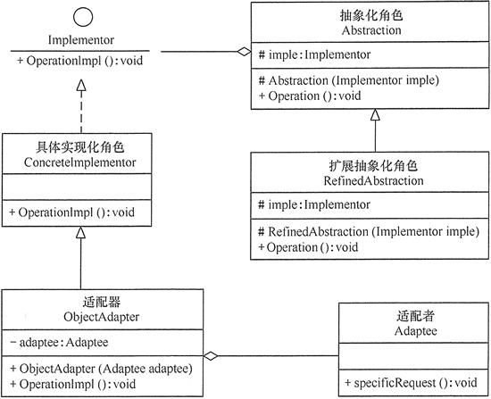

# 桥接模式（Bridge 模式）详解

在现实生活中，某些类具有两个或多个维度的变化，如图形既可按形状分，又可按颜色分。如何设计类似于 Photoshop 这样的软件，能画不同形状和不同颜色的图形呢？如果用继承方式，m 种形状和 n 种颜色的图形就有 m×n 种，不但对应的子类很多，而且扩展困难。

当然，这样的例子还有很多，如不同颜色和字体的文字、不同品牌和功率的汽车、不同性别和职业的男女、支持不同平台和不同文件格式的媒体播放器等。如果用桥接模式就能很好地解决这些问题。

## 桥接模式的定义与特点

桥接（Bridge）模式的定义如下：将抽象与实现分离，使它们可以独立变化。它是用组合关系代替继承关系来实现，从而降低了抽象和实现这两个可变维度的耦合度。

桥接（Bridge）模式的优点是：

*   由于抽象与实现分离，所以扩展能力强；
*   其实现细节对客户透明。

缺点是：由于聚合关系建立在抽象层，要求开发者针对抽象化进行设计与编程，这增加了系统的理解与设计难度。

## 桥接模式的结构与实现

可以将抽象化部分与实现化部分分开，取消二者的继承关系，改用组合关系。

#### 1\. 模式的结构

桥接（Bridge）模式包含以下主要角色。

1.  抽象化（Abstraction）角色：定义抽象类，并包含一个对实现化对象的引用。
2.  扩展抽象化（Refined    Abstraction）角色：是抽象化角色的子类，实现父类中的业务方法，并通过组合关系调用实现化角色中的业务方法。
3.  实现化（Implementor）角色：定义实现化角色的接口，供扩展抽象化角色调用。
4.  具体实现化（Concrete Implementor）角色：给出实现化角色接口的具体实现。

其结构图如图 1 所示。


图 1 桥接模式的结构图

#### 2\. 模式的实现

桥接模式的代码如下：

```
package bridge;
public class BridgeTest
{
    public static void main(String[] args)
    {
        Implementor imple=new ConcreteImplementorA();
        Abstraction abs=new RefinedAbstraction(imple);
        abs.Operation();
    }
}
//实现化角色
interface Implementor
{
    public void OperationImpl();
}
//具体实现化角色
class ConcreteImplementorA implements Implementor
{
    public void OperationImpl()
    {
        System.out.println("具体实现化(Concrete Implementor)角色被访问" );
    }
}
//抽象化角色
abstract class Abstraction
{
   protected Implementor imple;
   protected Abstraction(Implementor imple)
   {
       this.imple=imple;
   }
   public abstract void Operation();   
}
//扩展抽象化角色
class RefinedAbstraction extends Abstraction
{
   protected RefinedAbstraction(Implementor imple)
   {
       super(imple);
   }
   public void Operation()
   {
       System.out.println("扩展抽象化(Refined Abstraction)角色被访问" );
       imple.OperationImpl();
   }
}
```

程序的运行结果如下：

```
扩展抽象化(Refined Abstraction)角色被访问
具体实现化(Concrete Implementor)角色被访问
```

## 桥接模式的应用实例

【例 1】用桥接（Bridge）模式模拟女士皮包的选购。

分析：女士皮包有很多种，可以按用途分、按皮质分、按品牌分、按颜色分、按大小分等，存在多个维度的变化，所以采用桥接模式来实现女士皮包的选购比较合适。

本实例按用途分可选钱包（Wallet）和挎包（HandBag），按颜色分可选黄色（Yellow）和红色（Red）。可以按两个维度定义为颜色类和包类。（[点此下载本实例所要显示的包的图片](http://c.biancheng.net/uploads/soft/181113/3-1Q115125U5.zip)）。

颜色类（Color）是一个维度，定义为实现化角色，它有两个具体实现化角色：黄色和红色，通过 getColor() 方法可以选择颜色；包类（Bag）是另一个维度，定义为抽象化角色，它有两个扩展抽象化角色：挎包和钱包，它包含了颜色类对象，通过 getName() 方法可以选择相关颜色的挎包和钱包。

客户类通过 ReadXML 类从 XML 配置文件中获取包信息（[点此下载 XML 配置文件](http://c.biancheng.net/uploads/soft/181113/3-1Q115130045.zip)），并把选到的产品通过窗体显示出现，图 2 所示是其结构图。


图 2 女士皮包选购的结构图
程序代码如下：

```
package bridge;
import java.awt.*;
import javax.swing.*;
public class BagManage
{
    public static void main(String[] args)
    {
        Color color;
        Bag bag;
        color=(Color)ReadXML.getObject("color");
        bag=(Bag)ReadXML.getObject("bag");
        bag.setColor(color);
        String name=bag.getName();
        show(name);
    }
    public static void show(String name)
    {
        JFrame jf=new JFrame("桥接模式测试");
        Container contentPane=jf.getContentPane();
        JPanel p=new JPanel();   
        JLabel l=new JLabel(new ImageIcon("src/bridge/"+name+".jpg"));
        p.setLayout(new GridLayout(1,1));
        p.setBorder(BorderFactory.createTitledBorder("女士皮包"));
        p.add(l);
        contentPane.add(p, BorderLayout.CENTER);
        jf.pack();  
        jf.setVisible(true);
        jf.setDefaultCloseOperation(JFrame.EXIT_ON_CLOSE);
    }
}
//实现化角色：颜色
interface Color
{
    String getColor();
}
//具体实现化角色：黄色
class Yellow implements Color
{
    public String getColor()
    {
        return "yellow";
    }
}
//具体实现化角色：红色
class Red implements Color
{
    public String getColor()
    {
        return "red";
    }
}
//抽象化角色：包
abstract class Bag
{
    protected Color color;
    public void setColor(Color color)
    {
        this.color=color;
    }   
    public abstract String getName();
}
//扩展抽象化角色：挎包
class HandBag extends Bag
{
    public String getName()
    {
        return color.getColor()+"HandBag";
    }   
}
//扩展抽象化角色：钱包
class Wallet extends Bag
{
    public String getName()
    {
        return color.getColor()+"Wallet";
    }   
}
```

```
package bridge;
import javax.xml.parsers.*;
import org.w3c.dom.*;
import java.io.*;
class ReadXML
{
    public static Object getObject(String args)
    {
        try
        {
            DocumentBuilderFactory dFactory=DocumentBuilderFactory.newInstance();
            DocumentBuilder builder=dFactory.newDocumentBuilder();
            Document doc;                           
            doc=builder.parse(new File("src/bridge/config.xml"));
            NodeList nl=doc.getElementsByTagName("className");
            Node classNode=null;
            if(args.equals("color"))
            {
                classNode=nl.item(0).getFirstChild();
            }
            else if(args.equals("bag"))
            {
                classNode=nl.item(1).getFirstChild();
            }          
            String cName="bridge."+classNode.getNodeValue();
            Class<?> c=Class.forName(cName);
              Object obj=c.newInstance();
            return obj;
        }  
        catch(Exception e)
        {
               e.printStackTrace();
               return null;
        }
    }
}
```

程序的运行结果如图 3 所示。


图 3 女士皮包选购的运行结果 1
如果将 XML 配置文件按如下修改：

```
<?xml version="1.0" encoding="UTF-8"?>
<config>
    <className>Red</className>
    <className>Wallet</className>
</config>
```

则程序的运行结果如图 4 所示。


图 4 女士皮包选购的运行结果 2

## 桥接模式的应用场景

桥接模式通常适用于以下场景。

1.  当一个类存在两个独立变化的维度，且这两个维度都需要进行扩展时。
2.  当一个系统不希望使用继承或因为多层次继承导致系统类的个数急剧增加时。
3.  当一个系统需要在构件的抽象化角色和具体化角色之间增加更多的灵活性时。

## 桥接模式模式的扩展

在软件开发中，有时桥接（Bridge）模式可与适配器模式联合使用。当桥接（Bridge）模式的实现化角色的接口与现有类的接口不一致时，可以在二者中间定义一个适配器将二者连接起来，其具体结构图如图 5 所示。


图 5 桥接模式与适配器模式联用的结构图