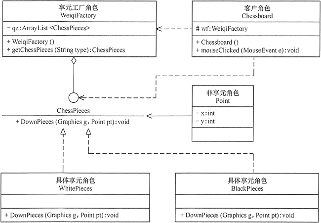
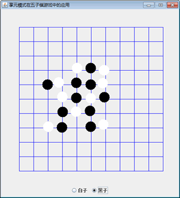

# 享元模式（详解版）

在面向对象程序设计过程中，有时会面临要创建大量相同或相似对象实例的问题。创建那么多的对象将会耗费很多的系统资源，它是系统性能提高的一个瓶颈。例如，围棋和五子棋中的黑白棋子，图像中的坐标点或颜色，局域网中的路由器、交换机和集线器，教室里的桌子和凳子等。这些对象有很多相似的地方，如果能把它们相同的部分提取出来共享，则能节省大量的系统资源，这就是享元模式的产生背景。

## 享元模式的定义与特点

享元（Flyweight）模式的定义：运用共享技术来有効地支持大量细粒度对象的复用。它通过共享已经存在的又橡来大幅度减少需要创建的对象数量、避免大量相似类的开销，从而提高系统资源的利用率。

享元模式的主要优点是：相同对象只要保存一份，这降低了系统中对象的数量，从而降低了系统中细粒度对象给内存带来的压力。

其主要缺点是：

1.  为了使对象可以共享，需要将一些不能共享的状态外部化，这将增加程序的复杂性。
2.  读取享元模式的外部状态会使得运行时间稍微变长。

## 享元模式的结构与实现

享元模式中存在以下两种状态：

1.  内部状态，即不会随着环境的改变而改变的可共享部分；
2.  外部状态，指随环境改变而改变的不可以共享的部分。享元模式的实现要领就是区分应用中的这两种状态，并将外部状态外部化。下面来分析其基本结构和实现方法。

#### 1\. 模式的结构

享元模式的主要角色有如下。

1.  抽象享元角色（Flyweight）:是所有的具体享元类的基类，为具体享元规范需要实现的公共接口，非享元的外部状态以参数的形式通过方法传入。
2.  具体享元（Concrete Flyweight）角色：实现抽象享元角色中所规定的接口。
3.  非享元（Unsharable Flyweight)角色：是不可以共享的外部状态，它以参数的形式注入具体享元的相关方法中。
4.  享元工厂（Flyweight Factory）角色：负责创建和管理享元角色。当客户对象请求一个享元对象时，享元工厂检査系统中是否存在符合要求的享元对象，如果存在则提供给客户；如果不存在的话，则创建一个新的享元对象。

图 1 是享元模式的结构图。图中的 UnsharedConcreteFlyweight 是与淳元角色，里面包含了非共享的外部状态信息 info；而 Flyweight 是抽象享元角色，里面包含了享元方法 operation(UnsharedConcreteFlyweight state)，非享元的外部状态以参数的形式通过该方法传入；ConcreteFlyweight 是具体享元角色，包含了关键字 key，它实现了抽象享元接口；FlyweightFactory 是享元工厂角色，它逝关键字 key 来管理具体享元；客户角色通过享元工厂获取具体享元，并访问具体享元的相关方法。


图 1 享元模式的结构图

#### 2\. 模式的实现

享元模式的实现代码如下：

```
package flyweight;
import java.util.HashMap;
public class FlyweightPattern
{
    public static void main(String[] args)
    {
        FlyweightFactory factory=new FlyweightFactory();
        Flyweight f01=factory.getFlyweight("a");
        Flyweight f02=factory.getFlyweight("a");
        Flyweight f03=factory.getFlyweight("a");
        Flyweight f11=factory.getFlyweight("b");
        Flyweight f12=factory.getFlyweight("b");       
        f01.operation(new UnsharedConcreteFlyweight("第 1 次调用 a。"));       
        f02.operation(new UnsharedConcreteFlyweight("第 2 次调用 a。"));       
        f03.operation(new UnsharedConcreteFlyweight("第 3 次调用 a。"));       
        f11.operation(new UnsharedConcreteFlyweight("第 1 次调用 b。"));       
        f12.operation(new UnsharedConcreteFlyweight("第 2 次调用 b。"));
    }
}
//非享元角色
class UnsharedConcreteFlyweight
{
    private String info;
    UnsharedConcreteFlyweight(String info)
    {
        this.info=info;
    }
    public String getInfo()
    {
        return info;
    }
    public void setInfo(String info)
    {
        this.info=info;
    }
}
//抽象享元角色
interface Flyweight
{
    public void operation(UnsharedConcreteFlyweight state);
}
//具体享元角色
class ConcreteFlyweight implements Flyweight
{
    private String key;
    ConcreteFlyweight(String key)
    {
        this.key=key;
        System.out.println("具体享元"+key+"被创建！");
    }
    public void operation(UnsharedConcreteFlyweight outState)
    {
        System.out.print("具体享元"+key+"被调用，");
        System.out.println("非享元信息是:"+outState.getInfo());
    }
}
//享元工厂角色
class FlyweightFactory
{
    private HashMap<String, Flyweight> flyweights=new HashMap<String, Flyweight>();
    public Flyweight getFlyweight(String key)
    {
        Flyweight flyweight=(Flyweight)flyweights.get(key);
        if(flyweight!=null)
        {
            System.out.println("具体享元"+key+"已经存在，被成功获取！");
        }
        else
        {
            flyweight=new ConcreteFlyweight(key);
            flyweights.put(key, flyweight);
        }
        return flyweight;
    }
}
```

程序运行结果如下：

```
具体享元 a 被创建！
具体享元 a 已经存在，被成功获取！
具体享元 a 已经存在，被成功获取！
具体享元 b 被创建！
具体享元 b 已经存在，被成功获取！
具体享元 a 被调用，非享元信息是:第 1 次调用 a。
具体享元 a 被调用，非享元信息是:第 2 次调用 a。
具体享元 a 被调用，非享元信息是:第 3 次调用 a。
具体享元 b 被调用，非享元信息是:第 1 次调用 b。
具体享元 b 被调用，非享元信息是:第 2 次调用 b。
```

## 享元模式的应用实例

【例 1】享元模式在五子棋游戏中的应用。

分析：五子棋同围棋一样，包含多个“黑”或“白”颜色的棋子，所以用享元模式比较好。

本实例中的棋子（ChessPieces）类是抽象享元角色，它包含了一个落子的 DownPieces(Graphics g,Point pt) 方法；白子（WhitePieces）和黑子（BlackPieces）类是具体享元角色，它实现了落子方法；Point 是非享元角色，它指定了落子的位置；WeiqiFactory 是享元工厂角色，它通过 ArrayList 来管理棋子，并且提供了获取白子或者黑子的 getChessPieces(String type) 方法；客户类（Chessboard）利用 Graphics 组件在框架窗体中绘制一个棋盘，并实现 mouseClicked(MouseEvent e) 事件处理方法，该方法根据用户的选择从享元工厂中获取白子或者黑子并落在棋盘上。图 2 所示是其结构图。


图 2 五子棋游戏的结构图
程序代码如下：

```
package flyweight;
import java.awt.*;
import java.awt.event.*;
import java.util.ArrayList;
import javax.swing.*;
public class WzqGame
{
    public static void main(String[] args)
    {
        new Chessboard();
    }
}
//棋盘
class Chessboard extends MouseAdapter
{
    WeiqiFactory wf;
    JFrame f;   
    Graphics g;
    JRadioButton wz;
    JRadioButton bz;
    private final int x=50;
    private final int y=50;
    private final int w=40;    //小方格宽度和高度
    private final int rw=400;    //棋盘宽度和高度
    Chessboard()
    {
        wf=new WeiqiFactory();
        f=new JFrame("享元模式在五子棋游戏中的应用");
        f.setBounds(100,100,500,550);
        f.setVisible(true);       
        f.setResizable(false);
        f.setDefaultCloseOperation(JFrame.EXIT_ON_CLOSE);
        JPanel SouthJP=new JPanel();
        f.add("South",SouthJP);
        wz=new JRadioButton("白子");
        bz=new JRadioButton("黑子",true);
        ButtonGroup group=new ButtonGroup();
        group.add(wz);
        group.add(bz);
        SouthJP.add(wz);
        SouthJP.add(bz);      
        JPanel CenterJP=new JPanel();
        CenterJP.setLayout(null);
        CenterJP.setSize(500, 500);
        CenterJP.addMouseListener(this);
        f.add("Center",CenterJP);      
        try
        {
            Thread.sleep(500);
        }
        catch(InterruptedException e)
        {
            e.printStackTrace();
        }               
        g=CenterJP.getGraphics();
        g.setColor(Color.BLUE);   
        g.drawRect(x, y, rw, rw);
        for(int i=1;i<10;i++)
        {
            //绘制第 i 条竖直线
            g.drawLine(x+(i*w),y,x+(i*w),y+rw);
            //绘制第 i 条水平线
            g.drawLine(x,y+(i*w),x+rw,y+(i*w));
        }   
    }
    public void mouseClicked(MouseEvent e)
    {
        Point pt=new Point(e.getX()-15,e.getY()-15);
        if(wz.isSelected())
        {
            ChessPieces c1=wf.getChessPieces("w");
            c1.DownPieces(g,pt);
        }
        else if(bz.isSelected())
        {
            ChessPieces c2=wf.getChessPieces("b");       
            c2.DownPieces(g,pt);  
        }
    }
}
//抽象享元角色：棋子
interface ChessPieces
{
    public void DownPieces(Graphics g,Point pt);    //下子
}
//具体享元角色：白子
class WhitePieces implements ChessPieces
{
    public void DownPieces(Graphics g,Point pt)
    {       
        g.setColor(Color.WHITE);
        g.fillOval(pt.x,pt.y,30,30);
    }
}
//具体享元角色：黑子
class BlackPieces implements ChessPieces
{
    public void DownPieces(Graphics g,Point pt)
    {
        g.setColor(Color.BLACK);
        g.fillOval(pt.x,pt.y,30,30);
    }
}
//享元工厂角色
class WeiqiFactory
{
    private ArrayList<ChessPieces> qz;   
    public WeiqiFactory()
    {
        qz=new ArrayList<ChessPieces>();
        ChessPieces w=new WhitePieces();
        qz.add(w);
        ChessPieces b=new BlackPieces();
        qz.add(b);
    }   
    public ChessPieces getChessPieces(String type)
    {
        if(type.equalsIgnoreCase("w"))
        {
            return (ChessPieces)qz.get(0);
        }
        else if(type.equalsIgnoreCase("b"))
        {
            return (ChessPieces)qz.get(1);
        }
        else
        {
            return null;
        }
    }
}
```

程序运行结果如图 3 所示。

图 3 五子棋游戏的运行结果

## 享元模式的应用场景

前面分析了享元模式的结构与特点，下面分析它适用的应用场景。享元模式是通过减少内存中对象的数量来节省内存空间的，所以以下几种情形适合采用享元模式。

1.  系统中存在大量相同或相似的对象，这些对象耗费大量的内存资源。
2.  大部分的对象可以按照内部状态进行分组，且可将不同部分外部化，这样每一个组只需保存一个内部状态。
3.  由于享元模式需要额外维护一个保存享元的数据结构，所以应当在有足够多的享元实例时才值得使用享元模式。

## 享元模式的扩展

在前面介绍的享元模式中，其结构图通常包含可以共享的部分和不可以共享的部分。在实际使用过程中，有时候会稍加改变，即存在两种特殊的享元模式：单纯享元模式和复合享元模式，下面分别对它们进行简单介绍。

(1) 单纯享元模式，这种享元模式中的所有的具体享元类都是可以共享的，不存在非共享的具体享元类，其结构图如图 4 所示。


图 4 单纯享元模式的结构图
(2) 复合享元模式，这种享元模式中的有些享元对象是由一些单纯享元对象组合而成的，它们就是复合享元对象。虽然复合享元对象本身不能共享，但它们可以分解成单纯享元对象再被共享，其结构图如图 5 所示。


图 5 复合享元模式的结构图