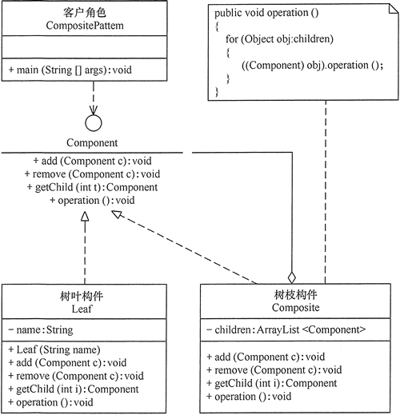

# 组合模式（详解版）

在现实生活中，存在很多“部分-整体”的关系，例如，大学中的部门与学院、总公司中的部门与分公司、学习用品中的书与书包、生活用品中的衣月艮与衣柜以及厨房中的锅碗瓢盆等。在软件开发中也是这样，例如，文件系统中的文件与文件夹、窗体程序中的简单控件与容器控件等。对这些简单对象与复合对象的处理，如果用组合模式来实现会很方便。

## 组合模式的定义与特点

组合（Composite）模式的定义：有时又叫作部分-整体模式，它是一种将对象组合成树状的层次结构的模式，用来表示“部分-整体”的关系，使用户对单个对象和组合对象具有一致的访问性。

组合模式的主要优点有：

1.  组合模式使得客户端代码可以一致地处理单个对象和组合对象，无须关心自己处理的是单个对象，还是组合对象，这简化了客户端代码；
2.  更容易在组合体内加入新的对象，客户端不会因为加入了新的对象而更改源代码，满足“开闭原则”；

其主要缺点是：

1.  设计较复杂，客户端需要花更多时间理清类之间的层次关系；
2.  不容易限制容器中的构件；
3.  不容易用继承的方法来增加构件的新功能；

## 组合模式的结构与实现

组合模式的结构不是很复杂，下面对它的结构和实现进行分析。

#### 1\. 模式的结构

组合模式包含以下主要角色。

1.  抽象构件（Component）角色：它的主要作用是为树叶构件和树枝构件声明公共接口，并实现它们的默认行为。在透明式的组合模式中抽象构件还声明访问和管理子类的接口；在安全式的组合模式中不声明访问和管理子类的接口，管理工作由树枝构件完成。
2.  树叶构件（Leaf）角色：是组合中的叶节点对象，它没有子节点，用于实现抽象构件角色中 声明的公共接口。
3.  树枝构件（Composite）角色：是组合中的分支节点对象，它有子节点。它实现了抽象构件角色中声明的接口，它的主要作用是存储和管理子部件，通常包含 Add()、Remove()、GetChild() 等方法。

组合模式分为透明式的组合模式和安全式的组合模式。

(1) 透明方式：在该方式中，由于抽象构件声明了所有子类中的全部方法，所以客户端无须区别树叶对象和树枝对象，对客户端来说是透明的。但其缺点是：树叶构件本来没有 Add()、Remove() 及 GetChild() 方法，却要实现它们（空实现或抛异常），这样会带来一些安全性问题。其结构图如图 1 所示。


图 1 透明式的组合模式的结构图
(2) 安全方式：在该方式中，将管理子构件的方法移到树枝构件中，抽象构件和树叶构件没有对子对象的管理方法，这样就避免了上一种方式的安全性问题，但由于叶子和分支有不同的接口，客户端在调用时要知道树叶对象和树枝对象的存在，所以失去了透明性。其结构图如图 2 所示。


图 2 安全式的组合模式的结构图

#### 2\. 模式的实现

假如要访问集合 c0={leaf1,{leaf2,leaf3}} 中的元素，其对应的树状图如图 3 所示。


图 3 集合 c0 的树状图
下面给出透明式的组合模式的实现代码，与安全式的组合模式的实现代码类似，只要对其做简单修改就可以了。

```
package composite;
import java.util.ArrayList;
public class CompositePattern
{
    public static void main(String[] args)
    {
        Component c0=new Composite(); 
        Component c1=new Composite(); 
        Component leaf1=new Leaf("1"); 
        Component leaf2=new Leaf("2"); 
        Component leaf3=new Leaf("3");          
        c0.add(leaf1); 
        c0.add(c1);
        c1.add(leaf2); 
        c1.add(leaf3);          
        c0.operation(); 
    }
}
//抽象构件
interface Component
{
    public void add(Component c);
    public void remove(Component c);
    public Component getChild(int i);
    public void operation();
}
//树叶构件
class Leaf implements Component
{
    private String name;
    public Leaf(String name)
    {
        this.name=name;
    }
    public void add(Component c){ }           
    public void remove(Component c){ }   
    public Component getChild(int i)
    {
        return null;
    }   
    public void operation()
    {
        System.out.println("树叶"+name+"：被访问！"); 
    }
}
//树枝构件
class Composite implements Component
{
    private ArrayList<Component> children=new ArrayList<Component>();   
    public void add(Component c)
    {
        children.add(c);
    }   
    public void remove(Component c)
    {
        children.remove(c);
    }   
    public Component getChild(int i)
    {
        return children.get(i);
    }   
    public void operation()
    {
        for(Object obj:children)
        {
            ((Component)obj).operation();
        }
    }    
}
```

程序运行结果如下：

```
树叶 1：被访问！
树叶 2：被访问！
树叶 3：被访问！
```

## 组合模式的应用实例

【例 1】用组合模式实现当用户在商店购物后，显示其所选商品信息，并计算所选商品总价的功能。

说明：假如李先生到韶关“天街 e 角”生活用品店购物，用 1 个红色小袋子装了 2 包婺源特产（单价 7.9 元）、1 张婺源地图（单价 9.9 元）；用 1 个白色小袋子装了 2 包韶关香藉（单价 68 元）和 3 包韶关红茶（单价 180 元）；用 1 个中袋子装了前面的红色小袋子和 1 个景德镇瓷器（单价 380 元）；用 1 个大袋子装了前面的中袋子、白色小袋子和 1 双李宁牌运动鞋（单价 198 元）。

最后“大袋子”中的内容有：{1 双李宁牌运动鞋（单价 198 元）、白色小袋子{2 包韶关香菇（单价 68 元）、3 包韶关红茶（单价 180 元）}、中袋子{1 个景德镇瓷器（单价 380 元）、红色小袋子{2 包婺源特产（单价 7.9 元）、1 张婺源地图（单价 9.9 元）}}}，现在要求编程显示李先生放在大袋子中的所有商品信息并计算要支付的总价。

本实例可按安全组合模式设计，其结构图如图 4 所示。


图 4 韶关“天街 e 角”店购物的结构图
程序代码如下：

```
package composite;
import java.util.ArrayList;
public class ShoppingTest
{
    public static void main(String[] args)
    {
        float s=0;
        Bags BigBag,mediumBag,smallRedBag,smallWhiteBag;
        Goods sp;
        BigBag=new Bags("大袋子");
        mediumBag=new Bags("中袋子");
        smallRedBag=new Bags("红色小袋子");
        smallWhiteBag=new Bags("白色小袋子");               
        sp=new Goods("婺源特产",2,7.9f);
        smallRedBag.add(sp);
        sp=new Goods("婺源地图",1,9.9f);
        smallRedBag.add(sp);       
        sp=new Goods("韶关香菇",2,68);
        smallWhiteBag.add(sp);
        sp=new Goods("韶关红茶",3,180);
        smallWhiteBag.add(sp);       
        sp=new Goods("景德镇瓷器",1,380);
        mediumBag.add(sp);
        mediumBag.add(smallRedBag);       
        sp=new Goods("李宁牌运动鞋",1,198);
        BigBag.add(sp);
        BigBag.add(smallWhiteBag);
        BigBag.add(mediumBag);
        System.out.println("您选购的商品有：");
        BigBag.show();
        s=BigBag.calculation();       
        System.out.println("要支付的总价是："+s+"元");
    }
}
//抽象构件：物品
interface Articles
{
    public float calculation(); //计算
    public void show();
}
//树叶构件：商品
class Goods implements Articles
{
    private String name;     //名字
    private int quantity;    //数量
    private float unitPrice; //单价
    public Goods(String name,int quantity,float unitPrice)
    {
        this.name=name;
        this.quantity=quantity;
        this.unitPrice=unitPrice;
    }   
    public float calculation()
    {
        return quantity*unitPrice; 
    }
    public void show()
    {
        System.out.println(name+"(数量："+quantity+"，单价："+unitPrice+"元)");
    }
}
//树枝构件：袋子
class Bags implements Articles
{
    private String name;     //名字   
    private ArrayList<Articles> bags=new ArrayList<Articles>();   
    public Bags(String name)
    {
        this.name=name;       
    }
    public void add(Articles c)
    {
        bags.add(c);
    }   
    public void remove(Articles c)
    {
        bags.remove(c);
    }   
    public Articles getChild(int i)
    {
        return bags.get(i);
    }   
    public float calculation()
    {
        float s=0;
        for(Object obj:bags)
        {
            s+=((Articles)obj).calculation();
        }
        return s;
    }
    public void show()
    {
        for(Object obj:bags)
        {
            ((Articles)obj).show();
        }
    }
}
```

程序运行结果如下：

```
您选购的商品有：
李宁牌运动鞋(数量：1，单价：198.0 元)
韶关香菇(数量：2，单价：68.0 元)
韶关红茶(数量：3，单价：180.0 元)
景德镇瓷器(数量：1，单价：380.0 元)
婺源特产(数量：2，单价：7.9 元)
婺源地图(数量：1，单价：9.9 元)
要支付的总价是：1279.7 元
```

## 组合模式的应用场景

前面分析了组合模式的结构与特点，下面分析它适用的以下应用场景。

1.  在需要表示一个对象整体与部分的层次结构的场合。
2.  要求对用户隐藏组合对象与单个对象的不同，用户可以用统一的接口使用组合结构中的所有对象的场合。

## 组合模式的扩展

如果对前面介绍的组合模式中的树叶节点和树枝节点进行抽象，也就是说树叶节点和树枝节点还有子节点，这时组合模式就扩展成复杂的组合模式了，如 Java AWT/Swing 中的简单组件 JTextComponent 有子类 JTextField、JTextArea，容器组件 Container 也有子类 Window、Panel。复杂的组合模式的结构图如图 5 所示。


图 5 复杂的组合模式的结构图