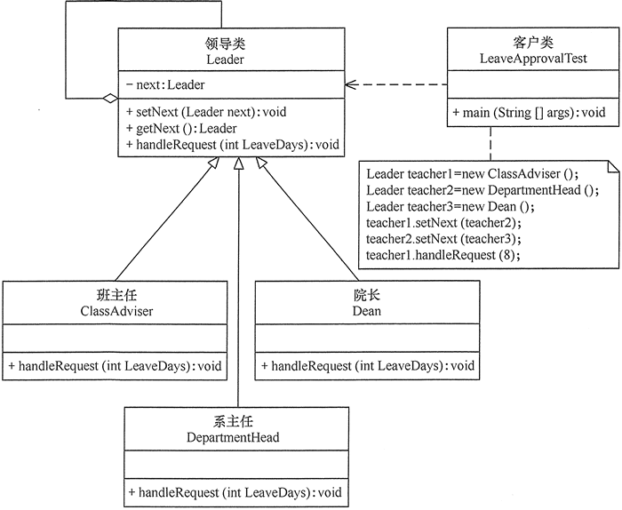

# 责任链模式（职责链模式）详解

在现实生活中，常常会出现这样的事例：一个请求有多个对象可以处理，但每个对象的处理条件或权限不同。例如，公司员工请假，可批假的领导有部门负责人、副总经理、总经理等，但每个领导能批准的天数不同，员工必须根据自己要请假的天数去找不同的领导签名，也就是说员工必须记住每个领导的姓名、电话和地址等信息，这增加了难度。这样的例子还有很多，如找领导出差报销、生活中的“击鼓传花”游戏等。

在计算机软硬件中也有相关例子，如总线网中数据报传送，每台计算机根据目标地址是否同自己的地址相同来决定是否接收；还有异常处理中，处理程序根据异常的类型决定自己是否处理该异常；还有 Struts2 的拦截器、JSP 和 Servlet 的 Filter 等，所有这些，如果用责任链模式都能很好解决。

## 模式的定义与特点

责任链（Chain of Responsibility）模式的定义：为了避免请求发送者与多个请求处理者耦合在一起，将所有请求的处理者通过前一对象记住其下一个对象的引用而连成一条链；当有请求发生时，可将请求沿着这条链传递，直到有对象处理它为止。

注意：责任链模式也叫职责链模式。

在责任链模式中，客户只需要将请求发送到责任链上即可，无须关心请求的处理细节和请求的传递过程，所以责任链将请求的发送者和请求的处理者解耦了。

责任链模式是一种对象行为型模式，其主要优点如下。

1.  降低了对象之间的耦合度。该模式使得一个对象无须知道到底是哪一个对象处理其请求以及链的结构，发送者和接收者也无须拥有对方的明确信息。
2.  增强了系统的可扩展性。可以根据需要增加新的请求处理类，满足开闭原则。
3.  增强了给对象指派职责的灵活性。当工作流程发生变化，可以动态地改变链内的成员或者调动它们的次序，也可动态地新增或者删除责任。
4.  责任链简化了对象之间的连接。每个对象只需保持一个指向其后继者的引用，不需保持其他所有处理者的引用，这避免了使用众多的 if 或者 if···else 语句。
5.  责任分担。每个类只需要处理自己该处理的工作，不该处理的传递给下一个对象完成，明确各类的责任范围，符合类的单一职责原则。

其主要缺点如下。

1.  不能保证每个请求一定被处理。由于一个请求没有明确的接收者，所以不能保证它一定会被处理，该请求可能一直传到链的末端都得不到处理。
2.  对比较长的职责链，请求的处理可能涉及多个处理对象，系统性能将受到一定影响。
3.  职责链建立的合理性要靠客户端来保证，增加了客户端的复杂性，可能会由于职责链的错误设置而导致系统出错，如可能会造成循环调用。

## 模式的结构与实现

通常情况下，可以通过数据链表来实现职责链模式的数据结构。

#### 1\. 模式的结构

职责链模式主要包含以下角色。

1.  抽象处理者（Handler）角色：定义一个处理请求的接口，包含抽象处理方法和一个后继连接。
2.  具体处理者（Concrete Handler）角色：实现抽象处理者的处理方法，判断能否处理本次请求，如果可以处理请求则处理，否则将该请求转给它的后继者。
3.  客户类（Client）角色：创建处理链，并向链头的具体处理者对象提交请求，它不关心处理细节和请求的传递过程。

其结构图如图 1 所示。客户端可按图 2 所示设置责任链。


图 1 责任链模式的结构图


图 2 责任链

#### 2\. 模式的实现

职责链模式的实现代码如下：

```
package chainOfResponsibility;
public class ChainOfResponsibilityPattern
{
    public static void main(String[] args)
    {
        //组装责任链 
        Handler handler1=new ConcreteHandler1(); 
        Handler handler2=new ConcreteHandler2(); 
        handler1.setNext(handler2); 
        //提交请求 
        handler1.handleRequest("two");
    }
}
//抽象处理者角色
abstract class Handler
{
    private Handler next;
    public void setNext(Handler next)
    {
        this.next=next; 
    }
    public Handler getNext()
    { 
        return next; 
    }   
    //处理请求的方法
    public abstract void handleRequest(String request);       
}
//具体处理者角色 1
class ConcreteHandler1 extends Handler
{
    public void handleRequest(String request)
    {
        if(request.equals("one")) 
        {
            System.out.println("具体处理者 1 负责处理该请求！");       
        }
        else
        {
            if(getNext()!=null) 
            {
                getNext().handleRequest(request);             
            }
            else
            {
                System.out.println("没有人处理该请求！");
            }
        } 
    } 
}
//具体处理者角色 2
class ConcreteHandler2 extends Handler
{
    public void handleRequest(String request)
    {
        if(request.equals("two")) 
        {
            System.out.println("具体处理者 2 负责处理该请求！");       
        }
        else
        {
            if(getNext()!=null) 
            {
                getNext().handleRequest(request);             
            }
            else
            {
                System.out.println("没有人处理该请求！");
            }
        } 
    }
}
```

程序运行结果如下：

```
具体处理者 2 负责处理该请求！
```

## 模式的应用实例

【例 1】用责任链模式设计一个请假条审批模块。

分析：假如规定学生请假小于或等于 2 天，班主任可以批准；小于或等于 7 天，系主任可以批准；小于或等于 10 天，院长可以批准；其他情况不予批准；这个实例适合使用职责链模式实现。

首先，定义一个领导类（Leader），它是抽象处理者，包含了一个指向下一位领导的指针 next 和一个处理假条的抽象处理方法 handleRequest(int LeaveDays)；然后，定义班主任类（ClassAdviser）、系主任类（DepartmentHead）和院长类（Dean），它们是抽象处理者的子类，是具体处理者，必须根据自己的权力去实现父类的 handleRequest(int LeaveDays) 方法，如果无权处理就将假条交给下一位具体处理者，直到最后；客户类负责创建处理链，并将假条交给链头的具体处理者（班主任）。图 3 所示是其结构图。


图 3 请假条审批模块的结构图
程序代码如下：

```
package chainOfResponsibility;
public class LeaveApprovalTest
{
    public static void main(String[] args)
    {
        //组装责任链 
        Leader teacher1=new ClassAdviser();
        Leader teacher2=new DepartmentHead();
        Leader teacher3=new Dean();
        //Leader teacher4=new DeanOfStudies();
        teacher1.setNext(teacher2);
        teacher2.setNext(teacher3);
        //teacher3.setNext(teacher4);
        //提交请求 
        teacher1.handleRequest(8);
    }
}
//抽象处理者：领导类
abstract class Leader
{
    private Leader next;
    public void setNext(Leader next)
    {
        this.next=next; 
    }
    public Leader getNext()
    { 
        return next; 
    }   
    //处理请求的方法
    public abstract void handleRequest(int LeaveDays);       
}
//具体处理者 1：班主任类
class ClassAdviser extends Leader
{
    public void handleRequest(int LeaveDays)
    {
        if(LeaveDays<=2) 
        {
            System.out.println("班主任批准您请假" + LeaveDays + "天。");       
        }
        else
        {
            if(getNext() != null) 
            {
                getNext().handleRequest(LeaveDays);             
            }
            else
            {
                  System.out.println("请假天数太多，没有人批准该假条！");
            }
        } 
    } 
}
//具体处理者 2：系主任类
class DepartmentHead extends Leader
{
    public void handleRequest(int LeaveDays)
    {
        if(LeaveDays<=7) 
        {
            System.out.println("系主任批准您请假" + LeaveDays + "天。");       
        }
        else
        {
            if(getNext() != null) 
            {
                  getNext().handleRequest(LeaveDays);             
            }
            else
            {
                System.out.println("请假天数太多，没有人批准该假条！");
           }
        } 
    } 
}
//具体处理者 3：院长类
class Dean extends Leader
{
    public void handleRequest(int LeaveDays)
    {
        if(LeaveDays<=10) 
        {
            System.out.println("院长批准您请假" + LeaveDays + "天。");       
        }
        else
        {
              if(getNext() != null) 
            {
                getNext().handleRequest(LeaveDays);             
            }
            else
            {
                  System.out.println("请假天数太多，没有人批准该假条！");
            }
        } 
    } 
}
//具体处理者 4：教务处长类
class DeanOfStudies extends Leader
{
    public void handleRequest(int LeaveDays)
    {
        if(LeaveDays<=20) 
        {
            System.out.println("教务处长批准您请假"+LeaveDays+"天。");       
        }
        else
        {
              if(getNext()!=null) 
            {
                getNext().handleRequest(LeaveDays);          
            }
            else
            {
                  System.out.println("请假天数太多，没有人批准该假条！");
            }
        } 
    } 
}
```

程序运行结果如下：

```
院长批准您请假 8 天。
```

假如增加一个教务处长类，可以批准学生请假 20 天，也非常简单，代码如下：

```
//具体处理者 4:教务处长类
class DeanOfStudies extends Leader
{
    public void handleRequest(int LeaveDays)
    {
        if(LeaveDays<=20)
        {
            System.out.println("教务处长批准您请假"+LeaveDays+"天。");
        }
        else
        {
            if(getNext()!=null)
            {
                getNext().handleRequest(LeaveDays);
            }
            else
            {
                System.out.println("请假天数太多，没有人批准该假条！");
            }
        }
    }
}
```

## 模式的应用场景

前边已经讲述了关于责任链模式的结构与特点，下面介绍其应用场景，责任链模式通常在以下几种情况使用。

1.  有多个对象可以处理一个请求，哪个对象处理该请求由运行时刻自动确定。
2.  可动态指定一组对象处理请求，或添加新的处理者。
3.  在不明确指定请求处理者的情况下，向多个处理者中的一个提交请求。

## 模式的扩展

职责链模式存在以下两种情况。

1.  纯的职责链模式：一个请求必须被某一个处理者对象所接收，且一个具体处理者对某个请求的处理只能采用以下两种行为之一：自己处理（承担责任）；把责任推给下家处理。
2.  不纯的职责链模式：允许出现某一个具体处理者对象在承担了请求的一部分责任后又将剩余的责任传给下家的情况，且一个请求可以最终不被任何接收端对象所接收。